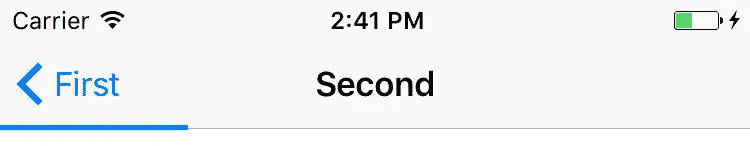
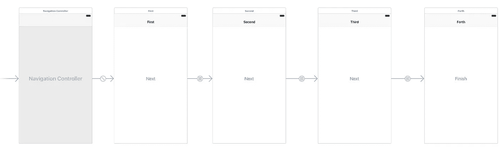

# 让手工表单输入稍微好一点

> 原文：<https://medium.com/hackernoon/making-manual-form-input-a-tiny-bit-better-ef40f04b5ea3>

## 在 UIProgressView 和协议的帮助下

表单输入从来都不好玩。尤其是在[移动](https://hackernoon.com/tagged/mobile)设备上。在我们的 [WeVat](https://hackernoon.com/tagged/wevat) 应用程序中，我们确实要求用户手动输入他们的一些细节，所以我们努力让用户尽可能不痛苦！

我们最近实现的一个功能是一个简单的进度视图，巧妙地向用户显示他们在流程中的进度。

我将向您展示如何以一种通用的方式编写这个进度视图，这样您就可以将它放入您的`UINavigationController`中并完成它！所以让我们开始吧。

TL；速度三角形定位法(dead reckoning)

*   创建将 UIProgressView 视图呈现为 UINavigationController 子视图的协议
*   创建更新 UIProgressView 的协议
*   使您的 UINavigationController 符合演示者协议
*   使导航堆栈中的每个 UIViewController 符合更新程序协议

只想要密码？没有牛肉！在此下载示例项目[。](https://github.com/harryblam/FormEntryProgress)

# 表单设置

我在 Xcode 中建立了一个新项目，在一个`UINavigationController`中有一个四个`UIViewControllers`的堆栈。每个按钮都有自己的 next 按钮，可以将 segue 推到下一个视图控制器，还有一个 finish 按钮，可以将您带回到展开 segue 的开始。

Our basic navigation flow

# 进度视图演示者

正如我在[以前的文章](/@harrybloom18)中所提到的，我们试图通过使用协议来尽可能多地将*功能化。所以让我们创建一个协议来处理`UIProgressView`的显示。*

一旦我们有了这个，我们就可以使用协议扩展来提供一些默认的行为来配置这个视图。我们将需要确保视图被添加到它的 superview 和布局正确。确保将视图固定到`UINavigationController`的`navigationBar`属性

通过进一步扩展`UINavigationController`，我们可以为协议提供视图，从而为实现这一点的所有导航控制器提供默认行为。伙计，我喜欢协议扩展。

现在，我们可以创建我们的`UINavigationController`子类，并在这里实现我们的协议，将这个功能添加到我们导航栈中的所有视图控制器中。**不要忘记将它作为自定义类添加到故事板中。**

# **进度视图更新器**

好了，现在我们的导航栏中有了`UIProgressView`，但是我们如何更新你所询问的每个视图控制器的进度呢？

我们可以创建另一个协议来处理这个功能。我将向您详细介绍这些功能的功能。

1.  `updateProgress`简单的一个浮动和动画`Bool`。稍后我们将把它传递给底层的`UIProgressView.setProgress`。
2.  `updateProgress`带有 UIViewController 类型的数组。这可能看起来有点奇怪，但是这可以给我们一种基于导航栈中的所有视图控制器来更新进度的方法。下面我会告诉你为什么这是有用的。
3.  `completeProgress`将进度条填满。

这里我们可以扩展`ProgressViewUpdater`来计算实际进度。我们通过遍历我们的视图控制器并根据我们当前在堆栈中的位置计算出进度来做到这一点。

我们快到了！还有一件事，在我们的流程中，我们有了一个全功能的进度视图。

# 更多默认实现

对于我们的视图控制器，我们可以非常简单地向导航控制器传递我们需要的信息。猜猜接下来会发生什么，更多的协议！

我们可以遵循我们的`ProgressViewUpdater`协议，并为这个流中的视图控制器提供一个更干净的接口。

然后，这使我们能够在这个函数的实现中，按照它们出现的顺序，编程定义导航栈中的每个视图控制器。

确保我们的视图控制器符合`MainFormProgressViewUpdater`，我们可以简单地调用`updateProgress()`来根据我们在流程中的位置更新进度视图。

如果您想在您的应用程序中有另一个具有类似功能的流，您需要做的就是创建另一个类似于`MainFormProgressUpdater`的协议，并将其放入您的视图控制器中。

*注意:一定要从* `*viewDidAppear*` *调用它才能看到动画。*

# 包裹

我做这个很开心！一定要让我知道你的想法，或者你是否会有不同的做法。

请务必查看我以前的文章中类似的内容。

> [黑客中午](http://bit.ly/Hackernoon)是黑客如何开始他们的下午。我们是 [@AMI](http://bit.ly/atAMIatAMI) 家庭的一员。我们现在[接受投稿](http://bit.ly/hackernoonsubmission)，并乐意[讨论广告&赞助](mailto:partners@amipublications.com)机会。
> 
> 如果你喜欢这个故事，我们推荐你阅读我们的[最新科技故事](http://bit.ly/hackernoonlatestt)和[趋势科技故事](https://hackernoon.com/trending)。直到下一次，不要把世界的现实想当然！

