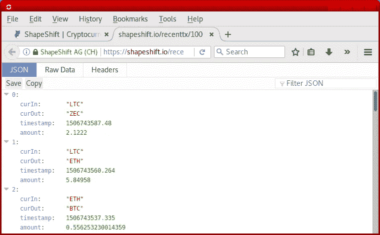
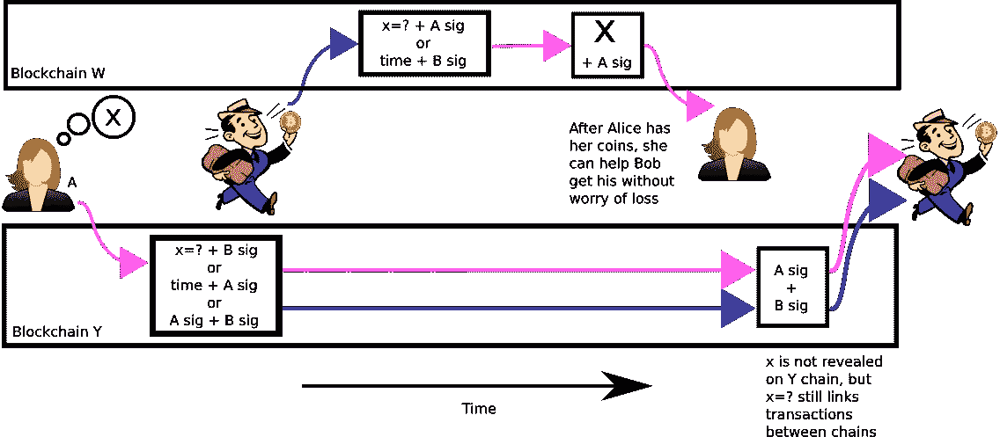
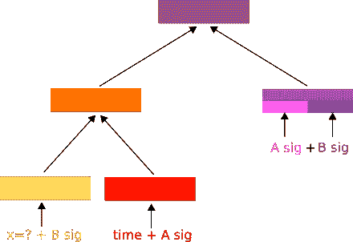
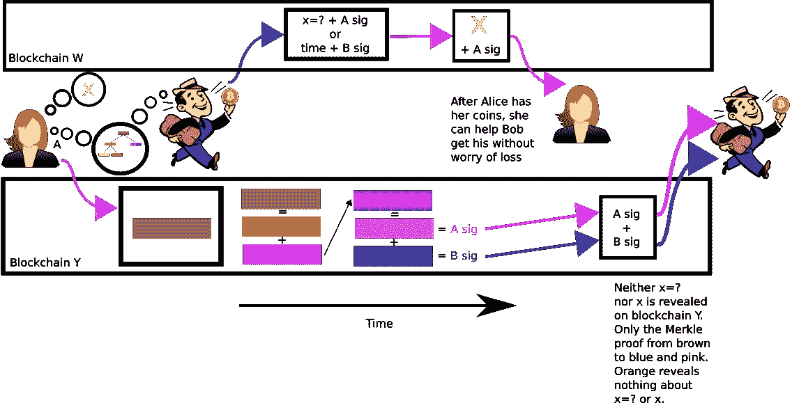
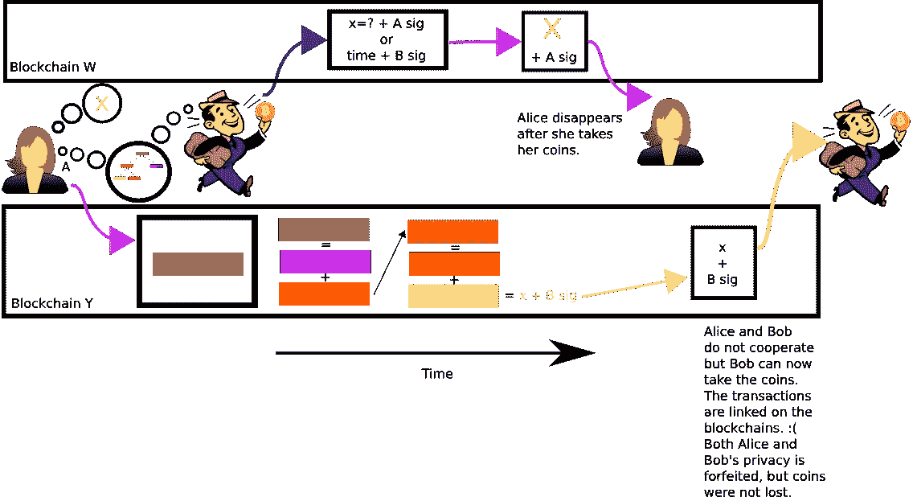
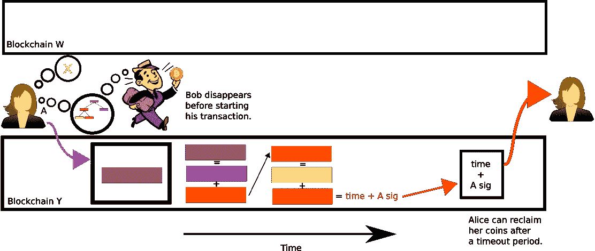

# 让 MAST 有意义；比特币原子互换成为私有

> 原文：<https://medium.com/hackernoon/making-mast-meaningful-bitcoin-atomic-swaps-become-private-ff003f7c2b7a>

Atomic + MASTs

最近有很多关于原子交换的讨论。然而，没有引起太多关注的是隐私问题。目前他们得到实现的方式，**不是很私密**。master(Merkleized Abstract Syntax Trees)通常被描述为一种隐私改进。这个例子展示了一个实用且显著的隐私改善(假设 MAST 被集成到比特币中)。

在这一点上，社区通常更关心易用性而不是隐私。例如，所有的 **Shapeshift** 事务都是 [**public**](https://shapeshift.io/recenttx/100) 。这些肯定会被硬币跟踪服务保存和使用。我怀疑如果有机会，大多数用户会选择增强隐私。

All Shapeshift transactions are public

从隐私的角度来看，原子交换甚至更糟。按照目前的使用方式，这种交易将在区块链永久公开记录。在未来的任何时候，硬币追踪器都可以追踪整个区块链的交易。让我们来看看基于 CLTV 的跨链互换目前是如何运作的。

Today’s atomic swaps

通过上述程序，如果另一方消失，双方的硬币都可以退还。要么计时器超时，他们拿回硬币，要么 x 出现，爱丽丝和鲍勃都可以认领硬币。原子部分是爱丽丝在 W 链上公开揭露 x 的地方。鲍勃可以找到 x，因为它现在是公开的，并使用它来要求他的硬币。爱丽丝不能拿走 W 硬币，除非给鲍勃拿走 Y 硬币所需的那块缺失的硬币。虽然安全，但它的缺点是公开这些是相同的交易。两个 Hash(x)的存在(显示为 x=？)和 x 表示它们是关联的。

请记住，**原子交换**的价值在于**在过程开始后**不合作**的情况下防止损失**。如果在整个交易过程中有合作，双方可以一起行动来完成。它看起来像这样:

Cooperative atomic swap available today

这仍然不是私有的，因为 x 的散列出现在两个链中。他们会在不同的链上使用不同的 pubkeys，所以链 W 上的粉色键会与 Y 上的粉色键不同，但是两个链上的 x 值必须相同。MAST 允许重写第一笔交易，以便只需要显示三个兑换条件中的一个。在合作的情况下，x 和 hash(x)都不需要在区块链 y 上公开披露。Alice 和 Bob 都会知道所有的赎回条件以保护自己，但除非需要，否则不会披露。下面是第一个事务的构造方式:

Merkle tree of possible spending options

MAST 允许我们将这个脚本表示为一棵树。颜色的组合代表散列。顶部的棕色糊状物锁住了硬币。如果证明颜色(散列)可以组合成与花费条件匹配的叶子颜色，则硬币可以被花费。此外，树可以是不平衡的，其中在常见的合作情况下使用较短的证明(较小的较便宜的交易)。在下面的例子中，他们显示了蓝色和粉红色组合成一个紫色的多角形。然后他们显示紫色和橙色会变成棕色。因此，在证明粉红色和蓝色是允许的之后，来自爱丽丝和鲍勃的两个签名中的两个可以移动硬币。这看起来就像区块链上任何普通的基于 2/2 multisig 的桅杆。公众看不到花哨的保护部分，只有橙色的哈希。重要的部分是**x 和 hash(x)都没有出现在区块链 Y 上，增加了隐私性。**公众甚至看不出这是一笔掉期交易。

Cooperative private atomic swap with MAST

在爱丽丝消失的**不合作**情况下，那么**鲍勃仍然可以**取回他的**硬币**。鲍勃在区块链 w 上发表了黄色的 x。

Uncooperative Alice atomic swap

爱丽丝也受到保护。如果 Bob 在开始交易前消失了， **Alice** 可以在超时后**获得**退款**。**

Uncooperative Bob atomic swap

关于如何实现 MAST，有多种公开的建议，每种都有不同的权衡。

[https://lists . Linux foundation . org/piper mail/bit coin-dev/2017-9 月/014932 . html](https://lists.linuxfoundation.org/pipermail/bitcoin-dev/2017-September/014932.html)
[https://github . com/bit coin/bips/blob/master/bip-0114 . mediawiki # hashed-time-lock-contract](https://github.com/bitcoin/bips/blob/master/bip-0114.mediawiki#hashed-time-lock-contract)

这个例子只是触及了表面。还有更多的可能性，而我们才刚刚开始。将来可以使用 MAST 创建远比现在想象的更复杂的合同。

此外，如果 Schnorr 签名被添加到比特币中，事情会变得更加隐私。一种优化是将多签名交易压缩成看起来像是单签名的形式，隐藏更多关于交易的信息。如果两个链都支持 Schnorr，那么 [*同步无脚本签名*](https://download.wpsoftware.net/bitcoin/wizardry/mw-slides/2017-03-mit-bitcoin-expo/slides.pdf) 可以与 MAST 结合使用，以获得更多隐私(参见第 31 页)。这种互换在两个链条上都表现为不相关的一对一交易。显式的 x 显示可以用椭圆曲线数学来代替。交易之间的联系也只有在不合作的情况下才是可检测的。

*感谢 Mark Friedenbach、Russell O'Connor、Paul Snow、& Justin Hanneman 的反馈和其他见解。*

这里讨论[的](https://www.reddit.com/r/Bitcoin/comments/740x97/making_mast_meaningful_bitcoin_atomic_swaps/)。

Brian Deery 在 Factom 担任首席科学家，Factom 是比特币区块链的数据层。他还共同创立了 Factom。

布莱恩有时可以在[让我们谈论比特币](https://letstalkbitcoin.com/blog/category/the-crypto-show)的[加密节目](https://soundcloud.com/heryptohow)中听到，主持人将他命名为*与比特币共舞*。

在 https://twitter.com/deery_me 的推特上关注他。