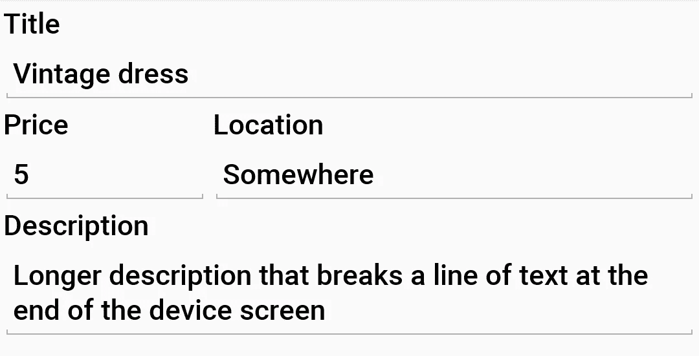
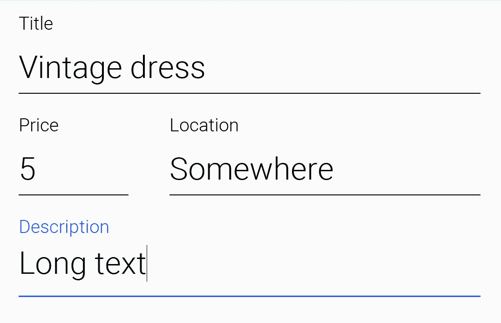
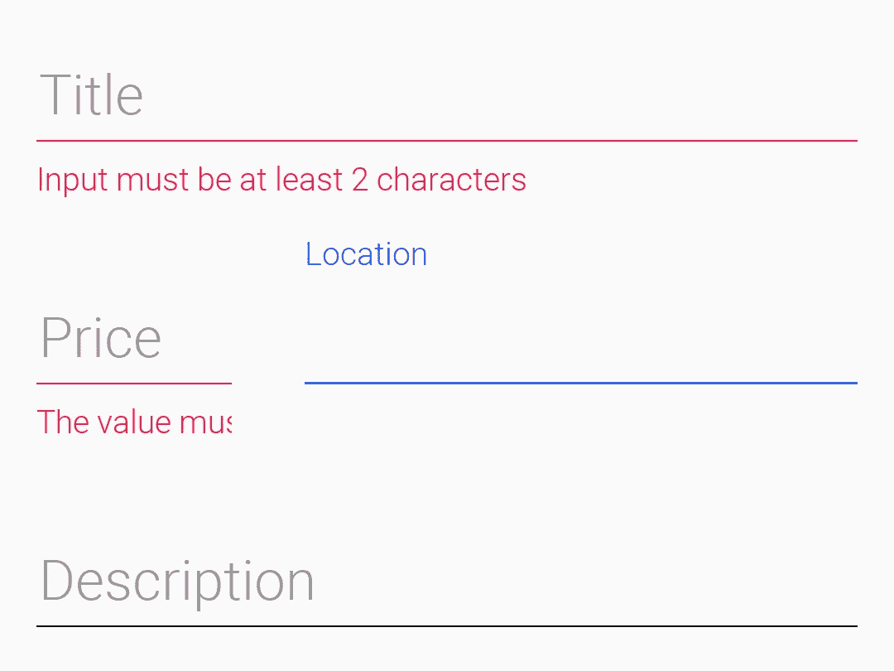
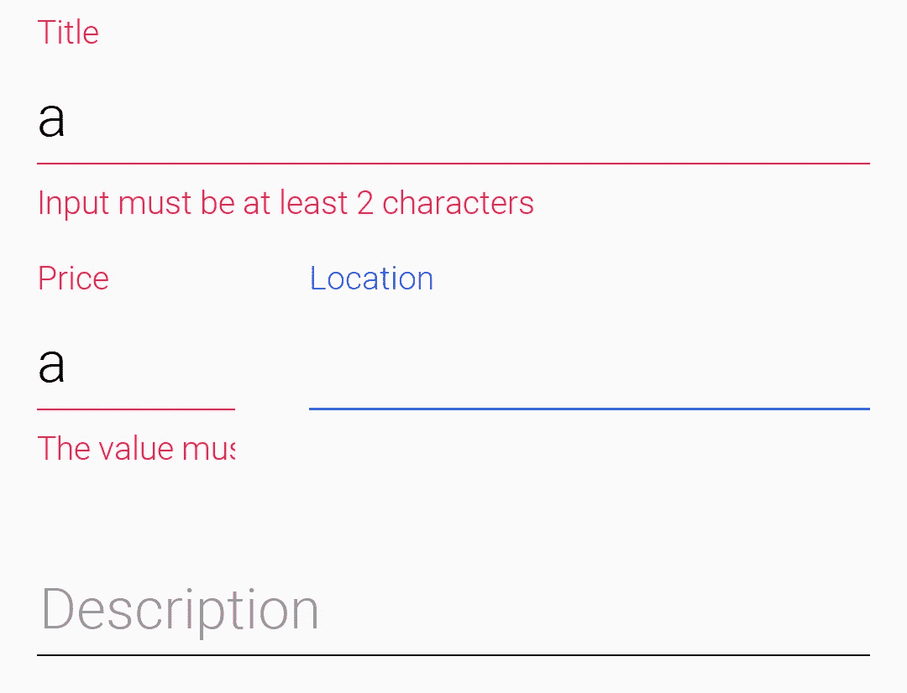
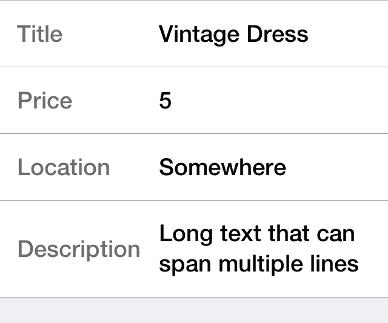

# 让移动一次编写运行在任何地方华丽

> 原文：<https://medium.com/hackernoon/making-mobile-write-once-run-anywhere-gorgeous-99707a3a6126>

编写一次，随处运行的工具因为看起来不够本地而受到很多批评&老实说，我们还没有做足够的工作来修复这个名声。工具现在才开始成熟，因为移动行业的发展速度正在放缓，这给了我们追赶的空间。

事实上，今天的 Android 和 iOS 比我们发布时更加相似(Android 2.x/iOS 4 days ),这使得这变得更加容易…

但不是装腔作势让我们切碎图片，这是在 Android 的 [Codename One](https://www.codenameone.com/) 3.7 中输入文本的截图:

这是同一个用户界面现在的样子:

It’s unclear from the image but the label “floats” into place when there is no text

我们甚至支持来自材料设计的很酷的错误消息，以及当提示变成标签动画时的动画效果:

Material style errors with no text so the label appears as a hint

Material style errors with text in place showing that the label gets the right red color

所以你可能会认为这在 iOS 中看起来不合适，但这是完全相同的代码在 iOS 上的样子:

On iOS

我认为我们可以对 iOS 版本进行一点改进，但对于这个版本，我们更关注 Android，因为我们觉得它落后太多了。

# “神奇的”代码

在 Codename One 中，生成上面的 UI 非常容易，只需要这一小块代码:

The code that made the screenshots above possible

如您所见，代码非常简单，我们只需为验证代码定义文本组件及其约束。包括动画和特定于操作系统的行为在内的其他一切都是自动的，这很酷。

# 我们需要你的帮助！

在 3.8 版本中，我们对 Codename One 的外观做了很多改进，在即将到来的 4.0 版本中，它仍将是一个焦点。对我们来说，一个主要的困难是决定什么是重要的，以及我们需要在外观和感觉方面达到的细节水平。为此我们需要你的帮助。我们需要你在[问题追踪器](https://github.com/codenameone/CodenameOne/issues/)中提出问题，但不是“广泛的问题”，如“实施材料设计”。

如果你想了解这方面的更多信息，我在我们的网站上写了几篇关于[像素完美系列](https://www.codenameone.com/blog/tags/uidesign.html)的博客文章，非常深入地探讨了技术细节。我更详细地解释了为了达到这些效果我必须经历的事情以及原因。

我们需要指出狭隘的可实现效果或我们犯错误的行为的问题，这样我们就可以在推动整个平台前进的过程中专注于修复较小的事情。这主要是资源和优先事项的问题，如果人们只是抱怨“WORA 不好看”，这没有帮助…我们需要投诉，但我们需要它更具体，最好包括 Codename One 与原生 UI 的截图，以便我们可以针对锚定器进行调整。