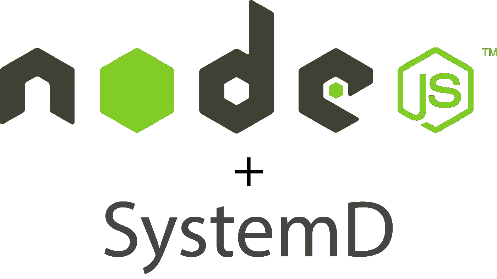

# 使 Node.js 服务在 Ubuntu 服务器上始终有效

> 原文：<https://medium.com/hackernoon/making-node-js-service-always-alive-on-ubuntu-server-e20c9c0808e4>



很好，但是你不需要另一个软件来控制你服务器上的后台进程！

生产中的挑战之一是如何

1.  在后台运行 Node.js 服务
2.  如果它们崩溃，自动重启它们
3.  收集输出/错误日志，供以后分析或实时查看。

所有这些工具都类似于服务器端长期运行的应用程序，因此 linux 社区将这类工具原生集成到了几乎所有的 Linux 发行版中。用于处理长时间运行的后台任务/服务的最新工具之一叫做`SystemD`，它是由 Linux 基金会开发的，现在已经成为 Linux 发行版的标准。我们将只关注 Ubuntu 服务器，因为它很容易上手。

# 什么是真正的 SystemD？

> SystemD 是一个 init 系统，在 Linux 发行版中用于引导用户空间和管理所有后续进程——来自 Wikipedia

这意味着 SystemD 实际上是为管理和执行用户空间进程/服务而开发的。您可以计划作业，启动/停止/重新启动作业，并使用系统日志收集作业。

开始使用它的基本命令是`systemctl`,它包含管理现有服务或添加现有服务的所有子命令。

# 别说了！让我们建立一个项目！

为了让这个实验更真实，制作非常基本的 node.js *hello world* http 监听器。

```
#!/usr/bin/env node/** server.js  */var http = require('http');

// Configure our HTTP server to respond with Hello World to all requests.
var server = http.createServer(function (request, response) {
  response.writeHead(200, {"Content-Type": "text/plain"});
  response.end("Hello World\n");
});

// Listen on port 8000, IP defaults to 127.0.0.1
server.listen(8000);

// Put a friendly message on the terminal
console.log("Server running at http://127.0.0.1:8000/");
```

看一下我们的`server.js`文件的第一行，使用这一行我们只是让大家知道，使用当前的用户环境，我们将用`node`可执行文件运行这个文件。

将该文件保存到`~/hello_world/server.js`并使其成为可执行文件

```
chmod +x ~/hello_world/server.js
```

**是时候做 SystemD 服务了**

制作文件`/etc/systemd/system/hello_world.service`，这将是 SystemD 服务配置的主文件

```
[Unit]
Description=Node.js Hello World Http Server[Service]
PIDFile=/tmp/hello_world-99.pid
User=<Your Username>
Group=<Your User Group>
Restart=always
KillSignal=SIGQUIT
WorkingDirectory=/home/<username>/hello_world/
ExecStart=/home/<username>/hello_world/server.js[Install]
WantedBy=multi-user.target
```

保存该文件后，我们可以启用该服务，通过 SystemD 开始使用它

```
sudo systemctl enable hello_world.service
```

就是这样！现在您有了 Node.js 服务作为后台服务，它将在出错时重新启动，您可以使用非常简单的命令查看所有输出日志

```
sudo journalctl -u hello_world.service# For real time logs just add -f argument
sudo journalctl -fu hello_world.service
```

# 结论

在所有这些设置之后，现在你有了非常简单的方法来管理你的服务

```
sudo systemctl start hello_world.service
sudo systemctl stop hello_world.service
sudo systemctl restart hello_world.service
```

所以你实际上不需要像`forever`这样的模块来管理 Node.js 后台服务，所有这些都可以使用 Linux 本地工具来完成，这些工具性能更好，也更可靠！(希望如此)。

*所以如果你从中学到了什么，就* `*Recommend This*` *让别人也学学吧。*

[](http://bit.ly/HackernoonFB)[](https://goo.gl/k7XYbx)[](https://goo.gl/4ofytp)

> [黑客中午](http://bit.ly/Hackernoon)是黑客如何开始他们的下午。我们是 [@AMI](http://bit.ly/atAMIatAMI) 家庭的一员。我们现在[接受投稿](http://bit.ly/hackernoonsubmission)，并乐意[讨论广告&赞助](mailto:partners@amipublications.com)机会。
> 
> 如果你喜欢这个故事，我们推荐你阅读我们的[最新科技故事](http://bit.ly/hackernoonlatestt)和[趋势科技故事](https://hackernoon.com/trending)。直到下一次，不要把世界的现实想当然！

