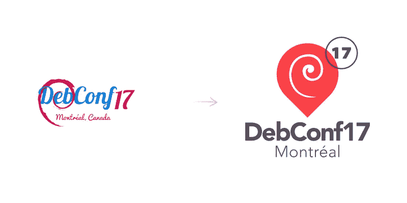
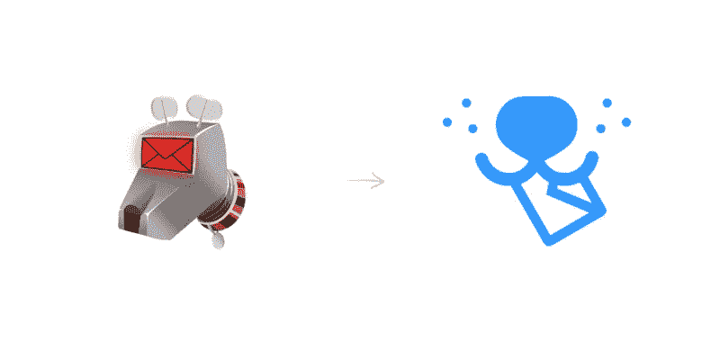
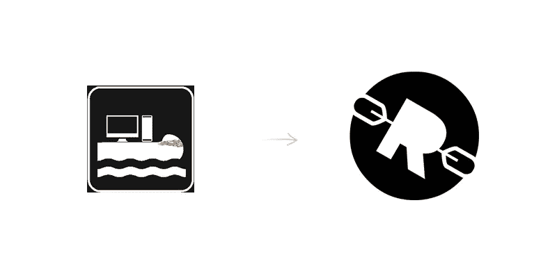
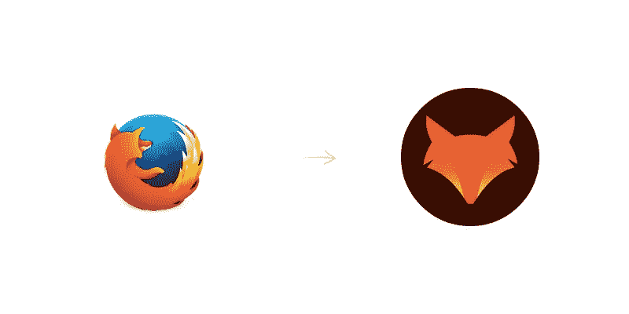

# 让开源看起来很美

> 原文：<https://medium.com/hackernoon/making-open-source-look-beautiful-60130f3c9456>

在 [Fairpixels](http://fairpixels.pro) ，我们已经帮助一大堆雄心勃勃的初创公司看起来很顺利(通过 UI &品牌设计)

现在…我们❤开源。一月份，我们开始[开源我们自己未使用的标志设计](http://logodust.com)。几天前，我们决定在这个领域做得更多，[为 HN 提供了一个免费的 *1* 棒极了的开源项目](https://news.ycombinator.com/item?id=12372118)的标志(重新)设计。

由于我们忘记了时间，我们最终重新设计了 4 个开源项目的标志。下面是结果。

[**下载**](https://www.dropbox.com/s/ug4habfaa1jne61/deb.svg?dl=0) 重新设计的[**debconf 17**](https://wiki.debconf.org/wiki/DebConf17/Artwork/LogoProposals)logo

[**下载**](https://www.dropbox.com/s/3qvgmz7cdyhj0a6/k9.svg?dl=0) 改版[**K9-邮箱**](https://play.google.com/store/apps/details?id=com.fsck.k9) logo

[**下载**](https://www.dropbox.com/s/ppjxrriob3dk0rd/rl.svg?dl=0) 重新设计的 [**RaftLib**](http://raftlib.io) logo

[**下载**](https://www.dropbox.com/s/js4hcf9sd14aqha/ff.svg?dl=0) 重新设计的 [**火狐**](http://firefox.com) logo

请在评论中告诉我们你的想法，或者访问 www.fairpixels.co

> [黑客中午](http://bit.ly/Hackernoon)是黑客如何开始他们的下午。我们是 [@AMI](http://bit.ly/atAMIatAMI) 家庭的一员。我们现在[接受投稿](http://bit.ly/hackernoonsubmission)并乐意[讨论广告&赞助](mailto:partners@amipublications.com)机会。
> 
> 如果你喜欢这个故事，我们推荐你阅读我们的[最新科技故事](http://bit.ly/hackernoonlatestt)和[趋势科技故事](https://hackernoon.com/trending)。直到下一次，不要把世界的现实想当然！

