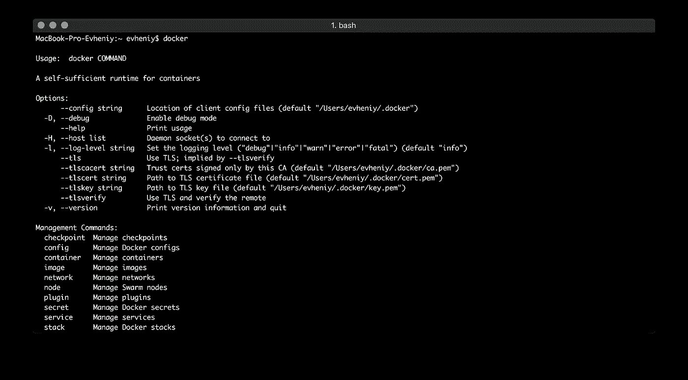
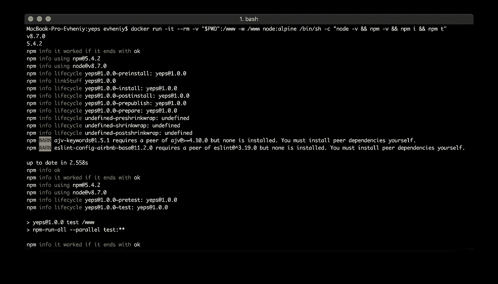
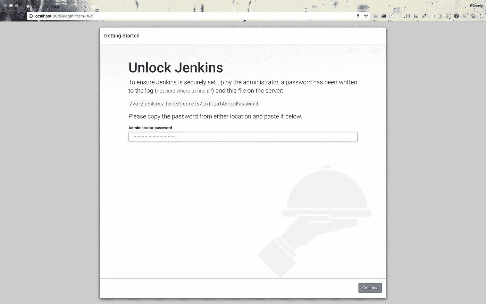
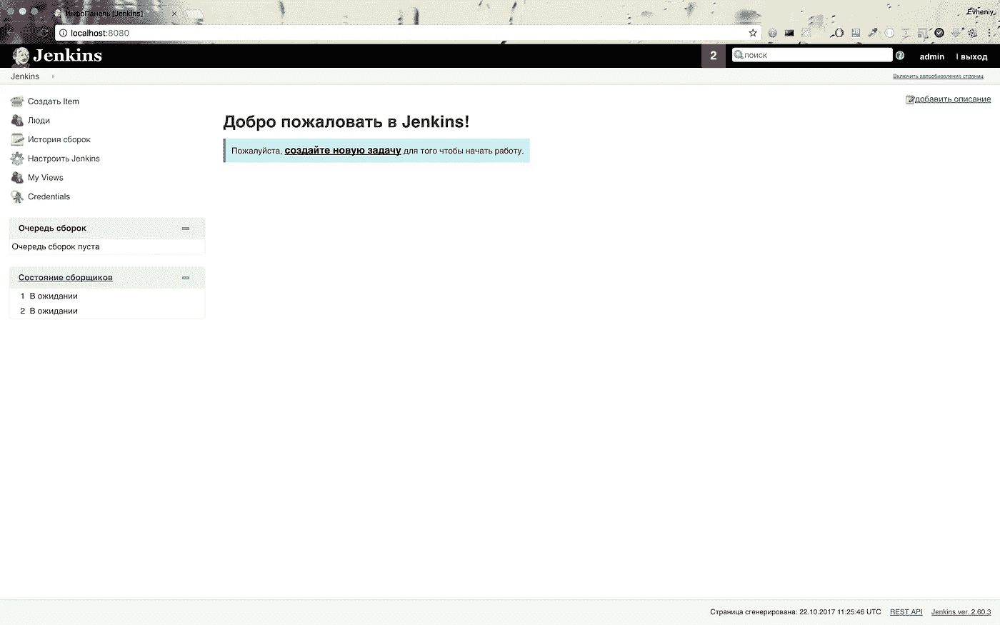
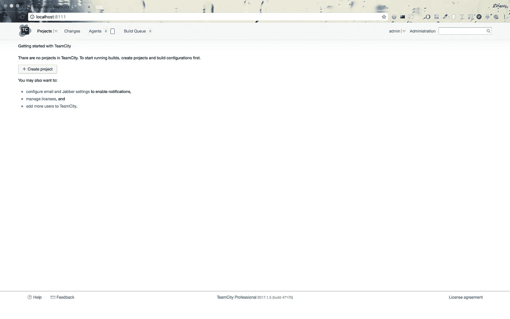
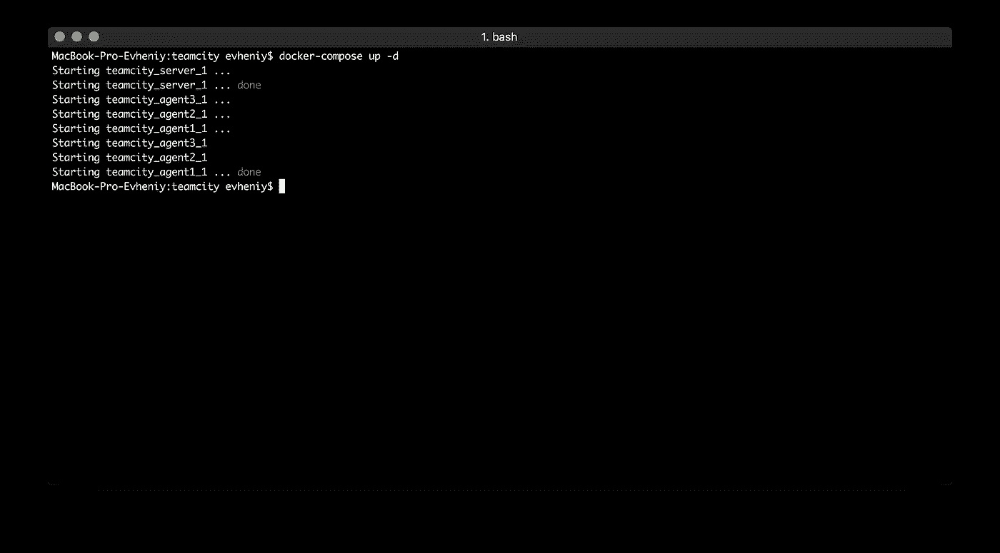
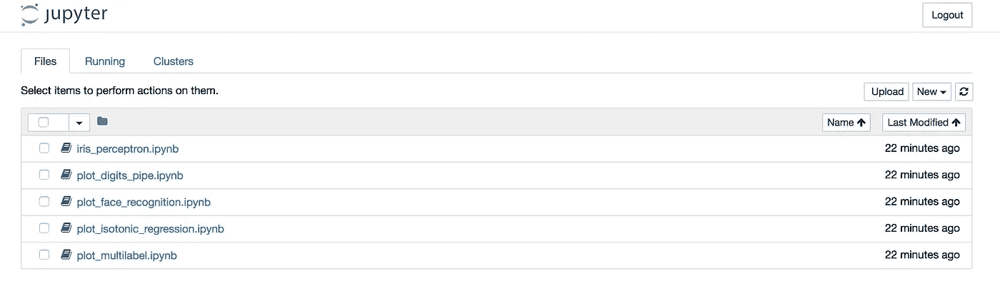

# 使用 Docker 做正确的事情

> 原文：<https://medium.com/hackernoon/making-right-things-using-docker-7296cf0f6c6e>

在本文中，我想展示如何使用 docker 进行**开发**和**测试**。为了表明现在是从开发切换到**工程**，从单栈切换到**全栈**的时候了。当然，全栈不仅仅是前端和后端，它也是环境。docker 是一个很好的工具。

还有一些想法认为在不久的将来[**全栈将包含和机器学习**](https://hackernoon.com/how-i-started-with-learning-ai-in-the-last-2-months-251d19b23597) 。我将展示在这个领域使用 docker 是多么容易。


## 码头工人哲学

Docker 容器是一个开源软件开发平台。它的主要好处是将应用程序打包在“容器”中，允许它们在任何运行 Linux 操作系统(OS)的系统之间移植。

可以把 Docker 容器看作是虚拟化的另一种形式。虚拟机(VM)允许将一个硬件分割成不同的 VM(或虚拟化),以便不同的用户可以共享硬件能力，并显示为独立的服务器或机器。Docker 容器将操作系统虚拟化，将其分成虚拟化的隔间来运行容器应用程序。

> 这种方法允许将代码片段放入更小的、易于移植的片段中，这些片段可以在任何运行 Linux 的地方运行。这是一种使应用程序更加分散的方式，并将它们分解成特定的功能。

容器映像是一个轻量级的、独立的、可执行的软件包，包含了运行它所需的一切:代码、运行时、系统工具、系统库、设置。基于 Linux 和 Windows 的应用程序都可以使用容器化软件，无论环境如何，容器化软件都可以运行。容器将软件从其周围环境中隔离出来，例如开发和阶段环境之间的差异，并有助于减少在同一基础设施上运行不同软件的团队之间的冲突。

docker [安装](https://docs.docker.com/engine/installation/)后，它使用命令行工作:



有很多参数和选项。我们将主要用 [**构建**](https://docs.docker.com/engine/reference/commandline/build/)[**图像**](https://docs.docker.com/engine/reference/commandline/images/)[**运行**](https://docs.docker.com/engine/reference/commandline/run/)[**exec**](https://docs.docker.com/engine/reference/commandline/exec/)[**RM**](https://docs.docker.com/engine/reference/commandline/rm/)**和 [**rmi**](https://docs.docker.com/engine/reference/commandline/rmi/) 。**

## **使用 YEPS 将 node.js 应用程序归档**

**可以从 node 官方文档文章开始:[dockering a node . js web app](https://nodejs.org/uk/docs/guides/nodejs-docker-webapp/)。**

**要使用 [docker 容器](https://www.docker.com/what-container)，您需要从 [docker hub](https://hub.docker.com/) 获取图像，或者使用 [Dockerfile](https://docs.docker.com/engine/reference/builder/) 和 [**docker build**](https://docs.docker.com/engine/reference/commandline/build/) 命令创建自己的图像。让我们使用 node.js 和 [**YEPS** 框架](https://yeps.info/)创建自己的映像。**

**我在 github 上创建了[库，所以你可以获得源代码:](https://github.com/evheniy/yeps-docker-example)**

```
git clone https://github.com/evheniy/yeps-docker-example.gitcd yeps-docker-example
```

****Dockerfile** :**

```
**FROM** node:latest# Create app directory
**RUN** mkdir -p /usr/src/app
**WORKDIR** /usr/src/app# Install app dependencies
**COPY** package.json /usr/src/app/
**RUN** npm install# Bundle app source
**COPY** . /usr/src/app**EXPOSE** 3000**CMD** [ "**npm**", "**start**" ]
```

**要创建自己的图像，您需要使用中的**从现有图像扩展它。该图像扩展了 [docker hub](https://hub.docker.com/_/node/) 上的原始节点图像的最新版本。****

**之后，我们需要在容器中创建工作目录。使用 node.js 有一个很好的做法，即复制 package.json 并在复制所有其他文件之前安装所有依赖项。所以我复制它并运行 **npm install** 命令来获取所有依赖项。在我将所有文件复制到容器后。**

****EXPOSE** 命令使 docker 容器监听端口。而 **CMD** 命令运行我们的服务器。**

****只能有一个 CMD** 命令。这是 docker 的理念— **每个容器一个流程**。**

**建成后，我们可以在 docker 中心或自己的私人图像库存储我们的图像。但我不会在这篇文章中描述。**

**要构建它，请运行:**

```
docker build -t yeps .
```

**我在 [README.md](https://github.com/evheniy/yeps-docker-example) 文件中描述了如何处理该图像的所有示例和命令。选项 **-t** 为图像创建名称，在我们的例子中是 **yeps** 。**

**要运行容器:**

```
docker run -p 3000:3000 --name yeps -d yeps
```

**选项 **-p** 将端口从主机映射到容器端口，选项 **-d** 将其作为服务运行。打开 [http://localhost:3000/](http://localhost:3000/) 看到工作节点应用。**

**有很多命令可以阻止它。简单的就是**docker stop<continer id>**。要检查**集装箱 id** ，运行 **docker ps -a** 。如果你运行 **docker image ls** 你可以找到图像: **node** 和 **yeps** 。并使用 **docker 镜像 rm** 将其删除。但是还有其他方法来覆盖和移除图像:**

```
docker rm -f yeps
```

## ****交互模式****

**Docker 帮助处理图像，但不构建自己的图像。在 docker hub 上，你可以找到很多有趣的官方和非官方图片。你可以扩展它来制作自己的新图像，或者只是出于某些原因运行它。**

**一个有趣的例子是测试。在 node.js 的官方 docker hub 页面上，有许多不同 node.js 版本的图片。这对测试很有用。例如，我将展示如何测试任何 node.js 应用程序。再来试试 **YEPS** 框架。首先我们应该从 github 获取代码:**

```
git clone https://github.com/evheniy/yeps.git
cd yeps
```

**在我们需要使用任何节点版本运行 npm 测试命令之后，如下所示:**

```
docker run -it --rm -v "$PWD":/www -w /www **node:8** /bin/bash -c "node -v && npm -v && npm i && npm t"
```

**这里我们使用 **node:8** image 运行 docker image(我使用最新的 8 版本，你可以指定任何其他版本)。 **-it** 参数有助于在交互模式下运行它，并在完成后清除所有数据我们放入 **— rm** 参数。如何从旧的容器和图像中清理光盘，我将在教程中描述。**

**命令 **-v** 帮助将当前目录映射到 **/www** 和 **-w** 命令是 **cd** 命令的模拟(改变目录)，它帮助在这个目录中运行我们的命令。**

**我们运行 node.js 命令**node-v&&NPM-v&&NPM I&&NPM t**，使用标志 **-c** 。**

**如果您需要使用 **node.js 7** 运行相同的命令，只需更改节点的 docker 映像:**

```
docker run -it --rm -v "$PWD":/www -w /www **node:7** /bin/bash -c "**node -v && npm -v && npm i && npm t**"
```

**你可以在 [docker hub](https://hub.docker.com/_/node/) 上找到来自官方资料库的所有节点图片。但是作为一个好的实践，如果你看到有基于 alpine linux 的映像，最好使用它们来减少磁盘空间。因此，如果我们需要使用最新的节点版本测试我们的应用程序，只需运行即可(在 alpine linux 中，我们需要使用 **/bin/sh** 而不是 **bash** ):**

```
docker run -it --rm -v "$PWD":/www -w /www **node:alpine** **/bin/sh** -c "**node -v && npm -v && npm i && npm t**"
```

****

## **数据库即服务**

**为了测试不同数据库的 YEPS 包，我使用了 docker。比如 [**yeps-redis**](https://github.com/evheniy/yeps-redis) 。为了运行和停止测试，我在 **package.json** 的脚本部分添加了命令:**

```
"**db:start**": "docker run -d --name redis -p 6379:6379 redis:latest",    "**db:stop**": "docker rm -f redis"
```

**同样适用于 [**yeps-mysql**](https://github.com/evheniy/yeps-mysql) :**

```
"**db:start**": "docker run -d --name mysql -p 3306:3306 -e MYSQL_ROOT_PASSWORD=root -e MYSQL_DATABASE=yeps mysql:latest", "**db:stop**": "docker rm -f mysql"
```

**这里使用 **-e** 选项我设置环境变量，如用户和密码。**

**而对于[**yeps-mongose**](https://github.com/evheniy/yeps-mongoose):**

```
"**db:start**": "docker run -d --name mongo -p 27017:27017 mongo",    "**db:stop**": "docker rm -f mongo"
```

**当我使用 [**TravisCI**](https://travis-ci.org/) 进行测试时，使用 docker 作为服务很容易，因为 TravisCI 基于 docker。只需注册存储库并创建 **.travis.yml** 就像我为**[**yeps-mongose**](https://github.com/evheniy/yeps-mongoose/blob/master/.travis.yml):****

```
**sudo: required
language: node_js
node_js:
  - "7"
  - "8"
**services:
  - docker**
before_install:
  - npm install
script:
  - docker version
  - node --version
  - npm --version
  - npm run lint
  - npm run test
  - npm run report** 
```

****如果您需要使用私有 CI 服务，您可以使用 [**Jenkins**](https://jenkins.io/) 或 [**TeamCity**](https://www.jetbrains.com/teamcity/) 。詹金斯在 docker hub 上有[官方资源库，你可以在那里找到如何运行它的文档。例如:](https://hub.docker.com/_/jenkins/)****

```
**docker run --name jenkins -p 8080:8080 -d jenkins**
```

****要访问管理员界面，您需要获得管理员**密码**。当我们用 **-d** 选项运行我们的容器时，我们只能从**/var/Jenkins _ home/secrets/initial admin password**中获得它:****

```
**docker exec jenkins **cat /var/jenkins_home/secrets/initialAdminPassword****
```

********

****这里我使用 **exec** 命令。它有助于在运行容器中运行类似于"**cat/var/Jenkins _ home/secrets/initialAdminPassword "**的命令。****

********

****并命令**“docker RM-f Jenkins”**将其停止。****

****团队合作也差不多。但是这里我们需要运行主进程(服务器)并在单独的容器中构建代理。****

****但是首先，我们需要创建目录来存储我们的配置和日志:****

```
**mkdir teamcity
cd teamcity**
```

****要启动 [**TeamCity 服务器**](https://hub.docker.com/r/jetbrains/teamcity-server/) 只需运行:****

```
**docker run -it --name teamcity-server-instance  -v "$PWD"/datadir:/data/teamcity_server/datadir -v "$PWD"/logs:/opt/teamcity/logs -p 8111:8111 -d jetbrains/teamcity-server**
```

****对于 [**构建代理**](https://hub.docker.com/r/jetbrains/teamcity-agent/) 几乎相同(在免费版本中，我们只能使用 3 个构建代理):****

```
**docker run -it -d -e SERVER_URL="teamcity-server-instance:8111" -v "$PWD"/**agent1**:/data/teamcity_agent/conf --link teamcity-server-instance:teamcity-server-instance --privileged jetbrains/teamcity-agentdocker run -it -d -e SERVER_URL="teamcity-server-instance:8111" -v "$PWD"/**agent2**:/data/teamcity_agent/conf --link teamcity-server-instance:teamcity-server-instance --privileged jetbrains/teamcity-agentdocker run -it -d -e SERVER_URL="teamcity-server-instance:8111" -v "$PWD"/**agent3**:/data/teamcity_agent/conf --link teamcity-server-instance:teamcity-server-instance --privileged jetbrains/teamcity-agent**
```

****我为每个代理指定了不同的名称和目录。如您所见，我将服务器和代理的目录映射到本地目录 **teamcity** 。****

********

## ****Docker 撰写****

****如果您需要构建和运行单个映像，Docker 是个好东西。但是在大多数真正的应用程序中，你需要同时处理不同的东西。数据库、集群模式下的实例、微服务…以及[**Docker compose**](https://docs.docker.com/compose/)是这方面的完美工具。****

> ****Compose 是一个定义和运行多容器 Docker 应用程序的工具。使用 Compose，您可以使用 YAML 文件来配置应用程序的服务。然后，只需一个命令，您就可以从您的配置中创建并启动所有服务。要了解更多关于 Compose 的所有特性，请参见特性列表。****

****Compose 具有用于管理应用程序整个生命周期的命令:****

*   ****启动、停止和重建服务****
*   ****查看运行服务的状态****
*   ****流式传输正在运行的服务的日志输出****
*   ****在服务上运行一次性命令****

****让我们为我们的 **TeamCity** 集群创建一个组合版本— **docker-compose.yml** :****

```
**version: '2'
services:
  **server**:
    restart: unless-stopped
    **image**: jetbrains/teamcity-server
    **ports**:
      - "8111:8111"
    **volumes**:
      - "./server/datadir:/data/teamcity_server/datadir"
      - "./server/logs:/opt/teamcity/logs"
  **agent1**:
    restart: unless-stopped
    **image**: jetbrains/teamcity-agent
    **links**:
      - "server:server"
    **environment**:
      SERVER_URL: server:8111
    **volumes**:
      - "./**agent1**:/data/teamcity_agent/conf"
  **agent2**:
    restart: unless-stopped
    **image**: jetbrains/teamcity-agent
    **links**:
      - "server:server"
    **environment**:
      SERVER_URL: server:8111
    **volumes**:
      - "./**agent2**:/data/teamcity_agent/conf"
  **agent3**:
    restart: unless-stopped
    **image**: jetbrains/teamcity-agent
    **links**:
      - "server:server"
    **environment**:
      SERVER_URL: server:8111
    **volumes**:
      - "./**agent3**:/data/teamcity_agent/conf"**
```

****我们使用几乎相同的参数(**端口**、**映像**、**卷**)，但有一些特定的更新。****

********

****要开始编写，只需运行 **docker-compose up** 或将其作为服务运行:****

```
**docker-compose up -d**
```

****并停止:****

```
**docker-compose stop**
```

****把所有东西都拿下来(用卷):****

```
**docker-compose down --volumes**
```

****或者，如果您想要删除 docker 图像:****

```
**docker-compose down --rmi all**
```

****让我们用 node.js 实例集群和作为负载平衡器的 [nginx](https://nginx.org/) 来更新我们之前的 node.js **YEPS** 示例。****

****我创建了一个 [github 库](https://github.com/evheniy/yeps-docker-compose-example)，所以只需克隆它:****

```
**git clone [https://github.com/evheniy/yeps-docker-compose-example.git](https://github.com/evheniy/yeps-docker-compose-example.git)
cd [yeps-docker-compose-example](https://github.com/evheniy/yeps-docker-compose-example.git)docker-compose up -d**
```

****在这个例子中，我们有 [docker-compose.yml](https://github.com/evheniy/yeps-docker-compose-example/blob/master/docker-compose.yml) 和两个目录: [nginx](https://github.com/evheniy/yeps-docker-compose-example/tree/master/nginx) 和[节点](https://github.com/evheniy/yeps-docker-compose-example/tree/master/node)。您可以打开链接并检查每个文件。我使用了与前面的合成示例相同的想法。但是这次我为 nginx 构建了自己的映像:****

```
**# Set nginx base image
**FROM** nginx:latest

# Copy custom configuration file from the current directory
**COPY** nginx.conf /etc/nginx/nginx.conf**
```

****对于节点 I，使用现有的 [Dockerfile](https://github.com/evheniy/yeps-docker-compose-example/blob/master/node/Dockerfile) 。****

******Docker** 和 **Docker compose** 即使使用**微服务架构**，也能真正帮助开发和测试真正的现代应用。但是你不仅可以用它来开发。接下来我将向您展示如何使用它进行数据科学实验。****

## ****机器学习****

****同样的想法不仅对开发有用，我指的是计算机科学。它对数据科学很有用。在 docker 容器中运行机器学习实验也是一个不错的选择。****

****为了我在**机器学习**中的实验，我基于[**python anaconda**](https://hub.docker.com/r/continuumio/anaconda3/)创建了 [github 库](https://github.com/evheniy/python-docker)。****

****要使用这个容器，只需克隆 git 存储库并构建映像:****

```
**$ git clone https://github.com/evheniy/python-docker.git
$ cd python-docker**
```

****由于我经常使用 **node.js** 和 **npm** ，我在 **package.json** [**脚本部分**](https://github.com/evheniy/python-docker/blob/master/package.json) 中创建了命令，并在 [**README.md**](https://github.com/evheniy/python-docker) 文件中进行了描述。****

****所以对于 build 只需运行 **npm 运行 build** 或 **docker build -t python** **。**”。并开始: **npm start** 或“**docker run—name python-p 8888:8888-v $ PWD/python:/opt/notebooks-d python**”。在这里，我使用参数 **-d** 进行恶魔化处理，使用参数 **-v** 映射当前目录，并在停止容器后保存我的所有数据。****

****并使用密码 **root** 打开 [http://localhost:8888](http://localhost:8888/) 。****

********

****您可以使用 **jupyter 笔记本**的 web UI 找到一些示例，并运行任何示例 **plot_face_recognition** :****

********

****Docker 有助于在任何地方使用相同的环境( **python** 、 [**scikit-learn**](http://scikit-learn.org/stable/) 、[**SkPy**](https://pypi.python.org/pypi)……)工作。完成后，需要使用 **npm 运行停止**停止容器，并使用 **npm 运行 rm** 清洁圆盘空间。****

## ******清洁******

****Docker 使得将应用程序和服务封装在容器中变得容易，这样你就可以在任何地方运行它们。然而，当您使用 Docker 时，也很容易积累大量未使用的图像、容器和数据卷，从而使输出混乱并消耗磁盘空间。****

****Docker 没有提供直接的清理命令，但是它提供了从命令行清理系统所需的所有工具。在本教程中，你可以找到一些命令的快速参考，这些命令有助于通过删除未使用的 Docker 映像、容器和卷来释放磁盘空间并保持系统有序。****

****我将在这里提供一些有用的命令:****

******所有图像列表:******

```
**docker image ls**
```

******运行容器**:****

```
**docker ps -a**
```

******一行停止并移除所有容器:******

```
**docker rm -f $(docker ps -a -q)**
```

******并删除所有图像:******

```
**docker rmi -f $(docker images -q)**
```

******删除所有悬空卷:******

```
**docker volume rm $(docker volume ls -f dangling=true -q)**
```

## ******结论******

****在本教程中，我展示了一些使用 docker 的有用例子和命令。有许多其他的组合和标志可以与每一个一起使用。要获得更多信息，你可以阅读 docker 文档，我建议你完成 T2 的 Udemy 课程。****

****Docker 可以帮助研究和测试新工具、数据库、机器学习和大数据工具，如 [**Hadoop**](http://hadoop.apache.org/) 和 [**Apache Spark**](https://spark.apache.org/) 。您可以在本地运行它，并在停止后保持您的电脑干净。****

****正如我之前所说，docker 是一个用于**开发**和**测试**的伟大工具。在生产中，您将使用 **devops** 帮助来配置 web 服务，如 **AWS** 。所以有了 docker，你现在可以使用任何东西，让我们 devops 关心生产。****