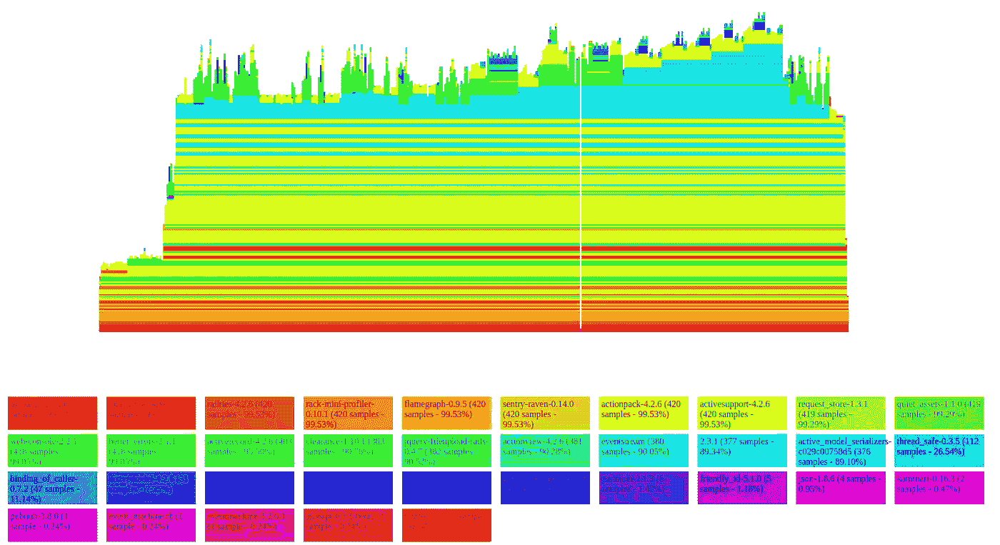
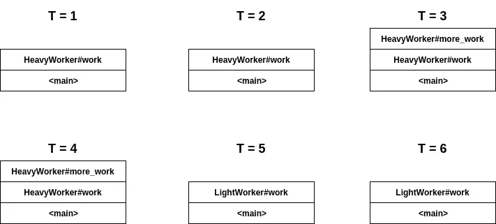
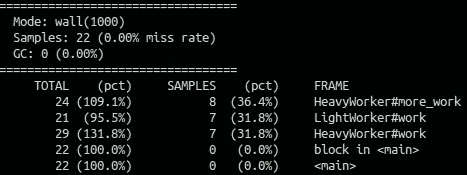
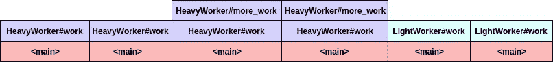
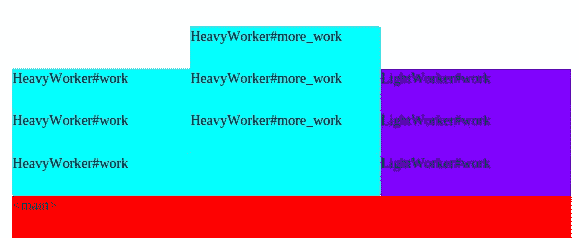

# 理解火焰图

> 原文：<https://medium.com/hackernoon/making-sense-out-of-flamegraphs-f25e1a0eb760>

Flamegraph generated for a Rails application’s request

火焰图是一个有价值的工具，可以帮助您调试应用程序的性能问题。但是，当您第一次使用它时，它们可能会让人不知所措，尤其是当您处理复杂的 Rails 应用程序，其中有许多事情正在进行的时候。

但是我们所需要的只是一点点关于如何构建 flamegraph 以及它代表什么的直觉，我们就可以开始我们的性能优化之旅了。这篇文章旨在帮助你获得有价值的直觉。

## 什么是火焰图？

火焰图只是*采样分析器输出的可视化。*

采样分析器？好吧，让我们把事情分解一下。首先，*分析器*是一个工具，它让你检查运行程序的*并收集统计数据，告诉你有多少资源(比如内存、磁盘等等。)程序正在使用，方法调用花费多长时间，执行代码的每个部分花费多长时间，等等。这些统计数据有助于你优化你的程序。有许多不同种类的分析器，深入研究它们已经超出了本文的范围。*

为了更好地理解火焰图，让我们仔细看看采样分析器。

## **采样剖析器**

*采样分析器* 是一种分析器，它通过定期拍摄运行程序的[方法调用堆栈](https://en.wikipedia.org/wiki/Call_stack)的快照来工作，并报告在哪里(在哪些函数或方法中)花费了最多的执行时间，从而允许我们识别程序中较慢的部分(瓶颈)。

理解采样分析器的工作原理对于获得阅读火焰图的直觉是至关重要的。因此，让我用一些源代码来展示采样分析器是如何工作的。

`runner.rb`中的代码简单地调用了两个类中的方法——`HeavyWorker`和`LightWorker`——它们都做了一些需要不同时间完成的工作。

像我之前描述的那样，采样分析器以我们的采样频率定义的速率拍摄程序调用堆栈的快照(换句话说，就是样本)。

假设我们的程序需要大约`6 seconds`来运行(这实际上不是真的),并且我们用`1 second`的采样频率来分析程序，这些将是我们得到的样本——

每行代表调用堆栈中的一个框架。利用我们对[调用栈代表什么](https://www.youtube.com/watch?v=Q2sFmqvpBe0)的直觉，我们现在可以从我们获得的样本中推断出以下事实—

1.  `HeavyWorker#work`大约占总执行时间的 2/3(~ 66%)。
2.  `HeavyWorker#work`中的执行时间在`HeavyWorker#work` (~33%)和`HeavyWorker#more_work` (~33%)之间平均分配。
3.  总执行时间的 1/3(~ 33%)花费在`LightWorker#work.`

这是一些有用的信息。想象一下，如果您可以从 Rails 请求执行中获得这样的快照，您可以做些什么。我们可以知道在模型中花费了多少百分比的响应时间，或者渲染你的模板花费了多长时间，或者是否有任何有问题的库花费了太多时间来执行。

在我们的程序中使用真正的采样分析器，比如[stack prof](https://github.com/tmm1/stackprof)(Ruby2.1+的一个流行选项)将会为我们提供这样的报告

Text report generated by running stackprof

该报告告诉您每个方法(帧)在调用堆栈快照顶部出现的次数(这意味着在该时间点，该方法正在执行)。

根据我们上面的推断，这个报告告诉我们`HeavyWorker`花费了大约 66%的执行时间，而`LightWorker`花费了大约 33%。需要注意的重要一点是，我们需要小心不要将这与*实际执行时间相关联。*这是不准确的，采样分析器并不意味着跟踪每个方法的实际执行时间。

stackprof 非常复杂，您也可以使用它生成其他报告。请务必阅读他们的[文档](https://github.com/tmm1/stackprof)以了解更多信息。

## 回到火焰图

既然我们已经清楚了如何使用采样分析器从正在运行的程序中提取样本，那么我们可以看看如何使用这些样本来生成火焰图。

我们需要做的是，将上面得到的快照组合成一条水平线(代表时间进程)。我们可以得到这样的东西—

我已经根据它们属于哪一类对它们进行了颜色编码。现在只需*看一眼*就可以知道每个类和方法花费了多少执行时间。很漂亮吧？我希望你现在对如何阅读火焰图有了更好的直觉。

让我们继续使用[这是我们得到的结果—](https://medium.com/u/af8fe46fdb8f# your code }</code>

 [黑客中午](http://bit.ly/Hackernoon)是黑客如何开始他们的下午。我们是阿妹家庭的一员。我们现在[接受投稿](http://bit.ly/hackernoonsubmission)并乐意[讨论广告&赞助](mailto:partners@amipublications.com)的机会。
> 
> 如果你喜欢这个故事，我们推荐你阅读我们的[最新科技故事](http://bit.ly/hackernoonlatestt)和[趋势科技故事](https://hackernoon.com/trending)。直到下一次，不要把世界的现实想当然！

