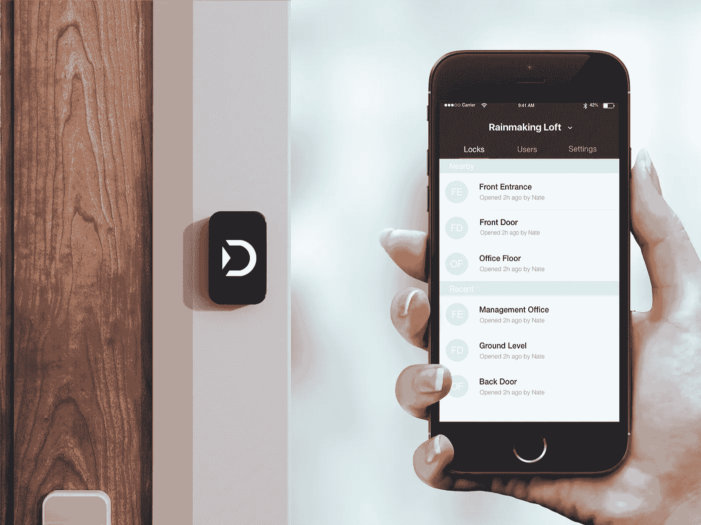
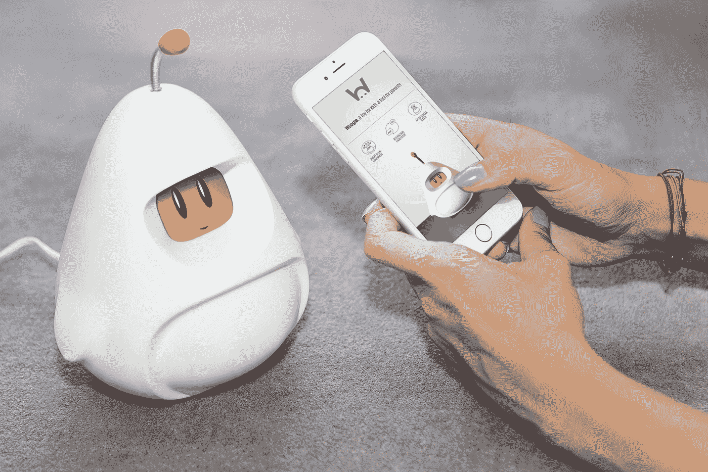

# 用物联网创造未来

> 原文：<https://medium.com/hackernoon/making-the-future-with-iot-478c0d356b3a>

**认识九家创造未来的创业公司**

早在 10 月份，我们就在[startup boot camp IoT | Connected Devices](https://www.startupbootcamp.org/accelerator/iot-connected-devices/)向九家初创公司敞开了大门，[开始了](https://hackernoon.com/tagged/beginning)为期三个月的加速计划，并在下周三(1 月 25 日)的演示日达到高潮。

我迫不及待地想看到我们的九个团队——混合了高质量的工程、技术能力和强大的[业务](https://hackernoon.com/tagged/business)经验——向一屋子的投资者、合作伙伴和导师推销他们的产品(如果你想参加，那么[你可以在我们的网站](https://startupbootcampiotdemoday.splashthat.com/)上注册)。

所以，废话少说，介绍我们的九个创业公司创造未来…

[**ThingTrax**](http://www.thingtrax.com/) 帮助制造商减少停机时间，提高运营效率，其设备从机器和电机中捕获数据，供其人工智能云平台进行分析。然后，ThingTrax 平台会在问题发生前向车间经理发送可行的见解。

ThingTrax — Smart Manufacturing made easy

YodelUP 的设备放在你的滑雪手套或连指手套上，让你甚至不需要触摸就可以使用手机和应用程序。你可以改变你的音乐，控制你的 GoPro 和浏览斜坡，所有这些都可以将你的手机安全地存放在你的口袋里。他们的移动应用程序还允许你在发布新功能时不断更新你的 YodelUP。

[**Joyride**](http://www.joyride.city/) 的设备为自行车车队经理生成数据，以改善他们的服务，并为城市建设世界级的自行车基础设施。他们的设备安装或嵌入到自行车中，能够实时监控和跟踪一队自行车，然后通过 Joyride 的数据分析仪表板更新和提醒操作员出现的问题。

[**Doordeck**](https://doordeck.com/) 用智能手机取代传统的感应卡。没有更多的钥匙卡，钥匙链，门禁卡，或挂绳。他们的技术让人们毫不费力地通过大门——使用每个人都有的钥匙，他们的智能手机。通过 Doordeck 易于使用的平台，楼宇管理人员可以快速加入新成员，与客人共享访问权限，并管理或限制访问权限。

Doordeck — Revolutionising Access Control

[**埃斯科索**](http://www.eskesso.com/en/home/) 帮你烹饪出完美的食物，甚至不用去厨房。只需在一壶水中加入一袋食物和一个 Eskesso 设备。使用他们的应用程序选择烹饪的食谱，让 Eskesso 的智能浸入式加热器完成剩下的工作。你还可以通过该应用程序订购预先准备好的食物，让美味的烹饪变得简单。

[**Woogie**](http://www.hiwoogie.com/) 是一个外星伙伴，让孩子们的学习和发现充满乐趣。使用人工智能和机器学习，他们的设备能够理解每个孩子感兴趣的东西，提供个性化的事实和故事来帮助他们发展。他们的应用程序允许父母每天给 Woogie 添加新内容。

Woogie — AI enabled device for kids education

[**tracker**](http://www.trackener.com/)是一种可穿戴设备，它可以全天候分析马的心率、活动和行为，以便提醒主人注意他们的马的问题或异常，为他们提供避免未来健康问题所需的所有信息。

[**HomyHub**](http://homyhub.com/) 让你通过智能手机控制你的车库门，任何人都可以在两分钟内安装好这个设备。由于它们的电池友好型接近传感器，你一回家车库门就会自动打开，它们的应用程序意味着你可以随时随地控制、监控和管理对车库门的访问。

[**CityCrop**](https://www.citycrop.io/) 是一个互联的室内花园，让你在自己家里种植无农药蔬菜、香草和水果。通过他们的移动应用程序，你可以决定种植什么，并全程监控你的产品，他们的水培方法和小气候允许你全年种植。

有兴趣亲自去见见这些初创公司吗？
请在这里 登记买票 [**。希望在那里见到你！**](https://startupbootcampiotdemoday.splashthat.com/)

> [黑客中午](http://bit.ly/Hackernoon)是黑客如何开始他们的下午。我们是 [@AMI](http://bit.ly/atAMIatAMI) 家庭的一员。我们现在[接受投稿](http://bit.ly/hackernoonsubmission)，并乐意[讨论广告&赞助](mailto:partners@amipublications.com)机会。
> 
> 如果你喜欢这个故事，我们推荐你阅读我们的[最新科技故事](http://bit.ly/hackernoonlatestt)和[趋势科技故事](https://hackernoon.com/trending)。直到下一次，不要把世界的现实想当然！

