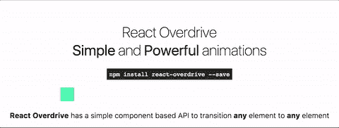
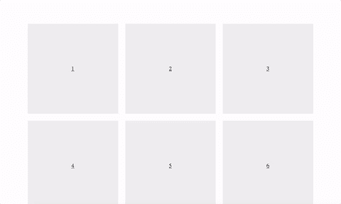

# 用 React 让网络成为一个令人愉快的地方

> 原文：<https://medium.com/hackernoon/making-the-web-an-enjoyable-place-with-react-46c0dcfaab44>

React — what an amazing development experience

React 是一个非常棒的框架，具有非常棒的 DX(开发者体验)——编写代码非常令人愉快和有趣。我们应该**向前支付**，让**为我们的用户带来卓越的体验**。

一种这样的体验是元素从一种状态到另一种状态的转换。原生移动应用已经实现了平滑过渡，今天我想让它在网络上更容易做到这一点。

React Overdrive 就是这样一个开源项目。以一种让用户非常愉快的方式将应用程序从一种状态转换到下一种状态。

React Overdrive

React Overdrive 用于处理相同元素改变位置的过渡、两个不同元素之间的过渡以及元素从一页到下一页的过渡。

虽然还不完美，但它是通向愉快网络之旅的起点。

Transition elements from a thumbnail to the full image

查看[网站](https://react-overdrive.now.sh)、 [github](https://github.com/berzniz/react-overdrive) 回购及实例: [1](https://overdrive-demo.now.sh/) 、 [2](https://nextgram-overdrive.now.sh/) 、 [3](https://overdrive-rr4.now.sh/) 。

> [黑客中午](http://bit.ly/Hackernoon)是黑客如何开始他们的下午。我们是 T21 家庭的一员。我们现在[接受投稿](http://bit.ly/hackernoonsubmission)并乐意[讨论广告&赞助](mailto:partners@amipublications.com)机会。
> 
> 如果你喜欢这个故事，我们推荐你阅读我们的[最新科技故事](http://bit.ly/hackernoonlatestt)和[趋势科技故事](https://hackernoon.com/trending)。直到下一次，不要把世界的现实想当然！

