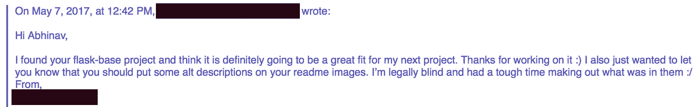
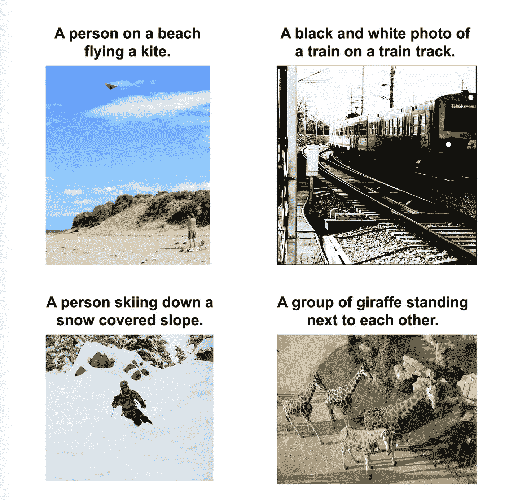
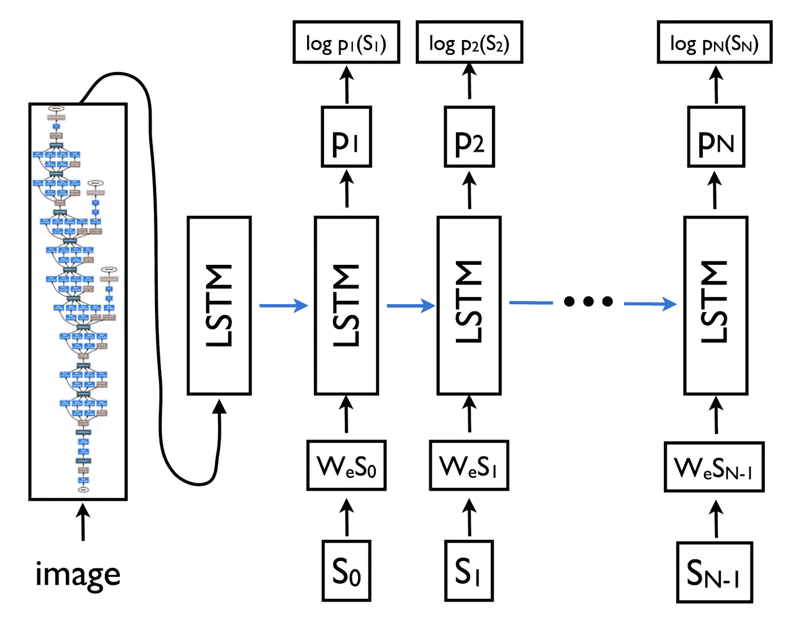
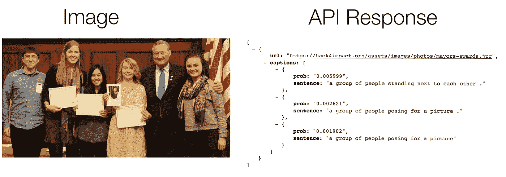
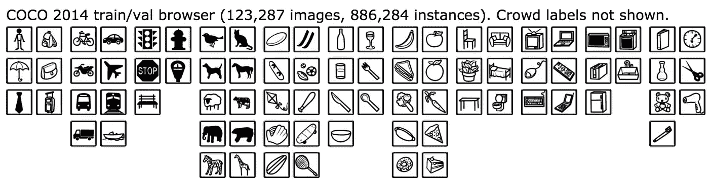

# 借助人工智能让网络更容易访问

> 原文：<https://medium.com/hackernoon/making-the-web-more-accessible-with-ai-1fb2ed6ea2a4>

Person reading Braille stock image ([src](http://usabilitygeek.com/wp-content/uploads/2012/07/Software-For-Visually-Impaired-Blind-Users.jpg))

[根据世界卫生组织](http://www.who.int/mediacentre/factsheets/fs282/en/)统计，全球约有 2.85 亿人存在视力障碍，仅在美国就有 810 万互联网用户存在视力障碍。

大多数非残疾人认为互联网是一个充满文本、图像、视频等的地方，但对视力障碍者来说却是完全不同的东西。屏幕阅读器是能够读取网页上的文本和元数据的工具，它非常有限，只能显示网页的一部分，即网站的文本。虽然一些开发人员会花时间浏览他们的网站，并为视觉障碍用户的图像添加描述性的标题，但绝大多数程序员并没有花时间去做这项公认的乏味任务。

所以，我决定借助 [AI](https://hackernoon.com/tagged/ai) 的力量，做一个工具来帮助视力障碍者“看”互联网。它被称为自动替换文本，是一个 chrome 扩展，允许用户右键单击并获取图像中场景的描述，这是第一次这样做。

查看下面的视频，了解它是如何工作的,[下载并试用](http://abhinavsuri.com/aat)！

Demo of the chrome extension in action

## 我为什么制作自动替换文本:

我曾经是那些不花时间在我的页面上添加图片描述的开发者之一。对我来说，可访问性一直是我的第二个想法，直到我收到一封来自我的一个项目的用户的电子邮件。

Email Text: “Hi Abhinav, I found your flask-base project and think it is definitely going to be a great fit for my next project. Thanks for working on it. I also just wanted to let you know that you should put some alt descriptions on your readme images. I’m legally blind and had a tough time making out what was in them :/ From REDACTED”

在这一点上，我的开发过程将可访问性放在了列表的底部，基本上是事后的想法。然而，这封[电子邮件](https://hackernoon.com/tagged/email)对我来说是一个警钟。互联网上有许多人需要可访问性功能来理解网站、应用程序、项目等的初衷。

> “网络上充斥着缺失、不正确或糟糕的替代文本的图像”——WebAIM(犹他州州立大学残疾人中心)

## 人工智能拯救:

有很多种方法为图像添加字幕；然而，大多数都有一些共同的缺点:

1.  他们没有反应，需要很长时间来回复字幕。
2.  它们是半自动的(即依靠人工根据需要手动为图像添加字幕)。
3.  它们的创建和维护成本很高。

通过创建神经网络，所有这些问题都可以解决。我最近开始深入研究机器学习和人工智能，这时我遇到了 Tensorflow，这是一个帮助机器学习的开源库。Tensorflow 使开发人员能够构建健壮的模型，这些模型可用于完成从对象检测到图像识别的各种任务。

做了更多的研究，我看到了 Vinyals 等人的一篇论文，名为“[展示和讲述:从 2015 年 MSCOCO 图像字幕挑战赛](https://arxiv.org/abs/1609.06647)中吸取的教训”。这些研究人员创建了一个深度神经网络，以语义方式描述图像内容。

Examples of im2txt in action from the [im2txt Github Repository](https://github.com/tensorflow/models/tree/master/im2txt)

## im2txt 的技术细节:

该模型的机制相当详细，但基本上是一个“编码器-解码器”方案。首先，图像通过一个名为 Inception v3 的深度卷积神经网络，这是一个图像分类器。接下来，编码后的图像通过 LSTM，这是一种专门用于模拟序列/时间敏感信息的神经网络。然后，LSTM 通过一组词汇，构建一个句子来描述图像。它是这样做的:从词汇表中取每个单词在句子中第一个出现的可能性，然后根据第一个单词的概率分布计算最可能的第二个单词的概率分布，依此类推，直到最可能的字符是“.”指示标题的结尾。

Overview of the structure of the neural network (from the [im2txt Github repository](https://github.com/tensorflow/models/tree/master/im2txt))

根据 Github 知识库，在 Tesla k20m GPU 上，这个神经网络的训练时间大约为 1-2 周(对于我所拥有的笔记本电脑上的标准 CPU 来说，时间可能要长得多)。幸运的是，tensorflow 社区的一名成员提供了一个经过训练的模型供公众下载。

## 开箱即用的问题+ Lamdba:

在运行模型时，我设法让它与 Bazel 一起工作，Bazel 是一个用于将 tensorflow 模型预打包到可运行脚本中的工具(除了其他目的之外)。然而，在命令行上运行时，我花了将近 15 秒的时间才从单个图像中得到一个结果！解决这个问题的唯一方法是将张量流图保存在内存中，但这需要保持应用程序全天候运行。我计划把这个模型放在 AWS Elasticbeanstalk 上，在那里计算时间是按小时分配的，让一个应用程序一直运行是不理想的(基本上导致了图像字幕软件的缺点中的第三种情况)。所以，我决定改用 AWS Lamdba 来托管一切。

Lambda 是一项以极低的成本提供无服务器计算的服务。此外，当它被积极使用时，它按秒计费。Lambda 的工作方式很简单:一旦你的应用程序收到用户的请求，Lambda 就会激活你的应用程序的图像，提供响应，并停用该图像。如果您有多个并发请求，它只是旋转更多的实例来适应负载。此外，只要一小时内有多个请求，它就会保持您的应用程序激活。这项服务非常适合我的用例。

AWS API Gateway + AWS = heart ([src](https://cdn-images-1.medium.com/max/700/1*SzOPXTf_YQNtFejG0e4HPg.png))

Lambda 的问题是我必须为 im2txt 模型创建一个 API。此外，Lamdba 对可以作为函数加载的应用程序有内存限制。上传包含所有应用程序代码(包括依赖项)的 zip 文件时，最终文件不能超过 250 MB。这个限制是一个问题，因为 im2txt 模型的大小超过了 180 MB，并且它运行的依赖项超过了 350 MB。我试图通过将一些部分上传到 S3 实例中，并在 lambda 实例激活时下载到我正在运行的实例中来解决这个问题；然而，lambda 上的总存储大小限制是 512 MB，我的应用程序已经超过了这个限制(总共大约是 530 MB)。

为了减小项目的最终规模，我重新配置了 im2txt，以接受一个精简的模型，只包含经过训练的检查点，不包含无关的元数据。这一删除将我的模型大小减少到 120 MB。然后我发现了 [lambda-packs](https://github.com/ryfeus/lambda-packs) ，它包含了所有依赖项的最小化版本，尽管使用的是 python 和 tensorflow 的早期版本。在经历了降级任何 python 3.6 语法和 tensorflow 1.2 代码的痛苦过程后，我终于有了一个总共约 480 MB 的包，刚好低于 512 MB 的限制。

为了保持快速响应，我创建了一个 CloudWatch 函数来保持 Lambda 实例“热”和应用程序活动。我添加了一些辅助函数来处理非 JPG 格式的图像，最终得到了一个可用的 API。所有这些减少导致了 https://github.com/abhisuri97/auto-alt-text-lambda-api< 5 seconds in most cases!

Image with likely probabilities of what is in the image according to the API

Moreover, Lambda is incredibly cheap, at the current rate, I can analyze 60,952 images for free monthly and any additional image for $0.0001094 (meaning approx $6.67 for the next 60,952 images).

More details about the API can be found at the repository: [的极快响应时间](https://github.com/abhisuri97/auto-alt-text-lambda-api)

剩下的工作就是将它打包到 chrome 扩展中，以便于最终用户使用，这并不是一个太具挑战性的任务(因为它只涉及到对我的 API 端点的一个简单的 AJAX 请求)。

Auto Alt Text Chrome Extension in action

## 结果:

Im2txt 在人物、风景等图像上表现出色。只要这些对象存在于上下文中的公共对象(COCO)数据集中。

Categories of images in the COCO dataset

这种模式在某种程度上限制了标题的范围；然而，它确实涵盖了脸书和 Reddit 等社交媒体网站上的大多数图片。

然而，由于 COCO 数据集不包含任何此类图片，因此它通常无法为包含文本的图像添加标题。我尝试使用宇宙魔方来完成这项任务；然而，结果太不准确，而且产生时间太长(超过 10 秒)。我目前正在 Tensorflow 中实现王等人的论文来帮助完成这个任务。

## 外卖:

虽然每周都有关于人工智能奇迹的新故事，但重要的是退一步看看这些工具如何在研究环境之外使用，以及这些发现如何帮助世界各地的人们。总的来说，我喜欢用 im2txt 深入研究 Tensorflow，并能够将我所学到的知识应用到现实世界的问题中。希望这个工具将是第一个帮助视障人士看到更好的互联网的工具。

## 链接:

*   关注我:我主要在[我的媒体](/@abhisuri97)上发布我正在做的事情。如果你喜欢这个帖子，我会很感激你的关注:)在接下来的几个月里，我会发布更多关于使用 AI/tensorflow 解决现实世界问题的“如何做”指南。在不久的将来，我也会发布一些 JS 解释者/教程。
*   链接到 Chrome 扩展[下载页面](http://abhinavsuri.com/aat)
*   链接到自动替换文本 Lambda API [Github 库](http://github.com/abhisuri97/auto-alt-text-lambda-api)