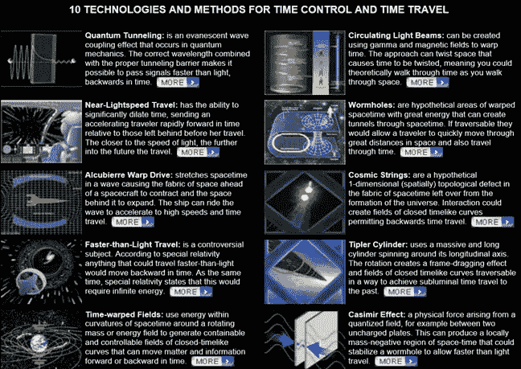

# 让时间旅行成为现实

> 原文：<https://medium.com/hackernoon/making-time-travel-a-reality-61e60dc8f6c8>

这是一个每个人都会问但从不相信会有可能的问题，“如果你可以旅行到任何时间点，你会旅行到什么时候？”事实证明，时间旅行可能不像许多人预期的那样遥远，因为现在有具体的科学支持这个想法。

詹姆斯·比彻姆是欧洲核研究组织的粒子物理学家，他在布达佩斯的大脑酒吧(Brain Bar Budapest)与切尔西·高德(Chelsea Gohd)坐下来谈论这个想法。比彻姆提出的想法之一是利用虫洞。比彻姆说，“我们知道空间是可以弯曲的。如果说重力可以弯曲*空间*，那么*时空*也可以弯曲如果一切都在三维系统中运动，时空就是空间和时间相遇的四维系统。所以，如果时空可以弯曲，时间也可以。

这可能看起来有些牵强，但是来自巴塞罗纳马德大学物理系的科学家们已经在一个实验室里创造了一个虫洞，将空间中的两点磁性地连接起来。这些虫洞是磁性虫洞，而不是时空(引力)虫洞，但可以制造隐形虫洞的想法仍然是创造时间旅行的一大进步。

史密森尼简单地描述了这一点，“如果另一个磁场穿过虫洞，它似乎会一起离开空间，只在另一端出现。”因此，这种方法的最大“缺点”是，这些虫洞还不能传送人或粒子，但是操纵基本物理力的能力让人们认为操纵时空也是可能的。

时间旅行的另一种方法是时间膨胀。艾森泰因关于时间在宇宙中以不同方式传播的理论被证明是正确的，因为国际空间站上的时钟比地球上的慢。这是因为在强引力场附近时间移动得更快。这意味着接近超大质量黑洞几秒钟可能是地球上几年的时间。

同样的效应也发生在时间上，以接近光速的速度旅行几秒钟将会使时间明显变慢，几千个地球年可能在几秒钟内过去。由于人类仍然无法创建正确类型的虫洞或以接近光速的速度旅行，正在进行的研究每天都越来越近。

这些只是时间旅行的几种可能性，关于如何实现这种可能性，有许多不同的想法。

比彻姆说:“通过我们现在所做的研究，我们有可能解决关于时间旅行的问题，并理解时间的基本性质。或者至少在未来的 50 到 100 年内。”斯蒂芬·霍金也说过时间旅行，“即使时间旅行是不可能的，重要的是我们要明白为什么它是不可能的。”