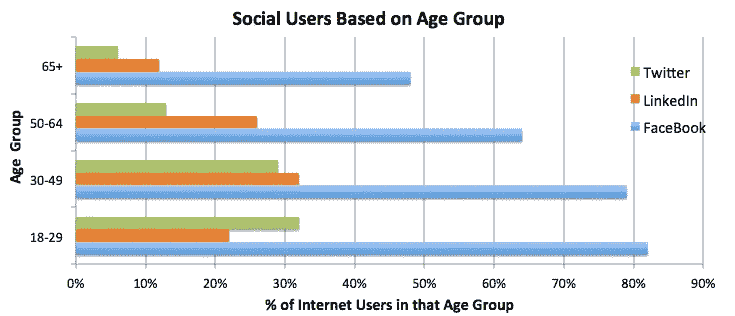

# 让 Twitter 为杰克·多西的投资者和我服务！

> 原文：<https://medium.com/hackernoon/making-twitter-work-for-jack-dorseys-investors-and-me-dc6aa4c768ba>

Twitter 的美妙之处在于一个精心设计的约束——用 140 个字符或更少的字符广播你想说的话。没有中间人。

名人世界蜂拥至推特。对我们其余的人来说，一条推特听起来像是寓言的寓意或往昔的对联*-简短，简单并且(希望)令人难忘。一种经得起时间考验的简单方法帮助推动了 Twitter 的发展。

在最近的收益电话会议上，Twitter 的数据说话了——3.1 亿用户，上个季度收入 5.95 亿美元。坚定的用户继续保持忠诚。杰克·多西和他的推特团队在让他们开心方面做得非常出色。然而，杰克·多西面临着挑战。华尔街渴望 Twitter 的增长。为什么 Twitter 的增长明显停滞了？

> 杰克的困境让我想起了我在印度的村庄里着迷地看过的一个故事。

在我成长的那些年里，每年夏天，我都会去村里看望我的祖父母。有一年夏天，我在村里的当地夫妻店发现了一件独特的东西——我发现香包挂在显眼的地方。我问店主它们是什么——他提到当地一家公司生产袋装洗发水和护发素(它们看起来像塔可钟酱包，稍微大一点),村里的人觉得很方便。

当城市培育 honchos 创造洗发水时，他们致力于更好和更深层的产品，每年都在更高级的瓶子里增加赌注。这家本地公司将其变成了更简单的掘金，并获得了更大的客户群！到明年夏天，所有的大品牌都复制了这一模式。在我下一次夏季访问期间，这个有时伪装成店主的村民自豪地分享了他更大的展示。回到洗发水公司，谁不想扩大客户群呢！

这个村庄的故事和 Twitter 有相似之处吗？我想知道。

让我们看看 Twitter 去年的重大变化——通过算法与年表增加了一个新的时间线，将潜望镜集成到时间线，增加了民意调查，增加了 moments 新闻频道等等。显而易见，所有的改变，很多是早该做的，使产品变得更好。更简单的小袋不见了——最接近的是将最喜欢的重新命名为带有心形标志的更普通的“喜欢”。

> 它发生在我们最优秀的人身上——我们被我们所知的东西吸引得更深。更大的问题是:丢失的香包重要吗？只有在你的传统势力范围之外有市场才重要。

让我们来看看 Twitter 和其他社交网站的年龄统计数据[感谢皮尤研究所对美国互联网用户的研究]

脸书是一个庞然大物——这是显而易见的。除此之外，LinkedIn 在 GenX 和婴儿潮一代中相对出色，Twitter 在这一人群中还有很长的路要走。

在与他们中的一些人(在 Twitter 上更沉默的 LinkedIn 用户)的交谈中，我突然明白了他们是如何看待 Twitter**——一个以关注者为重点的广播平台**——交谈几乎没有被讨论。

> 一个普通人拥有追随者的几率和他作为核心人物主演好莱坞电影的几率一样好，甚至略好。当普通人在彼此的电影中表演时，那就是另一回事了。

很多时候，我很难确定我听到的是酸葡萄心理还是对 Twitter 风格的真实困惑——FF，MT，B4 和更多的 T1。一个人笑着分享道:“数学是有符号的，我年轻的时候就被教导这些，Twitter 快捷方式是另一个故事。我需要捷径女神的祝福。”

不管怎样，这些人群缺少一种不同类型的简单。

**让 Twitter 为你、我和 Twitter 的投资者服务**

> 如果 Twitter 只是浏览器书签的简单扩展，会发生什么？随着世界向云发展，这能成为一种自然的延伸而不被拉长吗？作为一个香包，它对这些人来说更有吸引力吗？

我已经用 Twitter 做了一段时间的公共书签实验，我觉得很舒服。我喜欢两个功能——推文没有截止日期(不像 LinkedIn 上的更新),任何人都可以在闲暇时顺便来看看我的推文书签，而不会因为交谈而影响列表的流动。

所有这一切的好处是——任何广告商都可以查看我的书签推文(它们是公开的)，并有望瞄准更好的定制广告——如果我不能避免广告(我确实意识到它们有助于保持内容免费)，至少让这些广告更相关。

最重要的是，我用 140 个字符中的大部分来提醒自己为什么我把这篇文章作为 tweet 添加了书签。

我征服 Twitter 了吗？见鬼，不。渐渐地，我明白了标签和@提及在我的 tweet 书签中的价值。事后，我想知道为什么我没有勇气让我的 twitter 手柄变得超小。我真的很羡慕 Om Malik，他是 GigaOM(一个很棒的网站，可惜是从前的)的创始人。他有一个最短的- @om。[杰克-也许，你可以原谅 140 计数的长把手，以鼓励提及。]

**在以上段落的所有单词中,“逐渐”一词概括了 Twitter 中的香包——书签的美丽。**它们是长期解决方案吗？显然，没有。然而，对于 Twitter 领域之外的普通人来说，这是更简单的一小步。

> 这就是 Twitter 所需要的——不是深度的魔力，而是广度的简单魅力。仍然受到简单约束的推动—总共 140 个字符。

每个人都有自己的想法。你对 Twitter 的快速发展有什么想法吗？请在评论区分享它们。让我们谈一谈。

你可以在 Twitter [@KarthRajan](http://twitter.com/karthrajan) 上“关注”我。我分享我最喜欢的阅读书签和其他一些。

— — — —

Karthik Rajan
我喜欢在分析和人际关系的交叉点上写作。

*   泰米尔语中有一套古老的智慧对联，叫做 [Thirukkural。——](https://en.wikipedia.org/wiki/Tirukku%E1%B9%9Ba%E1%B8%B7)1330 副对联中的每一副正好是 7 个字。是在公元前 3 世纪制作的。每一代人仍然引用他们的话！

> [黑客中午](http://bit.ly/Hackernoon)是黑客们下午的开始。我们是 [@AMI](http://bit.ly/atAMIatAMI) 家庭的一员。我们现在[接受投稿](http://bit.ly/hackernoonsubmission)并乐意[讨论广告&赞助](mailto:partners@amipublications.com)机会。
> 
> 要了解更多信息，请[阅读我们的“关于”页面](https://goo.gl/4ofytp)、[在脸书上给我们点赞/发消息](http://bit.ly/HackernoonFB)，或者简单地说， [tweet/DM @HackerNoon。](https://goo.gl/k7XYbx)
> 
> 如果你喜欢这个故事，我们推荐你阅读我们的[最新科技故事](http://bit.ly/hackernoonlatestt)和[趋势科技故事](https://hackernoon.com/trending)。直到下一次，不要把世界的现实想当然！