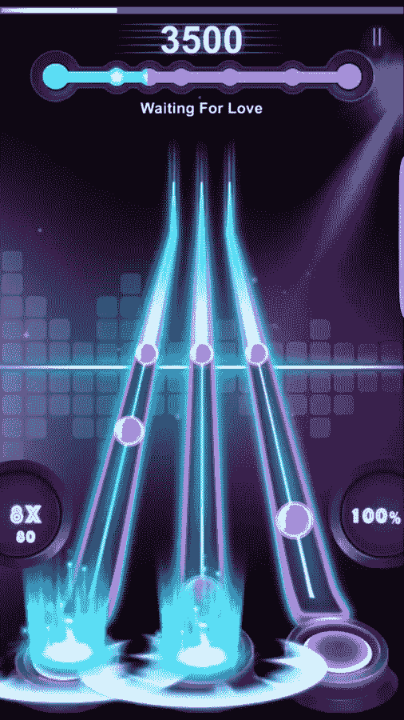
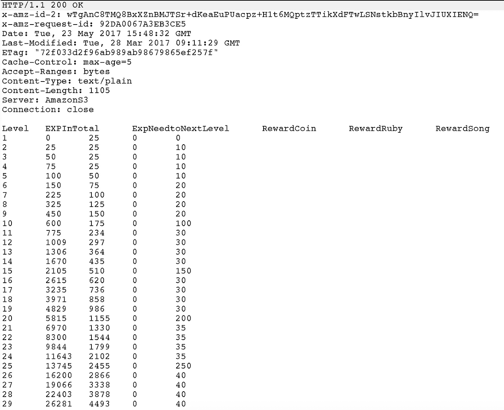
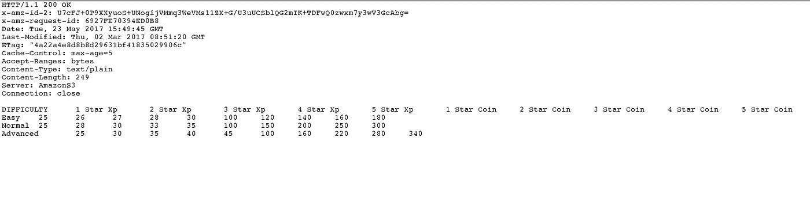
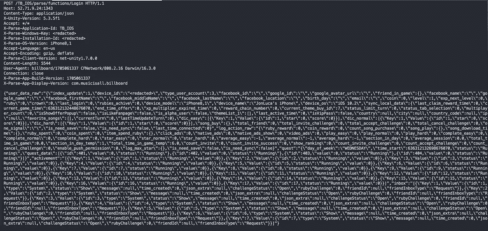
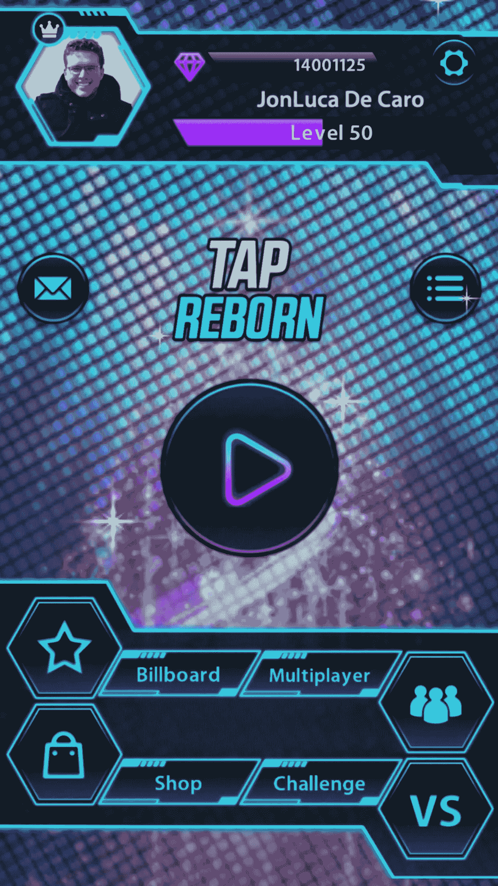
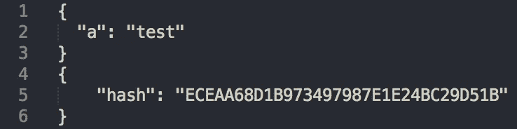
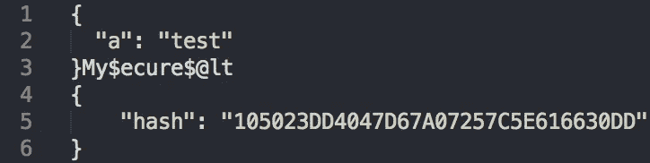

# 中间人 iOS 攻击:依赖单一安全层的危险

> 原文：<https://medium.com/hackernoon/man-in-the-middle-ios-attacks-the-danger-of-relying-on-a-single-layer-of-security-d39096c207a9>

作者注:这篇文章不会研究任何新的漏洞。相反，它探索了在琐碎的 [*入侵*](https://hackernoon.com/tagged/hacking) *iOS 应用程序中使用的一种常见方法，在这种方法中，你对自己进行中间人(MitM)攻击。*

*此外，您还需要对中间人攻击、SSL 和 HTTP 协议有初步的了解。它是为普通读者编写的，因此为了本文的目的，对一些示例进行了简化。*

# 通用设计模式

作为一名 iOS 开发人员，你通常希望以比苹果允许的应用更新速度更快的速度推送更新/更改。此外，经常会有一些小的变化(实际上是几个字节)，需要所有用户下载更新的二进制文件，这可能有几百兆字节的大小。

如果您经常更改某些参数，那么远程调用它们可能是有意义的。对服务器上的配置文件进行简单的更改，就可以快速有效地传播您的更改。然而，如果在应用程序中设置的参数很关键，它可能会使您的应用程序暴露于漏洞和 MitM 攻击。

这最常见于手机游戏、有 p2p 需求的应用，以及需要快速更新的应用(新闻、社交媒体等)。)

# 拦截请求

作为一名移动设备开发人员，最初可能不会想到拦截他们的网络请求会很容易，而且简单地使用 https 就足以阻止任何人四处窥探。然而，当您处理需要频繁更新的互连模型时，您将自己暴露在一个全新的攻击媒介面前——当用户对自己进行中间人攻击时。

虽然没有方法可以完全防止用户拦截自己的连接，但是有一些设计模式可以减轻这种风险。

作为概念验证，看一下 Tap Tap Reborn。大约 50 万用户，游戏外有一个活跃的社区，相对昂贵的应用内购买(高级 20 美元，750 个“宝石”10 美元)。

[要拦截 iOS 网络请求，我建议遵循 PortSwigger](https://support.portswigger.net/customer/portal/articles/1841108-configuring-an-ios-device-to-work-with-burp) 的指南。此外，在较新版本的 iOS 中，您需要允许完全信任根证书，方法是前往设置- >通用- >关于- >证书信任设置。

在首次加载应用程序时，它会尝试从 EC2 实例下载配置文件——不对输入进行验证或确认。这些规定了一切，从默认设置、可用歌曲、要求的点数级别，到每个动作的“奖励”。

Example config file that tells the app how much EXP is required for each level

这些配置文件的内容没有任何形式的验证。此外，每次运行应用程序时，它都会用一个包含您所有详细信息的大型 JSON 对象来更新服务器。同样，没有验证或加密。

POSTing updates to the server for games you’ve played since last update

真正有意思的是，这个应用程序在加载时会用你上次签名后的进度来更新服务器。它也不基于事件进行这些更新(比如，如果您播放了 3 首歌曲，它会提交 3 个带有歌曲详细信息的事件，并记录您的 XP)，相反，它只接受一个大的 JSON profile 对象。

服务器盲目地接受任何发送过来的东西。*在这里改变数值准确地反映了服务器端！*

因此，拦截单个请求并修改值，然后清除应用程序并通过脸书重新登录将允许你设置你的宝石，等级和经验值为你喜欢的任何东西。作为 alpha 用户，你也可以将自己设置为 premium，以及每首歌曲的最高分。

通过这种方法，一个人很容易成为世界第一玩家，并给自己任意数量的游戏内货币。

那批宝石相当于*18.7 万美元。*当然，它实际上根本不值这个数目，但很容易想象，在更重要的产品或 SaaS 产品上，由于付款或购买未经验证，你会很容易地积累费用。

# 可能的解决方案

应该如何解决这个问题？我们将探索一些常用的方法来缓解这种攻击媒介。

## 散列内容并验证

突破难度:微不足道

嵌入盐的难度:中等

这个问题的第一个解决方案是在数据中包含一个散列，看起来有点像这样:

这对于测试你的信息的有效性和没有损坏是很好的，但它不是一个有效的[安全](https://hackernoon.com/tagged/security)方法——你需要做的只是在将数据包转发到设备之前重新散列信息和替换散列。

当你在二进制文件中嵌入了一个 salt 时，这变得更加可行。这更正式地称为“共享密钥”类型的加密。例如，如果在对照哈希验证数据之前，将“My$ecure$@lt”附加到数据的末尾，就可以防止任何纯粹的中间人攻击。攻击者必须反编译并检查二进制文件，这是可行的，但比简单的 MitM 攻击需要更多的努力和知识。

What the hashing/verification would look like internally to your iOS application — it would append the salt, then hash it and verify against the provided hash. This is a “shared secret” method of encryption.

通过使用 obfuscator，[比如 Obfuscator-iOS](https://github.com/pjebs/Obfuscator-iOS) ，这种方法可以变得更加安全。然而，这仍然不能阻止专门的攻击者。

## 自定义加密

突破难度:中等/困难

这更像是模糊的设计，而不是清晰开放的设计，但是它会给大多数攻击者设置一个不小的路障。这种模式会以某种方式对数据内容进行加密。这可以从简单的编码(base-64)一直到 PGP，甚至是滚动你自己的加密([我不推荐——一个系统在被彻底攻击之前是不安全的](https://security.stackexchange.com/questions/18197/why-shouldnt-we-roll-our-own))。这将再次需要某种形式的密钥隐藏在二进制文件中，这不是不可能的逆向工程和提取。

这将挫败除了最专注的攻击者之外的所有人。纯粹的 MitM 攻击是不够的，需要大量的知识来计算如何解密。

这种方法的缺点是，它需要更多的计算资源，并且给系统增加了另一层抽象。

## 证书锁定

突破难度:困难

证书锁定包括验证加密/返回信息的证书是否与一组已知的证书相匹配，也就是说，它没有在两者之间被“换出”。这可以说是防止 MitM 攻击的最安全的方法之一——设备不会接受任何未经嵌入证书签名的连接。

绕过这个的唯一方法是越狱设备，手动禁用 SSL 验证或者用 Burp Suite 替换嵌入的证书。这将需要更复杂的攻击级别，如果您的设备越狱/扎根，那么还有多个其他攻击媒介需要考虑。

## 更好的建筑设计

安全系统的最佳方法是从一开始就考虑安全性。这意味着保护您的终端，并有意识地决定每次会话应该更新哪些信息，以及每个阶段需要多少级别的验证。它包括对您的应用程序有一个更抽象、更有安全意识的观点，以及它可能有哪些攻击媒介。在上面的示例中，最小化这些向量意味着每次会话需要刷新尽可能少的信息，而不是从实时配置中提取某些关键组件。

# 适用性和进一步研究

中间人攻击并不是什么新鲜事，这与其说是一个突破性的发现，不如说是一个安全范例的应用。然而，作为一名开发人员，您通常更关注防止外部攻击者破坏您用户的数据完整性，而不是防止由您的用户自己执行的 MitM 攻击。

Snapchat 和脸书已经实现了证书锁定，因为这是防止任何第三方在连接过程中修改数据的最可靠、最安全的方法之一(截至本文撰写之时)。这并不是不可能绕过(越狱设备见 [iOS Kill Switch](https://github.com/iSECPartners/ios-ssl-kill-switch) )，但在这一点上，攻击者将获得比单个 HTTP 连接更多的访问权限。

这篇文章旨在说明一种常见的不良设计模式，以及 iOS 应用程序完全依赖 SSL/TLS 会导致怎样的后果，从收入损失到应用程序的完全妥协。在 iOS 上尤其如此，在 iOS 上很容易简单地依赖 Swift 的 HTTP 请求，而不用考虑用户用自己的证书替换证书。

> [黑客中午](http://bit.ly/Hackernoon)是黑客如何开始他们的下午。我们是 [@AMI](http://bit.ly/atAMIatAMI) 家庭的一员。我们现在[接受投稿](http://bit.ly/hackernoonsubmission)并乐意[讨论广告&赞助](mailto:partners@amipublications.com)机会。
> 
> 如果你喜欢这个故事，我们推荐你阅读我们的[最新科技故事](http://bit.ly/hackernoonlatestt)和[趋势科技故事](https://hackernoon.com/trending)。直到下一次，不要把世界的现实想当然！

