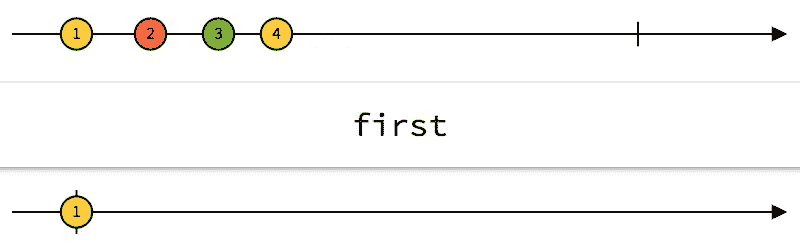
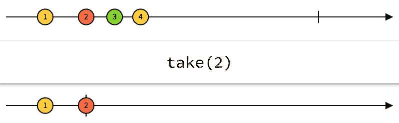
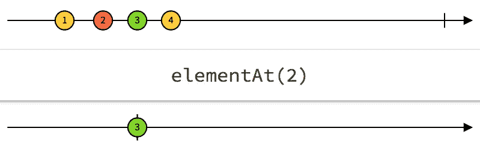
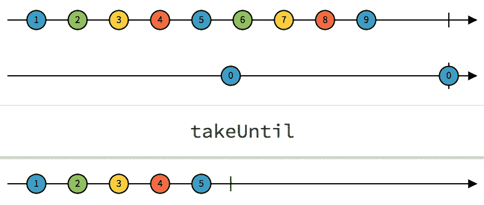
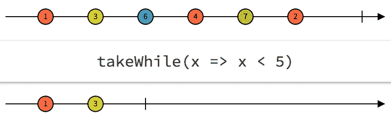

# 借助 rx.js 在 Angular 中管理您的可观察订阅

> 原文：<https://medium.com/hackernoon/manage-your-observable-subscriptions-in-angular-with-help-of-rx-js-f574b590a5cb>

订阅 observables 时，管理您的订阅是关键。一个可观察的执行可以运行无限长的时间，因此我们需要一种方法来阻止它的执行。如果我们对不需要的资源开放订阅，我们会失去不必要的内存和计算资源，这是不好的。我们当然可以直接调用`unsubscribe()`，但是有更好更简单的方法来阻止你的订阅使用 rx.js 接收数据。

如果你不确定你已经完全理解了可观测量，我推荐阅读我的[前一篇文章](https://hackernoon.com/understanding-creating-and-subscribing-to-observables-in-angular-426dbf0b04a3)。

Photo by [Grant Ritchie](https://unsplash.com/photos/x1w_Q78xNEY?utm_source=unsplash&utm_medium=referral&utm_content=creditCopyText) on [Unsplash](https://unsplash.com/?utm_source=unsplash&utm_medium=referral&utm_content=creditCopyText)

使用 rx.js 中的操作符使我们能够在不调用`unsubscribe()`的情况下完成可观测量。使用这些方法而不是调用`unsubscribe()`总是有优先权的，因为这样我们对我们的订阅有更多的控制权。

对于每个 rx.js 运营商，我将包括 rxmarbles.com 的图像。请注意，顶部的箭头代表发出多个值的原始可观察值。每个圆圈代表一次发射。底部的箭头表示操作符在数据流完成之前对数据流的影响。如果你还没有看 rxmarbles，我强烈推荐你尽快去看。它真的可以帮助您理解每个 rx.js 操作符是如何工作的。

# 。首先()

如果您确定您只需要第一个值或通过测试的第一个值，请使用`first()`。可观察对象只发出第一个值，然后完成。

[http://rxmarbles.com/#first](http://rxmarbles.com/#first)

**示例用法** 当您只想从 api 请求中获取值时，可以使用`first`。因为您知道您只需要一个值，`first`非常适合。

# 。采取()

如果您事先知道您只想从您的源中获取最大数量的值，您可以使用`take`。`take`返回最大次数发出其值的可观察值。

[http://rxmarbles.com/#take](http://rxmarbles.com/#take)

**示例用法** 例如，当您知道第一个值可以为空，但第二个值有您需要的值时，您可以使用`take`。当从我的 ngrx/store 中选择数据时，我有时会使用它。当您请求数据时，可能会出现商店仍然为空的情况，第一个值将为 null。过一会儿，商店可能就满了，我的订阅现在收到了它需要的数据。然后工作正常。

# 。元素 At()

其中`take`接受来自可观察对象的最大发射数。`elementAt`只接受来自给定索引的发射。换句话说，如果你只想从一个可观测值中得到第三个值，就使用`elementAt`。`elementAt`然后等待第三个值，然后完成。

[http://rxmarbles.com/#elementAt](http://rxmarbles.com/#elementAt)

**示例用法** 也许有这样一个场景，你正在制作一些交互的东西，需要用第三次点击来做一些事情。

# 。直到()

这个有点困难，因为`takeUntil`需要两个可观测量。`takeUntil`发出值，直到第二个可观察对象发出“某物”或完成。第一个可观察的，例如原始源，然后完成。

[http://rxmarbles.com/#takeUntil](http://rxmarbles.com/#takeUntil)

**例子用法** 假设你正在收听一个特定页面上的 websocket。当然，当您在页面上时，您只需要打开这个 websocket 的订阅。可以使用`takeUntil`在 routeChange 上自动退订。

# 。takeWhile()

你可以把`takeWhile`看成一个滤镜。可观察对象发出的每个值都被赋予`takeWhile`。然后测试特定条件的值，并返回一个布尔值。如果返回 false，则可观察性完成。

[http://rxmarbles.com/#takeWhile](http://rxmarbles.com/#takeWhile)

**示例用法** 我给出的关于何时使用`take`从我的 ngrx/store 中选择可能存在或可能不存在的数据的示例也可以使用`takeWhile`来完成。

# 结论

虽然这些示例有些虚构，但对`first`、`take`、`elementAt`、`takeWhile`和`takeUntil`的简要概述应该会让您更好地理解如何在不使用退订的情况下管理您的订阅。

# 在阿姆斯特丹找工作？

我在 Sytac 工作，是一名高级前端开发人员，我们正在寻找精通 Angular、React、Java 或 Scala 的中级/高级开发人员。Sytac 是荷兰一家雄心勃勃的咨询公司，为银行、航空、政府和零售部门的许多知名公司工作。你可以想到荷兰国际集团、荷兰皇家航空公司、德勤公司、阿霍尔德·德尔海兹公司、ABN·AMRO 公司、弗洛拉·荷兰公司等等。

从个人的观点来看，Sytac 确实与他们的客户组合不同，但也与他们如何照顾他们的员工不同。他们真的很关心员工的福利。除了丰厚的薪水(50K-75k)，你会在与咨询经理的定期会议中注意到这一点，还会从他们组织的活动数量以及他们为让所有员工满意而提供的所有其他津贴中注意到这一点。

如果你认为你有能力与最优秀的人共事，请发邮件给我，我很乐意告诉你更多..