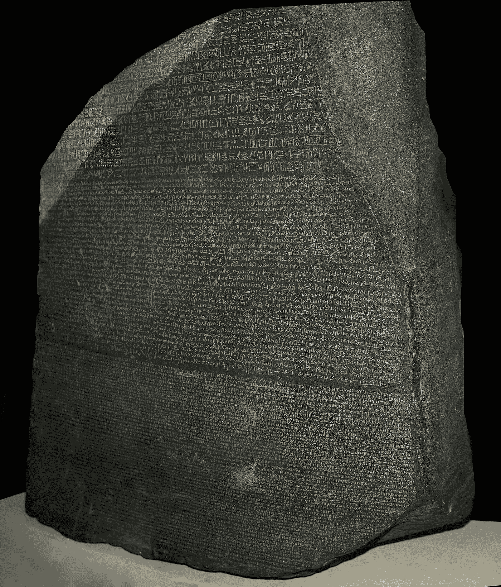

# 工程师的经理行话

> 原文：<https://medium.com/hackernoon/manager-lingo-for-engineers-4c8db00c4bb1>

不久前，我从一名工程师变成了一名经理。

随之而来的是一套全新的经理用词，我之前只是点头附和，但并没有深入理解。这篇文章是我对这些概念的定义，以一种 engineer-Collin 能够理解的方式。

## 序文

工程师建造了一个价值 100 美元的东西.经理们建立团队来创造价值 100 美元的东西.

一切都围绕着每个小组各自的重点，包括词汇。

围绕软件工程的对话根植于细节:规模、设计、权衡。经理方面对等物更抽象，但围绕着:团队方向、健康、产出等。

作为一名工程师，我记得主要是在计划或审查季节听到这些术语。

## 视力

愿景是你想要的未来的版本。

## 路标

愿景的近期表现，使之具体化。包括项目或任务。

## 代表团

团队、项目或公司的根本目的。兼作启发式，以确定给定的项目/目标/任务是否应该落在给定的团队身上。它定义了你的团队或问题空间的边界。

## 影响

影响力是你和你的团队对公司/世界的影响。收入、cpu 周期、节省的工程师时间、每月活跃用户、避免的数据泄露等。软件的魔力在于高影响力的项目通常是可扩展的。

## 影响

激发、说服或激励的能力。通常用于销售愿景，因为伟大的想法很少能单独实现。一个工程师说服其他工程师加入工作是利用影响力。

## 视觉++

视觉是最有趣的概念之一，也是我一直纠结的一个，所以它得到了额外的关注。

同样，愿景是阐明你认为应该存在的未来版本。这通常是一种大胆的声明。

视觉天生就是反细节的。这是因为它定义的是目的，而不是手段。对于那些喜欢沉湎于细节的人来说，或者那些马上就开始想事情可能会出错的人来说，这可能会让人不舒服。

愿景必须简洁。就像一个笑话，如果你必须解释它，它失败了。

到这个十年结束时，我们将把人送上月球。约翰·肯尼迪，1962 年

每张桌子和每个家庭都有一台电脑。比尔·盖茨，1980 年

[我们将出售我们过剩的计算能力](https://plus.google.com/+RipRowan/posts/eVeouesvaVX)
——杰夫·贝索斯

这些都是大胆的想法，很容易让人兴奋，可能被定义为成功和简洁。

即使无法实现，愿景也是有用的，例如:我们从未发布过安全漏洞。

愿景并不一定来自经理，它通常是在一些鼓励下产生的。

清晰的愿景具有强大的下游优势:

> 看到一个 SpaceX 的员工在组装一个大部件，他停下来问他:“你在 SpaceX 的工作是什么？”他回答道，“SpaceX 的使命是殖民火星。为了殖民火星，我们需要建造可重复使用的火箭，否则人类将无法负担往返火星的费用。我的工作是帮助设计操纵系统，使我们的火箭能够返回地球。如果我们的火箭在发射后降落在大西洋的平台上，你就会知道我是否成功了。”这名员工可以简单地说，他正在为火箭着陆建造一个转向系统。相反，他列举了公司的整个“任务到指标”框架。

— [阿里·罗加尼](https://blog.ycombinator.com/the-second-job-of-a-startup-ceo/)

愿景是一个顶级概念，路线图、项目和任务都来源于它。

视觉最有趣的例子，也是最困难的例子，是认识到一个从未存在过的未来。把你在工作中看到的想法带到你现在的公司要容易得多。脸书有一个很棒的建造系统，让我们在这里得到一些相似的东西。

## 结论

作为一名工程师，你的经理欠你他们自己对上述概念的定义，并有大量的例子来说明。为了进一步了解你的经理，请查阅[一些](http://www.elidedbranches.com/2015/10/notes-on-startup-engineering-management.html) [好的](http://firstround.com/review/this-90-day-plan-turns-engineers-into-remarkable-managers/) [写作](http://larahogan.me/blog/manager-levels/)题目。

这些只是我现在对这些术语的定义，我相信它们会随着团队的变化而改变。我很想听听其他人对这些的看法。

## 脚注

1.  Build 是一个动词，代表构思、设计、建造、运输、维护，通常负责

> [黑客中午](http://bit.ly/Hackernoon)是黑客如何开始他们的下午。我们是 [@AMI](http://bit.ly/atAMIatAMI) 家庭的一员。我们现在[接受投稿](http://bit.ly/hackernoonsubmission)并乐意[讨论广告&赞助](mailto:partners@amipublications.com)机会。
> 
> 如果你喜欢这个故事，我们推荐你阅读我们的[最新科技故事](http://bit.ly/hackernoonlatestt)和[趋势科技故事](https://hackernoon.com/trending)。直到下一次，不要把世界的现实想当然！

