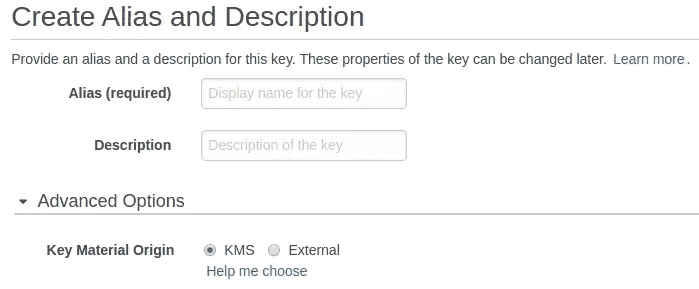
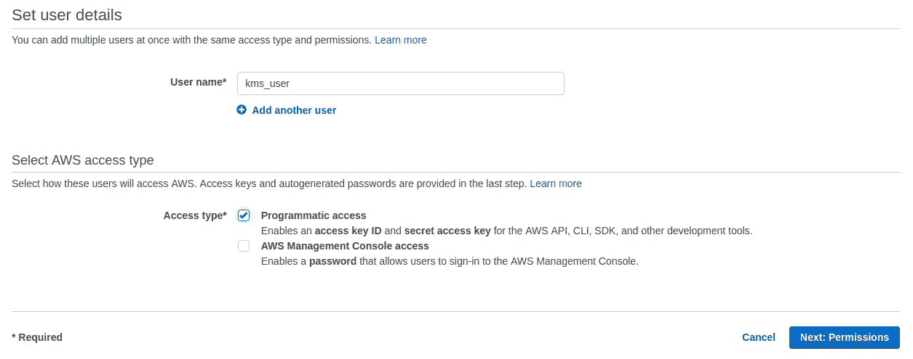
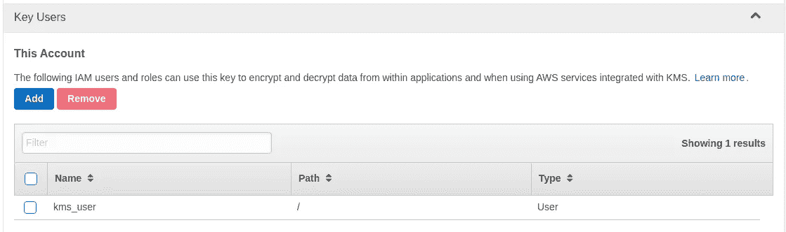
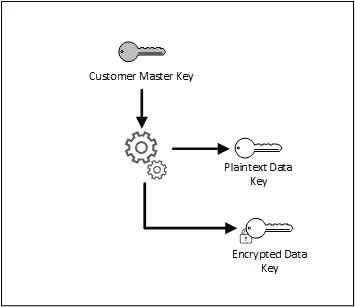
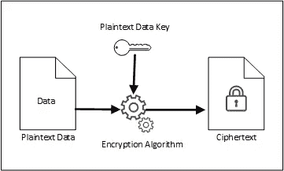
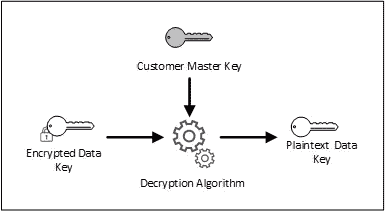
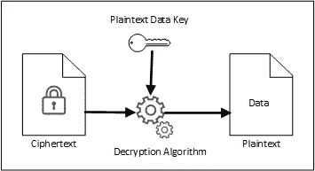

# 使用 Node.js 中的 AWS KMS 管理加密密钥

> 原文：<https://medium.com/hackernoon/managing-encryption-keys-with-aws-kms-in-node-js-c320c860019a>


itsgoingdown.org

[安全性](https://hackernoon.com/tagged/security)在开发应用时非常重要。如何在应用程序中加密数据和管理加密密钥？成功的密钥[管理](https://hackernoon.com/tagged/management)对于密码系统的安全性至关重要。这就是 KMS 发挥作用的地方。让我们先来看看什么是真正的 KMS。

# 密钥管理系统(KMS)

根据维基百科，

> 一个**密钥管理系统** (KMS)，也被称为**加密密钥管理系统** (CKMS)，是一种为设备和应用程序生成、分发和管理[加密密钥](https://en.wikipedia.org/wiki/Key_(cryptography))的集成方法。与术语密钥管理相比，KMS 是为特定的用例定制的，如安全软件更新或[机器对机器](https://en.wikipedia.org/wiki/Machine-to-machine)通信。从整体来看，它涵盖了安全性的所有方面—从通过安全的密钥交换安全地生成密钥，到客户端上安全的密钥处理和存储。因此，KMS 包括用于[密钥生成](https://en.wikipedia.org/wiki/Key_generation)、分发和替换的后端功能，以及用于在设备上注入密钥、存储和管理密钥的客户端功能。随着[物联网](https://en.wikipedia.org/wiki/Internet_of_Things)的出现，KMS 成为互联设备安全的重要组成部分。

当处理密钥管理和加密时，KMS 使你的生活变得容易。

# AWS KMS

现在我们知道了什么是密钥管理系统。让我们简单谈谈 AWS KMS。

AWS KMS 是 AWS 提供的一项服务，让您可以轻松管理您的加密密钥。它在后端使用硬件安全模块(HSM)。自动气象站 KMS 与其他自动气象站服务集成。成本也低。AWS KMS 提供对您的密钥的访问控制，以便您可以确定谁可以访问密钥，何时可以访问密钥以及许多其他选项。

AWS KMS 在[伽罗瓦/计数器模式(GCM)](https://en.wikipedia.org/wiki/Galois/Counter_Mode) 中使用[高级加密标准(AES)](https://en.wikipedia.org/wiki/Advanced_Encryption_Standard) 算法，被称为 AES-GCM。AWS KMS 使用 256 位密钥的算法。

AWS KMS 定价可点击查看[。免费层包括每月 20，000 次请求。](https://aws.amazon.com/kms/pricing/)

# 通过 Node.js 使用 AWS KMS

在这一节中，我将分享如何在 Node.js 应用程序中使用 AWS KMS。我将在这里讨论以下主题，

*   如何创建 CMK(客户主密钥)。
*   如何使用 IP 受限策略将 IAM 用户连接到 CMK。
*   如何使用 CMK 加密数据？
*   如何使用 CMK 解密数据？
*   使用自动气象站 KMS 的信封加密。
*   加密上下文(简介)

话虽如此，我想首先声明，我不是一个密码专家！。

## 如何创建 CMK(客户主密钥)

AWS KMS 的主要资源是*客户主密钥* (CMKs)。cmk 由客户管理或 AWS 管理。让我们看看如何在 AWS 中创建客户主密钥。

登录 AWS 控制台并转到服务。然后选择“IAM”。在左边你可以看到一个叫做“加密密钥”的部分。导航到该部分。然后选择左上角的“创建密钥”。



输入密钥的别名和描述。在高级选项中选择 KMS。如果需要，您可以在这里导入自己的外部密钥。我不打算在这里介绍如何导入一个外部键(这也非常简单)。

单击下一步。如果需要，添加标签(可选)。再次转到下一步。如果您已经创建了 IAM 用户(如果没有，请跳过选择用户。我们稍后将创建一个用户)，如果您希望允许该用户访问此密钥，请从列表中选择该用户，然后单击“下一步”。最后完成流程。现在将创建您的密钥。

## 如何使用 IP 受限策略将 IAM 用户连接到 CMK

现在，如果您之前没有创建 IAM 用户，请按照以下步骤创建一个。

转到“IAM”(如上)。选择左侧的“用户”。选择左上角的“添加用户”。填写所需的详细信息。下面给出一个例子。



选择下一步。选择“直接附加现有策略”选项。然后选择“创建策略”。您可以直观地编辑策略或编辑策略的 json。我将在这里编辑 json。选择“json”选项卡。我将使用下面的简单策略，只允许从一个选定的 IP 访问 CMK。您可以选择一个 IP 范围，也可以以任何方式自定义策略。

policy

之后，按照说明保存创建的策略。然后完成用户的创建。在最后一页，将显示新用户的访问密钥 ID 和秘密访问密钥。下载那些信息。之后您将无法查看它(但您可以再次创建新的凭据)。

现在转到加密密钥并选择您刚刚创建的密钥。转到“关键用户”部分并选择“添加”。选择您创建的用户。然后，该用户将被添加到您创建的 CMK 的允许列表中。



Key Users

## 如何使用 CMK 加密数据

足够的设置事情，让我们看看如何使用 AWS KMS！

我在这里使用的是 Node.js 的 AWS SDK。让我们从 npm 安装 AWS SDK 包。

```
npm install aws-sdk
```

下面的函数加密一个给定的缓冲区并输出密文 blob。

```
**function** encrypt(buffer) {
    **const** kms = **new** aws.KMS({
        accessKeyId: 'AKCVBTRNOSMLTIA7RPQQ', //credentials for your IAM user
        secretAccessKey: 'lJQtdIfH/Cup9AyaaHV8h2NnR/eKFIsZea5Vn0k', //credentials for your IAM user
        region: 'ap-southeast-1'
    });
    **return new** Promise((resolve, reject) => {
        **const** params = {
            KeyId: '965d2884-b2cd-4d79-8773-6b1f57133300', // The identifier of the CMK to use for encryption. You can use the key ID or Amazon Resource Name (ARN) of the CMK, or the name or ARN of an alias that refers to the CMK.
            Plaintext: buffer// The data to encrypt.
        };
        kms.encrypt(params, (err, data) => {
            **if** (err) {
                reject(err);
            } **else** {
                resolve(data.CiphertextBlob);
            }
        });
    });
}
```

## 如何使用 CMK 解密数据

下面的函数解密之前加密的密文 blob，并返回纯文本缓冲区。

```
**function** decrypt(buffer) {
    **const** kms = **new** aws.KMS({
        accessKeyId: 'AKCVBTRNOSMLTIB7ROQQ',
        secretAccessKey: 'lJQtdIfH/Cup9AyabHV9h2NnR/eKFIsZea2Vn0k',
        region: 'ap-southeast-1'
    });
    **return new** Promise((resolve, reject) => {
        **const** params = {
            CiphertextBlob: buffer// The data to dencrypt.
        };
        kms.decrypt(params, (err, data) => {
            **if** (err) {
                reject(err);
            } **else** {
                resolve(data.Plaintext);
            }
        });
    });
}
```

下面的代码加密文本“abc ”,然后解密，并将值打印到控制台

```
encrypt(**new** Buffer('abc','utf-8')).then(decrypt).then(plaintext => {
    console.log(plaintext.toString('utf-8'));
});
```

## 使用 AWS KMS 的信封加密

AWS KMS 对使用 CMK 直接加密数据有大小限制。每个请求最多只能加密 4 千字节的数据。如果你想加密更大的数据，例如视频，你需要使用信封加密。

在信封加密中，我们使用 KMS 的 CMK 生成数据密钥。当生成数据密钥时，AWS 向我们发送明文密钥和加密密钥(使用我们的 CMK)。然后我们使用生成的明文数据密钥来加密我们的数据。加密数据后，我们销毁明文密钥，并保留加密密钥。当我们想要解密数据时，我们将加密密钥发送给 AWS KMS，并取回明文密钥，然后继续解密。

首先，我们需要从 AWS KMS 生成一个数据密钥。下图描述了该过程。



[http://docs.aws.amazon.com](http://docs.aws.amazon.com)

以下函数从 AWS KMS 生成数据密钥。

```
**function** generateDataKey() {
    **const** kms = **new** aws.KMS({
        accessKeyId: 'AKCVBTRNOSMLTIB7ROQQ',
        secretAccessKey: 'lJQtdIfH/Cup9AyabHV9h2NnR/eKFIsZea2Vn0k',
        region: 'ap-southeast-1'
    });
    **return new** Promise((resolve, reject) => {
        **const** params = {
            KeyId: '965d2884-b2ab-4e78-8773-6b1f57133300', // The identifier of the CMK to use to encrypt the data key. You can use the key ID or Amazon Resource Name (ARN) of the CMK, or the name or ARN of an alias that refers to the CMK.
            KeySpec: 'AES_256'// Specifies the type of data key to return.
        };
        kms.generateDataKey(params, (err, data) => {
            **if** (err) {
                reject(err);
            } **else** {
                resolve(data);
            }
        });
    });
}
```

“数据”有加密数据密钥和明文数据密钥作为缓冲区。

下一步是用明文数据密钥加密数据。



[http://docs.aws.amazon.com](http://docs.aws.amazon.com)

以下是使用 AES-CBC 通过数据密钥加密数据的示例代码。这使用加密包。为了简单起见，这里我使用了一个固定的 iv(初始化向量)。

```
**function** encryptAES(key, buffer) {
    **const** algorithm = 'AES-256-CBC';

    **const** iv = **new** Buffer('00000000000000000000000000000000', 'hex');

    encryptor = crypto.createCipheriv(algorithm, key, iv);
    encryptor.write(strBuffer);
    encryptor.end();

    **return** encryptor.read();
}
```

让我们看看如何解密加密的数据。首先，我们需要使用 CMK 来解密我们的加密密钥。下图说明了这一点。我之前发布的代码片段可以用来做这件事(就像常规的数据解密一样)。



[http://docs.aws.amazon.com](http://docs.aws.amazon.com)

最后一步是解密数据。下图说明了这一点。



[http://docs.aws.amazon.com](http://docs.aws.amazon.com)

下面显示了使用 AES-CBC 对我们上面加密的数据进行解密的示例代码。

```
**function** decryptAES(key, buffer) {
    **const** algorithm = 'AES-256-CBC';

    **const** iv = **new** Buffer('00000000000000000000000000000000', 'hex');

    encryptor = crypto.createDecipheriv(algorithm, key, iv);
    encryptor.write(buffer);
    encryptor.end();

    **return** encryptor.read();
}
```

下面是使用信封加密对字符串进行加密和解密的代码片段。

```
generateDataKey()
    .then(data => {
        **const** cipherTextBlob = encryptAES(data.Plaintext, **new** Buffer('abc', 'utf-8'));
        **for** (**let** i = 0; i < data.Plaintext.length; i++) {
            data.Plaintext[i] = **null**;
        }
        decrypt(data.CiphertextBlob)
            .then(key =>    {
                **const** dataBuffer = decryptAES(key, cipherTextBlob);
                console.log(dataBuffer.toString('utf-8'));
            });
    });
```

## 加密上下文

除了所有这些 AWS，KMS 还提供了对加密上下文的支持，以进一步增强安全性。使用加密上下文可以缓解一些安全问题。要了解更多关于加密上下文以及如何使用它的信息，请点击[这里](http://docs.aws.amazon.com/kms/latest/developerguide/encryption-context.html)。

好了，我们到终点了。这是一篇相当长的文章。但是我希望你能从中学到一些东西。现在是你检查 AWS KMS 的时候了！！！