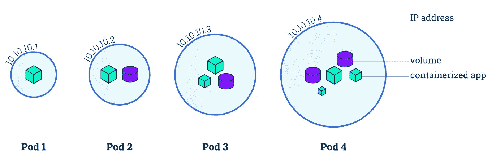
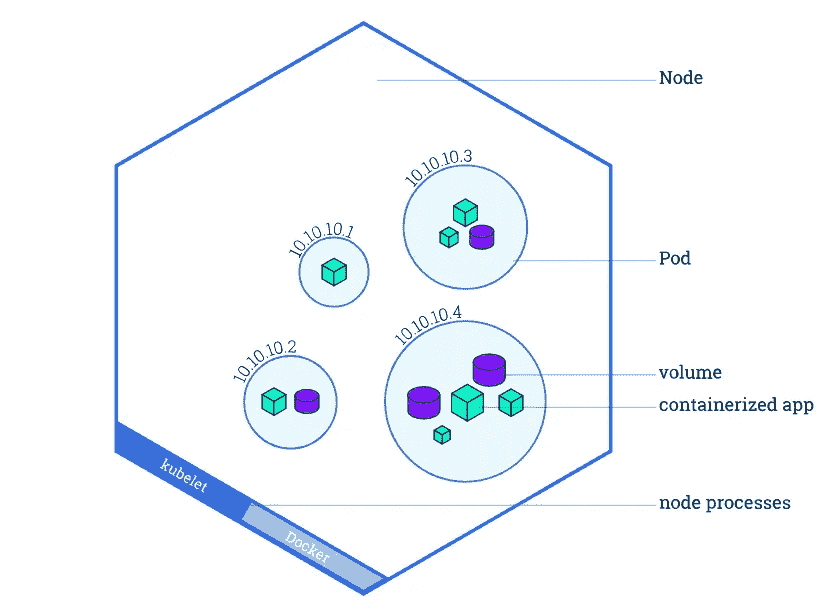
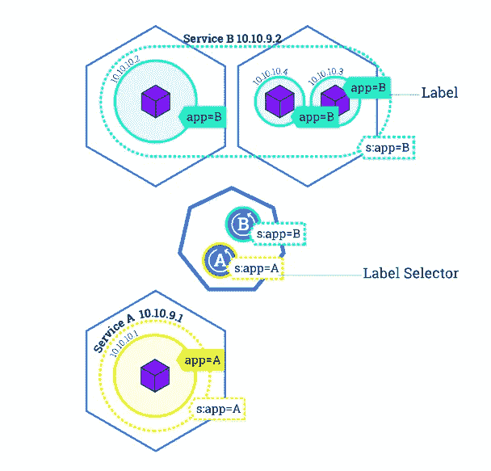
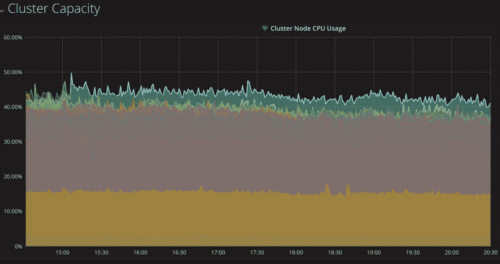

# 管理库本内特斯号上的舰队

> 原文：<https://medium.com/hackernoon/managing-fleet-on-kubernetes-8cac6483b64>

> 几个月前，我们正在应对系统可扩展性方面的挑战，并寻求找到合适的编排工具来帮助快速扩展系统。这份草稿概述了我们一路上尝试和学习的东西，大部分你可能听起来都很熟悉。快速浏览一下我们在 Kubernetes 建造舰队时遇到的事情。

我们开始探索由谷歌管理的流行项目:编排管理，DevOps[Kubernetes](https://kubernetes.io/)。从两周的学习曲线开始，我们在 *kubes* (简称 kubernetes)建立了我们的工作阶段系统，并做了一些小的工作设置来可视化这个编排框架的力量。

## 微服务

微服务架构之所以成为趋势，是因为它的架构风格旨在通过将软件解决方案分解成预计会失败的较小功能服务来解决管理现代应用程序的问题。

这有助于从较小功能单元的故障中快速恢复，而不是从大型单片软件系统中恢复。微服务有助于让您的发布周期更快，因为您将专注于单个应用程序中的较小变化，而不是在具有多个依赖项的较大软件系统中推动代码变化。

## 容器

当 Docker inc .在 2013 年发布 Docker 技术时，微服务架构掀起了一股浪潮。 **Docker containers** 为提供了虚拟机的完美替代品，并以更友好的方式驱动软件打包方法。码头工人集装箱比虚拟机(VMs)相对更小。它共享底层主机操作系统资源，我们可以在几毫秒的时间内旋转数百个这样的小单元。由于其可移植性，其较小的尺寸有助于更快的打包、测试甚至部署。

Docker 的基于容器的平台允许高度可移植的工作负载。Docker 容器可以在开发人员的本地笔记本电脑上、数据中心的物理或虚拟机上、云提供商上或多种环境中运行。

我们从[谷歌容器引擎](https://cloud.google.com/container-engine/) (GCE)开始，以快速完成工作。我们从一个只有几个 *10 个节点*的集群开始，每个节点都有配置 *12 个 vCore* 和 *30 GB* 在 [*默认池*](https://cloud.google.com/container-engine/docs/node-pools) 中运行无状态组件。

在深入研究之前，我们需要一些*齿轮*(概念/工具/理论)来登上集装箱船，然后出航进行巡航。

我们将我们需要了解的齿轮分成两部分，即第一部分将是 **Docker** ，第二部分将关注 **Kubernetes** 。

# 第一部分(了解码头工人)

## 无状态和有状态组件

在计算中，无状态协议是一种发送方或接收方都不保留任何信息的通信协议。发送方将数据包发送给接收方，并不期待收到确认。面向 UDP 连接的会话是一种无状态连接，因为两个系统都不会在会话生命周期内维护会话信息。
相反，需要在服务器上保存内部状态的协议被称为有状态协议。面向 TCP 连接的会话是一种“有状态”连接，因为两个系统都在会话生命周期内维护会话本身的信息。

## [理解集装箱化概念](https://www.redhat.com/en/containers)

Container 通过一个拥有自己的进程和网络空间的虚拟环境提供操作系统级的虚拟化，而不是创建一个完全成熟的虚拟机[(https://en.wikipedia.org/wiki/Virtual_machine)](https://en.wikipedia.org/wiki/Virtual_machine)。这使得操作系统的内核允许存在多个独立的用户空间实例，而不是只有一个。

## [为模块编写好 docker file](https://docs.docker.com/engine/userguide/eng-image/dockerfile_best-practices/)

Dockerfile 是 Docker 用来构建映像的一组指令。容器是使用 docker 映像创建的，可以通过手动执行命令或通过 Dockerfile 自动构建。Docker 通过为名为“ **docker 容器**”的应用程序创建安全的、基于 LXC(即 Linux 容器)的环境来实现这一点。

*编写优化的 Dockerfile，理解命令的顺序。我们在 Dockerfile 中运行的每个命令都是作为一个层执行的，后续的命令将建立在前一层之上。每一层都由 Docker 工具在缓存中管理。Docker 自己管理缓存，以重用以前构建的 Docker 映像层，从而节省时间和磁盘。

[**在 Docker 容器中运行单个进程**](https://docs.docker.com/engine/userguide/eng-image/dockerfile_best-practices/#each-container-should-have-only-one-concern)
“每个容器一个进程”通常是一个很好的经验法则，它不是一个硬性的规则。

> 使用你最好的判断来保持容器尽可能的干净和模块化。

了解远程 **docker 容器注册表**为了存储/推送我们本地构建的 Docker 映像，这里我们使用了 **Google 容器注册表** (GCR)进行 Docker 映像管理。

> 推送图片到 GCR([https://Cloud . Google . com/container-registry/docs/Push-and-Pulling](https://cloud.google.com/container-registry/docs/pushing-and-pulling))
> 推送图片到 Docker Cloud([https://docs.docker.com/docker-cloud/builds/push-images/](https://docs.docker.com/docker-cloud/builds/push-images/))

# 第二部分(了解海洋中的 Kubernetes)

**学习 kubernetes 的基础知识&** [**工作流程培训**](https://kubernetes.io/docs/tutorials/kubernetes-basics/)

> Kubernetes 是一个开源平台，用于跨主机集群自动部署、扩展和操作应用程序容器，提供以容器为中心的基础设施——kubernetes . io

[**什么是豆荚**](https://kubernetes.io/docs/concepts/workloads/pods/pod/#what-is-a-pod) **？容器如何在容器内运行？**

* Pods 是 Kubernetes 平台上的原子单位。Pod 是一个 Kubernetes 抽象，表示一组一个或多个应用程序容器(比如 Nginx 或 redis)，以及这些容器的一些共享资源。



Pod Overview : Images by Kubernetes.io

[**什么是节点**](https://kubernetes.io/docs/concepts/nodes/node/#what-is-a-node) **？** *(又称工人或奴才)*

* Pod 始终在节点内运行。在 Kubernetes 中，节点是一个工作机，可以是虚拟机，也可以是物理机，这取决于集群。节点由 Kubernetes 主节点控制。Kubernetes 管理集群中运行的节点的 pods 调度。



Node Overview : Images by Kubernetes.io

[**有哪些部署**](https://kubernetes.io/docs/concepts/workloads/controllers/deployment/) **？**

*我们使用部署来创建新资源，或者通过定义的配置用新资源替换现有资源。你可以把它想象成一个 pods 管理的主管。

[**什么是复制控制器和副本集**](https://kubernetes.io/docs/concepts/workloads/controllers/replicaset/) **？**

*复制控制器和副本集确保指定数量的 pod“副本”在任一时刻都在运行。换句话说，它确保一个 pod 或一组同类的 pod 始终可用。如果豆荚太多，会杀死一些。太少的话，会多启动。

> 在上面的 *yaml* 文件中，你可以看到**副本**关键字，这是由复制工具管理的。

[**什么是 Kubernetes 大师**](https://kubernetes.io/docs/concepts/overview/components/) **？**

* Kubernetes 集群中的控制服务称为主组件或控制平面组件。例如，主组件负责做出关于集群的全局决策(例如，调度)，以及检测和响应集群事件(例如，当复制控制器的‘副本’字段不满足时启动新的 pod)。Kubernetes 提供了一个 REST API，主要支持(大部分)持久性资源上的 CRUD 操作，这些资源充当其控制平面的中枢。

[*库伯内特生态系统由多种成分组成*](https://github.com/kubernetes/community/blob/master/contributors/design-proposals/architecture.md#architecture) *。*

[**什么是服务**](https://kubernetes.io/docs/concepts/services-networking/service/) **？**

* Kubernetes 服务是一种抽象，它定义了一组逻辑单元和访问它们的策略。一个服务所针对的一组 pod(通常)是由一个标签选择器决定的。服务继续寻找分配了特定标签的 pod，并跟踪这些 pod 以请求卸载。



Service Overview : Images by Kubernetes.io

[**如何从命令行**](https://kubernetes.io/docs/user-guide/kubectl-cheatsheet/) **调试或获取集群信息？**

* ***kubectl*** 是针对 Kubernetes 集群运行命令的命令行界面。

我们如何在 GCE 中运行容器？

我们有许多**部署**，它们根据我们需要的处理来管理扩展。*pod*运行集群中可用的*节点*内的容器。我们需要遵循正确的模块版本，以区分您的系统内部正在运行什么，这有助于在生产中出现问题时回滚发布。

> 我们需要公开的服务/API 怎么样？

——库贝斯 ***服务*** 来了。我们有大量的 API 需要向外界公开。为了实现这一点，我们使用分配了公共 IP 的 tcp loadbalancer 公开了几个 kube 服务。在内部，这些服务继续使用**标签选择器**进行服务发现，以找到 pod 并将其附加到该服务，具有相同标签的 pod 将被服务作为目标。它与我们在云上管理负载平衡器的概念相同，将虚拟机连接到负载平衡器以卸载传入流量。

> Kube 船内部运行的资源彼此非常了解。每个服务/单元可以通过分配给每个服务/单元的名称进行通信。您可以使用 FQDN 这样的名称，而不是使用分配给它们的 IP(私有)。由于网络资源分配的动态特性，使用名称而不是 IP 是一个很好的实践，因为在容器生命周期管理中，资源会被破坏和重新创建。Kube-DNS 维护所有内部分配的 IP 列表，并帮助按名称查找资源。

[**如何决定应该给你的 pods 资源分配什么资源**？](https://kubernetes.io/docs/tasks/configure-pod-container/assign-cpu-ram-container/)

每个容器都有自己的资源需求(即 *CPU、RAM、磁盘、网络*等)，在 kubes 中有**请求** & **限制**。这有助于保持您的节点健康。很多时候，由于糟糕的限制或没有定义限制，您的 pod 会在利用率方面发疯。它们可能会吃掉任何资源，并导致节点饥饿，从而使节点不健康，并由于资源耗尽而进入**【未就绪】**状态。在早期阶段，我们多次面临这种情况，但现在我们已经根据其饥饿行为微调了每个豆荚的资源。

**如何定义 kubernetes 集群中的节点资源？**

根据容器类型(在 *pod* 中运行)，您可以定义不同的 ***节点池*** 。假设您有名为`` **Core 的模块。X** 、**核心。Y** 和**型芯。Z** `` `，它们都需要``` **2 个内核，2 GB** `` `才能运行，然后您可以使用*标准节点池*来运行它们。在这种情况下，我将为我的节点池分配以下配置。

-名称:标准池
-池大小:2
-节点配置:4 个核心，4gb
-节点池资源:8 个核心，8gb
-**利用率** : 6 个核心，6 GB (75 %已用核心& RAM)

现在，假设我有高内存消耗模块。让我们称他们为 Mem。x，Mem。y 和 Mem。Z ` `，它们都需要`` **0.5 核，4 GB** ` `每个才能运行，那么你需要*高内存节点池*才能运行它们。在这种情况下，我将为我的节点池分配不同的配置。

-名称:HighMem 池
-池大小:2
-节点配置:1 个核心，8 GB
-节点池资源:2 个核心，16 GB
- **利用率** : 1.5 个核心，12 GB (75 %已用核心& RAM)

> 因此，基于您的节点池类型([https://cloud.google.com/container-engine/docs/node-pools](https://cloud.google.com/container-engine/docs/node-pools))，您可以通过使用 kubes 中的 nodeSelector 在不同的节点池中部署您的 pod。

**我们如何监控 Kubernetes？**

我们可以运行定制的监控设置来监视节点。你可以运行[heap ster]([https://github.com/kubernetes/heapster](https://github.com/kubernetes/heapster))，即。负责容器集群的计算资源使用分析和监控，与【influxdb】([https://github.com/influxdata/influxdb](https://github.com/influxdata/influxdb))挂钩，消费 heapster 推送的报告，可以在【grafana】([https://grafana.com/](https://grafana.com/)可视化。



Monitoring in Grafana

**注意:**需要注意 GCE 中的一些配置，比如**自动升级 kubernetes 版本**。如果您正在运行 RabbitMQ、Redis 或任何其他需要正常运行时间的消息队列服务，您最好关闭自动升级，因为 kubernetes 新版本将安排您的所有节点进行维护，但是它会逐个滚动更新，但可能会影响您的生产系统。否则，如果您是完全无状态的，您可以保留默认值或跳过此警告！

[https://cloud . Google . com/container-engine/docs/node-auto-upgrade](https://cloud.google.com/container-engine/docs/node-auto-upgrade)

> gcloud beta 容器节点池更新 <nodepool>—集群 <cluster>—区域 <zone>—无-启用-自动升级</zone></cluster></nodepool>

几乎所有以上的理解都是基于我过去六个月在 kubernetes 生产中所学到的。容器管理很容易适应，随着我们的发展，许多新的观察结果还没有被发现。

看看今天的部署，Kubernetes 在自动驾驶和自我修复方面绝对出色。我们在集群中一起运行超过 1000 个 pod，每月处理数十亿个 API 调用，并推动更多的处理。

> ***结论:*** *Kubernetes 解除了大量服务器管理，帮助更快部署&扩展系统。适应性更快，大部分安全和其他问题都由谷歌管理。Kubernetes 的目标是在集群基础设施之上提供一个更好的编排管理系统。Kubernetes 上的开发一直在以暴风般的速度进行，Kubernauts(*[](https://kubernetes.io/community/)**)的社区已经变得越来越大。**

*D **aemon 博客:**[https://sunnykrgupta . github . io/managing-fleet-on-kubernetes . html](https://sunnykrgupta.github.io/managing-fleet-on-kubernetes.html)*

*[](https://sunnykrgupta.github.io/managing-fleet-on-kubernetes.html) [## 守护程序博客-管理 Kubernetes 上的车队

### 桑尼·库马尔的文章和文章

sunnykrgupta.github.io](https://sunnykrgupta.github.io/managing-fleet-on-kubernetes.html)*