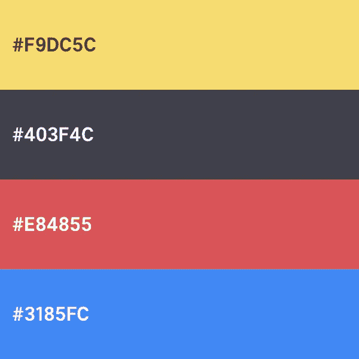
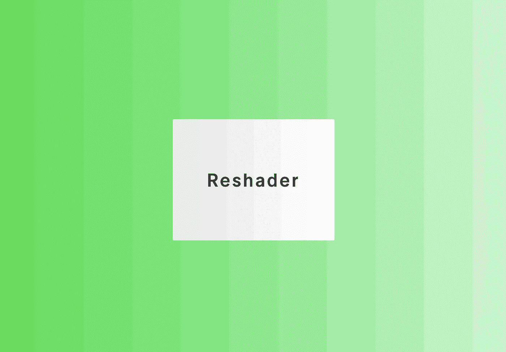

# 使用 Reshader 在 css-in-js 应用程序中管理可缩放的一致颜色

> 原文：<https://medium.com/hackernoon/managing-scalable-consistent-colors-in-your-css-in-js-app-with-reshader-ab29f03f1a35>

[想象](https://hackernoon.com/tagged/imagine)以下场景:你有一个 app 这个应用程序使用[风格化组件](https://styled-components.com)、[魅力](https://glamorous.rocks/)、[情感](https://emotion.sh)或任何其他 css-in-js 库。

我的问题是:**在这种语境下你是如何处理色彩的？**

我打赌答案会是这样的:

> 我有一些。存储 CSS 变量的 js 文件，其中一个是 **colors.js** ，它导出一个 js 对象，带有我的应用程序需要显示的颜色。

万一我是对的，或者几乎是对的，那就太棒了，尽管你可以更进一步，我会告诉你怎么做。否则，万一我错了，请允许我给你出个主意。

让我们开始将这一场景带入现实世界，想象您的应用程序具有以下颜色:

然后，假设我们有一个包含所有共享 CSS(-in-JS)变量的文件夹`UI`，我们将它们存储在单独的文件中。其中一个文件叫做`colors.js`,对于我们的颜色，它看起来像这样:

这很好也很简单。您只需通过调用`colors.brand.yellow`等来访问您的颜色。不幸的是，这还不够，原因稍微显而易见。如果我们继续举例，你会更容易明白。我创建了这个登录页面来帮助我们:

**Pro tip:** don't forget to inspect the code behind this page by seeing the source on CodeSandbox. You must do the same process for further previews in order to understand what's going on.

很酷，对吧？

但是突然，我们有了一个绝妙的主意，添加一些边框，让它看起来更酷。浅黄色会很好。

但是，什么淡黄色呢？

正如你可能猜到的，我们必须先找到它，因为它不存在。问题是:我们应该使用哪种语气？嗯。在一个非常琐碎的上下文中，我们只需打开 Sketch 或 Photoshop，在颜色选择器中输入我们品牌的黄色，然后稍微调整一下，得到更亮的颜色。假设我们想出了`#FEE579`。那么让我们改编一下我们的`colors.js`:

我改变了一些事情。`yellow`不再是字符串，而是两个元素的数组。第一个(零指数)是我们的新色调，该品牌的黄色带有较浅的变化，第二个是主要颜色，我们以前使用的颜色。

当然，在这里，我实现了我自己的方法来处理颜色，使用一个数组，其中索引越低，颜色的色调越浅，但是你可以[设计](https://hackernoon.com/tagged/design)任何你想要的。我们将进一步探讨这个问题。

好了，现在我们有了浅黄色的背景，让我们添加一些边框，并应用新的色调:

哦，是的，现在我们的登录页面看起来更真实。真好。但是，没有一个吸引人的短语和一个行动号召按钮，着陆就不是着陆:

几乎可以部署了，对吧？不对。这个按钮不适合主流启动登陆页面。我们必须把它定制得很酷。

**Note:** the white color on the text within the button was set in colors.js.

虽然它看起来更好，但我们仍然没有做到，因为我们的`Button`风格上没有`hover`、`focus`和`active`状态。问题是:我们必须再一次考虑其他颜色。就像以前一样，打开一个设计工具，使用颜色选择器，输入我们品牌的红色，调整它达到我们想要的色调。之后，有了颜色，我们必须将它粘贴到我们的代码中，并进行一些视觉测试和迭代，以检查它是否与登录页面的其余部分协调一致，以及它是否适合我们按钮的状态。

对于这个例子，我将选择一个较浅和较深的色调。我们的`colors.js`会是这样的:

同样，较浅的色调位于索引 0，较深的色调位于`red`属性的索引 2，以遵循从浅到深的逻辑。

现在，让我们回来在`Button`组件上应用剩余的样式:

哇！我们的纽扣不是变得更漂亮了吗？但是如果你点击它，你会发现我承诺实现的`:active`状态仍然不见了。那是因为我还没有选择一个更暗的色调来设置它的`background-color`。为了解决我们的问题，我选择了`#E21020`，这是`colors.js`现在的样子:

这就是我们的`Button`组件:

找到了。[现在，我们有了一个可部署的登录页面，可以将机会转化为实际客户，或者向风投开放。](https://twitter.com/iamdevloper/status/932731981737185285)

在一个平行世界里，假设它被发射了。我们已经添加了谷歌分析，并急切地等待访问者。一天过去了，两天，三天……mhmm，至今零转化。奇怪——怎么了？我们的着陆太棒了！

当盯着屏幕思考我们失败的原因时，屏幕右上方的通知窗口突然出现。

> 潜在客户的真实反馈
> 
> 来自:randomUXmaster @ hipster design . io

邮件内容如下:

> 你好，
> 
> 我只想通知您，您的登录页面无法工作。你的行动号召按钮上的红色太消极了。你得加点更开心的东西；鼓励用户走得更远，而不是让他止步于此。
> 
> 作为一名 UX 专家，我的建议是让它变得绿色或者不那么消极。在这里发挥创意，但请改变这种颜色。
> 
> 真诚地
> 
> <random name="">、UX 主脑工程师 Visual at HipsterDesign.io</random>

*精彩！*——“点击时刻”突然发生在我们身上，我们必须将红色变成绿色！

让我们深入我们的代码，再次从修改我们的`colors.js`开始:

Introducing the green property at line 11

现在剩下的就是在`Button`组件上把`red`改成`green`了……嗯……等等……还有其他音调不见了——更亮更暗的那些。将再次打开草图，调用颜色选择器，并调整位，以获得良好的色调。让我们试试这些:

而`Button`现在看起来是这样的:

嗯……我不知道……它看起来太亮了，而且与环境不协调，尽管如此，我们喜欢这种绿色调，并想坚持下去。让我们稍微颠倒一下:

哦，好多了，虽然还没到那一步。我将寻找另一种黄色调，一种更亮的，用它作为背景，但保持边界完全一样。

`#F7F4E5`看起来很完美！让我们将它添加到`colors.js`处的`yellow`属性中:

现在结果会是:

不完美，但更好，更真实。但是有一点我不喜欢:这个吸引人的短语的颜色。和我们伟大的`Hello World`文案重量一样，不应该。

我将只是减轻我的品牌的`tuna`颜色一点点，然后更新我的`colors.js`到`Button`组件旁边。结果是:

Tuna is now an array with a lighter tone out of the main's one

唷！我们装船吧！

然后我们的应用从此过上了幸福的生活。UX 大师是对的:改变一点颜色已经改善了我们的游戏。从第一天开始的大量转换(！).

这里的问题是，玩我们的幻想应用程序的颜色是详尽的。虽然这是一个非常小的细节，但不时重复这个过程是压倒性的。我面对过几次，即使有像[coolors.co](http://coolors.co)这样的应用，这个过程还是很烦人。我发现我需要一个简单的、自动化的解决方案，通过编程来简化这个过程。

# **介绍** [**重装机**](https://reshader.com)

抱歉，上面的教程很长，一步一步来。我不得不这样做，以证明处理颜色的简单事情可以是详尽的，特别是当我们没有设计师为我们提供色调的时候。

为了开始这个话题，从现在开始，我们将把“色调”称为“阴影”，好吗？从语义上来说，他们就是这样。色调是一种颜色的分叉，不一定是更深或更浅，而阴影应该是这种颜色的渐进变化，必然有更轻或更重的重量。

几乎每个网站、应用程序或系统都实现了颜色的深浅，即使开发者并没有意识到这一点。这些应用程序可以有一个主要的灰色，标题使用较深的阴影，而段落使用较浅的阴影。按钮、模式、英雄和几乎所有组件都是如此。

谢天谢地，介绍 Reshader 是本文最简单的部分。简而言之，这是一个非常新的库——在我写这篇文章的时候，我刚刚在几天前公开发布了它——来获得颜色的深浅。它的 API 是最小的，直观的，并且[有很好的文档记录](https://reshader.com/#usage)。

直接进入实际操作，我将使用我们之前构建的相同应用程序/登录页面来演示 Reshader 如何优化我们之前使用的流程。

首先，让我们安装 Reshader:

`yarn add reshader`或者`npm install reshader`就够了。唯一的依赖项是[Qix-s Color](https://github.com/Qix-/color)，它捆绑在安装中。如果你想用 RequireJS 或者在你的`window`中实现，我会邀请你手动下载[分发文件](https://github.com/chiefGui/reshader/blob/master/dist/reshader.js)。

之后，我们再跳转到我们 app 的`colors.js`。有了这些相同的主色，我们所要做的就是导入 Reshader 并使用它获得阴影:

Note that I implemented Reshader for all the colors but white (no need for that)

通过应用这些新的颜色和调色板，这就是我们的新外观和感觉:

你可能已经注意到事情有点乱，你没有错。本质上，事情是这样的:

1.  Reshader 会根据给定的颜色逐步一致地自动生成阴影。我们处理的不再是色调——一种颜色的随机分叉——而是真正的色调。[了解更多。](http://localhost:3001/#faq)
2.  由于 [Reshader 的默认选项](https://www.reshader.com/#API)，按钮几乎不可见，边框不再加粗，背景看起来也不再是黄色。

让我们解决这个问题。

稍微放大一下 API 的文档，我们会发现它有一个名为 `[numberOfVariations](https://www.reshader.com/#API-options-numberOfVariations)`的[选项，上面写着:](https://www.reshader.com/#API-options-numberOfVariations)

> [numberOfVariations 是]您要从输入的颜色中提取的变化数。这个选项将得到相同数量的较亮和较暗的阴影，这意味着如果你设置它为`10`，它将得到 10 个较亮的阴影和 10 个较暗的阴影。

为了让您提前有所了解，之前,`yellow`属性返回了一个包含三个元素的数组。第一个是最浅的色调，第二个是主色调，第三个是最深的色调。正如我所说的，我们的目标是让这个形状有一个合理的，有凝聚力的黄色调色板。

基本上，Reshader 的设计和输出都是基于同样的逻辑。正如你在上面的要点中看到的，我们选择了`reshader`函数的`.palette`属性，并将其设置为我们的颜色。这个`.palette`返回一个数组，其中阴影*和*是您在`reshader`函数的第一个参数中传递的颜色。正如你可能猜到的，它是从最浅的阴影到最深的阴影排序，而不是跳过给定的颜色。这意味着`yellow[0]`是最亮的阴影而`yellow[yellow.length — 1]`是最暗的。

回到`numberOfVariations` …默认情况下，它的值是`5`。根据文档，这意味着它将得到给定颜色的 5 个较浅的阴影和 5 个较深的阴影。*(大声读出来，我觉得有机会让这个选项名更好。)*

也就是说，多亏了`numberOfVariations`选项，我们不再有 3 种不同的黄色了。其他颜色的变化量也发生了变化，这意味着现在它们都是由 11 个元素组成的数组:5 个较浅的颜色，主色和 5 个较深的颜色。

通过根据 Reshader 输出(改变索引)稍微改变我们的`Button.js`文件上的连线，这是我们的新视图:

和上次的结果很相似，对吧？为了更好地突出使用 Reshader 管理颜色是多么简单，让我们从我们品牌的调色板中删除一些颜色。现在它将只包括`tuna`和`blue`:

在用这些新的颜色和色调重新设计了登录页面后，它看起来是这样的:

很简单，不是吗？

Reshader 的方法与手动方法的主要区别在于:

1.  你再也不用担心窗帘了。他们只是工作。
2.  易于扩展和维护。
3.  获得不同的结果只取决于改变 Reshader 的 API 的选项。
4.  正如我之前提到的，色调总是一致的。这意味着它们总是给定颜色的更深或更浅的版本。*这听起来令人困惑，对吗？但我的意思是，当你用眼睛选择一种颜色时，它不是一个被投射来使颜色变亮或变暗的机器人。这是非常武断的，经常有更多的设计人员会轻易地发现这些颜色的不一致。*
5.  主题化很容易实现。
6.  易访问的颜色也很容易实现。[有一个名为 contrast ration](https://www.reshader.com/#API-options-contrastRatio)的选项，你可以使用它来获得可访问的调色板。

但是和往常一样，生活并不是一帆风顺的。我必须保持透明，并强调在当前状态下使用 Reshader 的主要缺点:

1.  如果你和一个设计师配对，为了使用 Reshader，你真的必须和他配对，我是认真的。这个过程对他来说变得更加困难:基本上，他必须把主色传给你，而你必须把 Reshader 生成的主色的阴影传给他。不幸的是，在撰写本文时，还没有现成的快捷方式。
2.  尽管您可以使用一些神奇的技巧让它与您的 CSS/SASS/LESS 环境一起工作，但 Reshader 最初是以 css-in-js 为设计理念的。这意味着你要付出额外的努力，把它的输出转换成不同风格系统的变量。

对于这两种情况，我保证我都在思考解决方案。[你可以在 GitHub 上随意向 Reshader 的 repo 提交你的想法。](https://github.com/chiefGui/reshader/issues)

# 表演

请不要在你的`render`方法中多次运行`reshader`，你会没事的。[阅读更多。](https://www.reshader.com/#faq)

# Reshader 的未来

Reshader 很新鲜。虽然它的 API 已经很稳定了，但是在我的脑海中有几个想法可以进一步优化处理颜色的过程。如我之前所说，目前我正致力于为图书馆目前最常见的问题找到解决方案。

除了这些解决方案之外，我还在收集反馈，以确定开发人员最需要的功能。*再次，* [*随时提交你的想法*](https://github.com/chiefGui/reshader/issues/new) *。*

# 最后

理想情况下，Reshader 对于那些关注颜色并使用 css-in-js 方法的项目来说会非常有用——特别是那些没有设计团队的项目。此外，如果你想用程序生成颜色的阴影，这将是一条路要走。

有问题就写评论，我一看到就回复。

*想要给 Reshader 一颗星或阅读其完整文档？使***和* [*成为你的资源库*](https://github.com/chiefGui/reshader) *。**