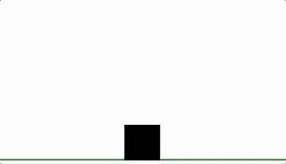
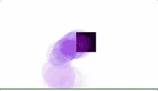
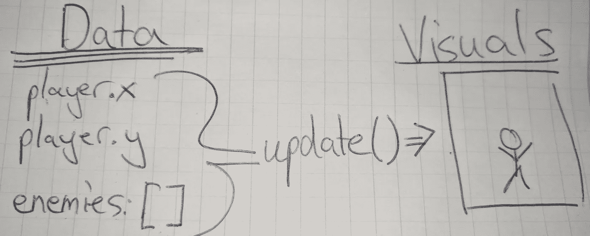
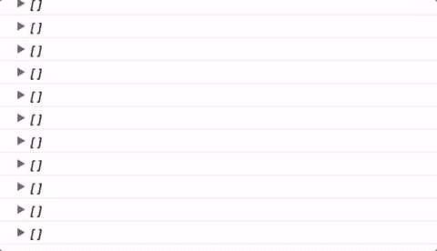
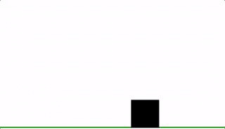
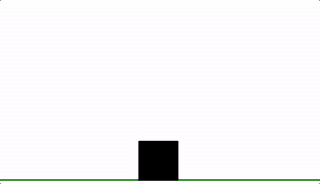
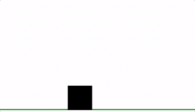

# 通过制作一个平台来操纵事件的 DOM！

> 原文：<https://medium.com/hackernoon/manipulating-the-dom-with-events-by-making-a-platformer-b90736ebd395>

We’ll be making this fun square!

很长一段时间以来，我一直想让东西在浏览器中移动。我遇到的最长时间的问题是试图理解同步代码和异步代码。当我按下一个键时，我怎样才能让玩家移动，但是把浏览器基于事件的特性和我在解决问题或谜题时使用的同步编码风格混合起来。

今天，我们将创建一个简单的角色，可以在空间中移动和跳跃。我们将用大约 70 行 JavaScript 实现这一点，不需要任何库的帮助。使用 CodePen 或您自己的编辑器继续操作。

Particles can also be added!

我假设您对 JavaScript 语法有基本的了解，包括一些基本的 ES6 特性。如果不是先看了[我对 ES6 的复习](https://hackernoon.com/es6-features-you-need-to-know-now-b525e2b0755e#.79tpwdexw)！

[点击此处查看最终代码](http://codepen.io/Spyr1014/full/BpybZY/)。

为了创建可管理的简单代码，我们将把游戏显示和游戏数据分开。游戏数据将驻留在一个通过`update`函数绘制的对象中。

首先让我们设置 html，这样我们就可以看到我们在做什么。我们将使用 svg 元素，因为它们易于设置并且速度足够快，可以满足我们的需求。我们将为我们的球员使用一个矩形和一条线来设置地板边界。要设置带有线条和矩形的 svg 屏幕，请将以下代码添加到 html 中。

这将绘制一个 svg 屏幕。需要指定宽度和高度，但是我们将使用 JavaScript 来完成。这条线还不可见，因为它超出了 svg 屏幕的尺寸。

让我们用 JavaScript 为屏幕和播放器设置数据。

屏幕现在将包括在屏幕底部绘制的地面。可以使用 css 修改 Svg 元素，就像可以修改其他元素的样式一样。然而，svg 元素具有特定于 svg 形状的不同 CSS 属性。

在进入逻辑之前，让我们从远处看一下我们将使用的过程。我们想要一个每秒运行 30 次的函数来改变游戏中的数据并绘制屏幕。我们希望像按键和释放按键这样的事件被监控，从而影响运行的逻辑。我们希望将数据存储在某种数据存储中(一个我们称之为`worldData`的对象),然后基于该数据构建我们的游戏循环。我们游戏循环的结尾也将有一个`update`函数来创建框架。

所以让我们设置数据和更新功能！

我们的游戏数据需要玩家的 x 和 y 坐标。我们将使它成为一个对象，这样我们以后就可以很容易地添加数据。我希望玩家从地面开始，以屏幕为中心，但可以随意写下自己的数字。

但是玩家矩形还没有移动。要移动它，我们需要创建一个`update`或`render`函数。无论你怎么称呼它，我都会用`update`。这个函数使用 worldData 来绘制一个框架。这应该不会太复杂，因为我们要做的只是将`worldData.player.x`链接到矩形`x`属性，对`y`属性也是如此。

现在矩形将跳转到您在`worldData`对象中指定的位置。

让我们创建一个每秒执行 30 次的游戏循环。这个循环将包含我们所有的逻辑，并以更新 svg 以反映新数据的`update()`函数调用结束。

It’s lonely out in space

你的玩家现在离地了！让我们解释一下为什么会发生这种情况。`setInterval`取一个函数，以毫秒为间隔反复调用。在这种情况下，我们每 30 毫秒调用一次函数。这大约是每秒 33 帧。每次该函数运行时，它通过减去`0.5`来改变`worldData.player.y`。在函数的最后，我们通过调用`update`来更新帧。没有`update`我们看不到发射！

再来补充一下互动。我们需要知道哪个键被按下了。这是最难的部分，但是一旦你理解了，你就可以在你的游戏中添加任意多的键，这很容易。我们需要跟踪哪些键被按下了。我们将把`keysDown`作为属性添加到`worldData`对象中。`keysDown`将包含玩游戏的人按住的所有键的列表。有了这些信息，我们就能看到游戏循环中哪些键被按下了(上面`setInterval`中的功能),并相应地移动玩家。

首先让我们将`keysDown`作为属性添加到`worldData`对象中。现在看起来应该是这样的:

我们使用文档的事件侦听器来跟踪被按下的键。

mashing keys activated

在您的控制台中，您可以看到当您按下键盘上的按钮时事件开始发生。让我们创建一个函数，将按下的箭头键添加到您的`worldData`对象的列表中。我们将调用这个函数`fireKeyAction`，它将处理`keydown`和`keyup`事件。

我们还想更新我们的按键和按键事件。

让我们快速浏览一遍。

当您按下一个键时，它会使用`event.key`找到您按下的键的名称。这是密钥的字符串表示，例如`ArrowLeft`。这被传递到`fireKeyAction`中，它有两个参数。一个关键字符串和一个布尔值，代表它是一个`keydown`还是`keyup`事件。

假设我们正在处理一个`keydown`事件。在`fireKeyAction`中，我们将参数`isDown`作为`true`传递。然后我们到达`switch`语句。这是检查各种`case`语句的`key`是否为`===`的一种简便方法。在这个例子中，如果`key`等于任何一个箭头键，我们将只做任何事情。

如果用户按下或释放了一个箭头键，我们就在`keysDown`数组中添加或删除它。如果`isDown`是`true`，我们添加箭头键，但是只有当它不在数组中的时候。这很重要，因为当一个键被按下时，keydown 事件会连续触发。我们只想添加一次密钥。如果`isDown`是`false`，我们用`indexOf`找到钥匙，用`splice`把它从`keysDown`数组中切下来。

回到主循环(setInterval 中的函数)，为`worldData.keysDown`添加一个`console.log`。

剩下的就是给游戏循环增加逻辑。让我们让角色左右行走。在 setInterval 匿名函数中，对其进行更新，使其与以下内容相匹配:

注意，我在`if`语句中使用了一个函数`isKeyDown`。让我们快速添加这个函数:

这只是检查键是否在数组中的快捷方式。

It’s ALIVE!

通过在 setInterval 游戏循环中添加一个键、更多逻辑或添加更多 svg 元素来添加其他功能。

A colourful trail!

I shoot!

我组织代码的方式深受《如何设计程序》一书的影响，这本书第二版可以在网上免费获得。

这一课使用了`worldData`对象[的变异，这不是好的做法](http://www.rubypigeon.com/posts/avoid-mutation-functional-style-in-ruby/)，尤其是当事情变得复杂的时候。如果你想增加游戏的复杂性和成长性，我推荐你看看 [Redux](http://redux.js.org/) 。通过制作另一个游戏来看看 Redux 的介绍吧！Redux 给你一个安全的方法来改变你的游戏状态，并跟踪这些变化。作为动力，有了 Redux，你可以轻松地在游戏中加入时间旅行。

有任何问题、意见或发现错误吗？在我的推特上给我发推特！:)

> [黑客中午](http://bit.ly/Hackernoon)是黑客如何开始他们的下午。我们是这个家庭的一员。我们现在[接受投稿](http://bit.ly/hackernoonsubmission)并乐意[讨论广告&赞助](mailto:partners@amipublications.com)机会。
> 
> 要了解更多信息，请[阅读我们的“关于”页面](https://goo.gl/4ofytp)、[在脸书上给我们点赞/发消息](http://bit.ly/HackernoonFB)，或者简单地说， [tweet/DM @HackerNoon。](https://goo.gl/k7XYbx)
> 
> 如果你喜欢这个故事，我们推荐你阅读我们的[最新科技故事](http://bit.ly/hackernoonlatestt)和[趋势科技故事](https://hackernoon.com/trending)。直到下一次，不要把世界的现实想当然！