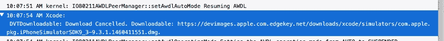
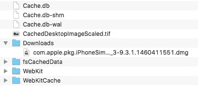
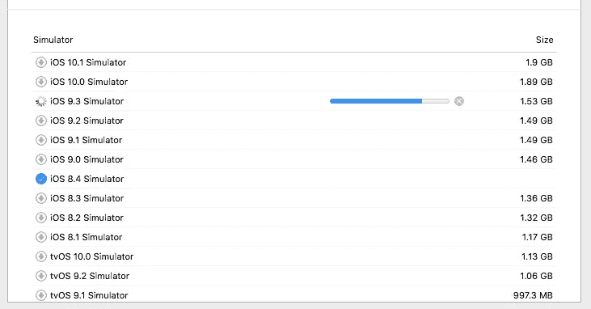

# 在 XCode 中手动安装 iOS 模拟器

> 原文：<https://medium.com/hackernoon/manually-install-ios-simulators-in-xcode-f7e4bbe50753>

归咎于互联网之神(或者可能是苹果)，但我最难从苹果的服务器下载大型(如千兆字节大小)下载。我在 iTunes 中下载 iOS 更新时遇到过问题，在 XCode 中下载新模拟器时也遇到过问题。在长时间尝试下载文件后，我得到一个“连接超时”的错误。我再试一次。同样的错误。再试一次。同样的错误。

四处搜索，我可以告诉你我并不孤单。其他人也有同样的问题，这和网络连接速度似乎没有明显的关系。这个错误甚至发生在“快速”连接的用户身上。

由于我不知道是什么导致了这个错误，我也不能修复苹果服务器上的任何东西，我所能做的就是找到一个解决办法。因此，如果你处于类似的情况，并且出于某种原因需要在正常的 XCode 下载过程之外下载新的 iOS 模拟器，这里是你如何做的。

这些步骤在我的机器上对我有用，但你的结果可能会有所不同，苹果可能明天会改变事情，打破整个过程。祝你好运。

以下是我的设置规格:

MacOS 10.11.6
XCode 8.2.1

# 找到下载网址

你要做的第一件事是找到你需要下载的文件。为此，打开 XCode 并点击“首选项>组件”来查看可供下载的模拟器列表。

单击您要下载的模拟器旁边的向下箭头，开始正常的下载过程。在这个例子中，我正在下载 iOS 9.3 模拟器。

现在打开您的 Console.app 程序，确保您看到的是“所有消息”选项卡。您可能需要单击“清除显示”来简化下一步。

一旦你确定模拟器下载已经在 XCode 中开始，取消它。当下载被取消时，控制台中将出现一个新的日志，其中包含正在下载的文件的 url。这是您要手动下载的文件的 url。

对于我的 iOS 9.3 模拟器，网址是:
[https://devimages . apple . com . edge key . net/downloads/xcode/simulators/com . apple . pkg . iphonesimulorsdk9 _ 3-9 . 3 . 1 . 1460411551 . dmg](https://devimages.apple.com.edgekey.net/downloads/xcode/simulators/com.apple.pkg.iPhoneSimulatorSDK9_3-9.3.1.1460411551.dmg)

The Console app shows the url for the cancelled simulator download.

# 手动下载模拟器

现在您已经有了文件的 url，您可以随意下载它。我选择通过 Safari 来完成，这样我可以很容易地看到进度，并在需要时继续下载。于是我在 Safari 的地址栏里输入了网址，按下 enter，看着字节开始流入。

您可以在命令行上使用 curl 轻松下载该文件。你如何得到文件并不重要，重要的是你得到了文件。

# 将下载的文件移动到 XCode 缓存目录

多亏了谷歌翻译和一些会说中文的人，我才能够想到下一步。

您需要在电脑上找到 XCode 缓存目录。这将位于:~/Library/Caches/com . apple . dt . xcode 下

这个缓存目录不是真正的“目录”,而是一个包。但是我们仍然可以通过右键单击文件并单击“显示包内容”来访问它的内容。

在缓存目录中，您可以找到一个名为“Downloads”的文件夹。当我第一次导航到缓存目录时，“下载”对我来说并不存在。所以我创建了一个新的“下载”目录。

您需要将下载的模拟器文件放入“下载”目录。确保您没有更改下载的 dmg 文件的文件名。它需要与原始下载 url 中出现的文件名相匹配。

Place your downloaded file in the Downloads folder of the cache directory.

# 在 XCode 中安装模拟器

现在我们需要告诉 XCode 文件已经可以安装了。因此，点击“首选项>组件”，返回 XCode 中的模拟器安装窗口。点击你正在安装的模拟器旁边的下载箭头，这次你应该会看到进度条移动得更快了。XCode 现在使用手动下载的文件，而不是从 Apple 服务器下载新文件。

如果一切顺利，您的模拟器现在已经安装好了。

XCode can now install the simulator from your manually downloaded file.

如果你正在寻找一个数字项目的帮助，看看我们的公司**。我们还通过我们的 [**用户挂钩**](http://userhook.com) 服务，帮助移动应用获得用户参与和反馈。**

************

> **[黑客中午](http://bit.ly/Hackernoon)是黑客如何开始他们的下午。我们是阿妹家庭的一员。我们现在[接受投稿](http://bit.ly/hackernoonsubmission)并乐意[讨论广告&赞助](mailto:partners@amipublications.com)机会。**
> 
> **如果你喜欢这个故事，我们推荐你阅读我们的[最新科技故事](http://bit.ly/hackernoonlatestt)和[趋势科技故事](https://hackernoon.com/trending)。直到下一次，不要把世界的现实想当然！**

****