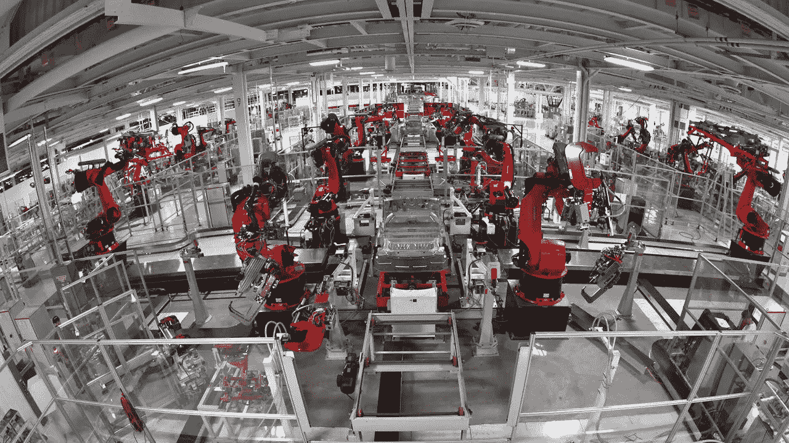
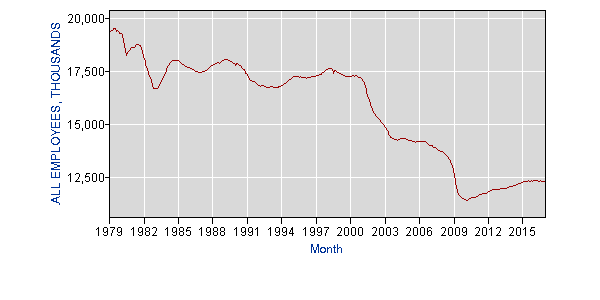

# 劳动力的终结:自动化、失业和社会

> 原文：<https://medium.com/hackernoon/manufacturing-the-end-of-labor-automation-unemployment-and-society-f772c74f0558>

**咔嚓*一声车门自动关上；一个修理工走到工厂门口。刷卡；修理工斜眼。然后他拿出一个手电筒——整个工厂里唯一的灯泡。他参考了自己的订单号，然后走过一条又一条机器走廊。最后，他找到了他要找的东西，一个坏了的机器人。修理工放下工具箱，开始修理机器。在他周围的黑暗中没有其他人。事实上，在过去的 30 天里，那里没有一个人。这是现在，2030 年。*

Tesla Motors

这个场景听起来是不是很牵强？像这样的工厂从 2001 年就在[成立了。日本](https://en.wikipedia.org/wiki/Lights_out_(manufacturing)#cite_note-5)[机器人](https://hackernoon.com/tagged/robotics)公司 [FANUC](https://redshift.autodesk.com/lights-out-manufacturing/) 有工厂，机器在那里制造自己的复制品。这些工厂“可以在无人监管的情况下一次运行长达 30 天”,不开灯，也不开空调和暖气。这被称为*熄灯制造*。

举个离家更近的例子，想想美国最大的杂货商:C&S 批发杂货店。没听说过？听起来差不多。他们生活在幕后，但向塔吉特(Target)、克罗格(Kroger)、西夫韦(Safeway)和 6500 家其他零售商提供食品杂货。C&S 还没有获得熄灯状态，但他们正朝着这个方向与子公司共生。该公司正在通过使用完全自主的仓库机器人来扰乱食品分销行业。在目标工厂，在给定时间只有 6 个人监控工厂。就是这样。

 [## 杂货店仓库里的自主机器人

### 2016 年 9 月 20 日上午 10:27 机器人公司 Symbotic 试图改变食品配送行业。公司有…

www.wsj.com](http://www.wsj.com/video/autonomous-robots-in-the-grocery-warehouse/52D0ECC8-C0F6-4E9A-B6CB-CD4AAD31E1D4.html) 

这可能会让你想起另一家从仓库运送大量物品的公司，亚马逊。

你听到了吗？这是一个 15 秒的片段，从 1:58 开始。“这是因为我们对自动化的关注是帮助人们完成工作，而不是取代人们。”

但是两年后，新闻报道中的*和*台词是这样的:

 [## 亚马逊最新的机器人冠军使用深度学习来库存货架

### 亚马逊为其机器人采摘挑战的最新冠军加冕，这是一项寻找机器人的年度比赛…

www.theverge.com](http://www.theverge.com/2016/7/5/12095788/amazon-picking-robot-challenge-2016) 

不想找人替代吗？没错。

但这不公平。虽然亚马逊目前确实使用了 3 万个 Kiva 机器人(带着商品在货架上行驶的橙色家伙)，但从 2014 年到 2015 年，人类就业人数已从 15.4 万增加到 23 万。

尽管如此，自动化将导致未来的制造业和仓库工作减少，而不是增加。这只是基本的数学。一旦机器人可以以比工人更低的成本做与人相同的工作，为什么公司不会使用它并解雇员工呢？比较便宜。这还不包括生产率的提高。

所以我们到了，2017 年。这些工作我们永远也拿不回来了。美国劳工统计局的数据显示，从 1980 年到 2000 年，制造业的工作岗位在 1750 万左右波动，在过去的 17 年里下降到 1250 万，损失了 500 万。

[https://data.bls.gov/pdq/SurveyOutputServlet](https://data.bls.gov/pdq/SurveyOutputServlet)

但这很好，对吧？工厂工作通常是体力消耗大、重复性强、头脑麻木的。这些是我们想让人们摆脱的东西，对吗？如果可以的话，大多数人难道不想拥有一份更安全、更有成就感的工作吗？因此，从理论上讲，自动化解放了人们去追求更有生产力的职业。但是…

> “我的 n 理论，理论和实践没有区别。但是，实际上是有的。”—未知

从长远来看，解放人们去做更好的工作的想法是正确的。然而，从短期来看，情况要混乱得多。以汽车的引入为例。这基本上让所有制造马车的铁匠都失业了。它通过更便宜的运输和工厂工人更高的工资为消费者带来了巨大的利益。但如果你是历史上那个时刻的铁匠，你是失业的。所以你有三个选择:退休，接受再培训换一份工作，或者去领政府救济金。

这是我们的根本问题:如何应对短期失业，以便在长期实现更高的生产率、工资和更低的价格。有一个关于就业机会不会回来的可能性和普遍收入的讨论，但那是另一个时间。

这篇[文章](https://medium.freecodecamp.com/bill-gates-and-elon-musk-just-warned-us-about-the-one-thing-politicians-are-too-scared-to-talk-8db9815fd398#.mqtq5isb0)很好地列出了受影响的主要行业，以及我们今天可以遵循的 3 个行动步骤，以应对短期的流离失所。总结于此:

> 1.自学自动化及其经济效应。这是关于这个主题的最好的书。
> 
> 2.与你的朋友和家人谈论自动化。我们不能因为它可怕，不可预测，就忽视它。我们需要对此进行公开讨论，这样我们才能决定作为一个国家该做些什么——在公司和他们的底线为我们做出决定之前。
> 
> 3.[联系你的代表](http://www.whoismyrepresentative.com/)询问他们在自动化和失业方面做了什么。告诉他们我们需要机器人税，全民基本收入，或者更多的资金投入到技术教育中——无论哪一个最符合你的政治观点。

不过，在你变得过于担心之前，重要的是要记住，让我们摆脱劳动的技术是*好的*。这是一条通往拥有更幸福、更充实生活的机会的道路。这最终会证明是好是坏取决于政府、社会和个人如何改变以接受它。

我们并不总是选择自己的战斗，但我们有一个选择，在未来，我们希望创造。

> “我必须研究政治和战争，我的儿子可能有自由研究数学和哲学。我的儿子应该学习数学和哲学、地理、自然历史、造船、航海、商业和农业，以便给他们的孩子学习绘画、诗歌、音乐、建筑、雕塑、挂毯和瓷器的权利。”约翰·亚当斯

我们可能正处于更全面实现这一愿景的尖端。

点击这里关注[马修·比金斯](https://medium.com/u/92f25ac1082d?source=post_page-----f772c74f0558--------------------------------)或者 [LinkedIn](https://www.linkedin.com/in/bigginsmatthew/) 了解更多

> [黑客中午](http://bit.ly/Hackernoon)是黑客如何开始他们的下午。我们是 [@AMI](http://bit.ly/atAMIatAMI) 家庭的一员。我们现在[接受投稿](http://bit.ly/hackernoonsubmission)并乐意[讨论广告&赞助](mailto:partners@amipublications.com)机会。
> 
> 如果你喜欢这个故事，我们推荐你阅读我们的[最新科技故事](http://bit.ly/hackernoonlatestt)和[趋势科技故事](https://hackernoon.com/trending)。直到下一次，不要把世界的现实想当然！

