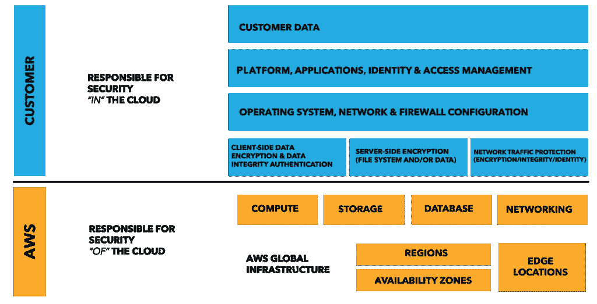
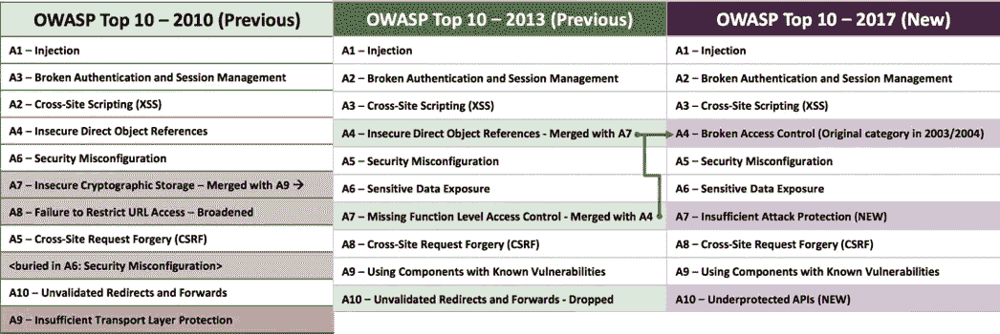
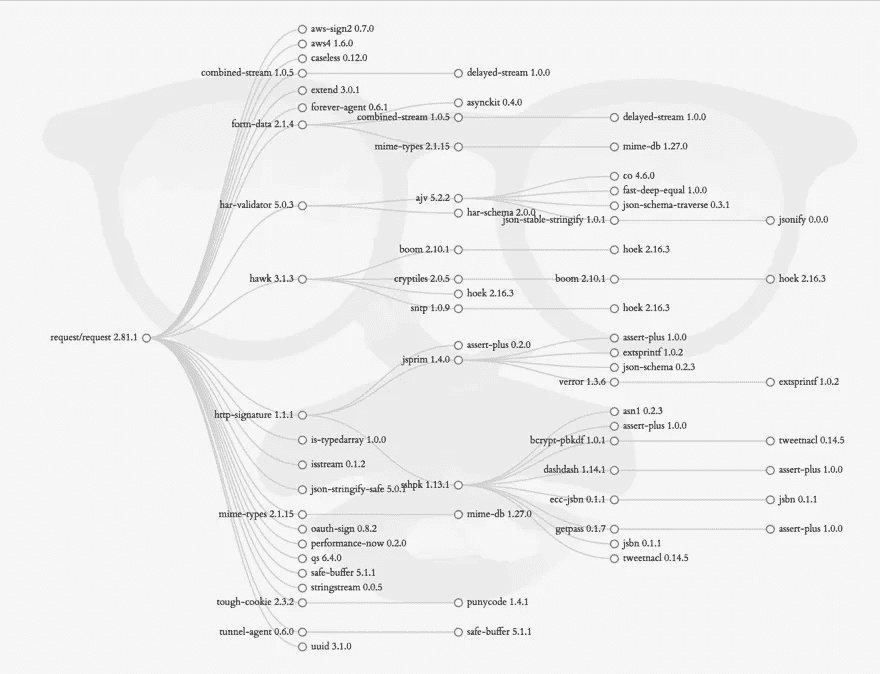
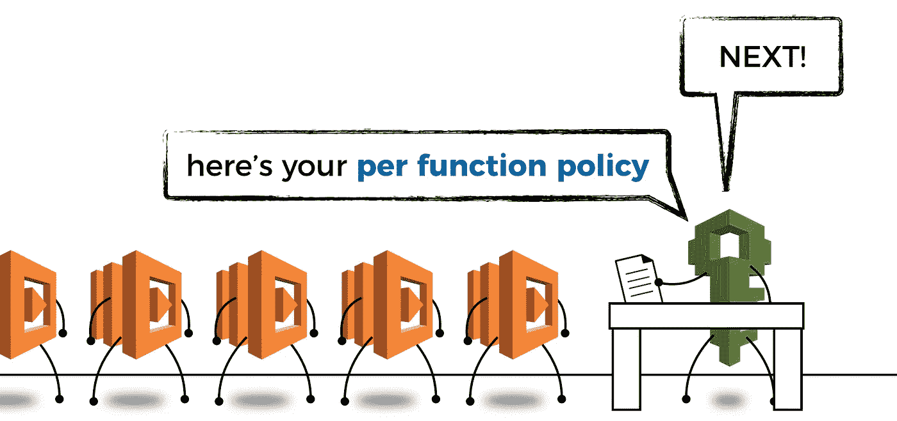
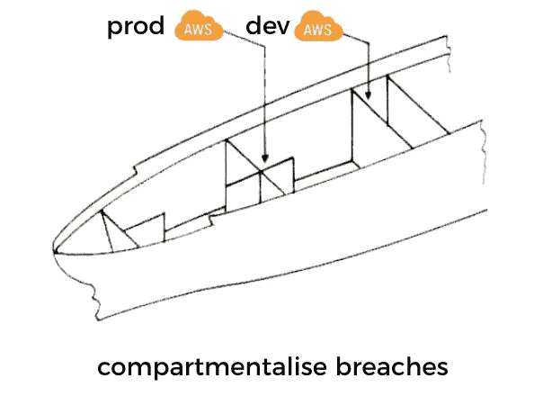
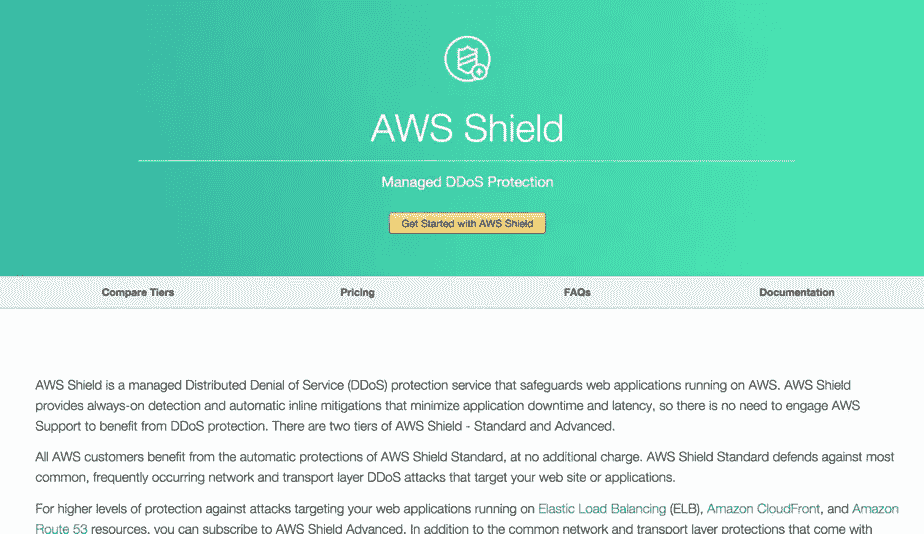
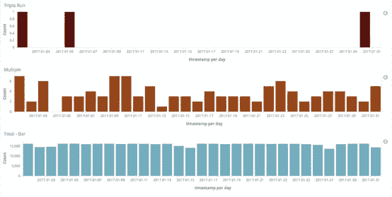
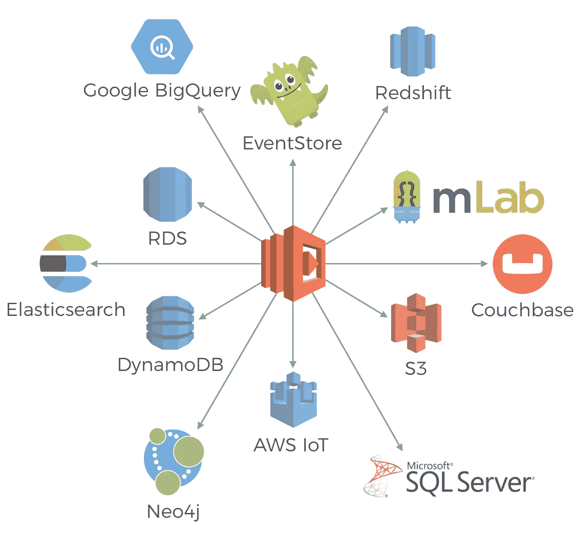
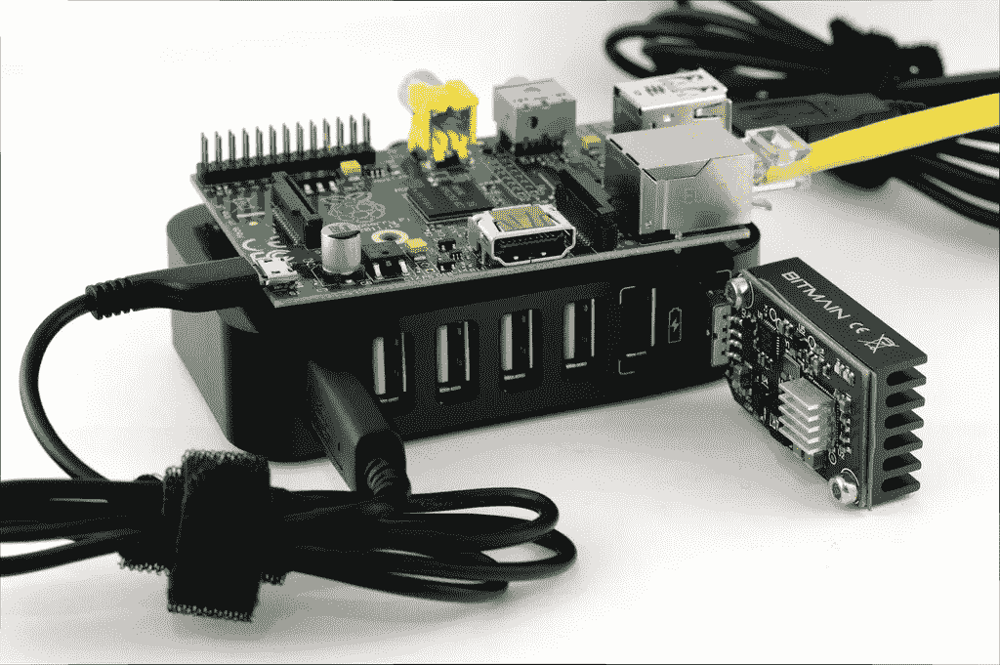

# 无服务器安全面临多种威胁

> 原文：<https://medium.com/hackernoon/many-faced-threats-to-serverless-security-519e94d19dba>

## 对无服务器应用程序的安全威胁有多种形式，有些是我们以前面对的老对手；有些是新的；有些在无服务器的世界中采用了新的形式。

随着我们采用无服务器模式来构建云托管应用，我们将更多的运营责任委托给了我们的云提供商。当您围绕 AWS Lambda 构建无服务器架构时，您不再需要配置 ami、修补操作系统和安装守护程序来收集和分发应用程序的日志和指标。AWS 会为您处理所有这些事情。

这对长期以来一直是 AWS 云中安全基石的 [**共享责任模型**](https://aws.amazon.com/compliance/shared-responsibility-model/) 意味着什么？

# 针对操作系统攻击的防护

AWS 接管了维护主机操作系统的责任，将其作为核心竞争力的一部分。因此，将您从应用所有最新安全补丁的繁重任务中解脱出来——这是我们大多数人都做得不够好的事情，因为这不是我们的主要关注点。

通过这样做，它可以保护我们免受操作系统中已知漏洞的攻击，并防止像 [WannaCry](https://en.wikipedia.org/wiki/WannaCry_ransomware_attack) 这样的攻击。

此外，通过从图片中删除长期存在的服务器，我们还删除了在我们的环境中长期存在的被破坏的服务器所带来的威胁。

WannaCry happened because the MS17–017 security patch was not applied to the affected hosts.

然而，修补我们的应用程序并解决代码和依赖关系中存在的漏洞仍然是我们的责任。

# OWASP 前 10 名仍然和以前一样重要

Aside from a few reclassifications the OWASP top 10 list has largely stayed the same in 7 years.

浏览一下 2017 年 OWASP 十大威胁列表，我们会发现一些常见的威胁——注入、跨站点脚本、敏感数据泄露等等。

## A9 —具有已知漏洞的组件

当 [Snyk](https://snyk.io/) 的人在 2016 年查看 1792 个数据泄露的数据集时，他们发现前 50 个 **数据泄露** 中的 [**12 个是由使用具有已知漏洞的组件的应用程序造成的。**](https://snyk.io/blog/owasp-top-10-breaches)

此外，[来自 Alexa 的前 5000 个 URL 中有 77%包含至少一个易受攻击的库](https://snyk.io/blog/77-percent-of-sites-use-vulnerable-js-libraries)。当你考虑到一些最流行的前端 js 框架——例如， [jquery](https://snyk.io/vuln/npm:jquery) 、 [Angular](https://snyk.io/vuln/npm:angular) 和[React](https://snyk.io/vuln/npm:react)——都有已知的漏洞时，这并没有听起来那么令人惊讶。它强调了不断更新和修补依赖关系的必要性。

然而，与独立、可信且易于应用的操作系统补丁不同，**这些第三方依赖项的安全更新通常与需要集成和测试的功能和 API 变更捆绑在一起**。这让我们作为开发人员的生活变得困难，这也是我们加班加点发布新功能时必须做的另一件事。

然后是暂时依赖的问题，天啊，有这么多的暂时依赖…如果这些暂时依赖有漏洞，那么你也会因为你的直接依赖而变得脆弱。

[https://david-dm.org/request/request?view=tree](https://david-dm.org/request/request?view=tree)

在我们的依赖关系中寻找漏洞是一项艰苦的工作，需要不断的努力，这就是为什么像 Snyk 这样的服务如此有用。它甚至还内置了与 Lambda 的集成！

## 对 NPM 出版商的攻击

What if the author/publisher of your 3rd party dependency is not who you think they are?

就在几周前，一名安全赏金猎人发布了这个[惊人的帖子](https://github.com/ChALkeR/notes/blob/master/Gathering-weak-npm-credentials.md)，讲述他如何设法获得 **14%的 NPM 套餐**的直接推送权。受影响的软件包名单也包括一些大牌:`debug`、`request`、`react`、`co`、`express`、`moment`、`gulp`、`mongoose`、`mysql`、`bower`、`browserify`、`electron`、`jasmine`、`cheerio`、`modernizr`、`redux`等等。总的来说，这些软件包占 NPM 每月下载总数的 20%。

让那件事过一会儿再说。

他是否使用了非常复杂的方法来规避 NPM 的安全措施？

不，这是一个结合了**蛮力**和使用**已知**帐号&的组合，包括 Github 在内的许多来源的凭证泄露。换句话说，任何人都可以用很少的研究就完成这些。

当如此多的软件包作者表现出如此漫不经心的态度来确保访问他们的 NPM 账户时，很难不感到失望。我觉得我对这些第三方依赖的信任被出卖了。

> 662 个用户有密码`123456`，174 — `123`，124 — `password`。
> 
> 1409 个用户(1%)使用他们的用户名作为他们的密码，在它的原始形式，没有任何修改。
> 
> 11%的用户重复使用他们泄露的密码:10.6%直接重复使用，0.7%只做了很小的修改。

正如我在最近关于无服务器安全的演讲(见视频 13:20 左右的演示)中所演示的那样，**人们可以通过几行代码轻松地从受影响的 Lambda 函数(或 EC2 托管的 Node.js 应用程序)中窃取临时 AWS 凭证**。

想象一下，一个攻击者成功获得了所有 NPM 包的 14%的推送权。他可以发布所有这些软件包的补丁更新，并大规模窃取 AWS 凭证。

赌注很高，这很可能是我们在无服务器世界面临的最大安全威胁；它同样威胁着托管在容器或虚拟机中的应用程序。

包管理的问题和风险并不是 Node.js 生态系统特有的。我职业生涯的大部分时间都在和。Net 技术，现在我在 Space Ape Games 与 Scala 合作，包管理在任何地方都是一个挑战。无论您是否在谈论 Nuget 或 Maven，或者任何包存储库，如果您的依赖项的作者没有像保护他们自己的应用程序那样尽职尽责地保护他们的帐户，那么您总是处于危险之中。

或者，也许他们有…

## A1 —注射和 A3 — XSS

在无服务器的世界中，SQL 注入和其他形式的注入攻击仍然是可能的，跨站点脚本攻击也是如此。

即使您使用的是 NoSQL 数据库，您也可能无法免受注入攻击。例如，MongoDB 通过其查询 API 暴露了许多[攻击媒介](https://zanon.io/posts/nosql-injection-in-mongodb)。

可以说，DynamoDB 的 API 使得攻击者很难(至少我还没有听说过一种方法)策划注入攻击，但是您仍然可以利用其他形式的漏洞——例如，跨站点脚本(XSS)攻击，以及授权攻击者访问 DynamoDB 表的泄漏凭据。

尽管如此，您应该始终净化用户输入，以及 Lambda 函数的输出。

## A6 —敏感数据暴露

随着服务器的出现，当迁移到无服务器模式时，web 框架也消失了。这些 web 框架已经为我们服务了很多年，但是它们也给了我们一把上了膛的枪，让我们可以搬起石头砸自己的脚。

正如 Troy Hunt 最近在 LDNUG 的[演讲中演示的那样，我们可能会因为不小心打开了目录列表选项而意外暴露各种敏感数据。从包含凭证的`web.config`(在 35:28)到 SQL 备份文件(在 1:17:28)！](https://skillsmatter.com/skillscasts/9954-london-dot-net-june-meetup)

有了 API Gateway 和 Lambda，像这样的意外暴露变得不太可能——目录列表是一个您必须自己实现的“特性”。它迫使你对何时支持目录列表做出非常有意识的决定，答案可能是*永远不要*。

# InternationalAssociationofMachinists 国际机械师协会

如果你的 Lambda 函数被破坏了，那么下一道防线就是限制这些被破坏的函数能做什么。

这就是为什么在配置 Lambda 权限时需要应用**最小特权原则**的原因。

在`Serverless`框架中，默认行为是对服务中的所有功能使用相同的 IAM 角色。

然而，`serverless.yml`规范允许您为每个功能指定一个[不同的 IAM 角色。虽然你可以从例子中看到，它涉及到更多的开发工作，而且(根据我的经验)增加了足够的摩擦，几乎没有人这样做…](https://serverless.com/framework/docs/providers/aws/guide/iam/#custom-iam-roles-for-each-function)

Apply per-function IAM policies.

***2018 年 1 月 2 日更新:*** *多亏了 Guy Lichtman，无服务器框架有了一个新的插件——恰当地命名为*[server less-IAM-role-per-function](https://github.com/functionalone/serverless-iam-roles-per-function)*——这将使应用 per function IAM 角色变得容易得多。安装和使用非常简单，只需按照 Github 页面上的说明操作即可。*

## IAM 策略没有 Lambda 版本

当前 Lambda + IAM 配置的一个缺点是 IAM 策略没有随 Lambda 函数一起进行版本控制。

在使用同一功能的多个版本的情况下(可能有不同的别名)，添加或删除权限会有问题:

*   向新版本的函数添加新的权限允许旧版本的函数进行它们不需要的额外访问(并造成漏洞)
*   从新版本的函数中移除现有权限会破坏仍需要该权限的旧版本的函数

自从 1.0 版本的`Serverless`框架以来，这已经不再是一个问题，因为它不再为阶段使用别名——相反，每个阶段都被部署为一个单独的函数，例如。

*   `service-function-dev`
*   `service-function-staging`
*   `service-function-prod`

这意味着您不太可能*需要*在活动中使用同一个功能的多个版本。

我还发现(从个人经验来看)**帐户级别的隔离**可以帮助缓解添加/删除权限的问题，更重要的是，这种隔离还有助于**区分安全漏洞**——例如，在非生产帐户中运行的受损功能不能用于对生产帐户造成伤害并影响您的用户。

We can apply the same idea of bulkheads (which has been popularised in the microservices world by Michael Nygard’s “Release It”) and compartmentalise security breaches at an account level.

## 删除未使用的功能

无服务器模式的一个好处是，当功能不用时，你不用为它们付费。

这个特性的另一面是，你不太需要删除不用的功能，因为它们不会出现在你的账单上。然而，这些函数仍然作为攻击面存在，甚至比经常使用的函数更容易受到攻击，因为它们不太可能被更新和打补丁。随着时间的推移，这些未使用的功能可能成为具有已知漏洞的组件的温床，攻击者可以利用这些漏洞。

Lambda 的文档也将此列为最佳实践之一。

> 删除不再使用的旧 Lambda 函数。

# 拒绝服务攻击的变化

有了 AWS Lambda，您更有可能通过扩展来摆脱 DoS 攻击。然而，积极地扩展您的无服务器架构来对抗暴力的 DoS 攻击会有很大的成本影响。

难怪人们开始称针对无服务器应用的 DoS 攻击为**拒绝钱包(DoW)** 攻击！

*“但是你可以限制并发调用的数量，对吗？”*

当然，你最终会遇到 DoS 问题…这是一个双输的局面。

AWS 最近推出了 [AWS Shield](https://aws.amazon.com/shield/) ，但在撰写本文时，支付保护(仅当您每月为 AWS Shield Advanced 支付固定费用时)并不涵盖 DoS 攻击期间发生的 Lambda 成本。

For a monthly flat fee, AWS Shield Advanced gives you cost protection in the event of a DoS attack, but that protection does not cover Lambda yet.

另外，Lambda 有一个 [**至少一次**调用策略](http://docs.aws.amazon.com/lambda/latest/dg/API_Invoke.html)。[根据 SunGard](https://blog.sungardas.com/CTOLabs/2017/06/run-lambda-run/) 的说法，这可以导致多达 3 次(成功的)调用。从这篇文章中可以看出，多次调用的报告率非常低——0.02%—但是人们想知道这个比率是否与负载有关，并且在 DoS 攻击期间可能表现为更高的比率。

Taken from the “Run, Lambda, Run” article below.

此外，您需要考虑 Lambda [retries 如何导致](http://docs.aws.amazon.com/lambda/latest/dg/retries-on-errors.html)[异步源](http://docs.aws.amazon.com/lambda/latest/dg/invoking-lambda-function.html)的调用失败——例如 S3、SNS、SES、CloudWatch 事件等。官方说法是，这些调用在被发送到指定的 DLQ(如果有的话)之前会重试两次。

然而，OpsGenie guys 的一项分析显示，重试次数并不是一成不变的，在调用被发送到 DLQ 之前，重试次数可以高达 6 次。

如果 DoS 攻击者能够触发失败的异步调用(也许是通过上传文件到 S3，这将导致您的功能，除了当试图处理)，那么他们可以大大扩大其攻击的影响。

所有这些都增加了在 DoS 攻击期间 Lambda 调用的实际数量爆炸的可能性。正如我们之前所讨论的，虽然您的基础设施可能能够应对攻击，**但您的钱包能承受同样的程度吗**？你应该允许吗？

# 保护外部数据

Just a handful of the places you could be storing state outside of your stateless Lambda function.

由于 Lambda 函数的短暂性，很可能你所有的函数都是无状态的。状态存储在外部系统中的情况比以往任何时候都多，我们需要保护静态的**和传输中的**。****

**与所有 AWS 服务的通信都是通过 HTTPS 进行的，每个请求都需要签名和认证。一些 AWS 服务也为你的静态数据提供服务器端加密——想到了 [S3](http://amzn.to/1N3Twb8) 、 [RDS](http://docs.aws.amazon.com/AmazonRDS/latest/UserGuide/Overview.Encryption.html) 和 [Kinesis streams](http://amzn.to/2tgvFR2) ，Lambda 内置了与 KMS 的集成来加密你的函数的环境变量。**

**当在不提供内置加密的服务/数据库中存储敏感数据时，也需要进行同样的谨慎处理，例如 DynamoDB、Elasticsearch 等。—并确保它们在休息时受到保护。在数据泄露的情况下，它为我们用户的数据提供了另一层保护。**

**我们欠用户太多了。**

**在服务(外部和内部)之间传输数据时，使用安全传输。如果你用 API Gateway 和 Lambda 构建 API，那么默认情况下你会被迫使用 HTTPS，这是一件好事。但是，API Gateway 总是可以公开访问的，您需要采取必要的预防措施来保护对内部 API 的访问。**

**你可以使用 API 键，但我认为最好使用 [IAM roles](http://docs.aws.amazon.com/apigateway/latest/developerguide/permissions.html) 。它给你[细粒度的控制](http://docs.aws.amazon.com/apigateway/latest/developerguide/api-gateway-iam-policy-examples-for-api-execution.html)谁可以调用哪些资源上的哪些动作。此外，使用 IAM 角色可以避免像这样尴尬的对话:**

***“今天是 X 的最后一天，他可能把我们的 API 密钥放在了他的笔记本电脑上，以防万一，我们应该轮换 API 密钥吗？”***

***“嗯..那要做很多工作，X 是值得信任的，他不会做任何事。”***

***“好吧……如果你这么说的话……(暗暗祈祷 X 不要丢了他的笔记本电脑或者对公司产生迟来的怨恨)”***

**幸运的是，两者都可以使用`Serverless`框架[轻松配置](https://serverless.com/framework/docs/providers/aws/events/apigateway#http-endpoints-with-aws_iam-authorizers)。**

# **泄露的凭据**

****

**Don’t become an unwilling bitcoin miner.**

**互联网上充满了恐怖的故事，开发者在他们泄露的证书被网络罪犯用来开采比特币后，积累了巨额的 AWS 账单。对于每一个这样的故事，更多的人会受到影响，但选择保持沉默(出于同样的原因，许多安全漏洞没有公开宣布，因为大公司不想显得无能)。**

**甚至在我的小社交圈里，我也听说过两起这样的事件，都没有公之于众，都导致了超过 10 万美元的损失。幸运的是，在这两种情况下，AWS 都同意承担费用。**

**我知道的一个事实是，AWS 会主动扫描公共 Github repos 以获取主动 AWS 凭证，并尝试尽快提醒您。但是正如上面的一些故事所提到的，即使你的身份信息只被泄露了一小段时间，它也不会逃过攻击者警惕的目光。(另外，它们仍然存在于 git 提交历史中，除非您也重写了历史，如果可能的话，最好停用凭证)。**

**防止 AWS 凭证泄露的一个好方法是使用 git 预提交钩子，如本文[所述。](https://www.unixdaemon.net/cloud/preventing-aws-creds-in-git-with-pre-commit/)**

# **结论**

**在这篇文章中，我们看到了对我们的无服务器应用程序的许多安全威胁，其中许多是困扰软件行业多年的相同威胁。所有的 OWASP 十大攻击仍然适用于我们，包括 SQL、NoSQL 和其他形式的注入攻击。**

**泄露 AWS 证书仍然是一个主要问题，可能会对任何使用 AWS 的组织产生潜在影响。虽然有不少公开报道的事件，但我强烈感觉到实际的事件数量要高得多。**

**我们仍然负责保护用户的静态和传输中的数据。API 网关总是可以公开访问的，所以我们需要采取必要的预防措施来保护对我们内部 API 的访问，最好是使用 IAM 角色。IAM 提供了对谁可以调用 API 资源上的哪些操作的细粒度控制，并使员工进出时的访问管理变得容易。**

**从积极的方面来看，让 AWS 接管主机操作系统的安全责任为我们带来了诸多安全优势:**

*   **防止操作系统攻击，因为 AWS 可以更好地修补操作系统中的已知漏洞**
*   **主机操作系统是短暂的，这意味着没有长期存在的受损服务器**
*   **忘记关闭 web 框架中的目录列表选项而意外暴露敏感数据要困难得多——因为您不再需要这样的 web 框架了！**

**在无服务器的世界里，DoS 攻击有了新的形式。虽然您可能能够通过扩展来摆脱攻击，但它仍然会伤害您的钱包，因此 DoS 攻击在无服务器世界中被称为*钱包拒绝*攻击。在撰写本文时，DoS 攻击期间产生的λ成本是由 *AWS Shield Advanced* 覆盖的**而不是****，但希望它们将在不久的将来实现。****

****与此同时，AWS Lambda 出现了一些新的攻击面:****

*   ****函数经常被赋予过多的权限，因为它们没有被赋予适合其需求的单独的 IAM 策略，因此一个受损的函数可能会造成更大的危害****
*   ****未使用的功能通常会被搁置很长时间，因为它们没有相关的成本，但攻击者可能会利用它们，特别是如果它们没有得到积极维护，因此可能包含已知的漏洞****

****最重要的是，对我来说最令人担忧的威胁是对软件包作者本身的攻击。事实表明，许多作者并没有认真对待其帐户的安全性，因此危及他们自己以及依赖于他们的社区的其他人。防范这样的攻击是不可能的，它会侵蚀任何软件生态系统最强大的一面——它背后的社区。****

****事实再次证明，人是安全链中最薄弱的一环。****

********

****嗨，我的名字是**崔琰**。我是一个 [**AWS 无服务器英雄**](https://aws.amazon.com/developer/community/heroes/yan-cui/) 和 [**量产无服务器**](https://bit.ly/production-ready-serverless) 的作者。我已经在 AWS 中运行了近 10 年的大规模生产工作负载，我是一名架构师或首席工程师，涉足从银行、电子商务、体育流媒体到移动游戏等多个行业。我目前是一名专注于 AWS 和无服务器的独立顾问。****

****你可以通过[邮箱](mailto:theburningmonk.com)、 [Twitter](https://twitter.com/theburningmonk) 和 [LinkedIn](https://www.linkedin.com/in/theburningmonk/) 联系我。****

****查看我的新课程，[**AWS 步骤功能完整指南**](https://theburningmonk.thinkific.com/courses/complete-guide-to-aws-step-functions) 。****

****在本课程中，我们将介绍有效使用 AWS Step Functions 服务所需了解的一切。包括基本概念、HTTP 和事件触发器、活动、设计模式和最佳实践。****

****在这里拿到你的副本。****

********

****来了解 AWS Lambda: CI/CD 的操作性**最佳实践**，本地测试&调试功能、日志记录、监控、分布式跟踪、canary 部署、配置管理、认证&授权、VPC、安全性、错误处理等等。****

****还可以用代码 **ytcui** 获得**票面价格 6 折**。****

****点击获取您的副本[。](https://bit.ly/production-ready-serverless)****