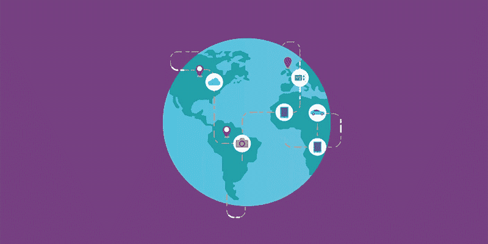

# 描绘全球数字发展和数字势头

> 原文：<https://medium.com/hackernoon/mapping-global-digital-evolution-and-digital-momentum-2a86eb8e0511>

## 塔夫茨和万事达推出 2017 年数字进化指数。

随着数字和技术推动全球互联互通，世界各地的政府必须加快其数字增长，以成为并保持全球竞争力，并为公民提供更好的服务。为了绘制当前形势并了解趋势，塔夫茨大学弗莱彻法律和外交学院与[万事达卡](https://medium.com/u/10924fd16ff8?source=post_page-----2a86eb8e0511--------------------------------)合作创建了 [*数字进化指数 2017*](https://www.mastercard.us/en-us/governments/insights-research/digital-evolution-index.html) (DEI)。

2015 年首次推出的*指数* [分析了四个关键驱动因素的 170 多个指标——供应状况；需求条件；体制环境；和创新与变革——促进我们对 60 个国家的数字进化和发展的理解。](https://hbr.org/2015/02/where-the-digital-economy-is-moving-the-fastest)

“每天，世界各地有数十亿人使用互联网分享想法，相互交易，并与家人、朋友和同事保持联系，”2017 年版 [*数字星球报告*](http://go.tufts.edu/dei17) *，*的作者解释说，该报告推出了 DEI。

> 随着全球互联网渗透率接近 50% 1，全球数字经济已成为一个充满巨大机遇的空间。

该报告不仅显示了数字化现在是全球化的主要驱动力之一，“而且还显示了“在全球数字舞台上获得竞争优势已成为努力融入全球市场并发挥作用的政府、企业和公民的关键优先事项。"

> 同样显而易见的是，当各国寻求改善其数字发展时，动力、创新和信任都发挥着关键作用。

## 什么是数字进化指数？

*2017 年数字发展指数*包括对每个国家的 DEI 得分和数字势头的分析，即各国自 2008 年以来发展数字经济的速度。

塔夫茨和万事达卡认为:“对投资者和企业来说，势头是市场吸引力和潜力的标志；对政策制定者来说，这是竞争力的代表。它说明了进步的速度。”

“较高的数字势头分数意味着机会，通常意味着访问的改善(更多的人上网)。它还反映了一个人们在数字空间中发现越来越多的价值和用途的社会。”

DEI 绘制了四个主要的数字演化和动量区域:

*   **脱颖而出**国家可以被认为是数字精英；它们都是高度数字化的，并且发展迅速。这一领域包括推动数字领域创新的较小国家，如香港、新加坡和阿联酋，以及保持领先地位的较大国家，如英国、爱沙尼亚、以色列和新西兰。
*   **拖延**国家已经达到了高水平的数字进化，但由于进展速度较慢，有落后的风险，并将受益于对创新的高度关注。包括美国和加拿大，但也包括挪威、丹麦、瑞典和芬兰，根据*指数*，“过去的数字化没有转化为未来的动力。”
*   小心了，这些国家在这两项指标上的排名都很低。在基础设施发展和创新方面，他们都有很多工作要做。注意国家是例如约旦，巴西，印度尼西亚，墨西哥和印度。
*   **爆发**国家在整体数字发展方面得分相对较低，但发展速度足够快，表明它们有潜力成为强大的数字经济体。根据*指数*，这一组包括有潜力成为未来杰出国家的国家，“其中中国、马来西亚、玻利维亚、肯尼亚和俄罗斯领先。”

*指数*的主要作者——IBGC 弗莱彻商学院全球环境商业研究所执行主任巴斯卡尔·查克拉沃蒂、弗莱彻新兴市场企业委员会高级研究员阿贾伊·巴拉和 IBGC 大学研究副主任兼创新与变革博士研究员拉威·香卡·查图维迪— [在《哈佛商业评论》](https://hbr.org/2017/07/60-countries-digital-competitiveness-indexed)[的一篇文章](https://medium.com/u/7ddfe8a6bc4f?source=post_page-----2a86eb8e0511--------------------------------)中解释了世界上最重要的两个经济体——美国和德国——如何处于边界

他们表示:“对他们来说，认识到停滞的风险，并向规模较小、发展势头较高的国家看齐，探索政策干预如何能有效地推动一个国家进入更具竞争力的区域，这一点至关重要。”

根据作者的说法，“从数字上讲，世界上最令人兴奋的地区是亚洲，以中国和马来西亚为典范。”

*指数*还显示了“具有高性能数字部门的国家，如欧盟国家，通常在塑造数字经济中有强有力的政府/政策参与；[..]高增长国家(如新加坡、新西兰和阿联酋)以及许多爆发国家(包括中国、马来西亚和沙特阿拉伯)也是如此