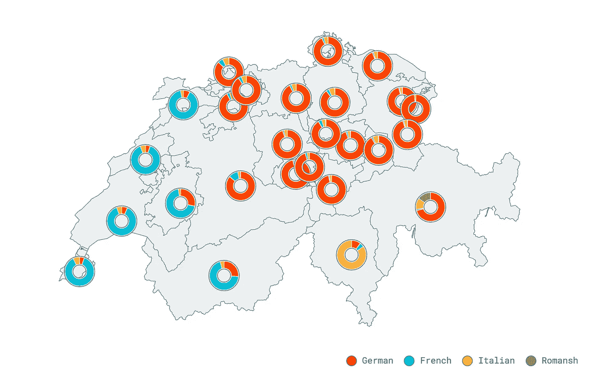

# 地图教程:结合胜利图表和反应简单地图

> 原文：<https://medium.com/hackernoon/mapping-tutorial-combining-victory-charts-and-react-simple-maps-4e839d803865>

## 在地图上使用圆环图创建瑞士语言分布的精美地图。

## 注意:我已经把我的博客搬到了 zcreativelabs.com/blog/。你可以在那里找到这篇文章的更新版本。以后的文章只会在那里发表。请订阅 z creative labs 时事通讯，以便在您的收件箱中收到我的最新文章。



This is the end result of this tutorial.

R[eact-simple-maps](https://www.react-simple-maps.io)是一个 [react](https://hackernoon.com/tagged/react) 组件库，有助于使用 d3-geo、TopoJSON 和 react 更轻松地进行 SVG 映射。使用`react-simple-maps`的优势之一是它让 React 完全控制 DOM，并且不会将 SVG 地图视为黑盒。这意味着`react-simple-maps`可以轻松利用整个 React 生态系统以及随之而来的所有好东西。

`React-simple-maps`的部分灵感来自于`Victory`图表的声明式 api。如果你没听说过`Victory`，那就看看 [github](https://github.com/FormidableLabs/victory) ，或者看看他们[网站](http://formidable.com/open-source/victory/)上的[示例](http://formidable.com/open-source/victory/gallery)和[指南](http://formidable.com/open-source/victory/guides)。

关于`Victory` charts 的伟大之处在于它不必单独使用，而是可以嵌入到现有的 SVG 容器中。这使得将`Victory`图表与任何 SVG 视觉效果(如地图)结合起来成为可能；)

本教程将介绍如何组合这两个库，并创建本文封面所示的地图。如果你只是对最终代码感兴趣，那就去看看 github repo。

以下是本教程将涵盖的内容:

1.  关于观想
2.  回购和应用程序结构
3.  设置基本地图(地形、投影、样式)
4.  数据
5.  在`<Marker />`组件内渲染`<VictoryPie />`

让我们开始吧。

# 关于观想

本教程的可视化显示了瑞士各州的语言分布。尽管瑞士人口略多于 800 万，但它有四种官方语言:德语、法语、意大利语和罗曼语。这导致瑞士被分成三个不同的语言区域，每个区域都有自己的文化。罗曼语是一个特殊的例子，因为只有 0.5%的瑞士人说罗曼语，主要是在格劳宾登州。

虽然大多数州主要认同一种语言，但也有一些州(弗里堡、瓦莱州、伯尔尼州和格劳宾登州)的语言环境相当多样化。

# 回购和应用程序结构

为了简化本教程的设置，我将使用 next.js 创建一个 app scaffold。要开始，请安装这些依赖项:

```
$ npm install react react-dom react-simple-maps victory next --save
```

就搭建而言，下面是应用程序结构的样子:

```
┬ app
├─┬ data
│ └── index.js
├─┬ pages
│ └── index.js
├─┬ static
│ └── cantons.json
├── node_modules
└── package.json
```

别忘了在`package.json`中添加下一个`dev`剧本。

```
// ./package.json
...
scripts: {
  "dev": "next",
  ...
}
...
```

# 设置基本地图

每一个地图可视化都是从一个好的底图和一个坚实的地形文件开始的。如果你是 TopoJSON 的新手，请在这里查看[文档](https://github.com/topojson/topojson)。如果您是创建自己的 TopoJSON 文件的新手，您可以查看我的文章[如何使用 d3](https://hackernoon.com/how-to-convert-and-prepare-topojson-files-for-interactive-mapping-with-d3-499cf0ced5f) 转换和准备 TopoJSON 文件以进行交互式制图。

用于创建 TopoJSON 文件的原始 shapefile 来自[gadm.org](http://www.gadm.org/country)。

瑞士地图的投影来自于迈克·博斯托克制作的这块积木。为了将[阿尔伯斯投影](https://github.com/d3/d3-geo-projection#geoAlbers)与`react-simple-maps`一起使用，我们需要加载 [d3-geo](https://github.com/d3/d3-geo) 。由于`react-simple-maps`内部使用 d3-geo，应该已经安装了。使用 d3-geo 中的`geoAlbers`，您可以轻松地创建一个自定义投影，并将其传递到`<ComposableMap />`的`projection` prop 中。

您现在可以运行该应用程序。只需在终端中键入`$ npm run dev`，然后转到`[http://localhost:3000](http://localhost:3000/)`。

# 数据

[本教程的数据集](https://www.bfs.admin.ch/asset/fr/je-f-21.03.02)来自[瑞士联邦统计局](https://www.bfs.admin.ch/bfs/en/home.html)。为了不影响异步数据加载，这个小数据集可以很容易地转换成一个 [javascript](https://hackernoon.com/tagged/javascript) 对象，并作为普通脚本加载。以下是摘录:

```
// ./data/index.jsexport const cantons = [
  {
    id: 25,
    canton: "Zurich",
    coordinates: [ 8.6356, 47.3595 ],
    languages: [
      { name: "German", value: 83.1 },
      { name: "French", value: 3 },
      { name: "Italian", value: 5.9 },
      { name: "Romansh", value: 0.4 },
    ]
  },
...
```

现在，数据可以轻松导入应用程序:

```
// ./pages/index.jsimport { cantons } from "../data"
...
```

# 将胜利图表渲染为标记

最后一步是使用数据渲染出`react-simple-maps` `<Marker />`组件，并将`<VictoryPie />`图表渲染到这些标记中。

***注:*** 线条`67-68`上增加的两个`<circle />`元素，只是起装饰作用。

# 结论

本教程讲述了如何使用`react-simple-maps`和`Victory`图表创建一个瑞士各州语言分布的小地图。这两个库配合得很好，不妨试一试。感谢阅读，并愉快的映射！；)

## 资源

完整的代码示例见[这个 github repo](https://github.com/zcreativelabs/react-simple-maps/tree/master/examples/with-victory) 。

有关声明式映射的更多信息，请查看[如何使用 topojson 和 d3-geo 创建纯 react SVG 地图](/@zimrick/how-to-create-pure-react-svg-maps-with-topojson-and-d3-geo-e4a6b6848a98)。

有关如何将 shapefiles 转换为 TopoJSON 以便与`react-simple-maps`或 d3 一起使用的信息，请查看[如何转换和准备 TopoJSON 文件以便与 d3](https://hackernoon.com/how-to-convert-and-prepare-topojson-files-for-interactive-mapping-with-d3-499cf0ced5f) 进行交互映射。

[更多关于 react-simple-maps 的信息](https://www.react-simple-maps.io)

关于胜利的更多信息。

## 提及

感谢[令人敬畏的](https://medium.com/u/900ee8ad3db9?source=post_page-----4e839d803865--------------------------------)的人们，感谢他们创造了`Victory`的精彩，当然还有[迈克·博斯托克](https://medium.com/u/c918c478bb49?source=post_page-----4e839d803865--------------------------------)，以及[杰森·戴维斯](https://twitter.com/jasondavies)为 d3 所做的工作，感谢他们一直以来的灵感来源。