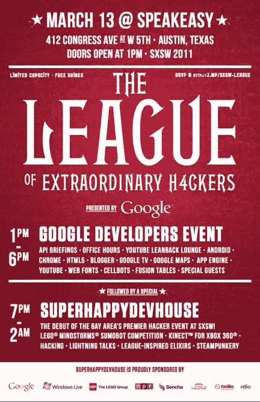

# 三月魔法记忆:克里斯·梅西纳

> 原文：<https://medium.com/hackernoon/march-magic-memories-chris-messina-83524f922f07>

## 《阿甘正传》四部曲:2017 年 10 月 29 日

也许最出名的是提议使用 Twitter 上的标签作为信息分组的方式，[克里斯·梅西纳](http://chrismessina.me/)还联合创立了 BarCamp 以及几个合作社区。作为卡耐基-梅隆大学的 2003 届毕业生，他丰富的技术履历包括在优步和谷歌的工作经历。梅西纳在 SXSW 上发表过无数次演讲——2017 年，他参加了一个名为“[计算机，我们应该谈谈:对话网络](https://schedule.sxsw.com/2017/events/PP61871)”的小组讨论在 2018 年 3 月的活动中，他将谈论我们过去在思考未来时可以教给我们什么，这是一场非常万圣节式的主题“[PC 之死的教训](https://schedule.sxsw.com/2018/events/PP78246)”的会议

**更新**:由于意外的日程冲突，Chris 将无法再参加 SXSW 2018。我们期待在 2019 年 3 月奥斯汀的活动中听到他的专业知识！

**用 20 个或更少的单词描述一下，你目前工作的主要重点是什么？**
我关注的是如何将高科技应用到自我认知和人际联系的问题上。

**小时候，你长大后想做什么？起初，我想成为一名探险家，但当那件事过去后，我将注意力转向了艺术、计算机、生物学和自然系统。高中的时候，我在设计的学习中结合了前者，在探索行为科学中结合了后者。**

**年轻时的职业抱负与你现在的工作有什么联系？从我早期对未知事物的好奇到我对现代技术的神秘以及人们如何使用和采纳它们的迷恋，我看到了一条直线。我仍然热爱艺术、漫画和创造力，并将这些元素融入到我参与的项目中。当然，在我从东海岸到西海岸的迁移过程中，我对计算机和设计的热爱已经设定了我的职业轨迹。此外，在新罕布什尔州长大的我养成了强烈的自由主义倾向——这一点经常反映在我参与的开源和分散技术项目中。**

**你目前最热衷于什么？**
我内心最活跃的部分每天都在变化，每周都在变化，但最近我最关注的是比以前更深入地理解和归属自己。但这涉及到深入思考:技术对人和社会的影响；什么激发了我们的行为和期望；如何更有效地处理人际关系；如何过更健康的生活；如何理解和服务于集体意识；我的需求是什么。

**在你看来，目前最被夸大/高估的科技趋势是什么？尽管扎克伯格似乎非常迷恋虚拟现实，但虚拟现实仍难以被广泛采用。Oculus 可能是脸书的谷歌眼镜——不是一个完全无用的东西，但不太可能在大众市场消费者中获得成功。在某些特定的环境中，虚拟现实显然是一种更好的创造、联系和理解的方式——但我们离生活在一个 [Ready Player One](https://en.wikipedia.org/wiki/Ready_Player_One) 的世界还很远。**

**在你看来，目前最被低估/忽视的技术趋势是什么？**
我们正在进入一个设计工具的黄金时代，这个时代还没有被科技媒体充分报道或放入合适的环境中。我们正在退出大多数设计师运用 Photoshop 和 Illustrator 技能来进行 UI 设计的世界。现在，我们有一批专门针对高密度和可变尺寸屏幕上的界面体验的新工具，允许高动态范围的逼真度，从原型到高度编排的运动交互设计。这是新的——以及使用真实数据和 API 进行设计——并将为我们的日常数字体验带来越来越复杂的程度。

你最近读过的一本伟大的书是什么？
这些天我主要是听书，但半讽刺的是，我确实喜欢读伊藤的[鞭伤](https://www.amazon.com/Whiplash-How-Survive-Faster-Future-ebook/dp/B01A5VQUOI/ref=sr_1_1?s=books&ie=UTF8&qid=1509276775&sr=1-1&keywords=Whiplash)。这是我能够指出的开创性著作之一，它确定了许多将定义未来 20 年技术的趋势，以及如何参与其中。我也读了尼尔·史特劳斯的[真相:一本关于人际关系的不舒服的书](https://www.amazon.com/Truth-Uncomfortable-Book-About-Relationships/dp/178211095X/ref=sr_1_1?s=books&ie=UTF8&qid=1509276798&sr=1-1&keywords=The+Truth%3A+An+Uncomfortable+Book+About+Relationships)，从中获益良多——但这可能比其他任何东西都更能说明我在生活中的位置。

你看过的最后一部伟大的电影是什么？
我真的很喜欢[银翼杀手 2049](http://www.imdb.com/title/tt1856101/) 。这真的是专营权的伟大更新。我也很欣赏杰瑞德·莱托在 [Recode Decode 播客](https://www.recode.net/2017/10/7/16440280/jared-leto-blade-runner-2049-niander-wallace-replicants-kara-swisher-recode-decode-podcast)中关于复制人的话……如果你把他们看作是他的角色，Niander Wallace 就是这样(也就是说，他们只是更先进的 iPhones)，那么他为什么把他们视为一次性的，为什么他寻求一种 Jony Ive 启发的技术完美就不那么令人惊讶了。看电影前先听听播客是很有用的。

**这些天你听得最多的是哪个乐队/音乐人？**
自从第一次去[火人族](https://burningman.org/)后，我就真的迷上了 EDM 和深宅以及各种 DJ 混音。我最喜欢的一些艺术家包括 Mat Zo、sober rob、Ramsey、dvsn、PANTyRAiD、Rezz 和 OBESØ。

如果你不住在旧金山，你想去哪里？尽管我在东海岸长大，但我绝对迷上了西海岸——尤其是三藩市和波特兰。我喜欢住在纽约，哪怕只有一年，我仍然想象着在某个时刻充满探索的生活方式，在阿姆斯特丹、新加坡和东京停留更长时间。

在过去的 15 年里，你曾在一些世界顶尖的创业公司工作过，或者是其中的一员。在此期间，你最好的工作经历是什么？为什么？
一直以来，在顶级公司和初创公司工作的最大好处就是与人互动和联系。与聪明、有动力、勤奋的人一起工作是一种难得的特权，这些人正在塑造反过来塑造我们的意识和生活体验的技术。最持久的好处不在于项目，而在于我在与同路人一起工作时瞥见的共鸣和乐观。我也有机会[面对自己和自己的局限](/chris-messina/today-is-my-last-day-at-uber-f6d5b3c0548e)，虽然那很艰难，但它给了我更多对他人的理解和同情。

[**作为标签**](https://en.wikipedia.org/wiki/Twitter#tweets) **的始祖，你对这个结构的未来有什么想法？五年后，我们还会通过标签组织对话吗？**
2017 年是该标签的十周年，它只会变得对世界话语更加重要。展望未来，我可以看到标签将继续像表情符号和贴纸一样相关和强大——这只是将人们聚集在社交媒体篝火(或篝火，取决于主题)周围的另一种方式！).从现在起的五年内，我想象我们将使用更多的视觉、虚拟和沉浸式媒体格式，但总会有分享、分类和发现内容的需求——而标签似乎是实现这一点的最简单方法。即使新的媒体形式出现了，那些形式倾向于扩展和建立在过去的那些形式的力量上，我不认为有必要从方言中删除已经建立的标签。

如果你掌管 Twitter(即成为首席执行官)，你会做出什么改变？
我被这个问题吓坏了，因为我热爱 Twitter，并从这个平台上获得了巨大的价值。也就是说，我也知道我的经历相对罕见，对许多人来说，Twitter 是一个粪坑。为什么我的体验好了这么多？真的需要十年的个人策划才能找到 Twitter 的天堂吗？当我想到这个平台可能的发展方式时，我想到了 [Twitter 时刻](https://twitter.com/i/moments?lang=en)的潜力。它真的成了获取突发新闻的好去处——收集了大量业余和专业人士对世界上正在发生的事情的观点。然而，大部分的经验都是肤浅的…更多的是人物杂志而不是经济学家…这似乎是一个错过的机会。如果你能把 Vice News 这样的媒体的有力报道和 Twitter 结合起来，你可能会有一些真正有趣和吸引人的东西。如果你能解决匿名的敌意和挑战——你也可能为有益的对话创造更肥沃的土壤，但鉴于这是一个开放的平台，这不是一个容易解决的问题。[产品变化已经承诺](http://blog.twitter.com/official/en_us/topics/company/2017/safetycalendar.html)，近几年也做了很多。我热爱这个平台，它为我提供了很好的服务；Twitter 领导层面临的问题是如何将这种价值扩大到其他受众。

**你对新手 SXSW 与会者的最佳建议是什么？**
不要超订自己！新手有一种倾向，就是把所有要看的东西都列成一个紧凑的时间表，然后试着去真正地看所有的东西！不要！把 SXSW 当作自助餐，里面有成堆的意外收获。去机会带你去的地方，而不是你日历上的东西。是的，你应该有一些你真正想看的东西和你期待听到的声音的清单，也要保持灵活机动。最好的 SXSW 体验往往是计划最少的！

**在您参加 SXSW 的这些年里，最难忘的社交活动是什么？为什么？我记得有一年，我们开放网络社区的一群人决定去奥斯汀郊外的一个湖边烧烤，吃墨西哥玉米卷，喝龙舌兰酒。我假装用了“难忘”这个词，但回想起来，它仍然是我在 SXSW 更好的社交活动之一！我还帮助谷歌组织了一个名为[非凡黑客联盟](http://mashable.com/2011/03/13/league-of-extraordinary-hackers/#FC6Qk2OwXsqb)的活动——我们举办了一场由乐高和红牛赞助的战斗机器人比赛，这完全是一场史诗。**

您喜欢参加哪些其他活动/会议/会议/节日？
SXSW 并没有真正让你为《燃烧的人》做好准备，但如果你参加大型的、精心策划的活动，有很多人在挑战生活的可能性，那么一旦你解决了 SXSW,《燃烧的人》可能是一个合理的朝圣之旅。我还发现了许多规模较小、不那么激烈的节日，比如《共生》和《瓶中闪电》，它们都是有价值的、有变革意义的。那些[庆祝解禁的](https://www.quora.com/How-does-the-principle-of-Decommodification-play-out-at-Burning-Man-How-is-it-followed-or-not-followed-and-what-are-the-results)值得一看！

由埃丝特·克劳福德提供的克里斯·梅西纳照片。

*三月魔法系列的其他连载还有* [*尤瓦尔·雅登*](/@hugh_w_forrest/march-magic-memories-yuval-yarden-3a1d187de540)*[*珍妮 8 的采访。李*](/@hugh_w_forrest/march-magic-memories-jenny-8-lee-3ec9f1e1b72c)*[*阿齐兹*](/@hugh_w_forrest/march-magic-memories-aziz-gilani-9b638b771003) *和* [*胡利*](/@hugh_w_forrest/quantum-this-10-questions-with-whurley-6e83703bbc2f) *。***

**休·福里斯特在全球最独特的创意专业人士聚会[*SXSW*](http://www.sxsw.com)*担任首席编程官。他还试图在媒介上每天至少写四段***。这些帖子通常涵盖与技术相关的趋势；其他时候，他们关注书籍、流行文化、体育和其他时事。****

***帮助 SXSW*[*帮助红十字会赈灾*](http://www.redcross.org/sxsw) *。***