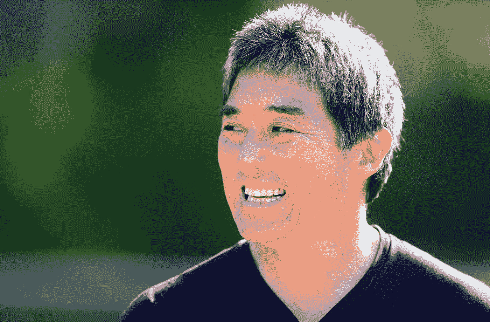

# 三月魔法记忆:盖伊·川崎

> 原文：<https://medium.com/hackernoon/march-magic-memories-guy-kawasaki-e47604695fe>

## 《阿甘正传》四部曲:2017 年 12 月 20 日

盖伊·川崎是在线图形设计工具 [Canva](https://www.canva.com/) 的首席传播者。他是[梅赛德斯-奔驰](https://www.mercedes-benz.com/en/mercedes-benz/lifestyle/friends/guy-kawasaki-the-evangelist/)的品牌大使，也是[哈斯商学院](http://facultybio.haas.berkeley.edu/faculty-list/kawasaki-guy/)(加州大学伯克利分校)的执行研究员。川崎曾担任苹果的首席传播者和维基媒体基金会的受托人。他也是《[开始的艺术 2.0](https://guykawasaki.com/books/the-art-of-the-start/) 》、[社交媒体的艺术](https://guykawasaki.com/books/the-art-of-social-media/)、[结界](https://guykawasaki.com/books/enchantment/)、[其他九本书](https://guykawasaki.com/books/)的作者。川崎拥有斯坦福大学的学士学位和加州大学洛杉矶分校的 MBA 学位，以及巴布森学院的荣誉博士学位。在 2018 年 SXSW 大会上，听听他与 Symone Sanders 关于技术和媒体如何改变政治和文化的对话。

用 20 个单词或更少的篇幅，描述一下你目前工作的重点是什么？
我目前工作的主要重点是传播 Canva 如何使设计民主化的好消息。但我是一个忙碌的家伙，一年要做 50 次演讲，代表梅赛德斯-奔驰，我正在写另一本书。

当你年轻的时候，你长大后想做什么？
年轻是一个相对名词。你是说在大学里吗？那么答案就是做一个高科技企业家。最近，我希望人们记住我是一个伟大的父亲，一个通过写作、演讲、建议和投资赋予人们力量的人。

**你目前最热衷的是什么？我最热衷于冲浪。大约九个月前，我爱上了这项运动。不幸的是，62 岁开始冲浪有点晚，但这为我的灵魂提供了一个窗口，当我决定做某事时，我会全力以赴。**

演员、运动员、音乐家、企业家、科学家，无论是谁——你可以和来自世界任何地方的任何三个活人共进晚餐。你邀请哪三个人？
我有四个:朱莉安娜·科斯特，Adobe Lightroom 福音传道者，希拉里·克林顿，米歇尔·奥巴马和安格拉·默克尔。与希拉里、米歇尔和安吉拉共进晚餐是显而易见的。Julieanne 是在 YouTube 上制作 Lightroom 视频的人，我真的需要 Lightroom 的帮助。这是否意味着我想与之共进晚餐的男人很少？是的，实际上。

**你最近读过的一本好书是什么，是什么让它如此令人愉快？**
“伟大”的限定词是高杠。通过这个测试，我读的最后一本好书是布伦达·尤兰德的《如果你想写》。我是 1987 年读的。它改变了我的生活，因为它让我有能力成为一名作家。每个人，不管你的职业是什么，都应该读这本书。

**这些天你听得最多的播客是什么？为什么这么喜欢？**
我爱[等等，等等别告诉我](https://www.npr.org/programs/wait-wait-dont-tell-me/)，[弗洛伊德经济学](http://freakonomics.com/)，[修正主义历史学](http://revisionisthistory.com/)。幽默和科学改变了我的脉搏。

如果有人问你是否应该投资加密货币，你会怎么回答？
加密货币超出了我有限的心智能力。我是守旧派:做能改善人们生活的东西，并因此获得报酬。

是什么让 2017 年前后的虚拟现实比 1997 年前后的虚拟现实更有可能获得主流大众的成功？
智能手机。

对于人工智能在不久的将来会对我们所有的系统产生多大的影响，你是乐观还是悲观？
《我们所有的系统》有点挑战性，但我看好 AI 会彻底改变驾驶。我迫不及待地想要一个全自动、电气化、你不拥有的汽车世界。

我听你说过你是一个内向的人。你用什么样的策略来克服这种害羞？
我是个内向的人，但我是拿工资来“表演”的。我就是干这个的。我没有克服这种害羞的“策略”——我只是让它发生，因为这是我的工作。

你还记得你参加 SXSW 的第一年吗？是什么激励你第一次去奥斯汀参加三月魔术？
不记得是哪一年了，但是从第一次参观开始，我就觉得 SXSW 很神奇。它与最初的 Macworld Expos 有着相同的氛围——这是我真正喜欢的。我认为 SXSW 的伟大之处在于，很少有亿万富翁和风险投资家四处走动。因此，废话因素比任何其他技术会议都要低得多。我有一个原则，我不能免费坐飞机。SXSW 和社交媒体营销世界是这一规则的唯一两个例外。

**在您参加 SXSW 的这些年里，谁是最令人难忘的演讲者，为什么？**
因为人多，我参加的会议不多，我也不喜欢人多。巴拉克·奥巴马是我见过的演讲者中最令人难忘的。我做过的最好的采访是马克·库班。

**在您参加 SXSW 的这些年里，最难忘的社交活动是什么？为什么？我从不参加社交活动。我右耳听力受损，那只耳朵耳鸣。这使得任何喧闹拥挤的活动都很难享受。我只是不喜欢作为半聋内向者的人群。**

**在 SXSW 2014 上，** [**你在大舞台上座无虚席之前采访了马克·库班**](https://www.youtube.com/watch?v=TE4JsAahB2w) **。在你看来，那次采访最有趣的部分是什么？我喜欢那次采访，因为马克根本不在乎让每个人开心。我会选他当总统。机智是聪明的标志，他是一个非常机智的家伙。对于大多数政客，我不能这么说。**

**对于 SXSW 2018，你将与**[**Symone Sanders**](https://twitter.com/SymoneDSanders)**对话，他是民主党总统候选人伯尼·桑德斯的前新闻秘书。在这个环节中，你将讨论什么样的话题？首先，我们必须确定她是伯尼还是莎拉的亲戚。然后主题将包括竞选活动中的真实情况，特朗普是如何当选的，人们可以做些什么来改变这个系统，她认为谁是最有资格成为总统的人，以及如何判断一个政客除了嘴唇在动之外是否在说谎。很高兴你问了这个问题，现在我已经准备好了。**

你对新手 SXSW 与会者的最佳建议是什么？
一定要吃点烧烤。SXSW 是不完整的，至少有一餐是围绕 BBQ 的。

你参加了今年九月在德国法兰克福举行的首届 [**Me 大会**](https://www.me-convention.com/en/mercedes-benz/events/me-convention/) **。你最喜欢那个项目的什么？我喜欢近距离观看安格拉·默克尔。那很特别。如今，相信科学和同理心的超级聪明的领导者很少。**

《三月魔法》系列的其他部分包括采访罗宾·梅特卡夫**[*斯蒂芬妮·阿格雷斯塔*](https://arvrjourney.com/march-memories-stephanie-agresta-c9c04d7c39f0)*[*安德鲁·海德*](https://medium.com/p/77767ed42a4f/edit)*[*布拉德·金*](https://arvrjourney.com/march-magic-memories-brad-king-baefd39ea073)*[*加里·夏皮罗*](/@hugh_w_forrest/march-magic-memories-gary-shapiro-77e91346216) 李*[*阿齐兹吉拉尼*](/@hugh_w_forrest/march-magic-memories-aziz-gilani-9b638b771003) *和* [*沃利*](/@hugh_w_forrest/quantum-this-10-questions-with-whurley-6e83703bbc2f) *。*******

**休·福里斯特(Hugh Forrest)在全球最独特的创意专业人士聚会[*SXSW*](http://www.sxsw.com)*担任首席编程官。他还试图在媒介上每天至少写四段***。这些帖子通常涵盖与技术相关的趋势；其他时候，他们关注书籍、流行文化、体育和其他时事。****

***Help SXSW*[*捐助这里*](http://www.redcross.org/sxsw) *帮助红十字会赈灾。***