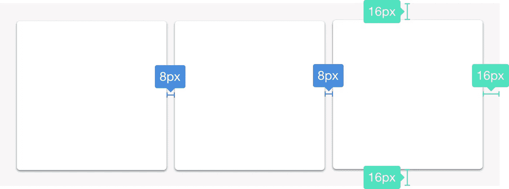
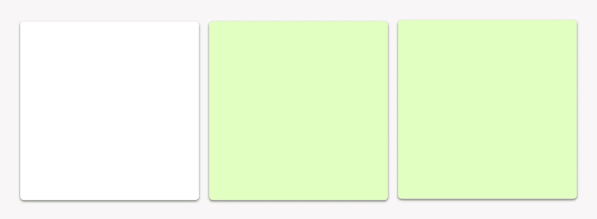
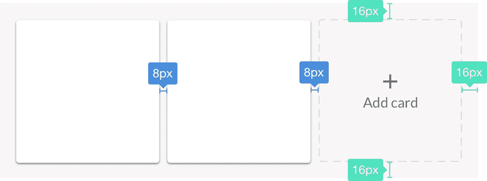
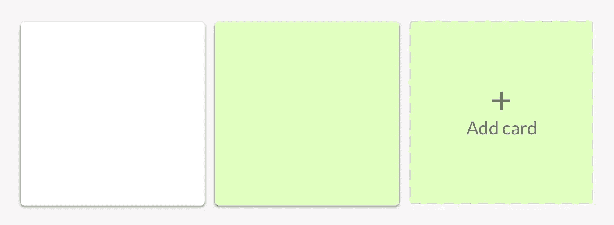

# 边距还是填充？

> 原文：<https://medium.com/hackernoon/margin-or-padding-f5252562313>

## 关于何时使用 which 的一些想法

*“我应该什么时候使用保证金？什么时候应该使用衬垫？这有关系吗？”*

我为这些问题纠结了太久。在写了大量难以维护且副作用很大的 [CSS](https://hackernoon.com/tagged/css) 之后，我想我终于找到了一些坚实的基本规则来回答这些问题。

我们来考虑一个典型的例子，大概是 2017 年我们每个做 UI 的人都遇到过的:卡片。



在本例中，我们可以识别两种不同的空间:

*   卡片之间的空间(蓝色)
*   卡片和容器之间的空间(绿色)

重要的是要理解这是两个不同的问题。它们的样式应该是分离的，这样我就可以将卡片和它们的容器之间的间距更改为 24px，而不会对卡片之间的间距产生副作用。

## 那么我们如何使用 CSS 实现这个例子呢？

实际上有一千种方法来实现这种带有边距和填充的[设计](https://hackernoon.com/tagged/design)，但是我将向您展示一种适当使用填充和边距的方法，它将允许我们稍后添加更多的卡片。

```
.container {
 padding: 16px;
}.card + .card {
 margin: 0 0 0 8px;
}
```

仅此而已。2 个选择器。2 规则。

## 但是,+是做什么的？🤔

**+** 是一个 CSS 选择器，称为*相邻选择器*。它将只选择紧接在前一个元素之前的元素。



The green elements are matched by the **adjacent selector** (+)

在我们的例子中，它将**选择前面有任何其他卡片**的任何卡片，如上图所示。因此，使用相邻的选择器，我们可以为除第一张以外的所有卡片添加左边距。

这意味着我们可以添加任意数量的卡，它们之间的间距始终为 8px🎉

现在想象一下，我们会在卡片旁边添加一些不是卡片的东西，比如“添加卡片”按钮:



如果我们看看我们的 CSS，我们可能不会给按钮*。卡*类，因为它不是卡。那现在怎么办？我们是否应该创造一个*。添加与*具有相同 margin 属性的卡*类。卡*类？不。有更好的方法。

## 切除脑叶的猫头鹰* + *

虽然这种模式听起来真的很搞笑，但它实际上非常有用，自从我学会它以来，我一直在使用它。这是它在我们的 CSS 中的样子:

```
.container {
 padding: 16px;
}/* can you see the lobotomised owl? 😜 */
.container > * + * {
 margin: 0 0 0 8px;
}
```

正如你之前所记得的，这个选择器会选择任何一张前面有其他牌的牌。现在选择器选择**前面的任何元素**——也包括按钮。



The green elements are matched by the **adjacent selector** (+)

# 结论

我希望这能让您更好地了解何时使用边距和填充来分隔容器中的内容。

综上所述，我将把上述示例的[笔](http://codepen.io/PhilippSpo/pen/oBrYGQ)和我使用的两条经验法则留给您:

**填充**:容器与其内容之间的间距。
**边距**:容器内部元素之间的间距。

*如果你喜欢这篇文章，请随意给它一个* ❤️ *并关注我的开发者之旅。*

[](http://bit.ly/HackernoonFB)[](https://goo.gl/k7XYbx)[](https://goo.gl/4ofytp)

> [黑客中午](http://bit.ly/Hackernoon)是黑客如何开始他们的下午。我们是阿妹家庭的一员。我们现在[接受投稿](http://bit.ly/hackernoonsubmission)并乐意[讨论广告&赞助](mailto:partners@amipublications.com)机会。
> 
> 如果你喜欢这个故事，我们推荐你阅读我们的[最新科技故事](http://bit.ly/hackernoonlatestt)和[趋势科技故事](https://hackernoon.com/trending)。直到下一次，不要把世界的现实想当然！

