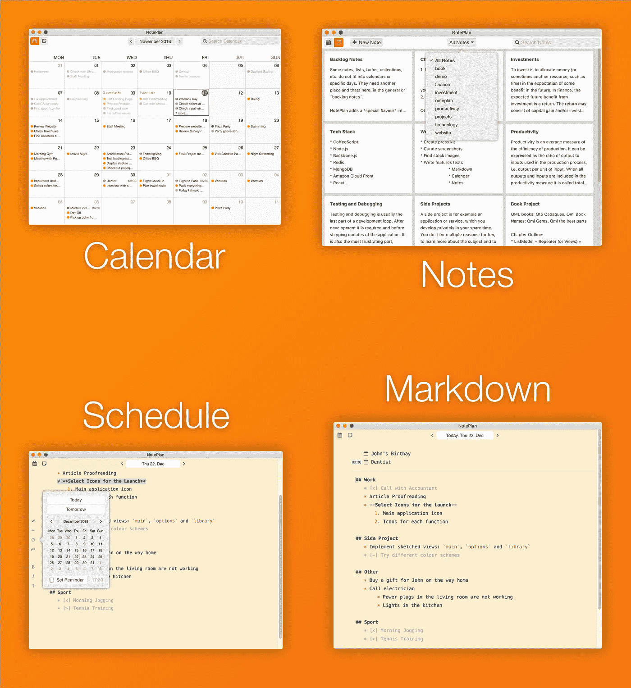

# Markdown +日历+笔记？

> 原文：<https://medium.com/hackernoon/markdown-calendar-notes-28b87f965e5d>

Image from [PixelBuddha](https://pixelbuddha.net)

## 日常计划

这是一个典型的自寻烦恼的兼职项目。我是一名工程师，经常忙于许多项目。我需要一个简单高效的应用程序来整理我的日常任务。有[很多 Todo app](https://www.process.st/checklist-app/)，可以管理任务，有的贵，有的免费。但是没有一个是集中在我需要的“*日报*”部分。

对我来说还行的单一系统是写在一个普通的纸鼹鼠皮日历上，每一页都是一天。我会写下接下来几天的任务，完成后核对一下。就像一个[子弹杂志](http://bulletjournal.com)。

## 降价

另一个让我抓狂的问题是，你必须以受限的方式将任务输入到常用的待办事项应用程序中。我知道 [Markdown](https://en.wikipedia.org/wiki/Markdown) ，我喜欢并经常使用它来记录 Slack 和 Trello 中的代码。它使你的文本样式非常非常简单。所以我决定用一个减价写作工具来跨越日历:

Markdown 有助于用项目符号记下任务并检查它们。将任务分成项目也非常简单。为一个特定的项目和下面的任务写一个标题。不是任务？没问题！有时候你只是想为当天添加一些评论，比如评论。然后它变得更像一本日记。设计自己的工作流程，不要被逼成一个！

以下是我添加到生产力标准降价中的内容:

[注册更新](http://eepurl.com/bVDiwT)并接受测试/试用。查看 noteplan.co 了解更多细节。

太棒了。

> [黑客中午](http://bit.ly/Hackernoon)是黑客如何开始他们的下午。我们是 AMI 家庭的一员。我们现在[接受投稿](http://bit.ly/hackernoonsubmission)并乐意[讨论广告&赞助](mailto:partners@amipublications.com)机会。
> 
> 如果你喜欢这个故事，我们推荐你阅读我们的[最新科技故事](http://bit.ly/hackernoonlatestt)和[趋势科技故事](https://hackernoon.com/trending)。直到下一次，不要把世界的现实想当然！

