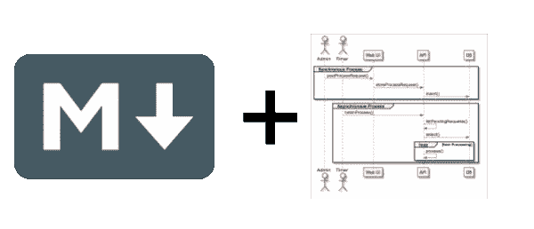
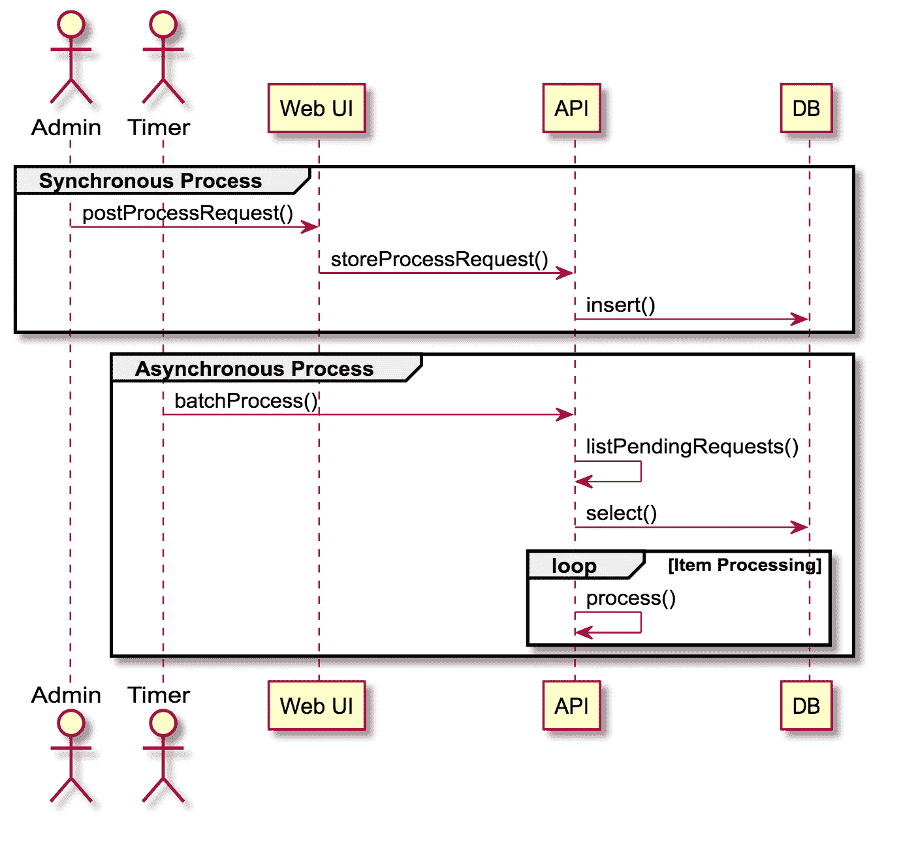
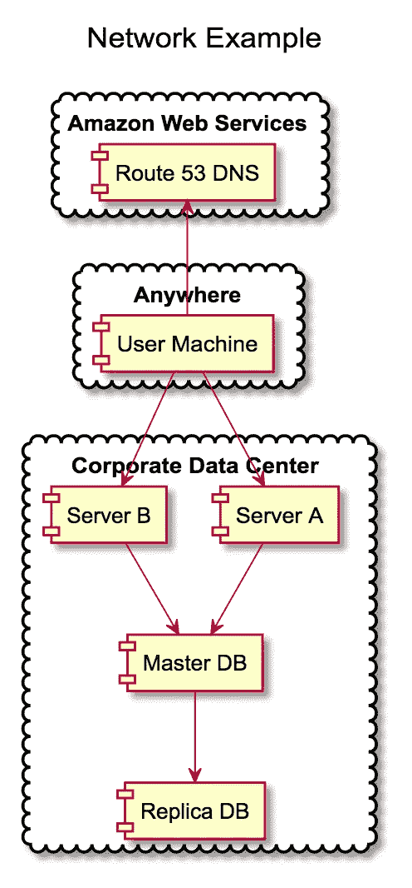

# 降价、代码块及其他:使用 PlantUML 的轻量级图表

> 原文：<https://medium.com/hackernoon/markdown-code-blocks-and-beyond-lightweight-diagramming-with-plantuml-9c8f2009cac0>

# 什么是降价

如果您已经熟悉 Markdown，请随意跳到下一部分。

[Markdown](https://hackernoon.com/tagged/markdown) 是一种简单的文档[标记语言](https://hackernoon.com/tagged/markup-language)，它实现了 HTML 中的“核心”格式特性。

它使得创建简单的文档文件(这篇文章的第一个版本就是用它创建的)变得非常容易，然后保存它，把它放在 git 上，控制变化，你明白了。

我喜欢认为它是一个“独立的”维基工具。你可以在没有任何服务器支持的情况下在你的项目中使用它，随时随地进行编辑。

您也不需要任何编译/构建步骤(与最近开发的一些项目文档生成器不同)。

# 版本和起源

有一些稍微不同的版本。最初的定义和发布在以下链接上:

 [## 大胆的火球:降价

### Markdown 格式语法的首要设计目标是尽可能地提高可读性。这个想法是…

daringfireball.net](https://daringfireball.net/projects/markdown/) 

您可以通过下面的链接查看语法示例:

[https://daringfireball.net/projects/markdown/syntax](https://daringfireball.net/projects/markdown/syntax)

# 如何充分利用它？

有几个插件、预览和语法包可以帮助你在你喜欢的 IDE/编辑器上开始使用它。

*   [原子](https://atom.io/packages/markdown-preview)
*   [月食](http://www.winterwell.com/software/markdown-editor.php)
*   [IntelliJ](https://plugins.jetbrains.com/plugin/7793-markdown-support)
*   [Visual Studio](https://code.visualstudio.com/Docs/languages/markdown)

它也在所有主要的编码社区上呈现:

*   [位桶](https://confluence.atlassian.com/bitbucketserver/markdown-syntax-guide-776639995.html)
*   [GitHub](https://guides.github.com/features/mastering-markdown/)
*   GitLab

# 只发文字很无聊，期待更多

使用 Markdown 一段时间后，您开始尝试更高级的功能。

Markdown 有一个内置的扩展语法(“代码跨度”):[https://daringfireball.net/projects/markdown/syntax#precode](https://daringfireball.net/projects/markdown/syntax#precode)

有了它，你就可以在 Markdown 文档中嵌入(任何编程语言的)代码。

这不仅可以用于文档。专门的工具可以读取这些代码，并采取额外的步骤(比如执行代码，并呈现代码的输出)。

仅举一个例子，下面的工具运行“R”块并生成结果报告:

 [## r 降价

### 利用 R Markdown 将您的分析转化为高质量的文档、报告、演示文稿和仪表盘。使用高效的…

rmarkdown.rstudio.com](http://rmarkdown.rstudio.com/) 

【http://rmarkdown.rstudio.com/gallery.html】例子:

*这种类型工具/技术通常被称为“笔记本”。类似工具:*

*   *Apache Zeppelin([https://Zeppelin . Apache . org/docs/0 . 7 . 0/interpreter/markdown . html](https://zeppelin.apache.org/docs/0.7.0/interpreter/markdown.html))*
*   *[Jupyter(http://Jupyter-Notebook . readthedocs . io/en/stable/examples/Notebook/Working % 20 with % 20 markdown % 20 cells . html](http://jupyter-notebook.readthedocs.io/en/stable/examples/Notebook/Working%20With%20Markdown%20Cells.html))*

# *图表呢？*

*如果有一种简单的语言，可以用来创建技术图表，而不需要四处拖放框或担心太多的细节，这不是很好吗？*

> *PlantUML 正是这样做的。*

*它定义了一种用于绘图的标记(人类可读语言),实现了其他技术绘图工具的基本功能。主要链接如下:*

*   *[PlantUML 主页——带有示例和规范的链接](http://plantuml.com)*
*   *[提供 PlantUML 支持的工具](http://plantuml.com/running)*

# *示例图*

*示例 1:*

**

*Sample sequence diagram*

*示例 2:*

**

*Sample component diagram*

# *如何让它们协同工作*

*在开源世界中，最好的选择可能是使用 Gravizo 生成的图像将 PlantUML 集成到 Markdown 中。*

*请点击此处观看演示:*

* [## htssouza/plantuml_with_gravizo

### plant UML _ with _ gravi zo-plant UML with gravi zo 样本

github.com](https://github.com/htssouza/plantuml_with_gravizo) 

在企业项目中，您可以在 Confluence 上直接使用 PlantUML:

 [## 汇流装置

### 添加各种 UML 图和其他图的宏

marketplace.atlassian.com](https://marketplace.atlassian.com/plugins/de.griffel.confluence.plugins.plant-uml/server/overview) 

您还可以在 Git 实验室服务器上设置集成:

[https://docs . git lab . com/ee/administration/integration/plant UML . html](https://docs.gitlab.com/ee/administration/integration/plantuml.html)

我希望这篇文章能帮助你在下一个项目中从 Markdown 获得更多！*