# 面向所有人的减价演示

> 原文：<https://medium.com/hackernoon/markdown-presentations-for-everyone-b5043a64ecea>

> 从创意到展示的最快方式。

[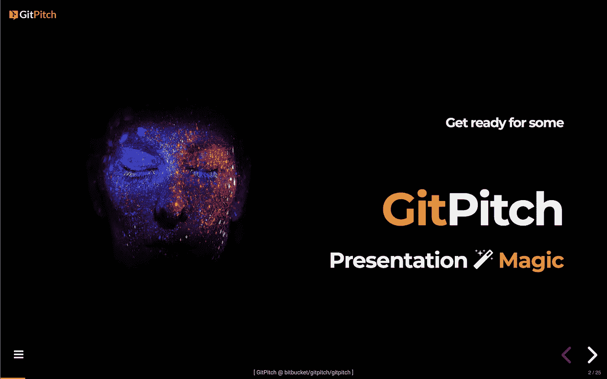](https://gitpitch.com/gitpitch/gitpitch)

欢迎来到我新博客上的第一篇文章，我计划在这里为 [GitPitch](https://gitpitch.com) 用户分享新闻、想法和技巧，并重点介绍一些由 GitPitch 社区创建的精彩演示。

如果您曾经在 GitHub、GitLab 或 Bitbucket 上使用过 Git，您可能已经熟悉了`**README.md**`约定。GitPitch 为 Git 用户引入了一个新的约定，即`**PITCHME.md**`约定。

GitPitch 将任何 Git 存储库中的`**PITCHME.md**` markdown 文件转化为现代的、响应迅速的在线或离线幻灯片演示。您可以使用您的幻灯片来宣传、推介或展示任何内容。

要在您的浏览器中通过实时 GitPitch 演示查看 GitPitch 介绍，请点击下图:

[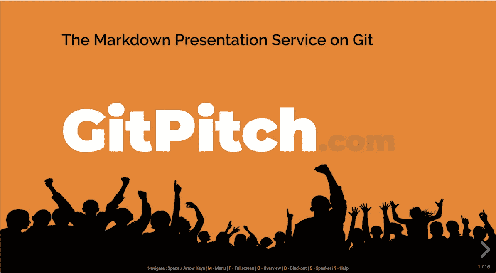](https://gitpitch.com/gitpitch/gitpitch)

[ Click on image to launch a live GitPitch introductory slide deck ]

# 为每个人**做减价演示**？

再简单不过了。要开始，没有注册。而且绝对不用安装。您只需使用您最喜欢的文本编辑器，在 Markdown 中编写您的演示内容。然后 *git-push* 到 GitHub、GitLab 或 Bitbucket 上的任何存储库。

> 为了更好地利用 GitPitch，请了解这些令人惊叹的 [pro 特性](https://gitpitch.com/featues)。

[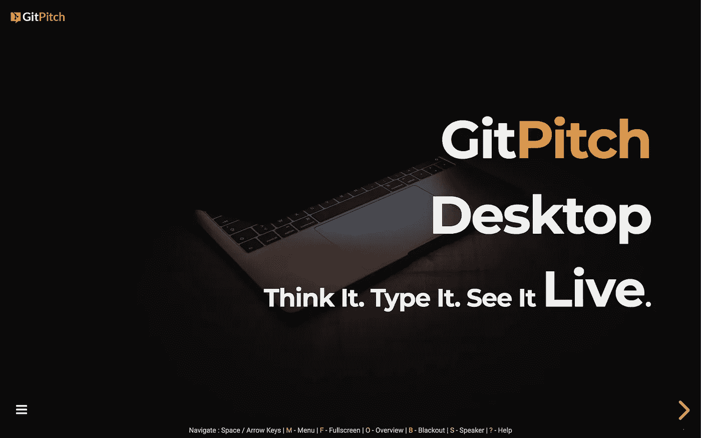](https://gitpitch.com/features)

# 降价展示**好处**？

*   GitPitch 让你完全专注于你的演示内容
*   将您的内容呈现为一个现代的、反应灵敏的幻灯片
*   它还使您的幻灯片可以立即在线共享
*   只需点击一下，您就可以将任何演示文稿打印成 PDF 格式
*   你也可以让你的幻灯片离线(用[演讲者笔记](https://gitpitch.com/docs/speaker-features/notes/))，这样*演示神*就不会在你下一次现场会议或聚会时破坏节目。
*   当您在 Git 下管理幻灯片内容和资产时，您将享受到版本控制、模块化和协作的所有好处

如果你有一个 [GitHub](https://github.com) 、 [GitLab](https://about.gitlab.com) 或 [Bitbucket](https://bitbucket.org) 账户，那么你就可以开始了。

# GitPitch 降价演示示例

为了让您了解 GitPitch 可以对您的简单 Markdown 内容做些什么，请点击以下任何一张演示截图，查看 GitPitch 社区成员已经创建了哪些内容:

[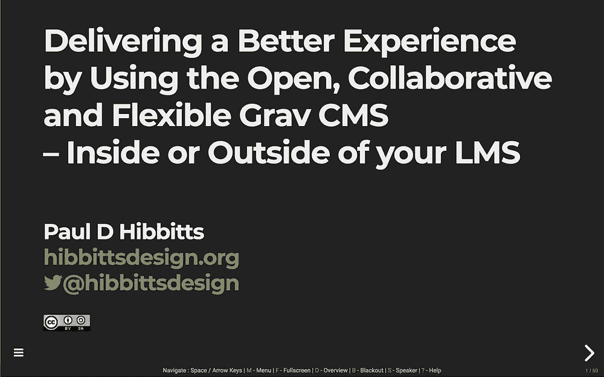](https://gitpitch.com/hibbitts-design/gitpitch/master?p=fol2018#/)[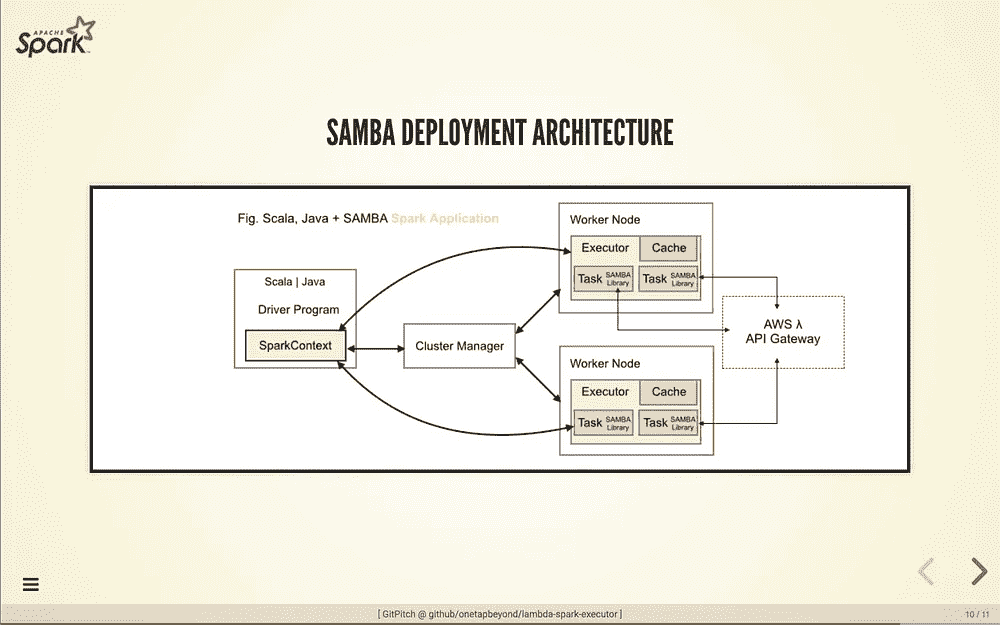](https://gitpitch.com/onetapbeyond/lambda-spark-executor#/)[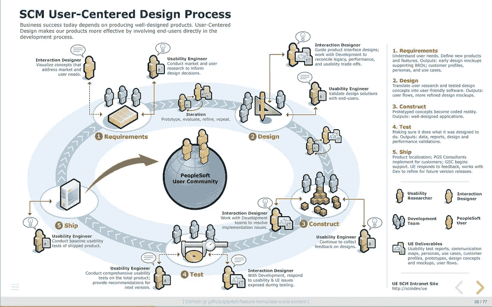](https://gitpitch.com/gitpitch/feature-demo/real-world-content#/)[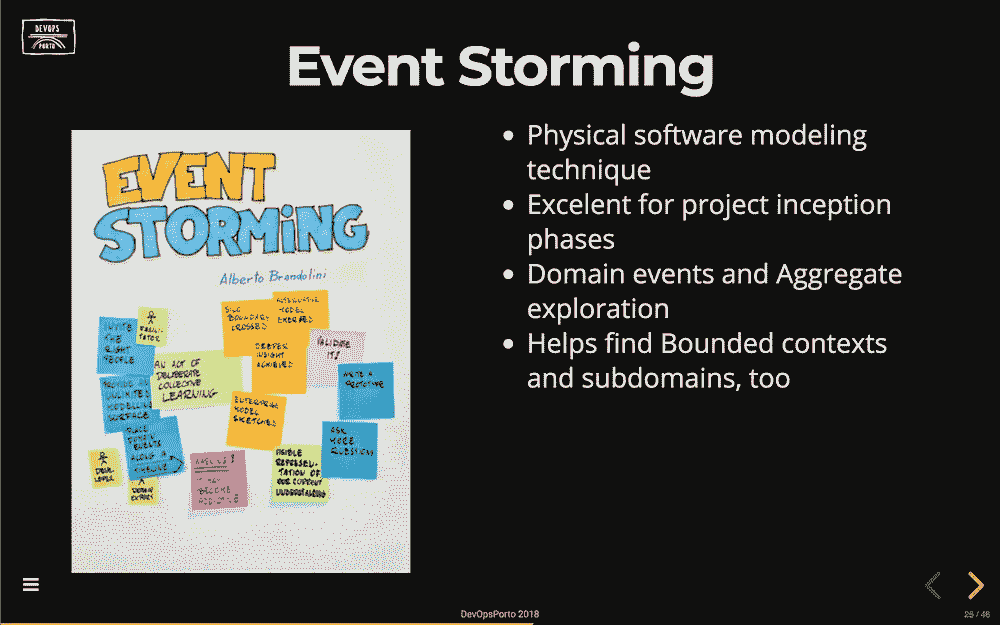](https://gitpitch.com/MiguelAlho/LearningChallenge2018#/)[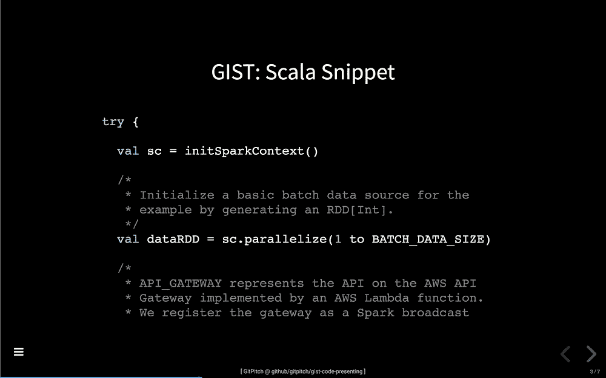](https://gitpitch.com/gitpitch/gist-code-presenting#/)[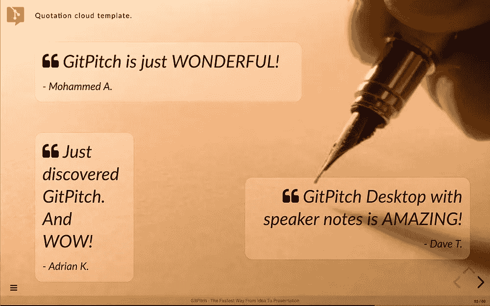](https://gitpitch.com/gitpitch/the-template)

# 现在轮到你了

希望现在你已经对 GitPitch 感到兴奋，并且认识到它可以帮助你制作和分享关于你关心的事物的美丽内容。

对于所有 GitPitch 演示文稿作者可用的幻灯片功能的高级浏览，请参见 GitPitch 功能页面[此处](https://gitpitch.com/features)。

如果你想直接进入主题，我建议从这个非常短的教程开始，**git pitch In-60 Second**。这里可以找到那个[。](https://gitpitch.com/docs/getting-started/tutorial)

[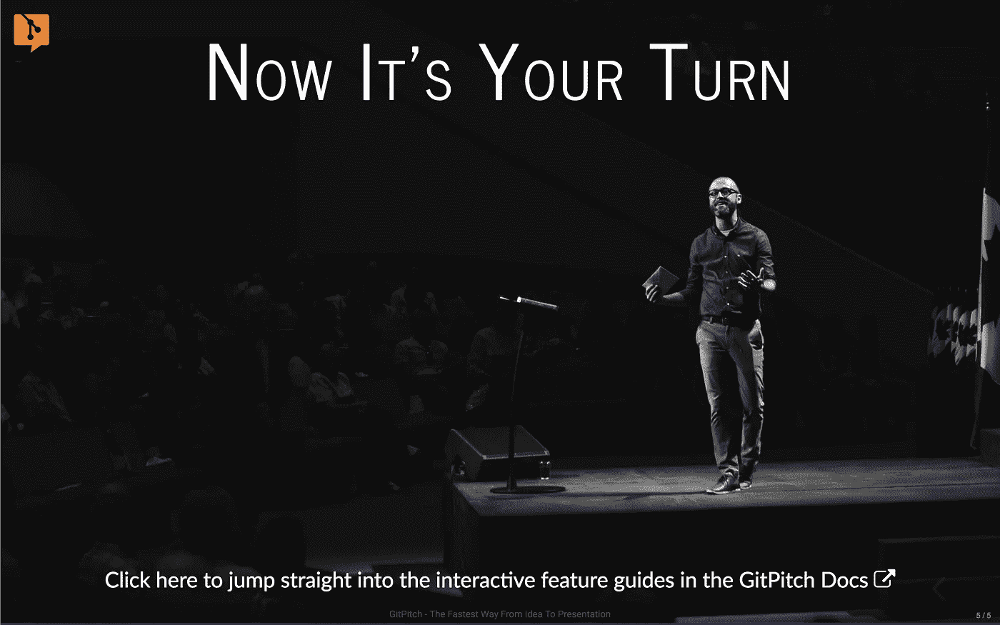](https://gitpitch.com/docs/getting-started/tutorial)

# GitPitch 背景故事

GitPitch 最初是一个开源项目[。这是我花了 20 多年作为开发人员和 It 顾问创造的东西。在此期间，我经常需要 ***向广泛的受众展示技术知识*** ，包括设计、框架、API 和各种技术。](https://github.com/gitpitch/gitpitch)

**我经常希望有一些真正简单而有效的方法来传递这些内容，使用我已经知道并喜欢的工具——Markdown 和 Git** 。

现在有了，叫 GitPitch:)。我希望你能像我创建它一样喜欢使用它。

在我结束之前，我想请你帮个小忙。如果你喜欢今天的这篇文章，请鼓掌表示你的欣赏👏对于这篇文章。

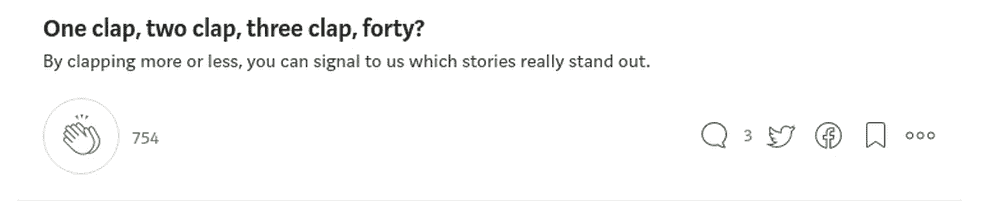

你的掌声有助于提升媒体上的文章。这也有助于其他人找到并阅读这篇文章。

如果你有任何问题或反馈，你可以在下面的评论区、推特或电子邮件联系我。更多详情请访问[网站](https://gitpitch.com)。

感谢您今天的阅读。欢迎大家。大卫。