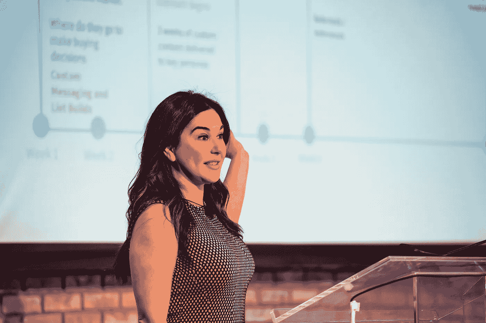

# 来自全球领先首席营销官的营销经验

> 原文：<https://medium.com/hackernoon/marketing-lessons-from-the-worlds-leading-cmos-91e1a0052c53>

Shopify，Slack，Jet，Spotify，Twilio，Casper，HubSpot，Oscar Health。在过去的九年里，一年一度的 FirstMark CMO 峰会吸引了来自开创性科技公司的营销领袖。作为我们公司每年举办的 100 多项活动之一，该会议聚集了来自全球各地的营销团队和财富 500 强高管。

我们听到专家们分享了他们对从营销自动化到战略信息等各方面的见解。以下是最重要的几点。

## **选择一个框架，任何框架**

金字塔、房子、圈子、阶梯……你的品牌框架的形式其实并不重要。重要的是你挑一个，花时间建立强大的品牌基础。这对早期阶段的创业公司来说尤其困难:为了测试和学习，有尽快进入市场的压力。

如果你打算扩大规模，花时间确定一个品牌的目的和文化是至关重要的。你需要这个基础来向你不断增长的观众传达一个清晰、持久的信息。你需要它来保持正轨。每一家快速发展的公司都不可避免地面临艰难的决策。了解你的品牌代表什么，可以让你的公司适应挑战，而不会违背你的核心承诺和失去客户的信任。

## **重新定义你的团队**

CMO·克雷格·米勒带领 Shopify 在短短三年内将月客户从 1.3 万增加到 13 万。他成功的关键？加入公司后，他将团队的名称和员工的头衔从 Marketing 改为 Growth。

> 不要想营销，要想成长。

这是一个影响巨大的简单举措。通过将头衔与他想要的结果联系起来，每个人都立即将他们的思想和精力重新集中在推动公司增长上，而不是执行与底线没有明确联系的营销任务(例如公关)。

## **小心闪亮的物体**

许多创业公司倾向于设定巨大的、可怕的目标。从理论上讲，力争上游是有道理的。然而，在现实中，团队经常花费他们所有的努力试图达到不可能的目标，而没有明显的进展。作为一名领导者，为你的团队设定雄心勃勃的目标是很好的——但要认识到实现这些目标的最佳方式是通过稳定的增量改进，而不是大规模的产品发布或网站重新设计。

> 正是这些渐进的变化最终带来了巨大的变化。

将您团队的营销工作分解为:

*   进入公司网站的流量
*   网站本身
*   该产品

专注于优化每一个阶段，每周优化 1%或 2%。更容易解决，你将每年翻倍。

## **从客户调查中获得更多收益**

不管你喜不喜欢，客户调查是收集数据的不可替代的方法。如果执行正确，您甚至可以训练客户回答重复的调查。3000 万次客户调查教会了 Price 一些关于优化的事情:

*   **长度:**非补偿形式的长度应该在三十秒到四分钟之间。四分钟后，响应质量显著下降。
*   **格式:**不要问开放式问题，使用 MaxDiff。也就是所谓的“最佳-最差比例”，这种框架迫使读者做出具体的决定。您收集的回答可以按等级和数量进行组织。您将节省时间，并保护自己免受代价高昂的客户偏好误报。

## **通过自动个性化提升性能**

新一波的技术和供应商正在改变个性化的可能性。由于像 Clearbit 和 Datanyze 这样的数据丰富服务，B2B 营销人员可以使用 IP 或电子邮件地址来找出谁是访问者。这些信息可用于为每位访问者个性化您公司的网站，优化网站副本和特色客户徽标等组件。发挥创造力，将这种个性化提升到一个新的高度。一个简单的电子邮件请求可以用来在你的网站上预先填写注册表格，减少摩擦，提高转化率。

## **信任基于信任的营销**

基于恐惧的营销活动可能会帮助你实现季度增长目标，但从长远来看，培养品牌信任会更有效。在消费者信任度已经很低的行业中尤其如此，比如健康保险。一项调查显示，他们的客户购买决定在很大程度上受到感知信任的推动，此后，Oscar Health 将营销工作的重点放在通过在广告中使用真实会员及其故事、开发高性能教育内容营销以及在其网站上展示数据丰富的医生简介来建立消费者的信任上。该方法适用于漏斗的每个阶段，提高了 WOM 的品牌认知度、有机流量和留存率。

如果提高品牌亲和力是你的团队的首要任务，那么确定你的产品中能鼓励客户信任的元素，并找出在你的营销工作中传达这些元素的方法。

## **尽你所能成为最好的营销人员**

总的来说，这是一条可靠的人生建议，但它尤其适用于营销人员。模仿像 Slack 这样成功的公司行之有效的营销策略是很有诱惑力的。但归根结底，每个营销团队都是独一无二的，由一家面临自身特定挑战的公司中独一无二的员工运营。因此，最重要的是，专注于成为营销自我的一流版本。建立一个一流版本的营销计划，与你的业务和你占领的市场联系起来。

*有兴趣向整个科技生态系统的高层领导学习更多吗？点击* [*此处*](https://community.firstmarkcap.com/) *加入 FirstMark 即将举办的活动，观看往期讲座。*