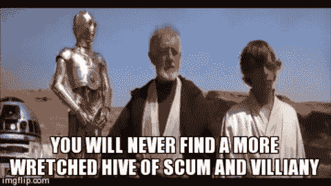
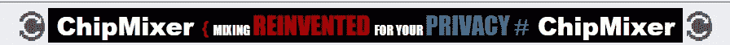

# 比特币谈话营销。什么会出错？

> 原文：<https://medium.com/hackernoon/marketing-on-bitcoin-talk-what-can-go-wrong-d6d5bd6c6174>

**免责声明:为了避免对整个社区进行定型，我不得不说 YMMV。我们的经历可能是一次性的，而不是常态。如果是这样的话，我希望在下面的评论中听到一些更好的故事。**

我最近参加了比特币对话上一个加密货币交易所( [Nexchange](https://nexchange.io/) )的营销活动。

对于那些不熟悉的人来说，比特币对话是一个比特币和加密相关的论坛，是最古老的论坛之一。

由于我们正在构建一个加密交换，BTCTalk 听起来像是一个吸引注意力的好地方。诚然，我们都是论坛的新手，没有线索，我们走进了一个肮脏的人渣和邪恶的蜂巢。嗯，算是吧。也许是我们自己的错。完整的故事，如下…

为了给你一个快速的纲要，让这篇文章更有教育意义，有几种在 BTCTalk 上营销的方法:

1.  首先，你可以做一些免费的事情。例如，你可以在[这里](https://bitcointalk.org/index.php?board=84.0)发布一个“服务公告”线程。这是我们做的第一件事，回想起来，也是我们在论坛上做的最好的营销。
2.  你可以出价把你的广告放在网站上。通常有一个每月线程运行感兴趣的各方可以把他们的出价。中标者可以做广告。很简单。我们没有走这条路。
3.  你可以开展一项名为“赏金运动”的活动，为执行某项行动的人支付报酬。例如，你可以向每周发布一定数量关于你的业务的帖子的用户付费。这是一个例子，说明了过去人们不以为然，但现在却司空见惯的事情。我认为这是一个伟大的工具，我希望我们已经做到了，但我们走了一条不同的道路。
4.  你可以做一些叫做“签名运动”的事情。这就是我们所做的，并且活着讲述了这个故事。

# 签名运动及其运作方式

签名活动的基本理念是招募论坛成员，并让他们通过在他们的用户资料上放置定制设计的签名和(可选)头像来代表您的企业。这个想法是，论坛访问者将开始注意到这些“广告”，并希望点击它们。

整件事是这样的，从开始到结束:

1.  首先，你可以为你的活动定制一个论坛签名。设计这些是一种“艺术形式”,通常会聘请论坛上的一位专门的签名设计师。此外，就像在任何老派论坛上一样，你发的帖子越多，你的“排名”就越高，你被允许拥有的签名也越详细。这就是为什么要做出不同的设计是很重要的，从为 Jr .会员设计的最简单的设计到为传奇会员设计的精致多彩的设计。

An example of a signature. I am in no way affiliated with ChipMixer. Nor do I want to be.

2.之后，你需要决定预算和结构。简单来说，活动参与者的报酬基于两个标准:成员的等级(等级越高=钱越多)，以及该成员佩戴您的活动签名在论坛上发布的高质量帖子的数量。是的，必须有人检查每个活动参与者的帖子，并确保它们符合标准。

3.一旦一切准备就绪，你就可以发帖宣布你的活动了。该线程将包含所有适用于您的活动的规则和限制，以及薪酬结构。如果你的活动足够吸引人，用户会通过回复你的原始帖子或给你发短信开始申请。

4.一旦你的活动开始，你将做日常维护。维护包括接受(和拒绝)申请人，监控支出，监督你的竞选成员(确保每个人都有他们的签名)。不要被骗了。这是大量的工作。

# 我们做错了什么。

1.  我们的营销进度落后了，希望尽快开始。结果我们没先学会诀窍就冲进去了。结果，我们的宣传活动最终比预期花费了更多的钱。
2.  我们犯了一个错误，没有从一开始就雇佣一个**优秀的**竞选经理。
3.  我们发了一个帖子来宣布这场运动。一天后，我们聘请了一位竞选经理，他马上告诉我们，我们的竞选糟透了(原因见第一条)，我们应该用新规则开一条新线索。相信专家，我们按他说的做了。然后，他告诉我们，我们做错了，因为我们忘记选择“自我调节线程”选项。没有它，他就不能删除所有的负面评论，因为我们在线程上的“不稳定”行为。所以我们创造了另一个。现在有三个线程充满了申请人，每一个都包含不同的规则，物流成了一场噩梦。不过，我们相信我们的经理会处理好的。
4.  论坛成员开始公开指责我们的“可疑”和“欺诈”行为(开放多线程，改变规则)。有人开设了一个针对我们的诈骗指控线程，这非常令人不安，因为我们没有诈骗任何人。我们也因为开设了一个“自我调节的主题”而开始受到抨击。很明显，这是个大禁忌。该死。
5.  我们开始收到来自各种论坛成员的要求，要求解雇我们的竞选经理，因为他“缺乏经验”，并雇用另一个人，确切地说是一个人。如果我们不遵守，我们被告知“我们在 BTCTalk 上的声誉将被摧毁”。诚然，我们的经理**缺乏经验，但他听起来不错，而且要价也不高，所以我们冒险一试。什么会出错？很多。**
6.  这就是事情变得真正有趣的地方。我们的竞选经理，让我们称他为“山姆”，告诉我们，论坛上有一些大人物的竞选经理，他们倾向于利用自己的影响力来击败新手经理，让他们出局，主要是通过破坏不雇用他或他的附属机构的竞选活动。“山姆”还告诉我们，BTCTalk 的“教父”是骗局指控线程和燃烧背后的家伙。
7.  后来，在没有和我们商量的情况下，“山姆”决定用一个不同的名字创建一个新账户，这一切都是为了制造一种假象，即我们屈服于论坛的要求，更换了我们的竞选经理。这更加激怒了已经恶化的社区。
8.  “Sam”请求访问我们的论坛帐户来“清理混乱”,因为没有直接访问我们的帐户，他无法编辑所有的活动主题。我们决定给他这个机会。
9.  在一个奇怪的(最终也是最后的)决定中，“山姆”亲自攻击了据称对我们所有麻烦负责的“教父”，并从我们的账户中用负面声誉**打击他。解释一下，BTCTalk 有一个声誉系统。您可以给其他用户正面或负面的声誉。声誉有助于区分好人和骗子。自然地，另一个家伙进行了报复，我们得到了-3 的负面声誉作为回报(这意味着我们有一个红色标签，上面写着“骗局，不要与该用户交易”，显示在我们的名字下)。**

# 我们是如何解决所有问题的…

这是最低点。

来自 BTCTalk 的流量已停止。

有一个以我们名字命名的诈骗指控线索。

我们的竞选主题充满了负面评论，而且每天都在增加。

我们的官方论坛用户帐户有-3 的负面声誉。我们所有的努力都是为了尽可能诚实地回答巨魔(嘿，我们其实没有诈骗任何人！)就像用勺子切生肉一样有效。以下是我们为扭转局面所做的努力:

1.  我们解雇了我们的竞选经理“山姆”，并接管了我们的竞选。由于他坦率的白痴行为，这是一个显而易见的。
2.  我们改变了我们的活动结构，使之更易于管理(每月支付，一次不超过 15 个成员……)。
3.  我们正式宣布，所有以前的活动线程现已关闭，只有每月活动是有效的。
4.  我们向现在关闭的线程支付了之前被“Sam”接受的每个人，并让他们离开。我花了一整天的时间列出了我们欠下的所有人的名单，并把工资和活动终止/道歉通知一起发给了他们。
5.  我联系了 BitcoinTalk 的“教父”,协商移除我们的负面代表，并关闭针对我们的诈骗指控线索。虽然他否认所有参与，但通过“与正确的人交谈”，他能够让骗局指控线索关闭，燃烧几乎完全停止。啊，他还消除了我们的负面影响。

仅此而已。随着诈骗线索的关闭和燃烧到一无所有，我们又开始从 BTCTalk 获得一些流量。

损害赔偿？一周 600 美元，我们这边有很多挫折。

课程？不要急于求成，先学会诀窍。雇佣合适的人。除非你完全知道自己在做什么，否则不要在 BTCTalk 上发起签名运动。疯狂，疯狂的社区。

*作者是*[*NEX change . io*](https://nexchange.io/)*以及各类创业公司的区块链产品顾问。*