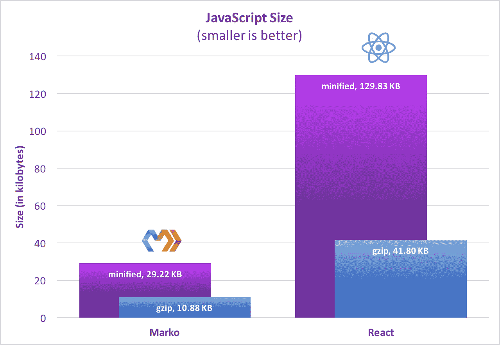

# Marko vs React:深度观察

> 原文：<https://medium.com/hackernoon/marko-vs-react-an-in-depth-look-767de0a5f9a6>


在这篇文章中，我们将从 Marko 维护者的角度，深入探讨一下 [Marko](http://markojs.com/) 和 [React](https://hackernoon.com/tagged/react) 之间的异同。

# 目录

[举例](#8b2d)[相同点](#f0a5)[不同点](#ed58)
[语法](#38a9)[组件](#67d6)[API](#ecfd)[自定义标签](#13c2)
[异步](#4355)[编译器](#9291)[工具](#7a82)[为什么 Marko？](#85c1)

从表面上看，Marko 和 React 有很多共同点，他们都在尝试解决非常相似的问题。具体来说，Marko 和 React 都允许开发人员基于 UI 组件构建 web 应用程序，并且都使开发人员不必编写代码来手动更新 DOM。虽然 Marko 中的许多功能都是受 React 的启发，但 Marko 和 React 提供了非常不同的可用性和性能特征。Marko 的设计避免了几乎所有的样板文件，并且更加符合 HTML。在几乎所有的情况下，一个 Marko UI 组件比它的 React JSX 等效组件需要更少的代码行，同时保持可读性，并允许与 JSX 一样的表达能力。此外，Marko 针对服务器和浏览器进行了高度优化，并且重量更轻:



因为 Marko [JavaScript](https://hackernoon.com/tagged/javascript) 库比 React 小得多，所以它需要更少的时间来加载和解析，这将极大地改善慢速连接或旧设备上的页面加载时间。基于[我们的基准](http://markojs.com/#benchmarks)，Marko 在服务器和浏览器上的表现都一直远远超过 React。

# 例子

下面的代码以一个有点做作的 UI 组件为例，强调了马尔科和反应 JSX 之间的一些差异:

## 反应 JSX

[▶ Try Online](http://codepen.io/mlrawlings/pen/wJXOWR?editors=0010)

## 马尔科

[▶ Try Online](http://markojs.com/try-online/?gist=8fe46bc5866605aca0dfeec202604011)

# 类似

Marko 和 React 有以下共同点:

*   基于 UI 组件
*   JavaScript 和 HTML 标记可以交织在一起
*   对 JavaScript 没有限制(使用 ES5 或 ES2015+，你自己选择)
*   浏览器中的虚拟 DOM 渲染
*   DOM 区分/修补用于协调视图
*   两者都支持键控元素匹配
*   UI 组件可以有输入属性
*   UI 组件可以有内部状态
*   对状态的更改会触发对 DOM 的异步更新
*   对 DOM 的更新是批处理的
*   与 Redux 和 MobX 等中央应用程序状态存储兼容
*   可以使用自定义标签嵌入 UI 组件
*   声明性事件绑定(不需要`domEl.addEventListener()`)
*   支持所有 DOM 事件
*   事件委托在内部用于冒泡的 DOM 事件
*   IE9+支持
*   UI 组件的类似生命周期事件
*   JSX 和马尔科都编译成 JavaScript

# 差异

以下是一些高层次的差异:

## 渲染差异

*   **性能提升:** Marko 在浏览器中渲染成虚拟 DOM，直接在服务器上渲染成 HTML 流(Marko 支持多个编译目标)。
*   **改进的性能:** Marko 支持异步渲染，对 HTML 进行 [*早期刷新*，以改善实际和感知的页面加载时间。](http://www.ebaytechblog.com/2014/12/08/async-fragments-rediscovering-progressive-html-rendering-with-marko/)
*   **改进的性能:**如果页面最初在服务器上呈现，而 Marko 没有，React 需要额外的客户端重新呈现。
*   **改进的易用性:** Marko 自动序列化 UI 组件状态并输入到浏览器，这样浏览器就可以从服务器停止的地方重新开始。
*   **改进的易用性:** Marko 适合在服务器上呈现一个完整的 HTML 页面，并支持标签，如`<doctype>`和`<html>`。

## 语法上的差异

*   **改进的易用性:** Marko 使用了 [HTML-JS](http://markojs.com/docs/syntax/) 语法，React 提供了 [JSX](https://facebook.github.io/react/docs/jsx-in-depth.html) 语法。
*   **改进的易用性:** Marko 支持简洁的语法和熟悉的 HTML 语法。
*   改进的易用性: JSX 要求严格的 XML，而 Marko 符合 web 开发人员习惯的不太严格的 HTML。
*   **改进易用性:**有了 Marko，*所有的* HTML 属性值都解析为 JavaScript 表达式。
*   改进易用性: Marko 支持简单的条件指令、循环指令等。
*   **JSX 限制:** JSX“只是 JavaScript ”,但是在某些地方需要排除使用 JavaScript 语句的表达式，比如`if/else/for`。

## 编译中的差异

*   **性能提升:** Marko 支持多种编译输出(目前支持 Marko VDOM 和 HTML 流)。
*   **改进易用性:** Marko 将 UI 组件编译成 JavaScript 模块，这些模块导出一个渲染 API。
*   **扩展功能:** Marko 支持一个健壮的 API 来控制定制标签和定制属性如何被编译，并且它支持基于友好的抽象语法树(AST)的编译时转换。
*   **改进的性能:** JSX 只是一个语法糖，它将元素翻译成`createElement()`函数调用，而 Marko 编译器完全控制如何编译和优化。
*   **改进的易用性:** React 要求所有的 UI 组件在被用作定制标签之前被显式导入，而 Marko 同时支持显式导入和隐式导入。
*   **改进的性能:** Marko 有一个模块化的运行时，编译器生成的代码只导入 Marko 运行时中更小构建所需的部分。
*   **改进的易用性:** Marko 支持可选的编译时检查，以确保只将允许的属性传递给定制标签。(React `PropTypes`仅在渲染时提供验证)
*   **改进易用性:** Marko 在编译时验证*所有的*标签名。
*   **改进易用性:** Marko 提供了自己的编译器，集成了 Node.js 和 JavaScript 模块捆绑器，而 React JSX 需要巴别塔和自定义巴别塔转换。

## 用户界面组件的差异

*   **精简样板:**Marko 中没有 JavaScript 类的显式扩展(与 React 中的`class Counter extends React.Component`相反)。
*   **改进易用性:**UI 组件状态的修改与 Marko 同步，而[React 的规则更复杂](https://facebook.github.io/react/docs/state-and-lifecycle.html#state-updates-may-be-asynchronous)。
*   **改进易用性:** Marko 观察 UI 组件状态对象，允许直接修改状态(例如`this.state.count++`)。
*   **改进易用性:** Marko 支持结合 JavaScript 行为、CSS 样式(支持 CSS 预处理程序)和 HTML 标记的单文件 UI 组件。(React 需要使用 JS 解决方案中众多 [CSS 中的一个，如果你想要样式和你的组件在同一个文件中，并且社区中没有标准)](https://github.com/MicheleBertoli/css-in-js)
*   **改进的可维护性:** Marko 支持从单文件 UI 组件到多文件 UI 组件的无缝转换。
*   **性能提升:** Marko 默认假设 UI 组件是纯的，当输入属性和状态不变时跳过重新渲染(React 需要扩展 [React。PureComponent](https://facebook.github.io/react/docs/react-api.html#react.purecomponent) )。

## 事件系统的差异

*   **降低复杂度:** React 利用[合成事件](https://facebook.github.io/react/docs/events.html)而 Marko 利用真实 DOM 事件。
*   **改进的易用性:**定制事件使用 Marko 中的 [EventEmitter API](https://nodejs.org/api/events.html) 发出(例如`this.emit('myCustomEvent', arg1, arg2)`)。
*   **改进的易用性:** Marko 有一个一致的方法来监听本地 DOM 事件和自定义事件。
*   **改进易用性:** React 需要传递自定义事件的`Function`引用，而 Marko 自动将发出的自定义事件委托给组件上的事件处理程序方法。
*   **改进的易用性:** Marko 提供了一个简单的机制，用于将额外的参数绑定到事件处理方法，而`this`将成为组件实例。

## 兼容性的差异

*   **马尔科限制:**马尔科不支持类似 React Native 的原生移动(虽然使用马尔科 VDOM 渲染，这是可能的)。
*   **Marko 限制:** Marko 要求在浏览器中使用 JavaScript 模块捆绑器(如 [Lasso](http://markojs.com/docs/lasso/) 、 [Webpack](http://markojs.com/docs/webpack/) 、 [Rollup](http://markojs.com/docs/rollup/) 或 [Browserify](http://markojs.com/docs/browserify/) )，因为 Marko UI 组件向下编译为 JavaScript 模块。(我们认为使用 JavaScript 模块捆绑器是最佳实践)

在下面几节中，我们将仔细研究 Marko 和 React 之间的一些差异。

# 句法

Marko 和 React JSX 都允许将 HTML 标记和 JavaScript 合并到一个文件中，并且都支持基于 UI 组件构建 web 应用程序。Marko 使用 HTML-JS 语法，而大多数 React 应用程序使用 JSX 语法。

> React JSX 让 JavaScript 更像 HTML，Marko 让 HTML 更像 JavaScript。

最终，Marko 和 React 都允许 JavaScript 和 HTML 交织在一起。

# 语法:属性

## 反应 JSX

在 React JSX 中，所有属性值都被解析为字符串值，除非使用了`{}`。

## 马尔科

使用 Marko，*所有的*属性值都被解析为 JavaScript 表达式。下面的马尔科码相当于上面的反应 JSX 码:

# 语法:内联 JavaScript

## 反应 JSX

React JSX 从 JavaScript 开始，允许 XML 元素内联，如下所示:

## 马尔科

Marko 从 HTML 开始，但是它允许 JavaScript 以一种干净和可维护的方式内联。与其他模板语言不同，Marko 的目标是发挥 JavaScript 的全部能力。下面的马尔科码相当于上面的反应 JSX 码:

前缀为`$`的行被直接添加到编译后的`render()`函数内的编译后的 JavaScript 输出中(对于每次渲染都应该运行的 JavaScript 代码)。前缀为`static`的行被直接添加到`render()`函数之外的编译后的 JavaScript 输出中(对于在加载模板时只应该运行*一次*的代码)。

# 语法:HTML 支持

有了 Marko，任何有效的 HTML 标记都可以在 Marko 模板中使用。React 不是这种情况。以下引文来自 [React 文档](https://facebook.github.io/react/docs/introducing-jsx.html#specifying-children-with-jsx):

> **警告:**
> 
> 由于 JSX 比 HTML 更接近 JavaScript，React DOM 使用`camelCase`属性命名约定，而不是 HTML 属性名。
> 
> 比如`class`变成了 JSX 的`[className](https://developer.mozilla.org/en-US/docs/Web/API/Element/className)`，`tabindex`变成了`[tabIndex](https://developer.mozilla.org/en-US/docs/Web/API/HTMLElement/tabIndex)`。

由于 React 的这个警告，[用于将 HTML 转换成 JSX 的工具出现了](http://magic.reactjs.net/htmltojsx.htm)。

## 反应 JSX

## 马尔科

# 语法:条件句

JSX 是 JavaScript 之上的语法糖，但是它需要表达式，所以像`if/else/for` 语句这样的简单东西在 JSX 元素中不能独立工作。因此，您必须使用三元表达式、立即调用的函数表达式、函数调用表达式或实验性的`do {}`表达式(撰写本文时为 0 阶段)。这对 Marko 来说不是问题，像`if()`和`for()`这样的指令可以在任何地方使用，如下所示:

## 反应 JSX

## 马尔科

Marko 还允许将指令用作更精简的模板的属性:

# 语法:循环

## 反应 JSX

## 马尔科

# 语法:HTML 速记

Marko 支持一种基于 CSS 选择器的速记，代码更少。

React 不支持这些有用的快捷键。

# 语法:简洁

Marko 支持一种简洁的语法，去掉尖括号和结束标记，支持缩进。下面是 Marko 语法选项的比较:

## Marko HTML 语法

## Marko 简明语法

## Marko 混合语法

HTML 语法和简明语法可以一起使用:

## 反应 JSX

React 不提供简洁的语法。

# 成分

Marko 从简单的 HTML 开始，并允许 UI 组件逻辑轻松地分层。

## 反应 JSX

React UI 组件通常实现为扩展`React.Component`的类:

React 还支持更简洁的功能组件:

但是，如果需要状态或生命周期事件，则功能 UI 组件必须转换为类组件:

## 马尔科

这是马尔科的相同部分:

可以很容易地将行为添加到任何 Marko UI 组件中:

Marko 还允许 JavaScript 行为、CSS 样式和 HTML 标记作为单个文件 UI 组件嵌入 Marko 模板中:

# 应用程序接口

Marko 将组件编译成 JavaScript 模块，这些模块导出用于呈现组件的 API，如下所示:

相同的 UI 组件可以被呈现给诸如可写 HTTP 响应流的流:

> Marko UI 组件的用户不需要知道该组件是使用 Marko 实现的。

以 React 为例进行对比:

最重要的是，React 需要导入不同的模块来在服务器上呈现完全相同的 UI 组件:

# 自定义标签

## 反应 JSX

使用 React，UI 组件的所有自定义标记都必须显式导入:

## 马尔科

Marko 支持一种基于项目目录结构为 UI 组件自动发现定制标签的机制。Marko 沿着目录树向上查找所有的`components/`目录，它还会自动查找由已安装的软件包导出的自定义标签。这种方法不需要显式导入定制标记来减少 Marko 模板中所需的代码量。例如，给定以下目录结构:

```
.
├── components/
│   ├── hello.marko
│   └── good-bye.marko
└── index.marko
```

嵌套在`components/`目录下的`<hello>`标签和`<good-bye>`标签将自动对根节点的`index.marko`可用；

这种方法还允许编辑器和 ide 为定制标签提供自动完成功能。

# 异步ˌ非同步(asynchronous)

即使渲染已经开始，Marko 也允许使用下面的 Marko 模板所示的`[<await>](http://markojs.com/docs/core-tags/#codeampltawaitgtcode)`标签异步渲染部分视图:

# 编译程序

Marko 根据是在服务器上使用还是在浏览器中使用来编译模板。例如，给定以下模板:

## 为服务器编译:

## 为浏览器编译:

# 编译时代码转换

Marko 编译器是为了支持定制标记的编译时代码生成器而构建的，它还提供了对编译时转换的支持。虽然 Babel 允许 JavaScript 的代码转换，但 Marko 编译器支持以声明方式解析自定义标记，Marko AST 提供了非常强大和简单的转换，如以下代码所示，用于在编译时*将 Markdown 呈现为 HTML:*

**components/markdown/code-generator . js:**

然后可以使用`<markdown>`标签，如下所示:

在这个例子中，模板编译后，在渲染时不再需要标记为的[库。](https://github.com/chjj/marked)

# 工具

Marko 和 React 提供了各种开发工具。 [Marko 开发者工具](https://github.com/marko-js/marko-devtools)在不断发展，但 Marko 目前提供了单元测试 UI 组件、预编译`.marko`文件和生成无配置 app 的工具(类似于 [create-react-app](https://github.com/facebookincubator/create-react-app) )。目前，还没有 Marko 开发者工具与浏览器集成，但这是我们希望在未来看到的。我们将在以后的文章中更详细地介绍 Marko 开发者工具。

## IDE 和编辑器支持

Marko 在所有主流 ide 和编辑器以及 GitHub 上提供了语法高亮。Marko 为 Atom 编辑器提供了一流的语法高亮支持，[自动完成【HTML 和定制标签，](https://github.com/marko-js/atom-language-marko#autocomplete) [Hyperclick](https://github.com/marko-js/atom-language-marko#hyperclick) 快速跳转到引用的文件和方法，[漂亮打印](https://github.com/marko-js/atom-language-marko#prettyprint)保持代码可读。

# 为什么是马尔科？

以下是你应该考虑使用 [Marko](http://markojs.com/) over React 的几个理由:

*   马尔科需要更少的样板文件。
*   根据我们的基准测试，Marko 的表现要好得多。
*   Marko 提供了一种简洁而强大的语法，它与 HTML 保持一致，同时也允许 JavaScript 的全部功能。
*   Marko 具有低得多的复杂性和非常小的运行时间。
*   Marko 的页面权重要低得多，以实现更快的页面加载。
*   Marko 与 Node.js 紧密集成。
*   Marko 允许极其强大的 IDE 和编辑器插件(参见 Atom 的 [Marko 插件作为例子)。](https://github.com/marko-js/atom-language-marko)
*   Marko 有一个强大的编译器，它允许添加新的特性而不会引起膨胀。
*   易贝非常依赖 Marko，它正被用来建设 ebay.com(包括移动网络)。
*   Marko 在 GitHub 和 Gitter 上都有一个强大且不断壮大的社区。

有兴趣了解更多关于 Marko 的信息吗？如果是这样，您可以在 [Marko 网站](http://markojs.com/)上获得更多信息。加入对话，在 [GitHub](https://github.com/marko-js/marko) 上投稿，在 [Twitter](https://twitter.com/MarkoDevTeam) 上关注我们。

如果你喜欢这篇文章，请点击下面的❤️按钮。

*如果您想在 Medium 上了解更多关于 Marko 的信息，请单击我的个人资料旁边的“* ***关注*** *”按钮。*

[](http://bit.ly/HackernoonFB)[](https://goo.gl/k7XYbx)[](https://goo.gl/4ofytp)

> [黑客中午](http://bit.ly/Hackernoon)是黑客如何开始他们的下午。我们是 AMI 家庭的一员。我们现在[接受投稿](http://bit.ly/hackernoonsubmission)并乐意[讨论广告&赞助](mailto:partners@amipublications.com)机会。
> 
> 如果你喜欢这个故事，我们推荐你阅读我们的[最新科技故事](http://bit.ly/hackernoonlatestt)和[趋势科技故事](https://hackernoon.com/trending)。直到下一次，不要把世界的现实想当然！

