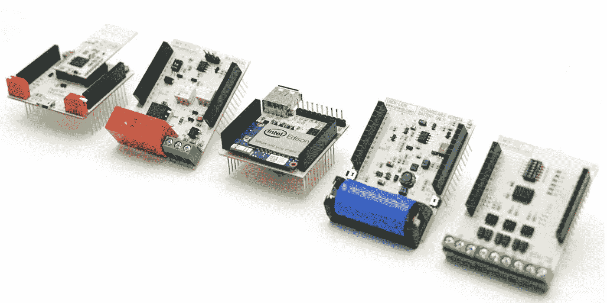
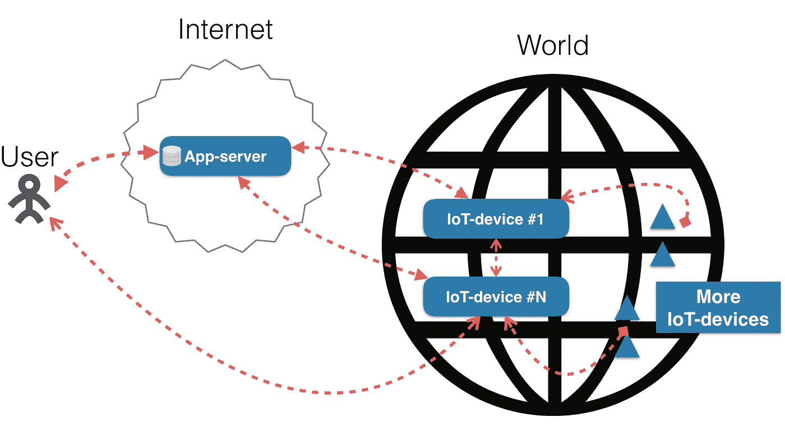
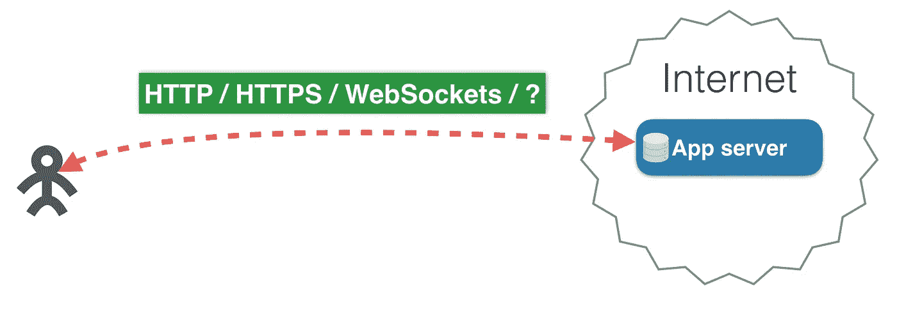
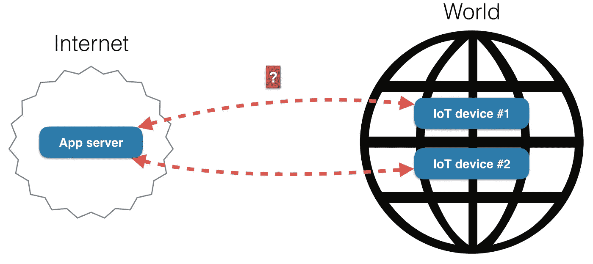
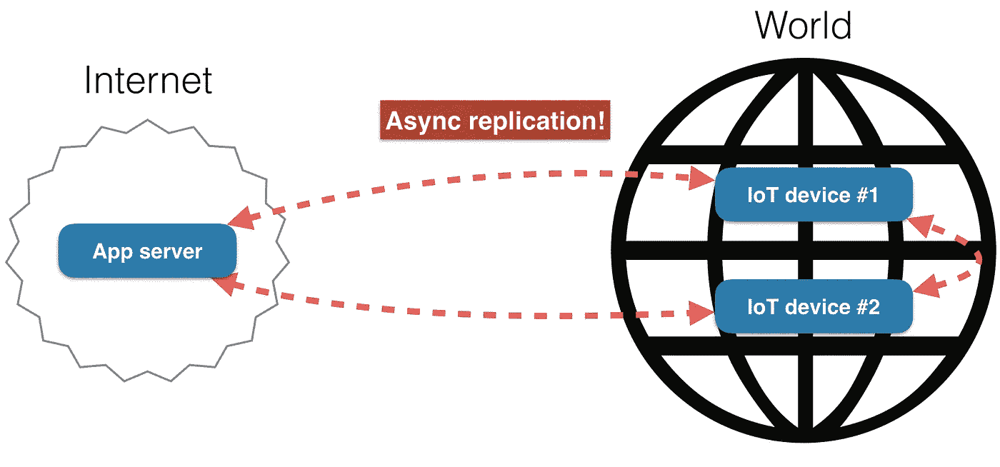
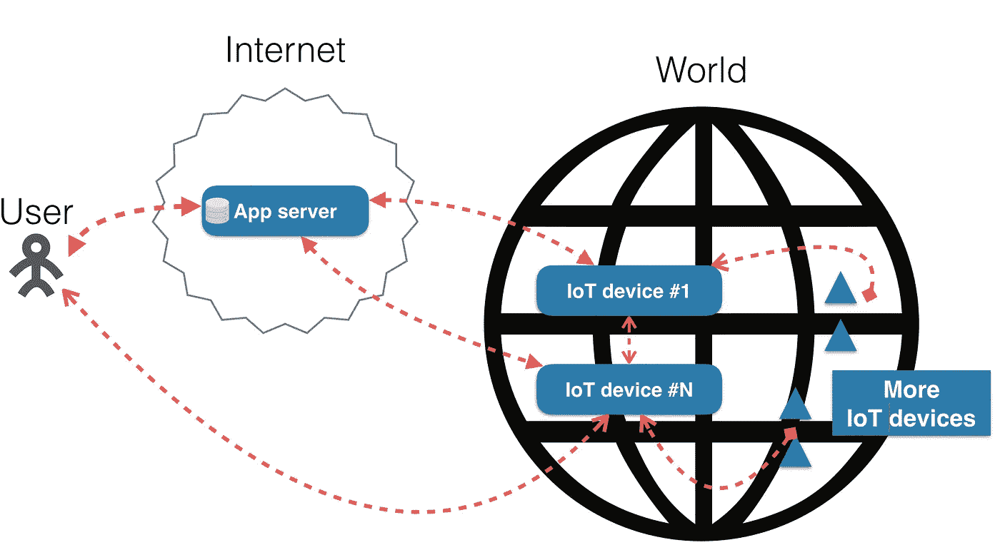
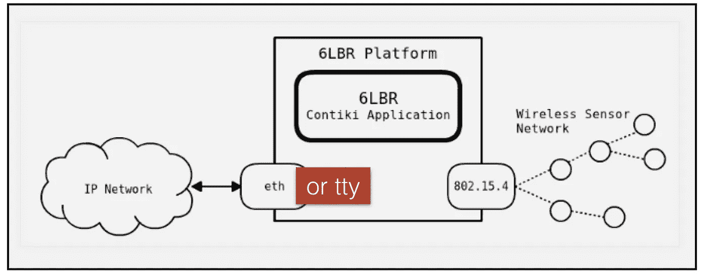
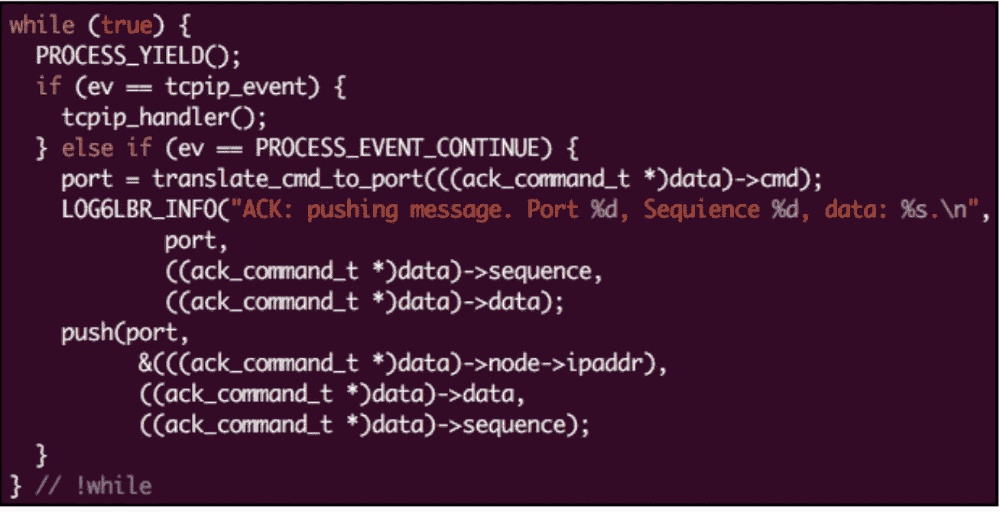
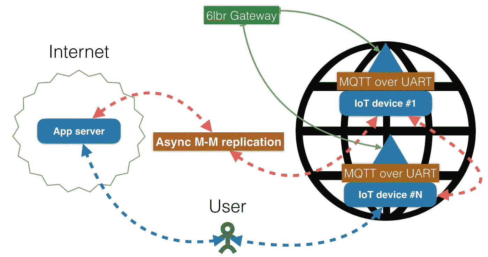

# 每个物联网设备和云之间应用的主-主复制和扩展

> 原文：<https://medium.com/hackernoon/master-master-replication-and-scaling-of-an-application-between-each-of-the-iot-devices-and-the-69c286f1b0d3>

Photo showing the devices used for prototyping. As you can plainly see, I’m using Intel Edison, as it supports many microcomputers, like MIPS, ARM and so on.

在这篇文章中，我想与你分享我是如何解决一个非常有趣的问题，即在物联网设备和云应用程序之间同步数据。

我将从概述我的项目的总体想法和目标开始。然后我将更详细地描述我的实现。这将是一个技术上更先进的部分，我会谈到 Contiki OS，数据库，协议等。最后，我将总结我用来实现整个系统的技术。

> **项目概述**

所以，先说一下大概的思路。

这里有一个图解说明整个系统的最终状态:

我有一个用户可以通过云服务或直接(通过 Wi-Fi)连接到物联网设备。

此外，我在云中的某个地方有一个应用服务器，而云本身在互联网上的某个地方。这个云可以是任何东西——例如，AWS 或 Azure 实例，或者它可以是专用服务器，它可以是任何东西:)

应用服务器通过某种协议连接到物联网设备。我需要这个连接来在应用服务器和物联网设备之间交换数据。

物联网设备以某种方式相互连接(比如，通过以太网或 Wi-Fi)。

此外，我有更多的物联网设备生成一些遥测数据，如光线或温度读数。可以有 100 多个甚至 1000 多个设备。

基本上，我的目标是让云和这些物联网设备之间的数据交换成为可能。

在继续之前，让我概述一下我的系统的一些要求:

*   *它应该在物联网设备之间同步数据。*
*   *它应该从物联网设备收集数据。*
*   *它应该在物联网设备和云之间同步数据。*

> **实施**

这非常简单:用户通过 HTTP(S)或 WebSocket 或类似的协议连接到应用服务器。

好吧，给你一个小测验。您认为可以使用什么将应用服务器连接到物联网设备？

如果你想到了 MQTT，那你肯定是对的！选择 HTTP(S)的人也是如此。事实上，它可能是任何协议！就选一个然后搞定它。

我的选择是异步复制！我说的是数据库中常见的复制。

你可能想知道复制是如何帮助我的。基本上，复制是为了同步数据而存在的。因此，我可以在所有设备上维护相同的数据库，包括云和物联网设备。

不过，复制很难实现。如果您想要复制，您需要有一个支持它的数据库。因为复制是数据库的一个自然特性。

在这里，我想说一下我为这个项目考虑的数据库: [SQLite](https://en.wikipedia.org/wiki/SQLite) 、 [Redis](https://en.wikipedia.org/wiki/Redis) 、 [MySQL](https://en.wikipedia.org/wiki/MySQL) 、 [PostgreSQL](https://en.wikipedia.org/wiki/PostgreSQL) 和 [Tarantool](https://en.wikipedia.org/wiki/Tarantool) 。

我比较了它们的特征，并尝试在物联网设备上直接运行其中的一些(MySQL 和 PostgreSQL 除外)，并希望分享我得到的结果。

SQLite 绝对是在物联网设备上直接存储数据的好选择，但它没有复制功能，也不真正支持不同进程的并发访问。

Redis 不支持主-主复制，所以它不能解决我的问题，因为我需要双向复制。

MySQL 和 PostgreSQL 对于一个物联网设备来说太重了。我甚至没有试图安装它们。但是如果你决定尝试 MySQL 或 PostgreSQL，请在下面的评论中分享你的经验。

我名单上的最后一个数据库是 Tarantool。事实上，我是 Tarantool 项目的委托人，所以我知道开发它的人。当然，这对我来说是一个很好的选择，因为我很了解这个项目。当然，Tarantool 有主-主复制。你也可以用它来尝试其他的东西。我在这里的主要观点是，物联网设备可以通过主-主复制来利用真实数据库进行数据传输。

但是到目前为止，我们只是触及了表面，所以现在让我们更深入地研究实现。

我先说我和塔兰图尔的问题。

首先，Tarantool 不能在 ARMv7 架构上工作。更糟糕的是，Tarantool 无法在 32 位环境中运行(只有 64 位)。

我设法解决了这些问题，我想分享我的开发规则，这些规则帮助我完成了这件事:

1.  ***为 CMake 使用工具链文件。*** *否则，你会像我一样浪费很多时间修补你的 CMake 文件。*
2.  ***不要使用无符号和其他没有指定大小的类型。libc 对此有特殊的类型，比如 uint32_t。否则，你会得到未定义的行为。这条规则只适用于 C/C++代码。***
3.  ***移植你的自动测试。*** *你应该期待你的自动测试可以在物联网设备上执行。否则，您将花费大量时间来修复 bug。*

好的，我有一个主-主复制的工作数据库。到目前为止一切顺利！我的下一步是通过 [6LoWPAN](https://en.wikipedia.org/wiki/6LoWPAN) 连接运行这个数据库的设备。

回想一下，我在一个 6LoWPAN 网络中有许多互联的物联网设备。我需要收集他们所有的遥测数据。

Here’s a brief visual explanation of how this whole setup works

带有传感器的设备通过无线电波传输遥测数据。这个标准被称为 6LoWPAN，是低功率无线个人区域网上 IPv6 的首字母缩写。

我想指出的是，我没有使用[劳拉茵](https://en.wikipedia.org/wiki/LPWAN)。不过，我将来可能会用到它。在本文中，我将只关注 6LoWPAN。

因此，遥测数据由网关收集，网关是系统的重要组成部分。网关是一种 MIPS 设备，提醒您一下，MIPS 是一个处理器家族，它有一个 WAN 天线，用于收集通过无线电波传输的数据。此外，网关安装了 6LBR 软件，帮助将通过无线电波接收的数据转换为 IPv6 数据包。

> **6LBR 应用**

上图说明了 6LBR 的工作流程。安装了 6LBR 软件的网关是无线传感器网络和任何其他网络之间的转换器。

此图显示了从无线传感器网络到 IP 网络的转换，因为这是 6LBR 的默认行为。我将在后面解释如何改变这种行为。

欲了解更多信息，请查看此链接至 [6LBR GitHub 页面](https://github.com/cetic/6lbr)。

你可能会问，“6LBR 到底为我做了什么？”

首先，它给了我一个 IP 栈，所以我可以在我的 6LBR 应用程序中使用 TCP 和 UDP 栈的所有特性。

第二，我可以用 6LBR 使用任何 I/O 设备。比方说，我可以将原始数据直接写入 bash =)

遗憾的是，6LBR 不能直接写入 MQTT。MQTT 经纪人对原始数据一无所知。可悲，但却是真的！

但是为什么我首先需要直接写给 MQTT 代理呢？答案是遗产。

这里我想说几句 6LBR 的应用。

一般来说，6LBR 应用程序是带有 6LBR API 的 C 代码，允许使用 IP 堆栈和做其他事情。开发这样的应用程序与至少两个主要困难相关联:复杂的线程模型和复杂的内存模型。也就是说，如果你想创建一个 6LBR 应用程序，你必须准备好许多 segfaults。

下面是我的 6LBR 应用程序的一个片段(抱歉，我只能给出一个模糊代码的截图，真实的源代码是封闭的):

注意这里有一件有趣的事情— PROCESS_YIELD()。6LBR 具有协作式多任务处理，这意味着 6LBR 应用程序必须让步，并且它们在每次循环迭代中都这样做。代码不应该运行太长时间。

让我们回顾一下目前项目的进展情况。

6LBR 网关使我能够创建一个网状网络，因此我可以在其中读取和写入数据。此外，我能够将 IP 包包装到 MQTT 消息中，每个消息都包含有关设备的信息，包括遥测数据。此外，我有能力操纵输入输出设备。例如，我能够将 MQTT 消息写入 UART。但随后我面临一个新问题:Tarantool 不与 MQTT 经纪人合作。

我是这样解决这个问题的。

我决定使用用普通 C 语言编写的 MQTT 库[libmosquito](https://mosquitto.org/man/libmosquitto-3.html)，作为将 MQTT 集成到我的应用程序中的一种简单且可移植的方式。

下面的代码片段展示了如何使用这个库来处理 MQTT 消息([链接](https://github.com/tarantool/mqtt)):

我可以引用一个套接字文件句柄，并使用我自己的事件循环来处理一些事件。很好，对吧？

我想提醒你注意一个事实，那就是 [Tarantool](/) 也有协同多任务处理功能，和 6LBR 一样。对于产量，Tarantool 使用 coio_wait()。

哦，忘了说 [Tarantool](https://github.com/tarantool/tarantool) 是 Lua 应用服务器。惊喜！

所以，为了在 Lua 中使用这段代码，我移植了 libmosquitto。

下面是一个例子，我调用了你在前面的代码片段中看到的函数:

另外，我从 libmosquitto API 移植了所有函数。你可以在这里查看这个端口[。这里有一个如何使用的](https://github.com/tarantool/mqtt)[示例](https://github.com/tarantool/mqtt/blob/master/examples/producer_consumer_queue.lua)。

为了从网状网络中的所有设备获取数据，我需要从特定位置调用 subscribe()函数并发布 get()方法。这就是与网状网络中的设备进行通信所需的一切！

> **总结**

现在让我们来看看最终的设置:

应用服务器通过 Tarantool 的主-主复制进行连接。这给了我两个特点:

1.  当应用服务器更改任何数据集时，这些更改将被传送到网络中的所有物联网设备。
2.  当物联网设备更改任何数据集时，这些更改将被传送到应用服务器。

这两个特性是我问题的解决方案。

此外，我可以通过主-主复制连接我的物联网设备。这将它们和云捆绑成一个集群，允许我同步所有数据集。所有物联网设备和云在大部分时间都是同步的，除非连接中断。但一旦备份，它们会很快再次同步。是不是很酷！

6LBR 网关允许在我的物联网设备和其他物联网设备之间交换数据集。它将每个消息包装成一个 MQTT 消息，并将它们传递到一个 UART 通道。

安装了 MQTT 代理的 IoT 设备#N 从 UART 通道读取这些消息。MQTT 代理通过 MQTT 连接将消息重定向到 Tarantool。Tarantool 读取它们，然后 Tarantool 的应用服务器为每条消息执行一些代码。

物联网设备#N 通过 Tarantool 的主-主复制连接到所有其他设备。云与每个物联网设备也通过 Tarantool 的主-主复制连接在一起。

好了，这就结束了！我已经设法解决了这个问题，我真的希望我的经验能在将来帮助你。重申一下，我使用 Tarantool 作为专用服务器的主前端和应用服务器。如果你感兴趣并想了解更多，查看这篇[文章](https://hackernoon.com/shrink-the-number-of-tiers-in-a-multitier-architecture-from-5-to-2-c59b7bf46c86#.3uwawab8w)。

敬请期待更多精彩内容！

> [黑客中午](http://bit.ly/Hackernoon)是黑客如何开始他们的下午。我们是 [@AMI](http://bit.ly/atAMIatAMI) 家庭的一员。我们现在[接受投稿](http://bit.ly/hackernoonsubmission)并乐意[讨论广告&赞助](mailto:partners@amipublications.com)机会。
> 
> 如果你喜欢这个故事，我们推荐你阅读我们的[最新科技故事](http://bit.ly/hackernoonlatestt)和[趋势科技故事](https://hackernoon.com/trending)。直到下一次，不要把世界的现实想当然！

