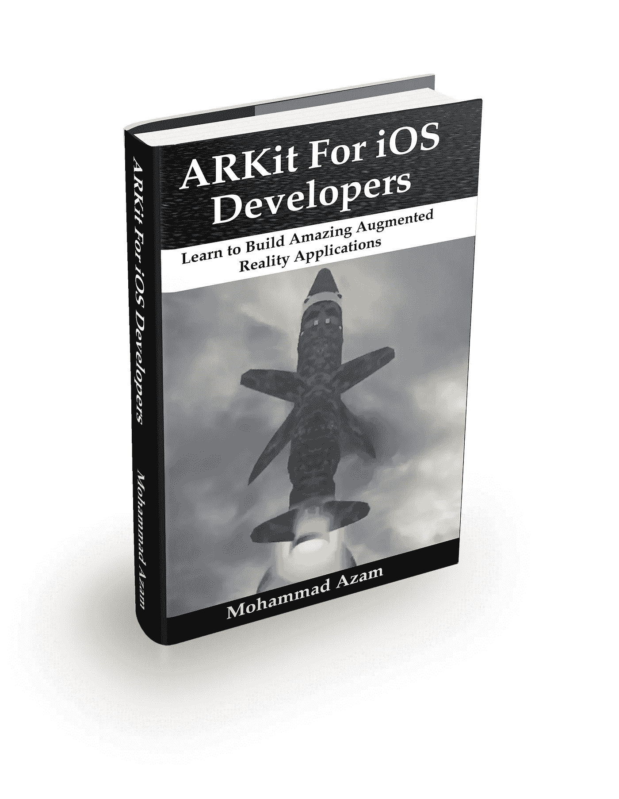

# 掌握 iOS 的 ARKit

> 原文：<https://medium.com/hackernoon/mastering-arkit-for-ios-dd47ff6bef23>

我非常兴奋地宣布，我为 [iOS](https://hackernoon.com/tagged/ios) 设计的课程“掌握 [ARKit](https://hackernoon.com/tagged/arkit) 现在可以在 Udemy 上使用了。本课程涵盖了所有您需要了解的关于构建惊人的 ARKit 应用程序的知识。

查看以下课程宣传片:

我相信你和我一样对 ARKit 感到兴奋。不要等待片刻，使用以下链接注册“掌握适用于 iOS 的 ARKit”课程。

 [## 为 iOS - Udemy 掌握 ARKit

### 为 iOS 构建惊人的增强现实应用

www.udemy.com](https://www.udemy.com/mastering-arkit-for-ios-using-swift/?couponCode=ILOVEARMEDIUM) 

我还在写一本名为《面向 iOS 开发者的 T4 ARKit》的书。每周我都会发行这本书的一章。[取书](https://gum.co/QOIq)。