# 掌握 Chrome 开发工具:下一级前端开发技术

> 原文：<https://medium.com/hackernoon/mastering-chrome-developer-tools-next-level-front-end-development-techniques-4755649d96ec>

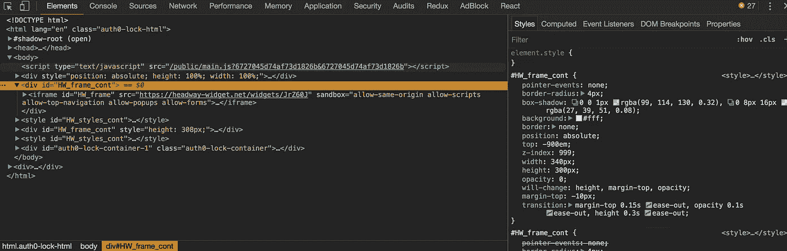

你可能已经熟悉了 Chrome 开发者工具的基本特性:DOM 检查器、样式面板和 JavaScript 控制台。但是有许多鲜为人知的功能可以极大地改善您的调试或应用程序创建工作流程。

# 黑暗主题

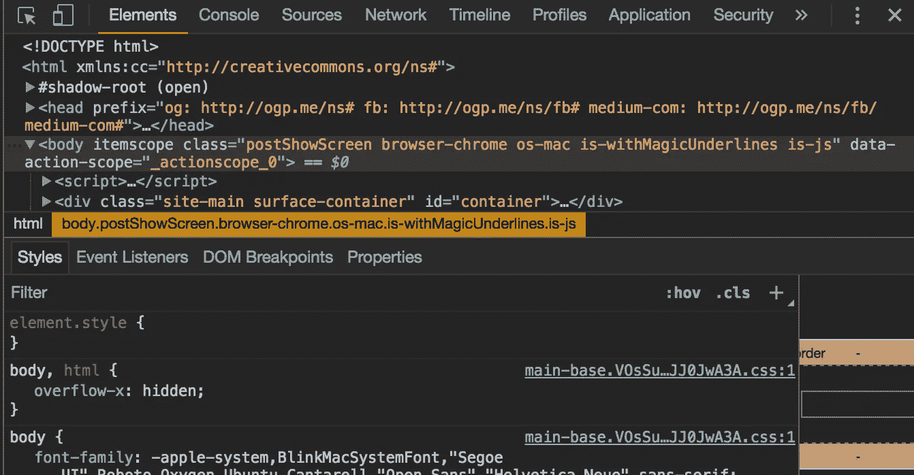

Chrome 为开发工具提供了一个内置的深色主题。你可以通过点击开发工具窗格右上角的三个点图标，点击“设置”，然后切换主题来启用它。

我有时觉得这样看起来更舒服，而且，很明显，看起来更酷:)

# 选择模式

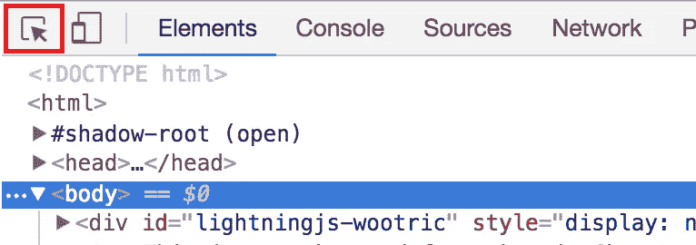

Chrome 开发者工具(DevTools)提供了多种选择元素的方式——其中最方便的是选择模式。

这个工具是通过按下开发工具面板左上角的鼠标图标激活的(或者用 cmd + shift + c ),让您只需点击它们就可以选择页面上的元素。

激活后，您可以在页面上移动鼠标并预览选择，然后单击选择要检查的元素。

这个工具非常适合快速选择页面上的元素，因为点击 cmd + shift + c 将打开开发工具并直接进入选择模式。

# 存储为全局变量

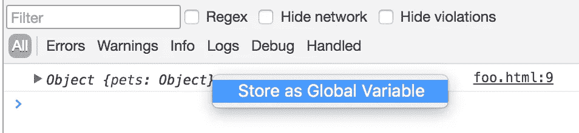

如果记录到控制台的复杂对象有许多键，或者包含难以手动解析的值，那么检查这些对象有时会很棘手。幸运的是，Chrome 使得用 JavaScript 检查这些对象变得很容易。

为此，右键单击控制台中的一个对象，然后按“存储为全局变量”。这将对象存储为一个全局变量，可在名为`temp1`的控制台中访问，然后您可以使用 JavaScript 对其进行操作。

# 动画工具

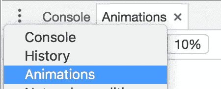

最近，Chrome 团队为调试和创建动画增加了许多新功能。

单击控制台左上角的下拉菜单会显示一个“动画”窗格，允许您限制站点上所有动画的速度。

您也可以暂停所有动画。这对于一个充满动画内容的网站尤其有用。

The animations viewer lets you individually control the curve for each property

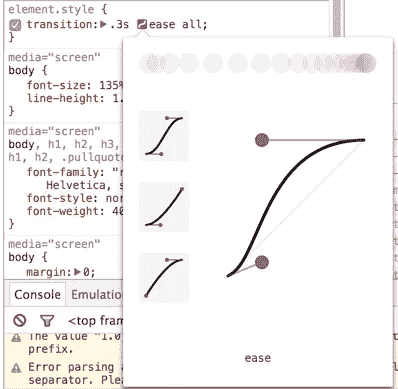

CSS animation controller

单击元素的`transition`属性中的紫色曲线图标，可以查看动画的运动曲线，并微调其属性。此外，您可以使用箭头图标滚动预设动画列表，以应用于您的元素。

# 模拟元素伪状态

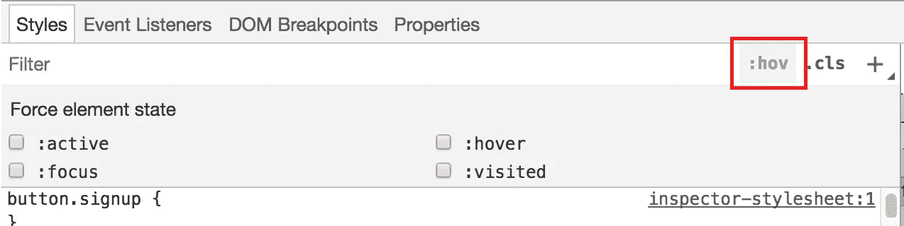

另一个方便的设计元素样式的工具是元素状态模拟器，通过点击样式面板右上角的`:hov`图标可以访问它。

该工具允许您模拟悬停、活动、聚焦和已访问的元素伪状态，以及与这些选择器相关联的视图样式。

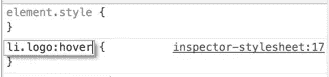

要为这些伪状态添加样式，添加一个新的选择器(带有`+`图标)并将`:<state>`添加到选择器字符串的末尾。

例如，要将悬停规则添加到具有类`logo`的`li`，创建一个新的选择器`li.logo:hover`，并在那里添加样式。

然后，您可以通过检查`:hover`元素状态来模拟悬停在元素上，从而测试您的样式。

# 美化 CSS 和 JavaScript

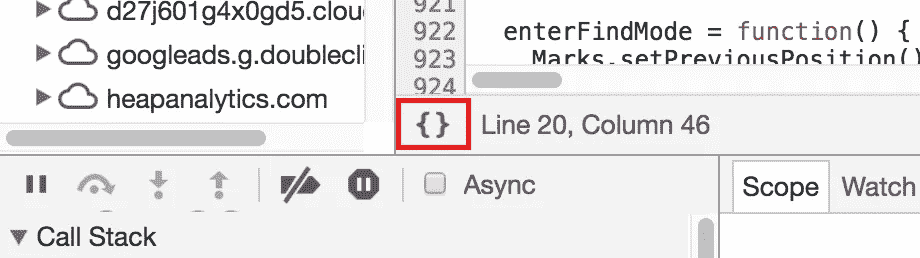

调试或查看缩小的 JavaScript 和 CSS 非常困难。但是幸运的是，DevTools 提供了一个工具，可以让这个工作变得简单一些。

在“Sources”标签中打开一个缩小的文件后，你可以点击文件左下角的括号标志，DevTools 会“美化”代码。

这对于 CSS 文件来说工作得很好，对于 JavaScript 来说也做得不错，尽管在缩小过程中丢失了一些信息(比如变量名)。

# Alt +向上/ Alt +向下

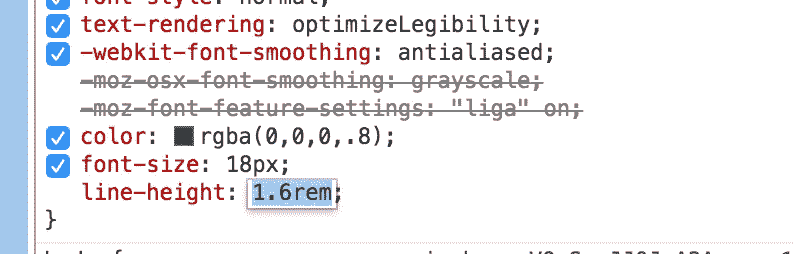

调试 CSS 时，您可以选择一个属性并使用向上/向下键来调整它的值。默认情况下，箭头键通过+/- `1`调整值。但是，通过按住`alt`键，您可以使用箭头键以`0.1`的步长微调数值，这在处理小数值时特别有用。

相反，您可以按住`shift`以`10`的步长调整数值。

# 保留日志

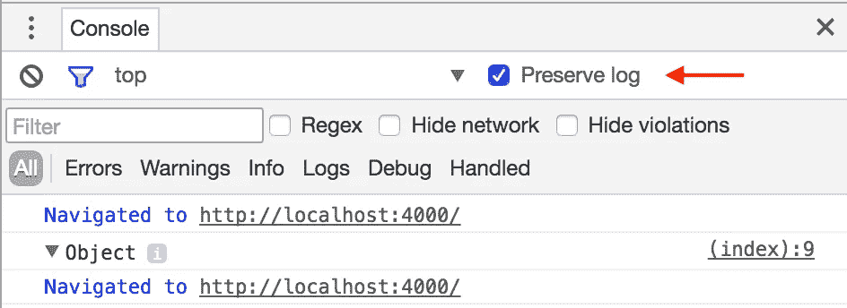

保留日志是一个复选框，允许您在页面刷新之间保留日志。这在调试需要您刷新页面的网站问题时非常有用，因为否则会清除所有控制台输出。

启用此选项时，控制台中会出现一种新类型的“导航”日志，以显示页面刷新或导航到不同页面的事件。

# 网络+日志过滤器

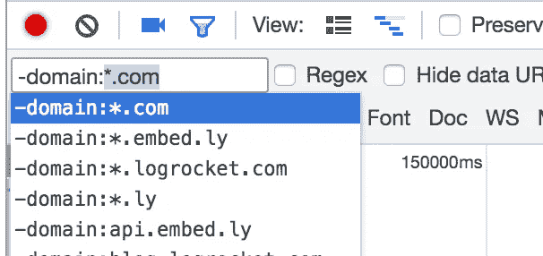

调试具有大量网络请求或控制台日志的应用程序时，过滤特定类型的事件会很有用。

Chrome 有一种过滤语言，支持许多不同的属性，以及像`*`这样的操作符来进行通配符匹配。

如果你输入“-”，Chrome 将显示一个 typeahead，显示你可以过滤的各种属性。您还可以打开“正则表达式”模式，对每行中显示的数据进行正则表达式匹配。

# 代码覆盖率

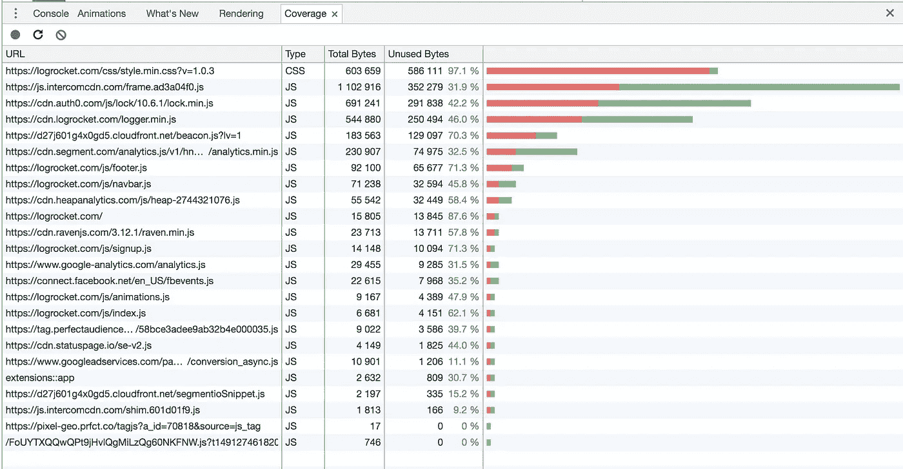

代码覆盖率允许您运行您的 web 应用程序，然后对于每个 JavaScript 和 CSS 文件，查看哪些代码行运行了，哪些没有运行。这是很有帮助的，因为当在一个复杂或长期的项目中工作时，很容易积累死代码。

要使用它，请确保您有 Chrome 59 或更高版本，并前往“覆盖范围”标签。按“录制”，然后开始使用您的应用程序。当你完成时，Chrome 会向你显示你会话期间运行的确切代码。

# 生产中的调试问题

DevTools 只有在你自己的机器上运行你的应用时才有效。如果你对理解用户在生产中看到的错误和性能问题感兴趣，试试 [LogRocket](https://logrocket.com) 。

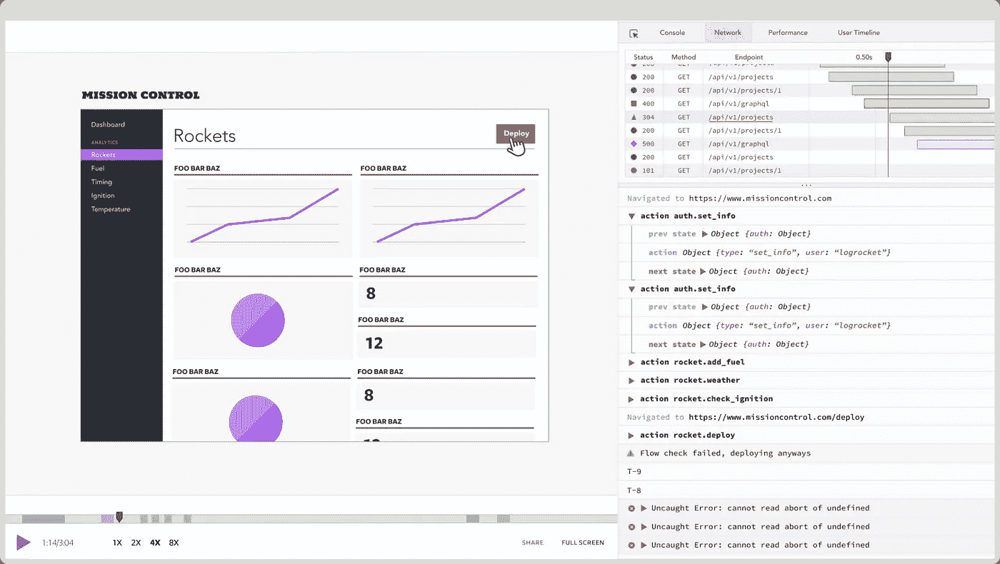

[LogRocket](https://logrocket.com) 是一个前端日志记录工具，可以让你回放问题，就像问题发生在你自己的浏览器中一样。LogRocket 不需要猜测错误发生的原因，也不需要向用户询问截图和日志转储，而是让您重放会话以快速了解哪里出错了。它可以与任何应用程序完美配合，不管是什么框架，并且有插件可以记录来自 React、Angular 和 Vue.js 的额外上下文。

LogRocket 让你的应用程序记录控制台日志、带有头+主体的网络请求/响应、浏览器元数据、Redux 动作/状态和性能计时。它还记录页面上的 HTML 和 CSS，甚至可以重建最复杂的单页面应用程序的像素级完美视频。

你可以[在这里](https://logrocket.com/)查看 LogRocket。

 [## JavaScript 应用程序的日志记录和会话重放

### LogRocket 帮助您了解影响用户的问题，以便您可以重新开始构建优秀的软件。

logrocket.com](https://logrocket.com) 

感谢阅读。我希望这些先进的 DevTools 技术能帮助你更轻松地构建更好的应用程序。

> [黑客中午](http://bit.ly/Hackernoon)是黑客如何开始他们的下午。我们是 [@AMI](http://bit.ly/atAMIatAMI) 家庭的一员。我们现在[接受投稿](http://bit.ly/hackernoonsubmission)并乐意[讨论广告&赞助](mailto:partners@amipublications.com)机会。
> 
> 如果你喜欢这个故事，我们推荐你阅读我们的[最新科技故事](http://bit.ly/hackernoonlatestt)和[趋势科技故事](https://hackernoon.com/trending)。直到下一次，不要把世界的现实想当然！

