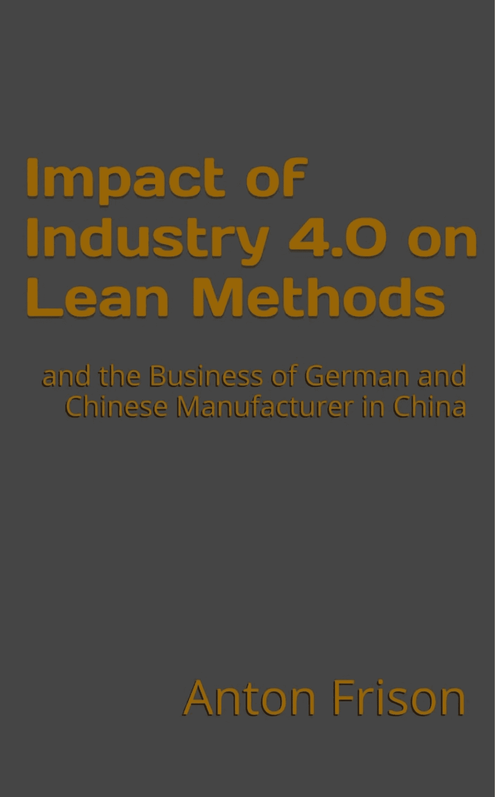
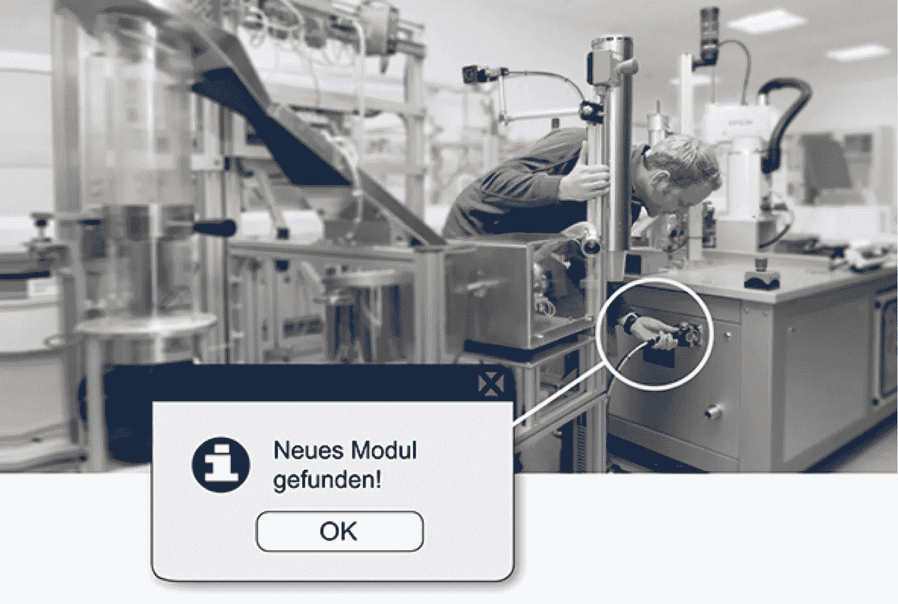

# 利用工业 4.0 控制复杂性

> 原文：<https://medium.com/hackernoon/mastering-complexity-with-industry-4-0-b9d204bb7009>

20 世纪 90 年代末，当我在大学里第一次听到 JIT(准时制)这个术语时，我就成了精益的狂热爱好者。近 50 年来，丰田方式一直在塑造着汽车制造业的格局。然而，它仍然是健全的，有活力的。但如今一个新的流行词正在出现，这一次它不是来自遥远的远东，而是来自老欧洲的技术中心:我指的是德国，我指的是工业 4.0。然而，在许多人看来，这种新时尚又一次充满了异国情调，让人难以理解，这让他们想起了 20 世纪 80 年代初日本理论开始在全球传播时，西方观众在理解这些理论时遇到的最初困难。

但是今天，我们生活在一个相互联系的世界里，我们所有人熟悉这一新趋势的速度肯定是二三十年前所没有的。在不久的将来，我们将会读到大量关于新工业革命的畅销书，我对此充满期待。毫不奇怪，关于这个主题的第一本[书](https://hackernoon.com/tagged/books)是一篇在上海写的德国学士论文。作者是 Anton Frison，标题是*工业 4.0 对精益方法的影响以及德国和中国制造商在中国的业务*。我强烈建议大家今天就在你的 Kindle 设备或应用程序上下载:[Http://amzn.com/B017T5XL0O](Http://amzn.com/B017T5XL0O)

我完全支持这本书的立场，因为我也坚信精益和工业 4.0 之间会有重要的协同作用。精益基本上是一套工具和实践，旨在降低复杂性，降低责任，设计故障安全流程，从自主拉动系统中获利。在日常实践中，直觉和经验告诉我们，如果行动是自发的(*看板*)，如果不合格产品大部分被避免(*防差错*)，如果工人直接管理所有基本偏差(*冲刺会议*)，效率就会提高，成本就会降低。

丰田方式植根于二战后的日本。当时[技术](https://hackernoon.com/tagged/technology)还不够先进，不足以确保在当前制造过程中广泛应用防错技术。因此，Taiichi Ohno 和 Eiji Toyoda 不得不寻找实用且负担得起的解决方案来设计他们的系统。

今天，事情发生了巨大的变化。技术无处不在，可靠性达到了前所未有的水平。新的应用即将出现，例如原型和备件的 3D 打印，所有车间文件级联更新的数字化，承诺与工人在其直接环境中操作而不需要安全区域的轻型机器人，提供生产进度透明数据的自路由和自我意识处理单元，机器集成和过程互联的 3D 测量，用于增强现实的智能眼镜和用于实时检测工人运动的 IR/US 跟踪手套等。

当复杂性无法避免或减少时，当确实有机会拥抱它时，就需要范式转换，必须开发新的模型。此外，工业 4.0 的竞赛是主要制造国之间的竞赛，以获得未来几十年的竞争优势。

> 工业 4.0 是应对复杂性的成本密集型机会(安东·弗里森)

在处理我们的个人电脑时，我们都曾在不太遥远的过去经历过死亡和病毒威胁的蓝屏。他们现在在哪里？谁还记得整理他的硬盘？我们在早期版本的 Microsoft Windows 和 Microsoft Office 中熟悉的大量选项和设置在哪里？我的 iPhone 的文件系统在哪里？我怎么可能在智能手机和平板电脑上运行完全相同的应用程序？

在过去的二十年里，我们在个人生产工具方面所经历的事情显示出两种相互关联的趋势:

1.  技术如预期的越来越好；
2.  复杂性不可能消失，但肯定对用户越来越隐藏。

类似的事情正在我们公司的车间里发生。随着技术变得越来越可靠，它将被大量采用来改善我们的生产流程。好消息是，大多数复杂的东西对经理和工人来说是完全隐藏的，在潜在的复杂性和感知的复杂性之间产生了巨大的差距。*从插&播放到插&产生。*

> [黑客中午](http://bit.ly/Hackernoon)是黑客如何开始他们的下午。我们是 [@AMI](http://bit.ly/atAMIatAMI) 家庭的一员。我们现在[接受投稿](http://bit.ly/hackernoonsubmission)并乐意[讨论广告&赞助](mailto:partners@amipublications.com)机会。
> 
> 如果你喜欢这个故事，我们推荐你阅读我们的[最新科技故事](http://bit.ly/hackernoonlatestt)和[趋势科技故事](https://hackernoon.com/trending)。直到下一次，不要把世界的现实想当然！

【https://upscri.be/hackernoon/ 