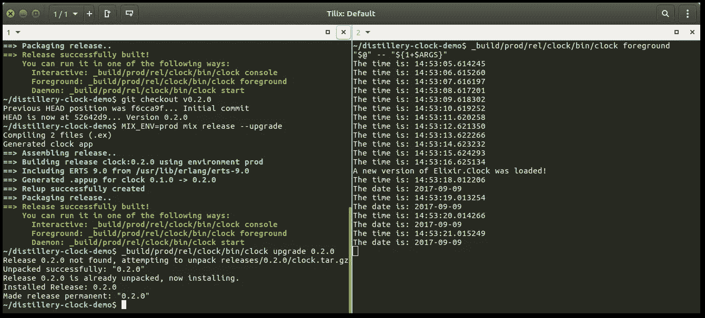

# 用蒸馏器控制酏剂释放——一本(相当)完整的指南

> 原文：<https://medium.com/hackernoon/mastering-elixir-releases-with-distillery-a-pretty-complete-guide-497546f298bc>

## 如何创建酏剂版本？和伞应用程序的一些提示。


# 快速复习和一点历史

发行版在 Erlang/OTP 领域已经存在很长时间了。

我以前写过关于[什么是发布以及为什么它们更好的详细信息](/@pentacent/elixir-releases-docker-the-basics-explained-4c800a5b990b)。这里有一点提醒:版本是编译好的 Elixir/Erlang [代码](https://hackernoon.com/tagged/code)的自包含包，可以很容易地部署在 [remot](https://hackernoon.com/tagged/remote) e 机器上。

自然，迄今为止，大多数创建发布的工具都来自 Erlang 世界。Erlang 附带了`systools`和`reltool`，但是它们的用法相当复杂。所以社区构建了`[relx](https://github.com/erlware/relx)`作为一个更易于使用的替代方案，现在已经成为从 Erlang 项目创建版本的事实上的标准。因为这些工具都是为 Erlang 设计的，所以它们可以为 Elixir 项目工作，但是还有很多不足之处。

2014 年，Paul aka [bitwalker](http://bitwalker.org/) 开始让酏剂的发布变得更容易，并发布了`exrm`——建立在`relx`的基础上，具有一些酏剂特有的功能。由于`relx`的限制，`exrm`不够灵活，永远无法充分发挥模块化酏剂应用的潜力。所以保罗决定创建一个新的发布经理，从头开始用纯灵药编写——于是[酒厂](https://github.com/bitwalker/distillery)诞生了。

# 逐步指南

在本文的这一部分，您将学习如何将 Distillery 添加到项目中，并逐步构建您的第一个版本。我们走吧！

我已经创建了一个小应用程序，每秒钟打印出当前时间。我们可以用它来构建一个版本:

```
git clone [https://github.com/wmnnd/distillery-demo.git](https://github.com/wmnnd/distillery-demo.git)
cd distillery-demo
```

## 安装 Distillery &创建第一个版本

在创建您的第一个发行版之前，您需要安装 Distillery。将`{:distillery, "~> 1.5"}`添加到项目`mix.exs`的依赖项列表中，并运行`mix deps.get`。

接下来，我们通过调用`mix release.init`来初始化 Distillery。该命令创建一个配置文件`rel/config.exs`。您也可以手动创建文件，但这样更方便。

我们稍后将查看配置文件的内容。现在，这足以构建我们的第一个版本。为了做到这一点，运行`mix release`。Distillery 现在将创建如下所示的输出:

```
==> Assembling release..
==> Building release clock:0.1.0 using environment dev
==> You have set dev_mode to true, skipping archival phase
==> Release successfully built!
    You can run it in one of the following ways:
      Interactive: _build/dev/rel/clock/bin/clock console
      Foreground: _build/dev/rel/clock/bin/clock foreground
      Daemon: _build/dev/rel/clock/bin/clock start
```

祝贺您，您刚刚创建了您的第一个版本！用`_build/dev/rel/clock/bin/clock foreground`运行。正如预期的那样，应用程序现在以一秒为间隔打印出当前时间。您可以点击`Ctrl+C`终止应用程序。

> **注意:目前在 Distillery 中有一个 bug，它可能会在启动发布时崩溃。在这种情况下，运行** `**mix clean && mix compile**` **并再次尝试运行应用程序。**

在启动应用程序的调用中，您在最后传递了`foreground`命令。这是*引导命令*。还有其他启动应用程序的引导命令:`console`启动与应用程序的交互式 iex 会话，`start`在后台创建一个守护进程。

## 发布概要文件和环境

让我们后退一步。您可能已经熟悉了 Elixir 的构建工具组合。Mix 支持多种*环境* : `dev`，`prod`和`test`。例如，根据当前环境，Mix 可以确定要包含哪些依赖项或配置文件。

您可能已经注意到，当我们创建发布时，Distillery 打印出了这一行:`Building release clock:0.1.0 **using environment dev**`。酿酒厂也有*环境—* 但它们不同于混合环境。 **Distillery 使用环境来允许发布构建过程的多种配置。**

便利地——或者令人困惑地——酿酒厂环境默认与混合环境相同。让我们看一下自动生成的配置文件`rel/config.exs`，以便更好地理解概要文件的工作原理:

```
use Mix.Releases.Config,
  default_release: :default,
  default_environment: Mix.env()
```

我们可以看到`default_environment`被设置为`Mix.env()`。这意味着酿酒厂将与我们的混合环境相匹配。您可以用`--env`开关覆盖默认环境。以下是这种工作方式的一些例子:

```
mix release
#Mix environment and Distillery environment are both *dev*MIX_ENV=prod mix release
#Mix environment and Distillery environment are both *prod*MIX_ENV=prod mix release --env=dev
#Mix environment is *prod*, Distillery environment is *dev*
```

配置文件还指定`default_release`为`:default`。这是因为您实际上可以为您的项目定义不止一个版本。通过`:default`设置，Distillery 自动选择`rel/config.exs`中定义的*第一个*版本。如果您想覆盖默认版本，您可以用`--name`标志来指定。

一个环境与一个特定发布名称的组合被称为一个*概要文件*。您可以选择带有`--profile=name:env`标志的特定个人资料。

在下一节中，我们将看看如何使用多种环境来配置 Distillery。

## 发布构建配置

我们的 Distillery 配置包括两个环境(`dev`和`prod`)，位于一个以我们的项目(`clock`)命名的版本之上:

```
environment :dev do
  set dev_mode: true
  set include_erts: false
  set cookie: :"W?cN_`G<>ayUI&ku{<$3w7J<^nUBRBu[F[…]"
endenvironment :prod do
  set include_erts: true
  set include_src: false
  set cookie: "^_`fz{dk|`w.n3Z%T,n=F>ezazFk.1ci5}[…]"
endrelease :clock do
  set version: current_version(:clock)
  set applications: [
    :runtime_tools
  ]
end
```

下面是配置文件中包含的选项的作用:

*   `dev_mode: true/false`:如果`true`，字节码、资产等文件不复制到发布文件夹。相反，Distillery 创建符号链接。这使得创建发布更快，并且非常适合测试目的。
*   `include_erts: true/false`:如果`true`，Distillery 包含 Erlang 运行时 ERTS。这在您的开发机器上不是必需的，但建议您制作自包含版本。
    如果您想将您的版本部署到具有不同操作系统或处理器架构的机器上，您可以指定交叉编译的 ERTS 版本的路径，而不是`true/false`。
*   `cookie: $STRING`:酒厂可以设置[二郎曲奇](http://erlang.org/doc/reference_manual/distributed.html)。自动生成的配置包括随机 Erlang cookies。如果你想把你的配置提交给一个 Git 库，不要包含硬编码的 cookie！在这篇文章的后面，我们将研究一种更好的方法来配置这个神奇的 cookie。
*   `include_src: true/false`:该选项可用于[向后兼容](https://twitter.com/gotbones/status/906270692970295296)与 Erlang 发布工具`relx`。如果`true`，来自你的项目和依赖项的 Erlang 源代码包含在发布中。不包含长生不老药代码，所以大多数时候，你可以忽略这个选项。
*   `version: $VERSION_STRING`:设置发布版本。您可以使用函数`current_version/1`从项目的`mix.exs`中提取版本。
*   `applications: [:app_name]`:您可以在这里列出您想要包含的其他应用程序。默认情况下，Distillery 包含了`:runtime_tools`，它是 Erlang 标准库的一部分，支持某些调试特性。

## 生命周期脚本又名钩子

可以将 shell 脚本添加到您的版本中，以便在应用程序生命周期的某些点上运行。这些脚本也被称为*钩子*，可以在您的`rel/config.exs`中配置。简单地将它们添加到`env`或`release`部分，如下所示:

```
environment :prod do
  set pre_start_hook: "rel/hooks/pre_start.sh"
end
```

注意，这些路径是相对于您的项目目录的，而不是相对于`rel`目录的。最有趣的钩子当然是`pre_start`，但还有`post_start`、`pre/post_configure`、`pre/post_stop`、`pre/post_upgrade`。虽然 Erlang 理论上允许更多，但是目前每个 Distillery 钩子只能配置一个脚本。

## 伞形应用

Distillery 在处理伞状应用程序时也很棒！你只需要注意两件事:

1.  在发布配置的`applications`列表中包含您的子应用程序的名称。
2.  您可以使用`current_version(:my_child_app)`选择从任何子应用程序中获取发布版本号。

如前所述，也可以在您的`rel/config.exs`中定义多个发布，从而指定多个发布概要文件。如果您希望发布的版本只包含保护伞项目中的某些子应用程序，这将非常有用。

# 发行版的运行时配置

配置 Elixir 应用程序——尤其是在涉及第三方库时，可能是一件棘手的事情。Ecto 核心开发者 Micha 最近表达了他对令人困惑的现状的担忧。

## 混合配置的问题是

您需要记住的第一件事是，混合配置文件中的配置是在编译时计算的。当您从源代码运行应用程序时，这不是问题。**但是当 Distillery 构建一个版本时，所有的配置文件都会在构建时被评估。**

如果你的混音中有类似`foo: System.get_env("BAR_VAR")`的东西。配置文件，你运气不好。`foo`将从您的构建系统中获取`BAR_VAR`环境变量的值。当您在另一台机器上启动应用程序时，该值不会更新。

幸运的是，有办法解决这个问题。最简单的是酿酒厂采用的一个小技巧:

## 一个简单的解决方案:替换 VARS 操作系统

Distillery 有一种将环境变量注入 Mix 配置的特殊方式。只需在配置文件中使用类似`"${BAR_VAR}"`的字符串，就可以了。当您的应用程序启动时，Distillery 将用相应的环境变量值替换它。你所需要做的就是在发布时设置环境变量`REPLACE_OS_VARS=true`。这使得编写如下配置变得非常容易:

```
config :my_app,
  foo: "${BAR_VAR}"
```

**这个方法非常适合初始化 Erlang cookie。**使用`rel/config.exs`中的`set cookie: "${ERLANG_COOKIE}"`从环境变量中设置 cookie。

不会没有问题的。最重要的是，这个方法只适用于字符串。如果您尝试类似于`String.to_integer("${BAR}")`的东西，您会得到一个错误消息，因为编译器在 Distillery 有机会替换特殊字符串之前评估了表达式。

幸运的是，许多库现在支持更灵活的配置方法。

## 埃克托

Ecto 引入了一种动态配置应用程序依赖关系的新方法。他们的解决方案是:回调！您可以使用`Ecto.Repo.init/2`回调来动态配置 Ecto。

这个回调将`type`和`config`作为参数。我们可以安全地忽略`type`(根据调用的上下文，可以是`:supervisor`或`:dry_run`)。`config`是您的 Mix 配置中的配置关键字列表。这很方便，因为它允许您在混合配置中设置默认值，然后用环境变量覆盖它们。

回调必须返回`{:ok, config}`或`:ignore`。下面是一个简单的类型转换示例:

不用编写自己的代码来解析环境变量，您可能会发现第三方应用程序，如 [Atmo](https://github.com/vinli/atmo_ex) 或 [Confex](https://github.com/Nebo15/confex) 很有用。我还没有尝试过，但他们似乎有一些很好的便利功能。

## 凤凰

从 Phoenix 应用程序中创建一个版本很容易。

在您创建生产版本之前，请确保您的资产已经构建并消化:

```
./node_modules/brunch/bin/brunch b -p
MIX_ENV=prod mix phx.digest
```

在 1.3 版本中，Phoenix 还采用了 Ecto 的回调式配置方法。这使得灵活配置`Phoenix.Endpoint`变得非常容易:

The init/2 callback for Phoenix.Endpoint behaves exactly like in Ecto.

# 升级版本

没有一个完整的关于 Elixir 版本的指南是完整的，如果没有提到他们最酷的特性之一:热更新。

您可能知道 Erlang 和 Elixir 被编译成字节码，然后由 *BEAM 虚拟机*执行。多亏了 BEAM，我们可以在不停止应用的情况下升级应用。

## 创建升级版本

内部版本升级使用`.appup`文件来确定哪些模块应该升级以及如何升级。幸运的是，当我们给它传递参数`--upgrade`时，Distillery 会自动创建它们。**在构建升级时，确保您的** `**/_build**` **文件夹中仍有以前的版本。否则，Distillery 将无法确定哪些模块需要更新。**

## 创建生产版本

只有包含 ERTS 的版本才能使用热升级。因此，让我们从创建我们的`clock`应用程序的生产版本开始:

```
**#In Terminal 1**
MIX_ENV=prod mix deps.get
MIX_ENV=prod mix release
```

现在打开第二个终端窗口并启动发行版:

```
**#In Terminal 2** cd distillery-clock-demo
_build/prod/rel/clock/bin/clock foreground.
```

同样，您应该看到每秒钟打印出来的当前时间。

## 创建升级版本

让我们创建一个新版本的`clock`。因为它打印出当前版本号和当前时间，所以你需要做的就是改变`mix.exs`中的`version`来得到不同的输出。目前设置为`0.1.0`。让我们把它改成`0.2.0`。

然后，通过将`--upgrade`标志传递给`mix.release`来创建一个升级版本。

```
**#In Terminal 1**
MIX_ENV=prod mix release --upgrade
```

## 我们要现场直播！

创建发布升级后，第二个终端中的时钟应用程序没有改变。还没有。仍然在第一个终端中，运行以下命令:

```
**#In Terminal 1**
_build/prod/rel/clock/bin/clock upgrade 0.2.0
```

在第二个终端中，时钟输出现在将改变，并开始打印出当前日期。多整洁啊！



Updating an application wile it’s running!

# 你是释放长生不老药的大师了吗？

我希望在阅读本指南后，您现在对酏剂版本有了更好的理解。写完之后当然有！

如果你认为我错过了长生不老药版本的某个方面，这应该是这个(漂亮的)完整指南的一部分，请让我知道，我会努力添加它！

**本文是正在进行的关于将 Elixir 应用程序开发和部署到生产环境的系列文章的一部分。**即将发布的文章将涵盖部署策略和构建 Docker 映像。

在这个系列中，我将分享我创建[*DBLSQD*](https://www.dblsqd.com)*的经验，这是一个用 Elixir 编写的发布和更新服务器。看看吧，有一个 60 天无附加条件的免费演示:*

[](https://www.dblsqd.com) [## 发布和分发软件— DBLSQD

### DBLSQD 是桌面和移动应用程序的发布+更新服务器。面向电子和 Qt 的强大 SDK。兼容 Sparkle、Squirrel 和其他产品。

www.dblsqd.com](https://www.dblsqd.com)