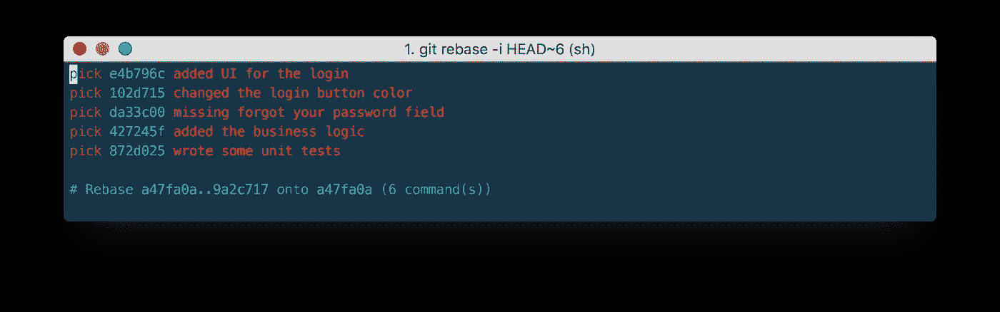
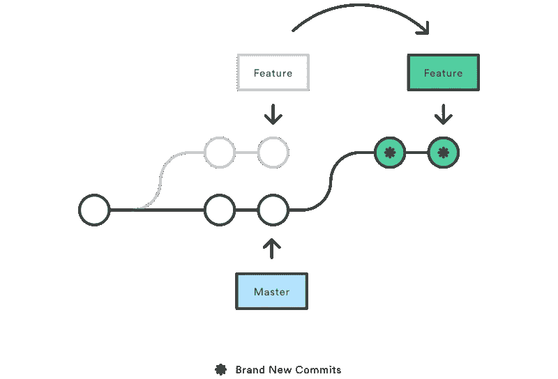
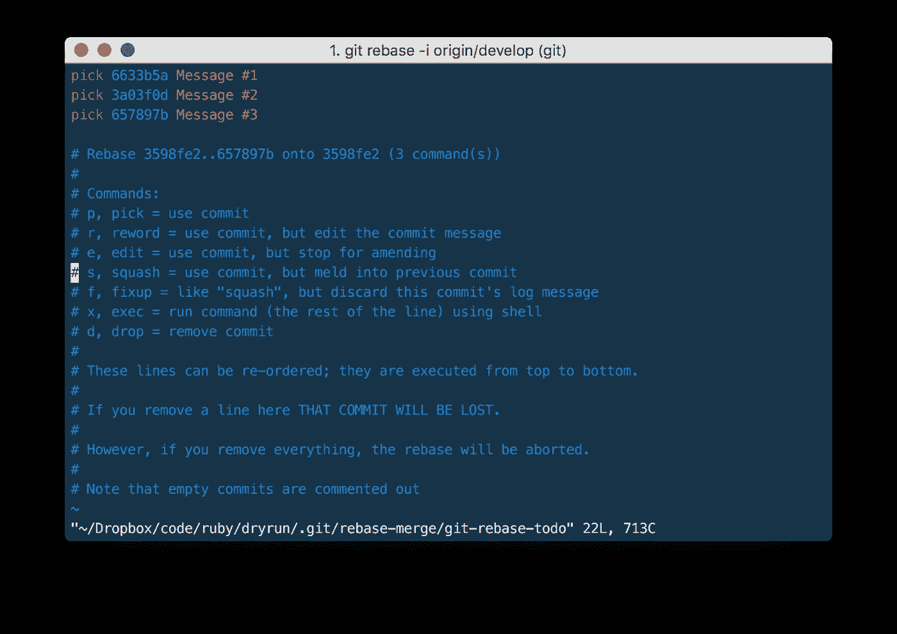
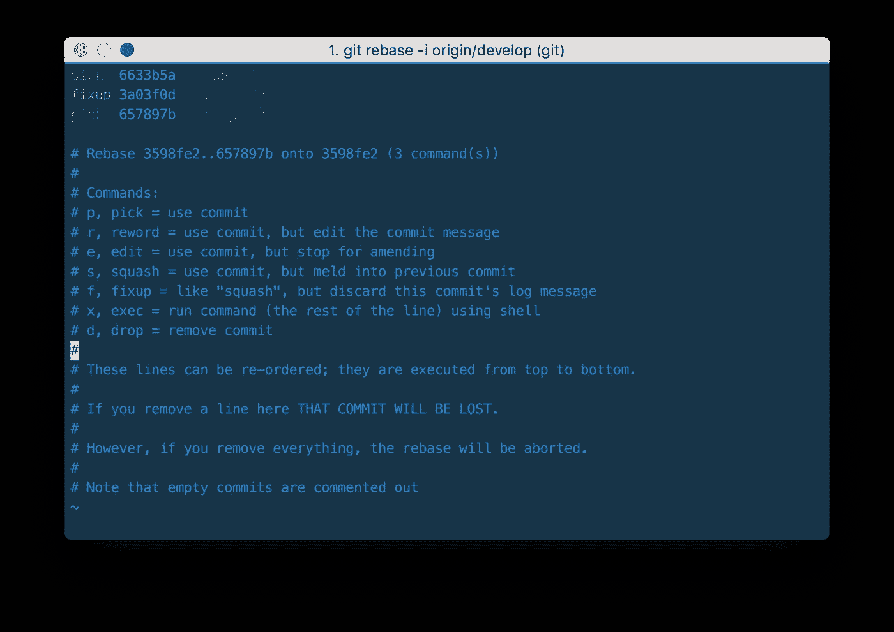
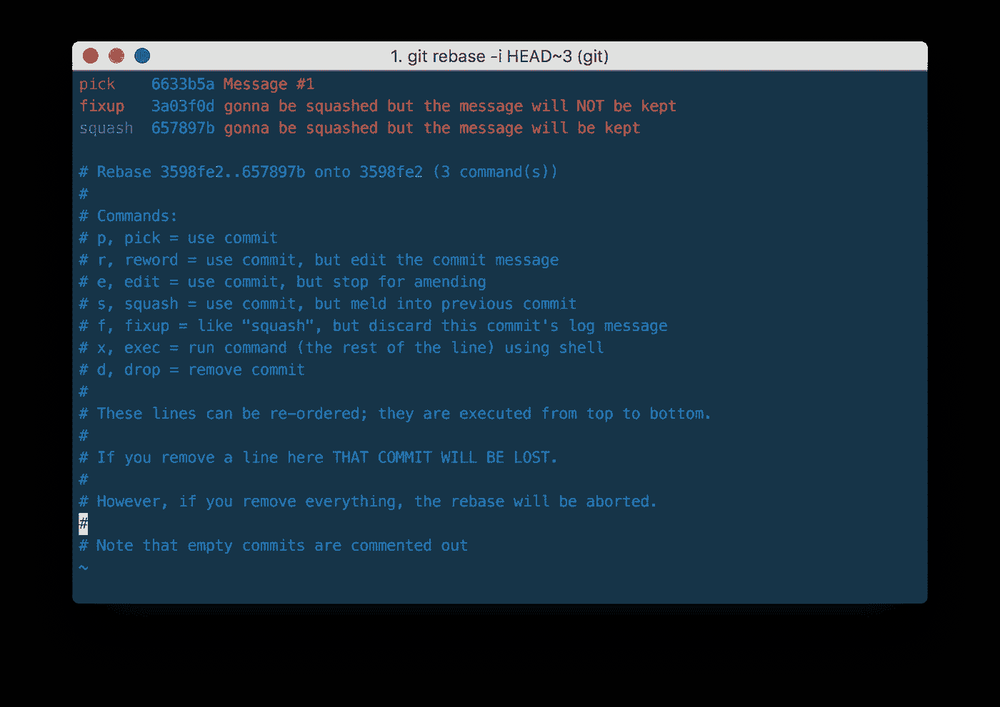
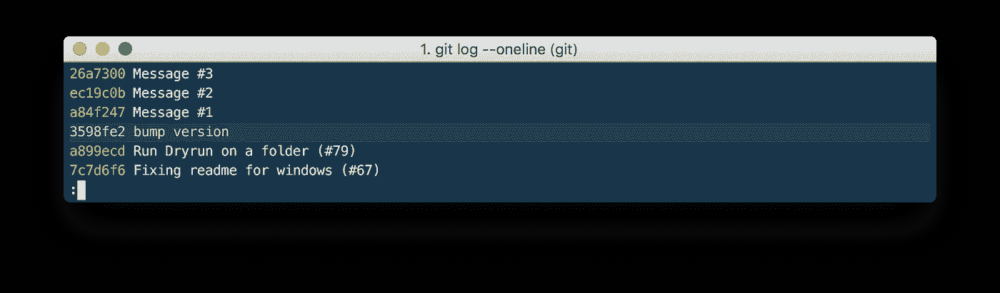
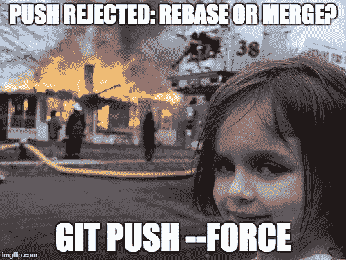
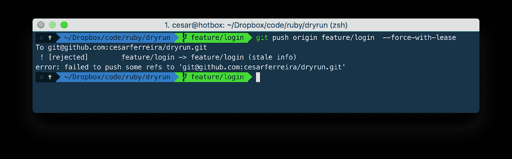

# 掌握 Git——为什么 Rebase 如此神奇

> 原文：<https://medium.com/hackernoon/mastering-git-why-rebase-is-amazing-a954485b128a>



## 不用时光机重写历史

就像 **Vim vs Emacs** ，**合并 vs 重定基础**是一场无休止的争论。两者都有优点和缺点，但是对于合并或重定基础哪个更好的问题:希望你会看到这并不那么简单。Git 是一个强大的工具，允许你对你的历史做很多事情，但是每个团队和每个项目都是不同的。如果你知道这两者是如何工作的，那就由你来决定哪一个最适合你的具体情况。

# 为什么我需要重定基数？

从内容的角度来看，重定基础实际上只是将一个分支从一个提交转移到另一个提交。但是在内部，Git 通过创建新的提交并将它们应用到指定的基础上来实现这一点——这实际上是**重写**您的项目历史。一般过程可以想象如下:



当一个特性分支的开发完成时，[rebase](https://hackernoon.com/tagged/rebase)/[squash](http://git-scm.com/book/en/Git-Tools-Rewriting-History)将所有工作压缩到最小数量的有意义的提交，并避免创建合并提交。这种方式代码历史保持平坦和可读。干净、清晰的提交消息就像代码注释一样，是代码库文档的一部分。出于这个原因，重要的是不要用 50 个单行提交来污染历史，这 50 个单行提交部分地相互抵消了单个特性或 bug 修复。

# Git rebase 交互式

当提交被移动到新的分支时，交互式的重新定基为您提供了修改提交的机会。这甚至比自动化的 rebase 更强大，因为它提供了对分支提交历史的完全控制。通常，这用于在将特征分支合并到`develop`之前清理混乱的历史。它允许您通过删除、拆分和更改现有的一系列提交来清理历史。就像打了类固醇的`git commit --amend`。

要开始交互式重置会话，请将`i`选项传递给`git rebase`命令:

```
git checkout feature
git rebase -i origin/develop
```

这将打开一个文本编辑器，列出所有将要移动的提交:



这个清单准确地定义了执行 rebase 之后分支的样子。通过更改`pick`命令和/或**重新排序条目**(这是一个很酷的特性)，您可以让分支的历史看起来像您想要的那样。例如，如果#2 提交修复了#1 提交中的一个小问题，您可以用`fixup`命令(或简称为 **f** )将它们压缩成一个提交:



当您保存并关闭文件时，Git 将根据您的指示执行 rebase。

大多数开发人员喜欢在将功能分支合并到主代码库之前，使用交互式 rebase 来修饰它。这给了他们机会来粉碎无关紧要的提交，删除过时的提交，并确保在提交到“正式的”项目历史之前其他事情都是有序的。对于其他人来说，看起来整个特性是在一系列精心设计的提交中开发出来的。

# 挤压

消除无关紧要的提交使您的特性的历史更容易理解。这是`git merge`根本做不到的事情。

有几种方法可以粉碎提交，以下是我用得最多的。

## 通过使用交互式重置基础

```
git rebase -i **HEAD~3**
```



It’s HEAD~3 because it is the number of commits in this branch

如果您不确定分支的提交数量，您可以在开始使用这个特性之前执行一个`git log --oneline`获取提交的散列，并执行一个:

```
git rebase -i **3598fe2**
```



如果您忘记了您的分支中有多少提交，您可以在您的`.gitconfig`中创建一个别名:

```
[alias]
    **count** = "!f() { compareBranch=${1-master}; git rev-list --count HEAD ^$compareBranch; }; f"
```

运行`git count **develop**`将会告诉你从**开发**偏离的提交数量，注意它可以与任何分支名称一起使用。

## 或者通过重置“X”次提交

```
git reset --soft HEAD~X
```

在这个命令之后，您最后的 X 提交更改将会被取消，因此您需要创建一个新的提交来覆盖它们。

```
git add .
git commit -am "Feature Z is completed"
```

这种方式很好，当你打开一个拉请求，有人告诉你要修复的东西，你可以回到“1”提交，修复你需要修复的东西，并强制推它。

# 力推

既然我们已经在本地改写了历史，我们需要通过强制将遥控器推到上游来覆盖它。

```
git push origin feature_branch **--force**
```



Git 的`push --force`是**破坏性的**，因为它**用你本地的任何东西覆盖远程库**，**可能**覆盖团队成员在此期间推动的任何更改，所以**对这个**要格外小心。

# `--force-with-lease`，-力少名小兄弟

此选项允许您强制推送，而没有无意中覆盖其他人的工作的风险。它只允许您在没有其他人同时将更改推送到远程的情况下进行强制推送。如果有新的远程提交，`--force-with-lease`将失败，提示我们先取。

如果您打算经常使用它，请在您的`.gitconfig`中创建一个别名:

```
[alias]
    **pf** = push **--force-with-lease**
```



*computer says no*

# 最后…

主要的决定围绕着这个:**你更看重一个干净的、线性的历史吗？还是你的分支机构的可追溯性？**在前一种情况下走**重定基准**政策，在后一种情况下走**合并**政策。

# 谢谢

…走了这么远！我很想知道你是怎么想的，如果你以不同的方式做一些事情。此外，如果你点击小❤️并分享这篇文章，那么更多的人将从中受益，这将是令人敬畏的。

如果你对更多的技术相关话题感兴趣，请查看我的其他文章，在 [Twitter](https://twitter.com/cesarmcferreira) 上关注我，或者查看我的 [GitHub](https://github.com/cesarferreira/) 项目。

# 来源

[](https://git-scm.com/book/en/v2/Getting-Started-The-Command-Line) [## git——命令行

### 开始翻译 Azərbaycan 迪尔语、беларуская语、加泰罗尼亚语、世界语、西班牙语(尼加拉瓜)、فارسی语、हिन्दी语、马扎尔语…

git-scm.com](https://git-scm.com/book/en/v2/Getting-Started-The-Command-Line) [](https://www.atlassian.com/git/tutorials/merging-vs-rebasing/) [## 合并与重置基础

### 将 git rebase 与 git merge 命令进行比较，并找出所有合并 rebase 的潜在机会…

www.atlassian.com](https://www.atlassian.com/git/tutorials/merging-vs-rebasing/) [](https://www.atlassian.com/git/tutorials/comparing-workflows/gitflow-workflow) [## Gitflow 工作流

### Gitflow 工作流程通过使用独立的分支来进行功能开发、发布…

www.atlassian.com](https://www.atlassian.com/git/tutorials/comparing-workflows/gitflow-workflow)  [## Git -重写历史| Atlassian Git 教程

### 在 Git 中覆盖已提交快照的常见用例。历史重写命令:git commit - amend，git rebase…

www.atlassian.com](https://www.atlassian.com/git/tutorials/rewriting-history) [](https://developer.atlassian.com/blog/2015/04/force-with-lease/) [## -被认为有害的武力；了解 git-force-with-lease-Atlassian 开发者

### Git 的推力是破坏性的，因为它无条件地用您拥有的任何东西覆盖远程存储库…

developer.atlassian.com](https://developer.atlassian.com/blog/2015/04/force-with-lease/) [](https://git-scm.com/book/en/v2/Git-Branching-Rebasing) [## git-rebase

### 现在，关于合并或重定基础哪个更好的问题:希望你会发现这并不那么简单。Git 是一个…

git-scm.com](https://git-scm.com/book/en/v2/Git-Branching-Rebasing) [](https://www.atlassian.com/git/articles/git-team-workflows-merge-or-rebase/) [## Git 团队工作流:合并还是重组？

### 亚特兰蒂斯 Git 教程

www.atlassian.com](https://www.atlassian.com/git/articles/git-team-workflows-merge-or-rebase/) [](https://robots.thoughtbot.com/git-push-force-with-lease) [## 小心用力推动

### 一个温和的 git 推力。

robots.thoughtbot.com](https://robots.thoughtbot.com/git-push-force-with-lease) [](https://medium.freecodecamp.com/bash-shortcuts-to-enhance-your-git-workflow-5107d64ea0ff) [## 增强 Git 工作流的 Bash 快捷方式

### 你使用 Git 越多，你学习它的工作流程就越快。

medium.freecodecamp.com](https://medium.freecodecamp.com/bash-shortcuts-to-enhance-your-git-workflow-5107d64ea0ff) [](http://bit.ly/HackernoonFB)[](https://goo.gl/k7XYbx)[](https://goo.gl/4ofytp)

> [黑客中午](http://bit.ly/Hackernoon)是黑客如何开始他们的下午。我们是 [@AMI](http://bit.ly/atAMIatAMI) 家庭的一员。我们现在[接受投稿](http://bit.ly/hackernoonsubmission)，并乐意[讨论广告&赞助](mailto:partners@amipublications.com)机会。
> 
> 如果你喜欢这个故事，我们推荐你阅读我们的[最新科技故事](http://bit.ly/hackernoonlatestt)和[趋势科技故事](https://hackernoon.com/trending)。直到下一次，不要把世界的现实想当然！

