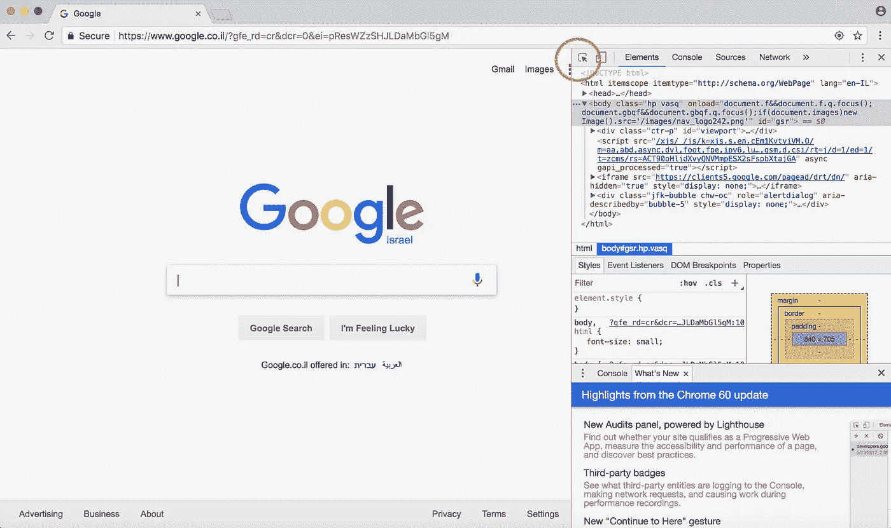
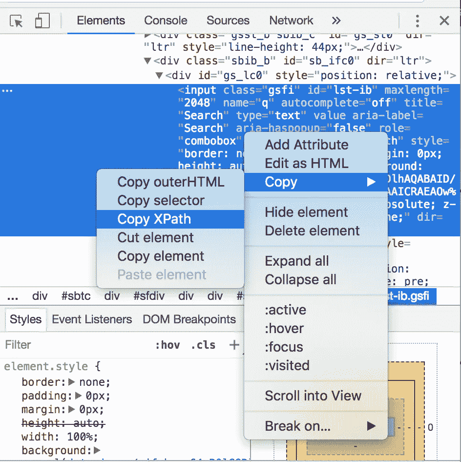
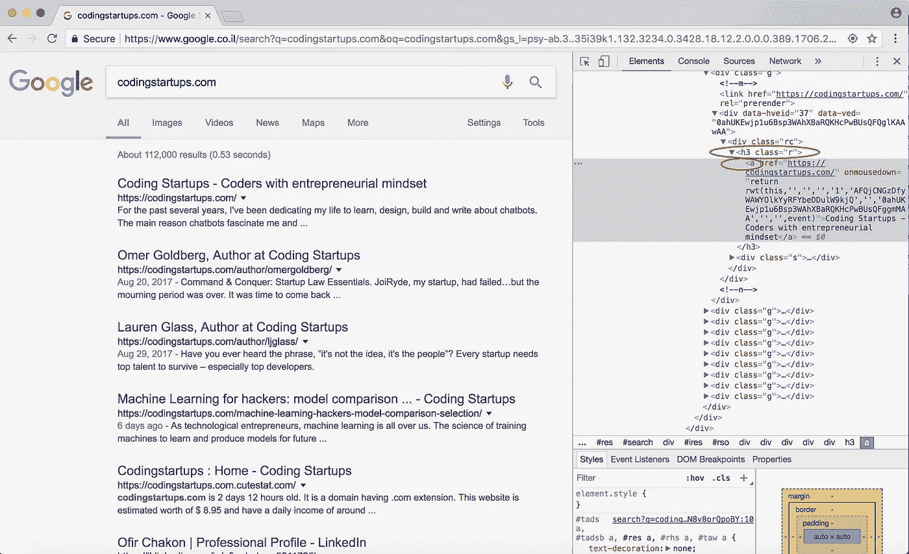

# 掌握 Python Web 抓取:取回您的数据

> 原文：<https://medium.com/hackernoon/mastering-python-web-scraping-get-your-data-back-e9a5cc653d88>


你有没有发现自己处于这样一种情况，你需要从一个网站获取信息，而这个网站*很方便*没有导出选项？

我的一个客户就遇到过这种情况，他迫切需要一个平台的电子邮件地址列表，这个平台不允许你导出自己的数据，并把数据隐藏在一系列 UI 障碍之后。这位客户正准备花大价钱让一名数据录入人员手动复印每封电子邮件。幸运的是，她记得网络抓取是未来的方式，也是我最喜欢的反抗“老大哥”的方式之一。我很快(15 分钟)就解决了一些问题，为她省了很多钱。我知道其他人也面临类似的问题。所以我想分享如何编写一个程序，像你一样使用网络浏览器，并取回数据！

我们将通过一个简单的例子来实践这一点:抓取 Google 搜索。抱歉，不是很有创意:)但这是一个很好的开始方式。

# 要求

Python(我用的是 2.7)

*   碎片(基于硒)
*   熊猫

铬

[Chromedriver](http://splinter.readthedocs.io/en/0.1.1/setup-chrome.html)

如果你没有熊猫并且很懒，我推荐你去 [Anaconda](https://www.anaconda.com/download/) 获取他们的 Python 发行版，其中包括这个重要的&超级有用的库。

否则，用 pip 从终端/命令行下载它及其所有依赖项。
`pip install pandas`

如果你没有 Splinter(使用 Anaconda 的 Python 的**也不是**，只需从终端/命令行用 pip 下载即可。
`pip install splinter`

如果你没有 Splinter(而**是**用的是 Anaconda 的 Python)，用 Anaconda 的包管理器从终端/命令行下载。
`conda install splinter`

如果你想在虚拟环境中设置它(它有很多优点)但是不知道从哪里开始，试着阅读我们关于虚拟环境的另一篇[博客文章。](https://codingstartups.com/3-best-practices-better-setting-django-project/)

# 步骤 1:库和浏览器

在这里，我们将导入我们需要的所有库，并设置一个浏览器对象。

```
from splinter import Browser
import pandas as pd# open a browser
browser = Browser('chrome')
```

如果你试图抓取的页面是有响应的，使用 set_window_size 来确保所有你需要的元素都显示出来。

```
# Width, Height
browser.driver.set_window_size(640, 480)
```

上面的代码将打开一个 Google Chrome 浏览器。既然浏览器都设置好了，那我们就访问 Google 吧。

```
browser.visit('https://www.google.com')
```

# 第二步:浏览网站

太好了，目前我们已经上了头版。现在我们需要专注于如何浏览网站。实现这一目标有两个主要步骤:

1.  寻找某物(一个 HTML 元素)
2.  对其执行操作

要找到一个 HTML 元素，你需要使用 Chrome 开发者工具。右键点击网站，选择“检查”。这将在 Chrome 浏览器的右侧打开一个框。然后点击检查图标(以红色突出显示)。



接下来，使用检查器光标单击您想要控制的网站部分。单击后，创建该部分的 HTML 将在右侧突出显示。在下面的照片中，我点击了搜索栏，这是一个输入。


接下来右键单击 HTML 元素，并选择“复制”->“复制 XPath”



恭喜你。你现在拿到了王国的钥匙。让我们继续讨论如何使用 Splinter 来控制 Python 中 HTML 元素。

# 第三步:控制网站

XPath 是最重要的信息！首先，通过粘贴到 Python 中的一个变量来保证 XPath 的安全。

```
# I recommend using single quotes
search_bar_xpath = '//*[@id="lst-ib"]'
```

接下来，我们将把这个 XPath 传递给 Splinter Browser 对象的一个伟大方法:find_by_xpath()。**这个方法将提取所有与传递给它的 XPath 匹配的元素，并返回一个元素对象列表。**如果只有一个元素，它将返回一个长度为 1 的列表。还有其他方法如 find_by_tag()、find_by_name()、find_by_text()等。

```
# I recommend using single quotes
search_bar_xpath = '//*[@id="lst-ib"]'# index 0 to select from the list
search_bar = browser.find_by_xpath(search_bar_xpath)[0] 
```

上面的代码现在为您提供了这个单独的 HTML 元素的导航。我使用两种有用的方法进行爬行:fill()和 click()

```
search_bar.fill("CodingStartups.com")# Now let's set up code to click the search button! search_button_xpath = '//*[@id="tsf"]/div[2]/div[3]/center/input[1]' search_button = browser.find_by_xpath(search_button_xpath)[0] search_button.click()
```

上面的代码在搜索栏中键入 CodingStartups.com，然后单击搜索按钮。一旦您执行了最后一行，您将被带到搜索结果页面！

提示:使用 fill()和 click()导航登录页面；)

# 第四步:刮！

出于本练习的目的，我们将在第一页上去掉每个搜索结果的标题和链接。



注意，每个搜索结果都存储在带有类“r”的 h3 标签中。还要注意，我们想要的标题和链接都存储在 a 标签中。

突出显示的标签的 XPath 是:

//*[@ id = " rso "]/div/div/div[1]/div/div/H3/a

但这只是第一个环节。我们希望搜索页面上的所有链接，而不仅仅是第一个。所以我们要稍微改变一下，确保我们的 find_by_xpath 方法在一个列表中返回所有的搜索结果。下面是怎么做的。参见下面的代码:

```
search_results_xpath = '//h3[@class="r"]/a' # simple, right?search_results = browser.find_by_xpath(search_results_xpath)
```

这个 XPath 告诉 Python 寻找所有带有类“r”的 h3 标签。然后在其中的每一个里面，提取 a 标签&它的所有数据。

现在，让我们遍历 find_by_xpath 方法返回的搜索结果链接元素。我们将提取每个搜索结果的标题和链接。很简单:

```
scraped_data = []
for search_result in search_results:
     title = search_result.text.encode('utf8')  # trust me
     link = search_result["href"]
     scraped_data.append((title, link))  # put in tuples
```

清理`search_result.text`中的数据有时是最令人沮丧的部分。网上的文字很乱。以下是一些清理数据的有用方法:

[。替换()](https://www.tutorialspoint.com/python/string_replace.htm)

[。encode()](https://www.tutorialspoint.com/python/string_encode.htm)

[。strip()](https://www.tutorialspoint.com/python/string_strip.htm)

所有的标题和链接现在都在 scraped_data 列表中。现在将我们的数据导出到 csv。我喜欢使用熊猫数据框，而不是 csv 库混乱。只有两行:

```
df = pd.DataFrame(data=scraped_data, columns=["Title", "Link"]) df.to_csv("links.csv")
```

上面的代码创建了一个 csv 文件，标题为 Title、Link，然后是 scraped_data 列表中的所有数据。恭喜你。现在去把数据拿回来！

如果你想要一个大的图片视图，这里是我们的 GitHub 账户上的[完整代码。](https://github.com/CodingStartups/scraping-with-python)

感谢阅读！如果你有问题，请随意评论&我会尽量回复你。


在 Instagram 上与我联系[@ Lauren _ _ glass](https://www.instagram.com/lauren__glass/)&[LinkedIn](https://www.linkedin.com/in/laurenjglass/)

在亚马逊上查看我的[必需品清单](http://bit.ly/my_essentials)

[访问我的网站！](https://www.laurenglass.me)


Search for me using my nametag on Instagram!