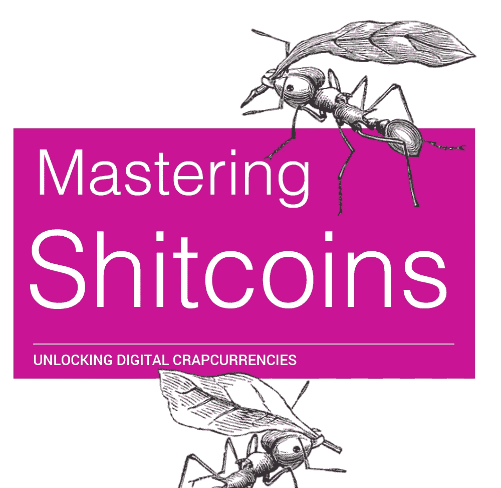
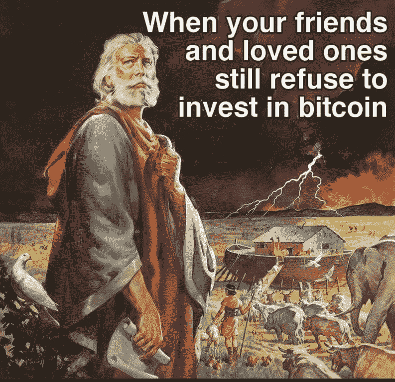
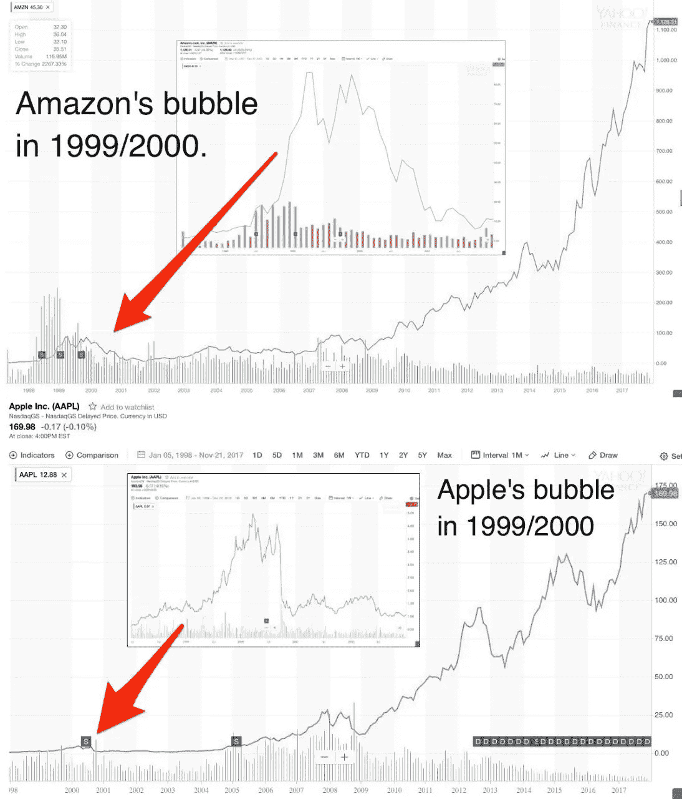
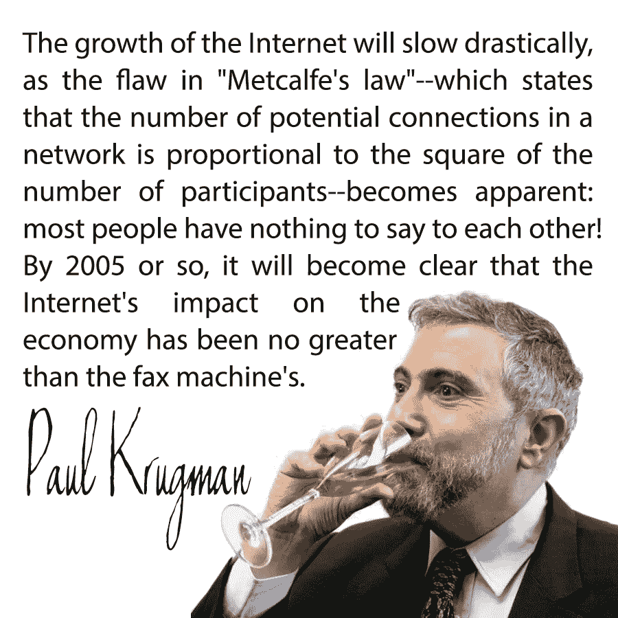
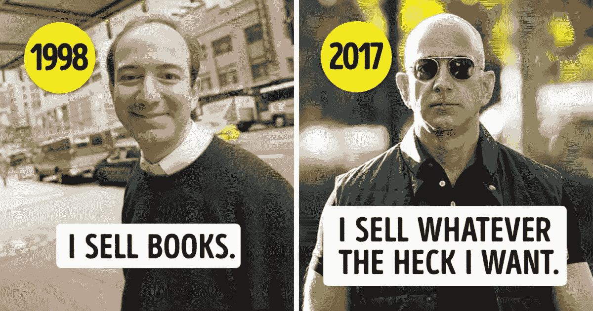
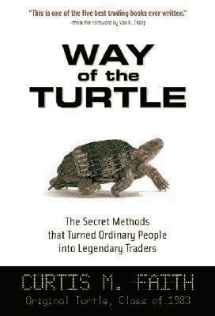
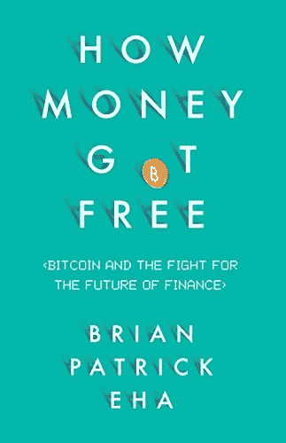

# 掌握狗屎硬币:穷人致富指南

> 原文：<https://medium.com/hackernoon/mastering-shitcoins-the-poor-mans-guide-to-getting-crypto-rich-2e469b762ba9>

所以你错过了加密热潮？

当你开着闪亮的粉红色凯迪拉克去寻找生活的意义时，你梦想着告诉你的老板去哪里，但是没有实现。

Rage quit time!

也许你坐在场边等待一个从未到来的好价格？这些价格太疯狂了，你想，它们会降下来的！谁会花一万美元买一个比特币？一个月前才 1000 美元。所以价格一直从你身边飘过。

或者也许你犯了加密货币交易圣经部分[一](https://hackernoon.com/the-cryptocurrency-trading-bible-43d0c57e3fe6)和[二](https://hackernoon.com/the-cryptocurrency-trading-bible-two-the-seven-deadly-sins-of-technical-analysis-cacd04f916b3)的所有错误？你交易过度，追反弹太晚，投机，卖得太快，总的来说比市场差很多，因为你没有吸取教训。成为优秀交易者的代价非常非常高。大多数人都做不到。要想成为伟大的交易者，你必须快速损失一大笔钱，并且在扭转局面之前跑赢市场。

如果你幸运的话，你会学到这些教训，最终成为一个精明的交易者，不管市场是涨是跌，他都交易得很好。

但是机会对你不利。人性与你为敌。情绪对你不利。一切都和你作对。

然而还是有希望的。

你没有错过机会。不完全是。如果你使劲划，还是可以游过去的。

这还没完。只有 1%的人拥有密码。加密可以解决许多以前难以解决的问题，比如数字身份、供应链完整性、数据泄露等等。

但这需要一段时间。加密高速公路仍在建设中。他们正在铺路和浇注水泥。还没有人住在麦克豪宅里。

但是…但是…但是泡沫。郁金香。一切都要崩溃了，不是吗？

是啊。那又怎样？

让我告诉你一个小秘密。准备好了吗？

这是亚马逊和苹果在 dot.com 崩盘时经历的泡沫。

那时那些是山，现在它们是鼹鼠丘。

我从[这篇惊人的文章](https://decentralize.today/dont-fall-for-the-hype-why-bitcoin-s-10-000-price-doesn-t-reflect-its-true-value-6b42a59fce0a)中抓取了这些截屏，这篇文章在很多层面上揭示了加密的真正价值。读完这篇文章后，你会发现 5000 美元、10000 美元或 25000 美元并不能反映比特币的价值。

大多数人看不到未来。这对他们来说是一个完全的盲点，就像盯着一台被雪撞毁的电视一样。作为一名未来学家，当我在聚会上与人们交谈时，他们知道我有趣又聪明，但他们一个字也听不进去。就好像我是查理·布朗里的老师。

当创新者生活在未来可能性的光明中时，世界上的其他人生活在此时此地。发明家和未来学家是全球部落的萨满和巫医。部落的其他人是狩猎采集者。狩猎采集者 100%关注当下。他们必须是。当你找到下一顿饭的时候，没有时间去考虑未来。

这就是为什么对部落来说，自动驾驶汽车不是真实的，也永远不会存在。虚拟现实就是笑话。比特币是一个笑话，是泡沫和欺诈。

Another genius predicting the future.

对于这个部落来说，仅仅在二十年前，互联网对他们来说就像一个笑话，尽管他们今天靠它生活。对他们来说，自主的金钱、隐私和分散的区块链投票绝对是海市蜃楼。

但是，如果你想获得丰富的密码，他们最好不是你的海市蜃楼。

那你怎么去呢？

你没有时间整天看图表。你可能没有太多的零钱可以挥霍。所以你完蛋了，对吗？

没有。

无论你的自由现金流看起来如何，你都可以投资加密货币。无论你有 500 美元、1000 美元还是 50000 美元，规则都是一样的。我认识一个人，他靠借来的 1000 美元起家，成了百万富翁。

当然不是每个人都会有那样的结果。没关系。

我遇到的那个把 2000 美元投资变成 70000 美元的女孩怎么样？你能多花 70，000 美元吗？你有足够的耐心经历 85%的提款和加密泡沫的破裂吗？

那么你也可以得到丰富的密码。

耐心和长远眼光是关键。

记住，有钱是相对的。如果你一生中的年收入从未超过 25，000 美元，那么 100，000 美元就是一大笔额外收入。它支付了大量的账单，让你安心。

这就是为什么我要给你最简单的方法来丰富加密。不交易。不看图表。

现在我不建议你借任何东西来做到这一点，你应该只投资你能承受的损失。不要抵押你的房子，否则当银行来找你时，你应该得到你应得的一切。别傻了。如果你认为你是例外，那么百分比表明你可能不是，所以把钱放在床垫里，因为那里安全得多。

但是如果你愿意有耐心，并且用正确的方法去做，你将来会有一个很好的机会脱颖而出。

# 明日的亚马逊

要想知道该怎么做，你只需要意识到明天的亚马逊和苹果将会从这个空间中诞生。肯定 80%的项目会失败。

那又怎样？

其他人将继续改变世界。

唯一的问题是，哪些会活下来，哪些会归零？

啊，这就是诀窍。没人知道。任何告诉你不同的人都是在撒谎。没有人有水晶球。

但是我们可以做一个有根据的猜测。

加密货币让你有机会做风险资本家做的事情。到目前为止，投资早期公司一直是那些有很多很多钱的人的专有权利。但是现在也轮到小家伙了。

风险投资家投资组合中成功或失败公司的统计数据会让在场的普通关注者感到害怕。

80%彻底失败。

没错。它们将变得一文不值。大鹅蛋。没什么。

如果一个风投投入 100 万美元，那 100 万美元就蒸发了。

This is the [way of the turtle](http://amzn.to/2Bk1CA9). Slow and steady.

但有趣的是另外的 20%。

10%的公司做得不错。也许他们有利可图，所以风险投资人拿回了他或她的钱，也许会翻倍。还不错。但考虑到他或她刚刚损失了 80%的其他投资，这就不太好了。这使他们亏损了大约 50-70%。哎哟。

但所有的钱都是在最后的 10%里赚来的。

这些是走向新星的公司。它们上升了 10 倍或 100 倍。我们称之为十个装袋者或百个装袋者。正是这些全垒打弥补了所有的损失。

**所以你要玩的不是交易，而是微型风投**

你会用你所有多余的钱买进，然后把这些钱分成最有机会赚钱的项目。

所以我们来分析一下这里的市场，这样我们就能想出买什么了。

# 竞争者

现在硬币开始分成三大类:

*   **货币**
*   **站台**
*   **实用程序**

还有第四种硬币:安全令牌。一两年后，在区块链上市的公司将会泛滥成灾。但除非监管者走出恐惧模式，并开始为此制定正确的规则，否则这种情况不会发生。特拉华州，已知宇宙的商业中心，已经给了我们立法范本，所以在联邦层面也要依靠它。他们只是行动缓慢。

不幸的是，现在没有安全令牌可以交易，所以我们将不得不在一年后重新考虑这个问题。

让我们从货币开始。

这些是最简单的硬币。它们是可编程的钱。他们希望成为商品和服务的交换媒介。或者它们是像黄金或白银一样的价值储存手段。有些是通货紧缩，有些是通货膨胀。有些是用来快速移动的，有些是用来拿着的，这样你以后就可以用它买东西了。

他们的祖师爷都是 [**比特币**](https://bitcoin.org/en/) 。

这肯定是任何堆栈的一部分。句号。

它有先发优势，而且遥遥领先于其他公司。它也是最贵的，可能也是最不创新的。

它的黑马对手是 [**比特币现金**](https://www.bitcoincash.org/) ，这是一个有追随者和反对者的原创项目的分支。但不管你对这枚硬币的感觉如何，感觉与它无关。这是交易，我们把宝押在每个能在这里赢的人身上，而不是假装我们能完美预测未来。这意味着比特币现金也应该进入您的账户。

其他硬币如 [**破折号**](https://www.dash.org/) 势头良好。当比特币暴跌时，Dash 往往会茁壮成长。它稳步获得市场和智力份额。还有长期以来人们最喜欢的 [**Litecoin**](https://litecoin.org/) ，比特币的黄金的“银”。 [**法令**](https://www.decred.org/) 也不是一个坏主意，因为它有一个好的分布模式和社区。

隐私币至关重要。这些工作很像数字版的现金，匿名且不可知。 [**蒙乃洛**](https://getmonero.org/) 、[T21、](https://z.cash/)和[、Zcoin 、](http://zcoin.io/)都是很好的例子，同样的例子还有[、 **PIVX** 、](https://pivx.org/)另一匹未被看好的黑马，它最初是 DASH 的分支，但已经发展成为自己的系统，并纳入了零币协议。这些都是在无现金社会中成为未来现金的有力竞争者。

让我们继续到平台上。这是事情变得非常有趣的地方。

平台币现在正在寻求做服务器和云的唯一领域的事情。他们希望为分散的应用程序供电，以法律形式运行智能合同，并为从身份到存储再到投票的所有事情供电。

这些平台还有很长的路要走。他们必须解决难以置信的挑战性扩展问题，维护安全性，创建全新的编程语言，并提供出色的用户体验。

这些都不容易。这需要时间。但这些平台是未来分散式互联网的基础。

目前为止最大最烂的是 [**以太坊**](https://www.ethereum.org/) 。上周，我有机会会见了这个国家的顶级风投之一，这个领域的早期投资者，他告诉我，他 90%的加密股份都在以太坊。那是因为他认为这是成为*平台的最好机会，一个统治所有人的平台。他们有巨大的动力，令人难以置信的发展，他们迅速将新的变化融入系统。**以太坊是任何筹码都必须持有的。***

*但他们不是唯一的王位竞争者。每天都有新的平台出现。在某个地方的白板上一定会有一个让我们大吃一惊的。但是现在我们用我们现在所拥有的。*

*其他主要的平台选择是**QTUM[**NEO**](https://hackernoon.com/is-neo-the-one-67799886b78f)out of China、[**maidssafe**](https://maidsafe.net/)、 [**Waves**](https://wavesplatform.com/) 、 [**IOTA**](https://iota.org/) **、** [**Tezos**](https://www.tezos.com/) (它们还没有交易，可能永远不会交易)就我个人而言，我认为这些白痴应该停止起诉，因为这个项目是辉煌的，这些傻瓜只是证明他们太愚蠢了，不能投资，需要保姆国家来保护他们，但我跑题了。***

***最后，还有 [**EOS**](https://eos.io/) ，可能是历史上最大的 ICO。他们有一个很好的计划，他们已经推出了稳定的代码流。对你的包来说还不错。我卖得太早了。***

***其他人肯定会加入进来。***

***最后的选择是实用硬币。这些是最难挑的。***

***大多数实用硬币的问题是它们没有实用性。***

***你应该使用这些硬币来消费服务，如身份查找或分散式 DNS 查找，但还没有使用这些硬币的平台，所以它们是最危险的，因为它们必须存活足够长的时间来服务于主导平台。到那时，这些服务可能已经被整合到平台中，或者免费运行。这应该是你包里最小的部分了。预计公用事业硬币将在后互联网时代的加密泡沫破裂清单中占据相当大的一部分。***

******

***[The battle for the future of money](http://amzn.to/2Bp2dk1).***

***然而，有一种实用硬币仍将存在:金融科技硬币。这些硬币是为银行等主要机构设计的，用于在世界范围内转移资金。***

***[**涟漪**](https://ripple.com/) 是这里的大条。我不喜欢他们的闭源模式和专利(专利是这个领域的毒药)，但他们的技术似乎工作得很好，并保持非常稳定的价值，这是转移资金时必不可少的，因为你不希望这些资金像比特币一样经历疯狂的波动。如果你把 100 万美元放在电线上，它应该在另一端输出 100 万美元，而不是 65 万美元或 120 万美元。***

***关于 Ripple 的唯一问题是，随着时间的推移，它的价值实际上升了多少。很难说，但无论如何都要坚持下去。***

***对我来说更好的选择是恒星流明，他们有一个很棒的团队。他们与 IBM 合作，为银行提供服务，他们有一些令人难以置信的顾问，以及很多透明度。他们还为两种很有可能成为通用奖励币的奖励币提供动力，即 Signal 创始人开发的第二种奖励币 [**Kik**](http://www.kinecosystem.org/) 和 [**MobileCoin**](https://www.wired.com/story/mobilecoin-cryptocurrency/) 。***

******

***以太坊的创始人维塔利克·布特林是他们的顾问，他们希望做很多 Stellar 和 Ripple 能做的事情，但要以一种更开放的方式，所以我会投他们一票。***

***所有这些硬币都可以在任何强劲的投资组合中买入并持有。***

***在金融科技之外，还有一些风险更高但有趣的选择。***

***[**是一个很好的赌注**](https://hackernoon.com/why-tenx-will-change-the-way-you-pay-for-everything-30ae29add74b)**，如果他们能与主要的信用卡创建者建立合作关系。这是一个很大的假设，因为世界上的签证和万事达卡可能会在某一点上做自己的加密，以试图保持对信用卡终端的垄断控制。*****

*****我还会寻找非中介业务的硬币，如能源硬币或处理工资和削减成本的**，这将为公司带来巨大的投资回报。*******

*******[**盐**](https://www.saltlending.com/) 也是令人难以置信的有趣。他们提议做区块链担保贷款，这是另一个成熟的行业，也是国际货币基金组织喜欢的第三世界国家的小额贷款。*******

*****最后在[上来**金属**上来](https://www.metalpay.com/)。它们符合我制作通用奖励硬币的最终模式，我喜欢我从它们身上看到的东西。*****

*****我可以在这里列出很多，但这并不是说要买前 100 个硬币中的每一个。这是关于了解谁有真正的生存机会。*****

*****这是我的清单。不要盲从！*****

*****自己做作业。自己做决定。*****

*****这是你的钱，你必须带着你的选择生与死。*****

*****如果不成功，不要来责备我。我不是你的财务顾问。这是非常冒险的。高风险，高回报。赚大钱就是要冒险。如果风险没有实现，不要哭着来。我只承诺给你下注的能力和最好的希望。*****

*****抛开免责声明不谈，我喜欢我的机会。我在世界历史上一次又一次地看到这种情况。我看不出有任何理由它不能再工作了。*****

*****那么你如何挑选你的硬币呢？提出问题，要求好的答案。*****

*****你想问的问题是:*****

*   *****这个硬币/项目有目的吗？*****
*   *****如果是什么？*****
*   *****他们能解决真正的问题吗？*****
*   *****他们的团队有多好？*****
*   *****它们存在多久了？*****
*   *****他们的代码基础有多强？*****
*   *****他们有路线图吗？*****
*   *****它们是透明的吗？*****

*****这个列表中的每一枚硬币都有 70-80%问题的好答案。但是不要相信我的话。自己做研究。*****

# *****这是所有的乡亲*****

*****所以你有它。抓住一篮子硬币，买入并持有。几年后你会变得富有。*****

*****如果你几年前这样做，你会退休或者至少有房子的首付。大部分的硬币会消失，但是大硬币会把那一百个装袋人送过来。*****

**********

*****请记住，许多这些硬币也会失败，但今天不同于三年前。越来越多有历史背景的老玩家开始加入这个游戏。这些是真正的公司，不是夜间飞行的项目。即使当这些硬币失败时，它们仍然会通过代码和思想共享到达某个地方。其他项目将吸收他们所做的，无论是通过获取开源代码并扩展它，还是仅仅雇佣那些开发团队。*****

*****我们可能会得到一个大泡泡。你可能要吃 85%的下拉酱。不要惊慌。甚至不要看图表。*****

*****把这些硬币冷藏起来，忘掉它们。*****

*****然后两年后醒来，看看自己表现如何。*****

*****幸运的话，你不会再为任何人工作了。*****

*****那你怎么办？环游世界？写那本你一直想写的小说？还是直接买辆兰博基尼？*****

*****选择权在你。明智地选择。*****

*****############################################*****

*****免责声明:做一个大男孩或大女孩，自己决定把辛苦赚来的钱花在哪里。我不是财务顾问，这也不是财务建议，如果我真的需要告诉你这些，那么无论如何最好把你的钱藏在床垫下，因为当你失去它时，你只会因为你的错误而责怪别人，而不是你自己。*****

*****###########################################*****

# *****看看这篇关于我的新播客的讨论，[**每日邮报**](http://dailyposthuman.com/mastering-shitcoins-the-poor-mans-guide-to-getting-crypto-rich-2/) **！上 RSS 频道，永远不要错过下一集。*******

**********

*****###########################################*****

## *****如果你喜欢我的作品，请访问我的个人主页，因为这是我与所有粉丝分享特别见解的地方。顶级赞助人可以独家访问传奇的硬币表 Discord，在这里您可以找到:*****

*   *******市场来电**来自我和其他专业技术分析大师。*****
*   *****进入**投币人**专用**私聊**。*****
*   *******幕后**看看我和其他专业人士是如何解读市场的。*****
*   *******你还可以独家参加每月一次的虚拟聚会**，在那里我会分享我正在做的一切，让你看看我的幕后工作过程。*****
*   *****我会跟踪每一次谈话，并和进行一次对话。问我任何问题，我都会回答。*****

*****############################################*****

*****如果你和我一样热爱加密空间，那就来吧，加入 [**DecStack，这是一个虚拟的加密货币和分散式应用项目**](http://decstack.com/) 的合作场所，在这里你可以接触多个项目。永远完全免费。只是进来和社交，一起工作，分享代码和想法。通过反馈让你的想法更好。寻找新朋友。见见你的新家人。*****

*****############################################*****

*****对于我的一些最独家的故事和这个星球上最好的实用硬币研究，请查看[**战略硬币**](http://strategiccoin.com/category/news/) **！*******

*****############################################*****

**********

*****关于我:我是一名作家、工程师和连续创业者。在过去的二十年中，我涉及了从 Linux 到虚拟化和容器的广泛技术。*****

## *****读者们称我的突破性纳米块小说[、蝎子游戏](http://amzn.to/2gNn04x)、“神经漫游者的第一次严肃竞争”和“黑色侦探遇上约翰尼记忆术”*****

*****############################################*****

## *****最后，你可以[加入我的私人脸书小组，Nanopunk Posthuman 刺客](https://www.facebook.com/groups/1736763229929363/)，在这里我们讨论所有的科技、科幻、幻想等等。*****

*****############################################*****

*****我喜欢这个新网站， [**CoinLoop**](https://coinloop.io/) ，在这里你可以用一个可爱的仪表盘跟踪你所有的货币，查看人工智能驱动的交易信号，并在一个地方获得你所有的新闻，这样你就知道什么时候去 FOMO，什么时候放弃。哦，他们可能很快就会有你的 RSS 订阅了。:)*****

*****############################################*****

## *****你没有一件[金钱獾 t 恤是有原因的吗？你可能想要一个，因为它们比比特币便宜多了。](https://teespring.com/money-badger)*****

**********

*****The [ultimate Bitcoin t-shirt](https://teespring.com/money-badger)! Grab one for your crypto loving friends for Christmas.*****