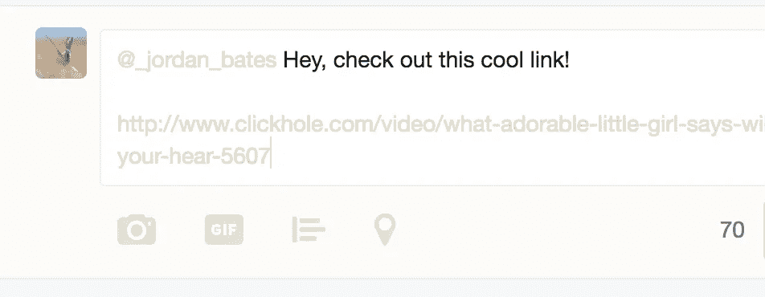
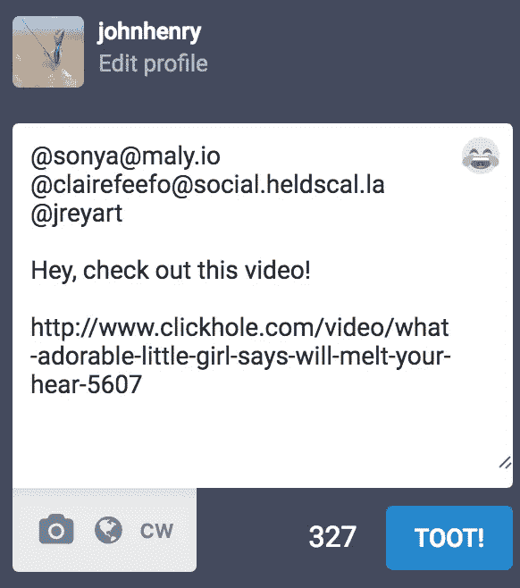
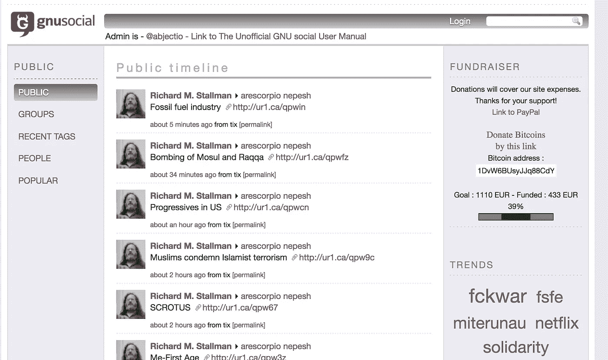

# 乳齿象已经死在水里了

> 原文：<https://medium.com/hackernoon/mastodon-is-dead-in-the-water-888c10e8abb1>

像许多其他人一样，这个周末我在 mastodon.social 上玩得很开心。许多[伟大的](https://mastodon.social/@five) [人](https://mastodon.social/@puellavulnerata) [从](https://mastodon.social/@sonya) [碎碎念](https://mastodon.social/@ultimape) [表现为](https://mastodon.social/@chenoehart) [向上](https://mastodon.social/@jdegoes)，以及[其他](https://mastodon.social/@brendaneich) [一般的](https://mastodon.social/@bcrypt) [酷](https://mastodon.social/@auerbach) [和](https://mastodon.social/@thegrugq) [出名的](https://mastodon.social/@meaningness) - [鱼](https://mastodon.social/@davatron5000) [人](https://mastodon.social/@aral)。

对于那些刚刚收听的人来说,《乳齿象》是 GNU Social 代码库的重新实现，它本身是——

> (好了，请大家耐心等待，我们将为大家奉上一大碗美味的礼仪汤)

——[OS tatus](http://ostatus.github.io/spec/OStatus%201.0%20Draft%202.html)协议的实现，最初源于 [GNU FM](https://www.gnu.org/software/gnufm/) 项目，后来与 [StatusNet](https://github.com/zh/statusnet) 和 [FreeSocial](https://github.com/UngPirat/freesocial) 项目合并，来自 [Identi.ca](https://github.com/dpearson/node-identi.ca) 的同一批人，后来合并为 [pump.io](http://pump.io/) ，它使用 [ActivityStreams](http://activitystrea.ms/) 规范以及类似 [PubSubHubBub](https://github.com/pubsubhubbub/PubSubHubbub) 、

明白了吗？好了，继续。

联盟背后的想法非常酷。如果我在 Twitter 上，想给我的朋友发消息，我需要他们的 Twitter 专用句柄:

但是如果我在一个联合网络上，比如乳齿象，我可以引用**更广泛的“fediverse”网络上的任何句柄，**我的消息(乳齿象中称为“嘟嘟”)将被传递给它们:

You’ll notice the quite-generous character limit of 500 on Mastodon

这太酷了。在我开始解释为什么 Mastodon(现在的样子)会失败之前，我想剖析一下 Mastodon 做对的所有事情，以及为什么它是分散计算运动中如此重要的垫脚石。

首先要注意的是，乳齿象是一个**漂亮、现代、随时可用的应用程序**，用户无需进行任何配置或设置。几乎所有开源社交网络的替代品要么很少关注用户界面，要么是为有多余时间的人编写的(建立他们自己的服务器，等等)。乳齿象解决了这个问题。你给一个电子邮件地址，一个乳齿象. social 实例的句柄，你就进入了。

很难轻描淡写地说一点点[设计](https://hackernoon.com/tagged/design)思考和关心用户是如何在采用这样的软件方面取得令人难以置信的进展的。想想乳齿象最亲密的同伴，受人尊敬的 GNU Social。如果你去 https://gnu.io/social/的，迎接你的是最基本的引导用户界面，或者是一个自我托管的选项，或者是一个包含一系列实例的[文本文件](http://skilledtests.com/wiki/List_of_Independent_GNU_social_Instances)，看起来像这样:

I should clarify that Richard Stallman is a literal hero, this just happens to be the first instance I clicked

我不想过于严厉地批评自由软件/开源平台所做的艰苦工作。从事这些项目的许多人都全职从事艰苦的、技术性的疏浚后端工作，以使这样的项目成为可能，乳齿象的成功得益于现有的“Fe diversity”网络。但是一个项目很少付出额外的努力来使它们的实例变得漂亮或可用，对于一个主要由一个人开发的项目来说，Mastodon 在这两个方面都得了 A。

第二，功能性。乳齿象的用户体验是 Tweetdeck 的升级版，Tweetdeck 是最受欢迎的第三方 Twitter 应用之一。而且功能性是**那里**，而且是**直观；**部分原因是 OStatus 协议的成熟，部分原因是描述了一个简单的实现，可能会以最小的痛苦推出，代价是可能破坏与 OStatus 规范的兼容性。

*   使用 Matrix.org 等身份映射系统来关联两个 WebFinger 身份，并调整乳齿象软件以允许跨多个实例/标识符跟踪用户。不清楚这将如何工作，但像 Matrix 这样的“映射”解决方案而不是典型的“提供者”解决方案的承诺是，它将极大地提高开发人员跨实例搜索更大的追随者社交图的能力(可能对隐私有一些影响)。

截至目前，我无法在当前情况下可靠地推荐使用 mastodon.social，但我想重申一下这个实验取得了多么令人难以置信的进展，以及我们多么迫切地需要像 Twitter 这样的集中式平台的替代品。感谢您的聆听。如果你想继续这个话题，你可以关注我的[该死的鸟网站](http://twitter.com/ckhonson)或者(我猜是叹气)的[乳齿象网站](http://mastodon.social/@johnhenry)，在那里我每天都会语无伦次地谈论类似的话题。

或者，随意评论[这里](https://news.ycombinator.com/item?id=14045014)

(更新:GNU FM 创始人 GNU social 联合创始人 Matt Lee 在[评论中做了一些很好的澄清)](https://news.ycombinator.com/item?id=14047605)

> [黑客中午](http://bit.ly/Hackernoon)是黑客如何开始他们的下午。我们是阿妹家庭的一员。我们现在[接受投稿](http://bit.ly/hackernoonsubmission)并乐意[讨论广告&赞助](mailto:partners@amipublications.com)机会。
> 
> 如果你喜欢这个故事，我们推荐你阅读我们的[最新科技故事](http://bit.ly/hackernoonlatestt)和[趋势科技故事](https://hackernoon.com/trending)。直到下一次，不要把世界的现实想当然！

