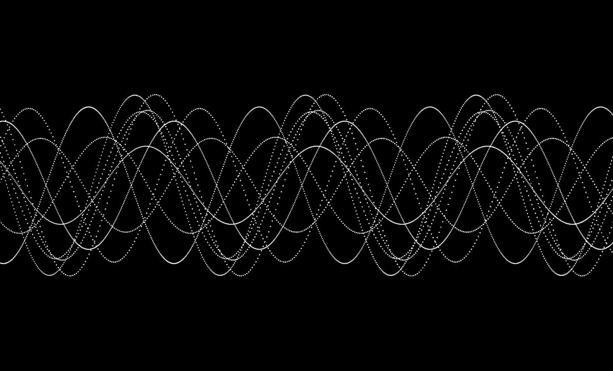
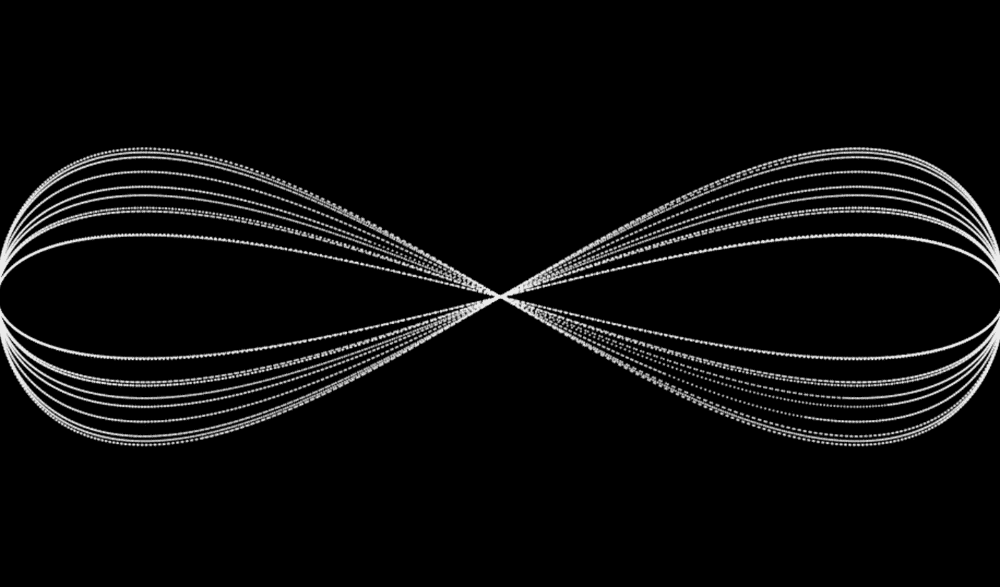
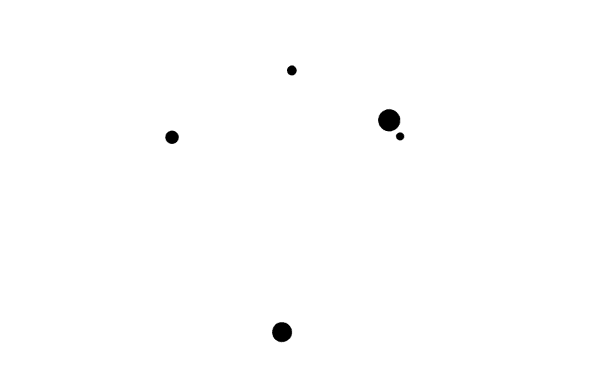
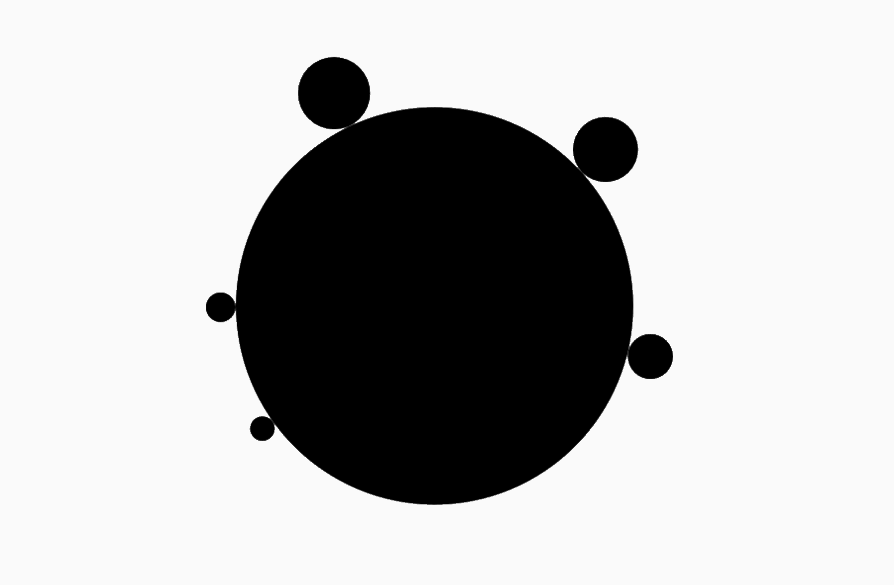
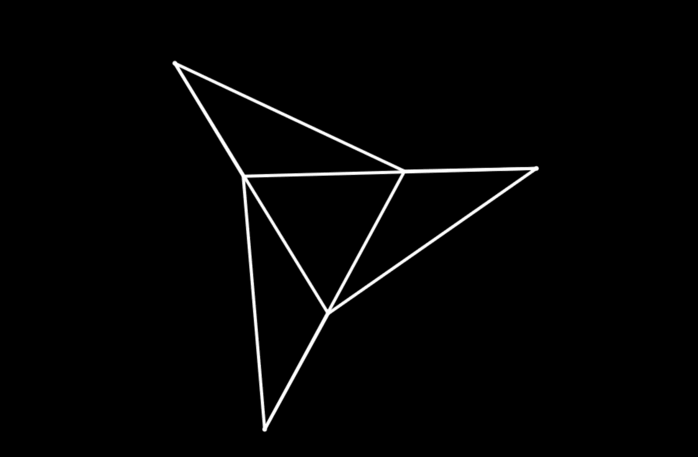

# Math.sin 和 math . cos——创造性编码者最好的朋友

> 原文：<https://medium.com/hackernoon/math-sin-and-math-cos-the-creative-coders-best-friend-597d69000644>



欢迎来到创造性编码基础的下一期。可以看之前的教程[这里](/@radarboy3000)。

**这一次我将带你了解创造性的程序员一直在使用的一个方便的代数:正弦和余弦——在 Javascript *Math.sin()* 和 *Math.cos()* 中。**

*这些教程的所有代码和库都可以在这里找到:*[*https://github.com/GeorgeGally/creative_coding*](https://github.com/GeorgeGally/creative_coding)

*如果您一直在跟进，那么做一个新的 git pull 来获取最新的代码。*


Sine wave osciallation

让我们从正弦波开始，它非常适合构建振荡器。 *Math.sin()* 将始终在-1，1 的值之间振荡。我们将它乘以一个振幅变量，得到一个振荡波效果。我们增加一个角度变量并通过 *Math.sin()传递它，而不是增加 speed_x 来改变粒子的 x 值，就像这样:*

```
var ctx = createCanvas("canvas1");var ball = {
    x: 0,
    y: h/2,
    speed_x: random(1),
    speed_y: random(1),
    size: random(10, 50),
    colour: rgb(0),
    angle: random(360)
  }function draw(){
  ctx.background(255);
  ball.angle += ball.speed_x;
  ball.rotation += 2;
  ball.x = w/2 + Math.cos(radians(ball.angle))*w/2;
  ctx.fillStyle = ball.colour;
  ctx.fillEllipse(ball.x, ball.y, ball.size);
}
```

为了从本教程的标题中获得正弦波效果，我们使用我们通常的粒子代码并振荡球的 y 位置(即。上下移动)同时左右移动球:

```
var ctx = createCanvas("canvas1");
var number_of_balls = 10;
var balls = [];
var radius = 200;
ctx.lineWidth = 1;
ctx.background(0);// push a ball and it's values into the array
for (var i = 0; i < number_of_balls; i++) {
  addBall(i);
}function addBall(i){
  var ball = {
    x: random(w),
    y: random(h),
    speed_x: random(1,4),
    speed_y: random(1,4),
    **amplitude: random(h/10,h/4),**
    size: 2,
    colour: rgba(255, 0.8),
    **angle_x: random(360),
    angle_y: random(360)**
  }
  balls.push(ball);
}function draw(){
  moveBall();
  drawBall();
}function moveBall(){for (var i = 0; i < balls.length; i++) {
    var b = balls[i];
    b.angle_x += b.speed_x;
    b.angle_y += b.speed_y;
    // move 
    **b.x = w/2 + Math.sin(radians(b.angle_x/5)) * w/2;**
    **b.y = h/2 + Math.sin(radians(b.**angle_y**)) * b.amplitude;**
  }}function drawBall(){
  for (var i = 0; i < balls.length; i++) {
    var b = balls[i];
    ctx.fillStyle = b.colour;
    ctx.fillEllipse(b.x, b.y, b.size);
  }
}
```

通过摆动球的 x 值，我们可以创造一些有趣的效果，就像这样:



Change the ball’s x-speed and to get some interesting effects

我用 Math.sin()和 Math.cos()做的最常见的事情就是画圆圈…

这很简单。使用我们相同的粒子代码，我们只是为粒子创建一个角度变量，然后使用 *Math.cos(angle)* 获得 x 位置，使用 *Math.sin(angle)* 获得 y 位置。我们把它乘以我们的半径和 walaa…我们有圆周运动…

```
var ctx = createCanvas("canvas1");
var number_of_balls = 5;
var balls = [];
*// radius of our circle*
**var radius = 200;**for (var i = 0; i < number_of_balls; i++) {
  addBall();
}function addBall(){
  var ball = {
    x: 0,
    y: 0,
    **speed: random(1),**
    size: random(10, 50),
    colour: rgb(0),
    **angle: random(360)** 
  }
  balls.push(ball);
}function draw(){ctx.background(245, 1);
  moveBall();
  drawBall();
}function moveBall(){for (var i = 0; i < balls.length; i++) {
    var b = balls[i];
    *// move the angle to rotate the balls*
    **b.angle += b.speed;** *// plot the balls x to cos and y to sin* **b.x = w/2 + Math.cos(radians(b.angle))*radius;
    b.y = h/2 + Math.sin(radians(b.angle))*radius;**
  }}function drawBall(){
  for (var i = 0; i < balls.length; i++) {
    var b = balls[i];
    ctx.fillStyle = b.colour;
    ctx.fillEllipse(b.x, b.y, b.size);
  }
}
```



好了，我们有了圆周运动，现在让球在圆周上运动……非常简单，我们只需改变我们的 *draw()* 函数，画一个半径两倍大的椭圆:

```
function draw(){
  ctx.background(245, 1);
  ctx.fillStyle = "black";
  **ctx.HfillEllipse(w/2, h/2, radius*2);**
  moveBall();
  drawBall();
}
```

请注意，我使用了一个新的椭圆绘制函数， *HfillEllipse()，这个*与 fillEllipse()完全相同，只是分辨率更高，也就是说，我们得到了更平滑的边缘。我通常用它来画更大的圆，让它们看起来更好，但是要注意，不要什么都用它，否则你会有性能问题。

然后，我们还需要修改我们的 *moveBalls()* 函数，以考虑单个球的大小，这样球就可以在圆上滚动…这很简单，我们只需将球的一半大小加到半径上:

```
function moveBall(){for (var i = 0; i < balls.length; i++) {
    var b = balls[i];
    // move the angle to rotate the balls
    b.angle += b.speed;
 **b.x = w/2 + Math.cos(radians(b.angle))*(radius+b.size/2);
    b.y = h/2 + Math.sin(radians(b.angle))*(radius+b.size/2);**
  }}
```

然后嘣，我们有了这个…



Balls on a ball!

比方说，我们想把球均匀地分布在圆圈上……我们可以用这样一个公式:

```
ball_number/total_number_of_balls * 360;
```

我为此创建了一个函数:

```
function distributeAngles(me, total) {
    return me/total * 360;
}
```

创造性的编码，通常只是简单概念的组合，使事情变得稍微复杂一些。我们现在有了所有需要的工具来创建一个稍微复杂一点的东西，就像这样:



我们有两组粒子，外粒子和内粒子。我把这些放在叫做内部和外部的物体中。注意，我已经为每个对象添加了一个名为 particles 的空数组，这样我们就可以存储我们的粒子了

```
var ctx = createCanvas("canvas1");// create two objects
var inners = {
  count: 3,
  radius: 220,
  speed: random(2)/100,
  **particles: []**
};var outers = {
  count: 3,
  radius: 100,
  speed: random(-2)/100,
  **particles: []**
}; 
```

现在我们可以添加粒子值。注意，我将整个对象传递给了 addParticle()函数，这使得访问它的值变得很容易。然后我们用和上面一样的方法计算出粒子的角度值。注意，我们并不真的需要计算 x 和 y 值，因为我们将在以后的每次循环迭代中这样做:

```
for (var i = 0; i < outers.count; i++) {
  **addParticle(i, outers);**
}for (var i = 0; i < inners.count; i++) {
  **addParticle(i, inners);**
}// pass in the object
function addParticle(_i, _object){**var _angle = radians(distributeAngles(i, _object.count));**var particle = {
    x: 0,
    y: 0,
    speed: _object.speed,
    angle: _angle,
    radius: _object.radius
  }_object.particles.push(particle);}
```

好了，谜题的最后一部分来了。请注意，每个内部粒子都与每个外部粒子相连。因此，我们在外部粒子的每次迭代中遍历所有内部粒子，就像这样:

```
*// draw and move particles*for (var i=0; i< outers.count; i++) {
  *// move the outer particles* for (var j=0; j< inners.count; j++) {
     // move inner particle   
     // then connect it to the outer particle   
  }}
```

所以让我们把它放在一个函数里。注意，我们把 canvas.width/2 加到 x 值上，把 canvas.height/2 加到 y 值上。然后我们从内部粒子到外部粒子画一条线:

```
function drawLines(){ for (var i=0; i< outers.count; i++) { var outer = outers.particles[i];
    **outer.angle += outer.speed;
    outer.x = w/2 + Math.cos(outer.angle) * outer.radius;
    outer.y = h/2 + Math.sin(outer.angle) * outer.radius;** for (var j=0; j< inners.count; j++) {
      var inner = inners.particles[j];
      **inner.angle += inner.speed;
      inner.x = w/2 + Math.cos(inner.angle) * inner.radius;
      inner.y = h/2 + Math.sin(inner.angle) * inner.radius;
      ctx.line(inner.x, inner.y, outer.x, outer.y);**
    } }}
```

仅此而已。我们完了。快乐编码。

像往常一样，我的 github 上有完整的代码:[https://github.com/GeorgeGally/creative_coding](https://github.com/GeorgeGally/creative_coding)

**在 Instagram 上关注我这里:**[https://www.instagram.com/radarboy3000/](https://www.instagram.com/radarboy3000/)

**在这里关注我的推特:**[**https://twitter.com/radarboy_japan**](https://twitter.com/radarboy_japan)

**又如我这里的脸书页:**[](https://www.facebook.com/radarboy3000)

**[](http://bit.ly/HackernoonFB)****[](https://goo.gl/k7XYbx)****[](https://goo.gl/4ofytp)**

> **黑客中午是黑客如何开始他们的下午。我们是这个家庭的一员。我们现在[接受投稿](http://bit.ly/hackernoonsubmission)并乐意[讨论广告&赞助](mailto:partners@amipublications.com)机会。**
> 
> **如果你喜欢这个故事，我们推荐你阅读我们的[最新科技故事](http://bit.ly/hackernoonlatestt)和[趋势科技故事](https://hackernoon.com/trending)。直到下一次，不要把世界的现实想当然！**

****