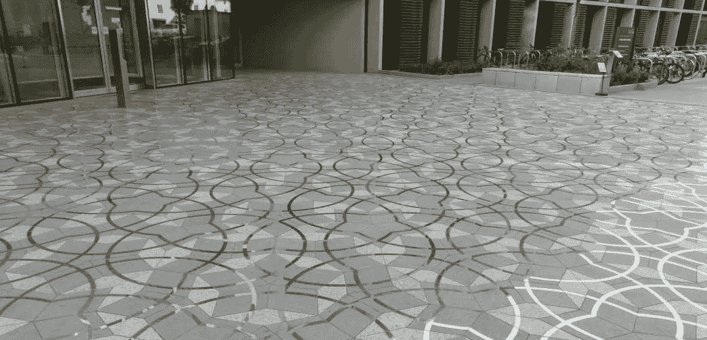
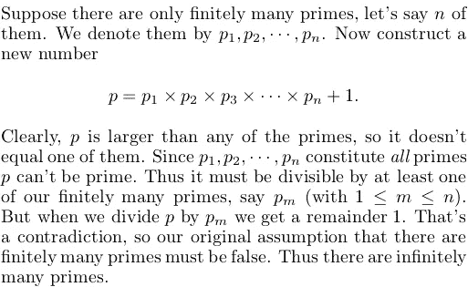

# 数学是艺术(所有数学家都这么说)

> 原文：<https://medium.com/hackernoon/mathematics-is-art-all-the-mathematicians-say-so-d0d569f89976>

## 数学需要的唯一理由

数学还是艺术？

这个问题是教育辩论的主要内容。它每隔几年出现一次，数学总是胜出。数学在世界各地的课程安排中占据了很高的位置，仅次于英语学习(T2)。

英国的[英语学士学位](https://www.gov.uk/government/publications/english-baccalaureate-ebacc/english-baccalaureate-ebacc)，美国的[共同核心州立标准](http://www.corestandards.org)和 [PISA 国际比较](https://www.oecd.org/pisa/aboutpisa/)的焦点揭示了教育政策的现状:数学是学校课程的国王。

> 课程规划的计算让许多学科——尤其是艺术——无所事事。在最极端的情况下，甚至游戏时间和体育课都要让位于“提高数学水平”的压力。

逻辑表明，作为一名数学家和教育家，我应该欢迎我喜欢的学科所获得的专注，我应该坚定地捍卫数学，反对偏见的指控。其实我很绝望，因为学校的数学是对我爱上的数学的屠杀。

教育政策有一个可悲的讽刺。在试图利用人类推理和解决问题的潜力——这些技能对我们经济的未来至关重要——时，政策制定者忽略了所有数学真理中最重要的一条:

> 数学是艺术。

我不是指几何学。当然，我一看到分形就心跳加速。我甚至参加了牛津徒步旅行，庆祝数学和设计的结合。但是数学超越了这些视觉形式。

The Penrose tiles outside the Mathematical Institute of Oxford — a literal case of ‘maths is art’

不，我说的是数学唤起的情感。当你沉浸在一个数学问题的梦幻怀抱中时，你有没有感到一阵兴奋？我有；把未知变成已知的满足感是巨大的。也是深具先天。

但是不要相信我模糊的说法——事实上，每一位思考过他们学科本质的数学家都谈到了它的艺术魅力。

在给数学系学生的笔记中，迈克尔·阿提亚建议:

> “好的数学的艺术，数学是一种艺术，是识别和解决既有趣又可解决的问题。”

“有趣”这个词并非没有主观性。一个训练有素的数学家当然可以利用他们深厚的知识和经验来过滤问题，但是确定一个问题是否值得你花时间也需要个人的判断。如果这是“好数学”,那么学校教育中的“坏数学”就剥夺了学生提出自己的问题，或者思考是什么让一个问题变得有趣或可解的权利。

在他著名的道歉中，G·H·哈代明确承认

> *“我只对作为创造性艺术的数学感兴趣。”*

当你考虑到哈代是一位纯粹的数学家时，这是一个惊人的说法。哈代非常注重严谨和证明的形式。他的手稿充满了象征性的抽象概念，不会立即给人以创造性或艺术性的印象。然而，对哈代来说，一个数学论证，虽然与逻辑联系在一起，却必须用艺术来精心制作。

这位顽固的思想家并非没有感觉:

> 像创造性艺术一样，数学促进并保持一种高尚的思维习惯，增加数学家和其他人的快乐

哈代在数学推理中找到了乐趣。他卓越的智力与对数学家主要目的的简单理解相匹配:

> "数学家就像画家或诗人一样，是图案的制造者."

哈代甚至为“严肃”的数学制定了一个标准:

> “美丽是第一个考验。丑陋的数学在世界上没有永久的位置。”

大部分学校数学，由于其对繁琐程序的严格关注，将无法通过哈代的测试。与哈代同时代的伯特兰·罗素用数学的美来定义数学:

> “正确地看待数学，它不仅拥有真理，而且拥有至高的美——一种冷酷而朴素的美……极其纯洁，能够达到只有最伟大的艺术才能表现出的严格的完美。”

在哈代道歉的地方，数学家出身的教师保罗·洛克哈特[哀叹道](https://www.maa.org/external_archive/devlin/LockhartsLament.pdf)。他的两篇文章以对学校数学的严厉抨击开始:

> “没有一个社会会将如此美丽而有意义的艺术形式简化为如此无脑而琐碎的东西；没有哪种文化会如此残酷地剥夺儿童如此自然、令人满意的人类表达方式。”

洛克哈特也无法逃避数学作为艺术本身的特征:

> “数学是最纯粹的艺术，也是最容易被误解的艺术……数学家的艺术是对我们想象的创造物提出简单而优雅的问题，并做出令人满意而美丽的解释。”

我们可以对艺术的精确定义吹毛求疵，但无论是什么使音乐、诗歌和绘画成为艺术形式，都必须适用于数学。艺术在于过程，而不在于结果。我们用情感和理智体验艺术。我们对它有心理和生理上的——甚至是精神上的——反应。数学，就其真实形式而言，也是如此。虽然数学真理是绝对的，但我们发现和接触这些真理的方式却绝非如此。

Euclid’s proof of the infinitude of primes — cited by Hardy (and many others) as his favourite piece of mathematics. The beauty lies in the simplicity and power of the argument.

这些结论给教育者提出了新的挑战。他们认为数学教育的目的不仅仅在于技能和理解，还在于美。对于教师来说，要向学生传达数学之美，他们必须首先亲身体验，摆脱自己对数学是一堆死板的机械真理的印象。

在政策层面，数学的基本原理需要重新思考。数学因其实用性而受到重视，然而学校数学的内容和形式充斥着死记硬背的程序，违背了这一目的。

> 课程和评估必须考虑到数学的整体性。

培养一代批判性思考者的最好方法是让学生沉迷于解决问题。数学只有在被美化后才能实现这一点——当它作为一门艺术被接受时。预期的经济成果将随之而来。

正如艺术应该在学校课程中得到更多关注一样，数学也需要更多关注其艺术形式。对数学的辩护和对艺术的辩护没有什么不同。这是因为数学是艺术——不多也不少。

*我是一名研究数学家，后来成为教育家，致力于数学、教育和创新的结合。*

*上* [*Twitter*](https://twitter.com/fjmubeen) *或*[*LinkedIn*](https://uk.linkedin.com/in/junaidmubeen)*。*

*如果你喜欢这篇文章，你可能想看看我的以下作品:*

 [## 那次我“几乎”解决了孪生素数猜想

### 我第一次真正的数学经历

hackernoon.com](https://hackernoon.com/the-time-i-nearly-solved-the-twin-prime-conjecture-8f033030fe90)  [## 我不再理解我的博士论文(以及这对数学教育意味着什么)

### 本周早些时候，我通读了我的博士论文。我的研究是在一个叫做泛函的纯数学领域…

medium.com](/@fjmubeen/ai-no-longer-understand-my-phd-dissertation-and-what-this-means-for-mathematics-education-1d40708f61c) 

> [黑客中午](http://bit.ly/Hackernoon)是黑客如何开始他们的下午。我们是 [@AMI](http://bit.ly/atAMIatAMI) 家庭的一员。我们现在[接受投稿](http://bit.ly/hackernoonsubmission)，并乐意[讨论广告&赞助](mailto:partners@amipublications.com)机会。
> 
> 如果你喜欢这个故事，我们推荐你阅读我们的[最新科技故事](http://bit.ly/hackernoonlatestt)和[趋势科技故事](https://hackernoon.com/trending)。直到下一次，不要把世界的现实想当然！

