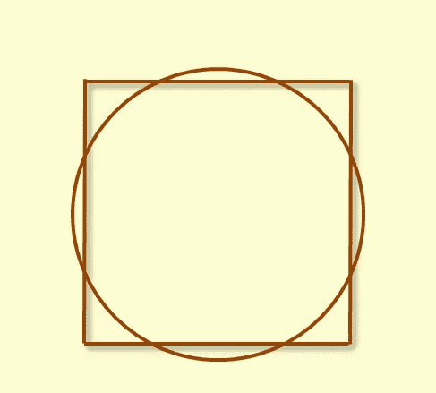
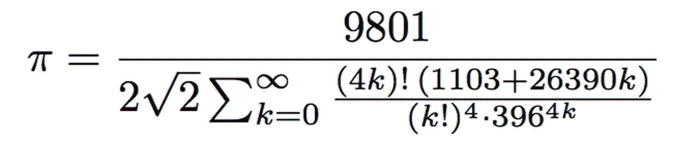
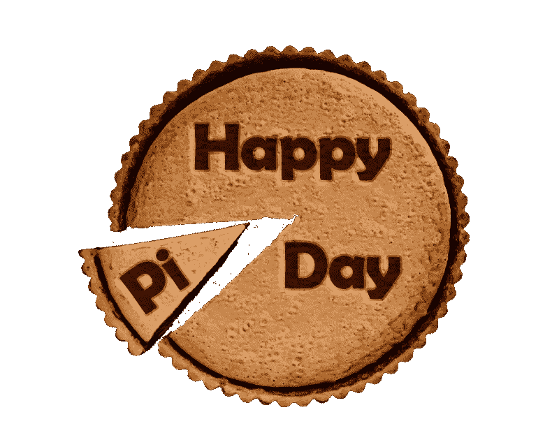

# 没有历史的数学是没有灵魂的

> 原文：<https://medium.com/hackernoon/mathematics-without-history-is-soulless-978436602fa4>

## π千古

我把假期的一部分用来研读莱茵纸莎草纸。这是一本引人入胜的读物。这幅 5 米长的卷轴绘制于公元前 1650 年(现藏于大英博物馆)，记录了埃及丰富的数学遗产。吉萨金字塔巍然屹立，证明了埃及人惊人的测量技能和气质。莱茵纸莎草纸汇集了他们对算术和几何的更广泛的贡献。它包括埃及人自己的十进制计数系统和一系列问题，展示了对单位分数的非凡天赋。

Problem 50 of the Rhind Papyrus, which gives rise to an approximation of π

纸莎草纸也记载了一种原始但优雅的估算π *值的方法。*更准确地说，埃及人估算直径为 9 的圆的面积，首先砍掉其直径的九分之一，然后构建一个边长为这个直径的正方形，最后计算正方形的面积。

‘Squaring’ the circle to approximate π ([source](http://jacqkrol.x10.mx/content/math/calc-hist-archimedespi.shtml))

由于圆的实际面积是π*(9/2)，而正方形的面积是 8，这就归结为将π估计为 256/81，约为 3.16，在实际值的 1%以内。对于公元前 1650 年来说还不错。

自古以来，我们就知道π是一个常数，也就是说，一个圆的周长与直径之比总是相同的，不管它的大小如何。你的衬衫纽扣和地球的赤道(假设它们都是正圆，请原谅我)将返回完全相同的比例。

长期以来人们怀疑π是一个无理数，以至于它的十进制展开永远不会穷尽或重复(这在 18 世纪最终被证明)。因此，对每一个主要文明来说，接近π都是一项热爱的工作。阿基米德通过使用涉及任何大小多边形的迭代法，取得了巨大的进步。到五世纪，中国人掌握了π到小数点后七位。斯里尼瓦瑟·拉马努金——他 [*知道无穷大*](http://www.robertkanigel.com/_i__b_the_man_who_knew_infinity__b___a_life_of_the_genius_ramanujan__i__58016.htm) (似乎还有π)——在 20 世纪早期以无穷和的形式对π进行了惊人的奇特表述。现代计算方法可能已经不再令人兴奋了，达到了 22 万亿位(然而它们就像中国人一样只差小数位数)。

Ramanujan’s approximation — *outrageous* isn’t the word

这仅仅是人类对π的永恒迷恋的一瞥。它不仅仅是一个数字，它跨越了多个领域——算术、几何、代数等等——至今仍令各行各业的数学家困惑和欣喜。

现在考虑在学校遇到的π的简洁形式。π作为圆的周长与直径之比被明确地介绍给学生。π的恒常性没有任何意义；没有阴谋。虽然不能指望学生们去努力解决这个性质的复杂的几何证明，但是探究这个定义和探索不同的圆的维度是一个有教育意义的时刻。一旦π的恒定性被批判性地接受，围绕地球问题的[弦就是一个喜悦。](http://mathforum.org/mathimages/index.php/Rope_around_the_Earth)

相反，学生们被束缚在计算面积、周长、弧长、体积等的苦差事上——整理他们没有完全掌握或关心的π公式。其中热情的人会把π的前 10 位数字记住；自称 genii 的会更进一步。他们可能会听到π的无限十进制扩展，却从未思考过无理数是如何让数字记忆变得无用的。他们可能会沉浸在[圆周率日](http://www.piday.org)中，错过了通过将其简化为粗略的两位小数形式来庆祝这一数学瑰宝的讽刺。

March 14 is Pi day — good for puns if not mathematical understanding

当[数学](https://hackernoon.com/tagged/mathematics)脱离其历史时，这就是随之而来的滑稽模仿。我们学习历史是为了理解我们是如何走到今天的。我们探索过去人类行为的原因和影响，我们研究反事实来理解可能发生的事情。这就是我们作为一个物种如何进步的；我们认识到我们的历史轨迹是偶然的。我们不接受我们当前的状态是不可改变的。

对于有抱负的数学家来说应该没什么不同。学生们需要明白数学思想不是凭空产生的。它们随着人类探索和提问而逐渐发展，通常伴随着巨大的斗争、回报和惊喜(π是常数真的很明显吗？)数学发现的过程是杂乱的、不确定的，即使最终结果看起来是干净的。

我们现在对π的理解，只来源于站在过去数学巨人的肩膀上。他们都是人类理解宇宙语言的永恒探索的参与者。数学是对学生进行这一旅程的公开邀请，但首先他们必须站在他们前辈的立场上，因为那是我们最深刻的数学见解所在。如果不记录过去理解和近似π的尝试，就无法欣赏π的惊人之美。

历史背景赋予了数学(以及数学家，我敢说)丰富的个性，而这种个性在正式的学习中往往会丢失。它揭示了数学人性的一面；追求新的数学前沿的痛苦和狂喜。它将奋斗和坚持视为普通数学家的特征。它摒弃了许多学生对数学的二元观点，取而代之的是一个充满发现和惊喜的世界。

不关注数学的历史，任何数学研究都不能被认为是完整的。

我是一名研究数学家，后来成为了一名教育家，致力于数学、**教育和创新。**

**来打个招呼上*[*Twitter*](https://twitter.com/fjmubeen)*或者*[*LinkedIn*](https://uk.linkedin.com/in/junaidmubeen)*。**

*如果你喜欢这篇文章，你可能想看看我的以下作品*

* [## 18 世纪 80 年代的一个男孩奇迹向我们展示了学校数学出错的地方

### 高斯的天才及其对教育者的启示

mystudentvoices.com](https://mystudentvoices.com/a-boy-wonder-from-the-1780s-shows-us-where-school-maths-gets-it-wrong-bd19c7af7b5c)  [## 我的侄子带回家这个危险的数学问题

### 接下来发生的是对学校数学的可悲控诉。

brightreads.com](https://brightreads.com/my-nephew-brought-home-this-menacing-maths-problem-e8bbba30e5cb)  [## 数学是艺术(所有数学家都这么说)

### 数学需要的唯一理由

hackernoon.com](https://hackernoon.com/mathematics-is-art-all-the-mathematicians-say-so-d0d569f89976) *