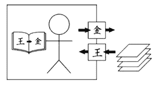
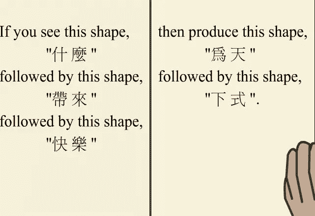

# 数学系学生被困在塞尔的中文教室里

> 原文：<https://medium.com/hackernoon/maths-students-are-trapped-in-searles-chinese-room-d5ab9eafbc51>

## 随着对强人工智能探索的展开，我们是否正在失去对人类智能的控制？

你在一个封闭的房间里。一个过路人在门下塞了一张纸条，上面有一个用中文写的问题列表。坏消息是你一句中文也不懂(只有你知道)。好消息是:在房间里，有一本用英语写的指导手册，指导你一步一步地把给定的字符转换成一组与答案相对应的新字符。过路人收到你的回答，并确信你懂中文。

这是对约翰·塞尔的名副其实的[“中国房间”思想实验](http://www.iep.utm.edu/chineser/)的一个小小的修饰。塞尔在探索机器智能的本质。他的实验表明，智能不是简单地通过对符号进行形式运算就能实现的(机器就是为此而造的)。因此，[著名的计算机图灵测试](http://www.turing.org.uk/scrapbook/test.html)是有缺陷的，因为它将智能简化为纯粹的语法形式。

Delightfully simple illustration of the Chinese room experiment ([source](https://ocw.mit.edu/courses/electrical-engineering-and-computer-science/6-080-great-ideas-in-theoretical-computer-science-spring-2008/))

你能够操纵中文，以至于用同一种语言回答问题，但你不能给那些讨厌的符号赋予意义或上下文。你一点也不懂中文。仅有外表的智慧是不够的。

> 塞尔不需要思想实验来证明他的观点。“中文教室”的场景是全世界数学教室的现实。

大多数五年级学生都能做长除法。它是由课程标准规定的，由教师操练的，并在教科书中反复出现。长除法表现为固定的计算序列。这是无可辩驳的；一些要学但不理解的东西，以流利的名义记忆。[学生们](https://goo.gl/GX0Df3)扮演符号推手的角色，他们使用“公交车站法”和其他类似的技巧来快速解决特别关注的长除法问题。然而，他们无法理解为什么他们的方法有效。

> 学生对数学概念的理解在无脑程序的重压下下降了。

Replace the Chinese symbols with mathematical ones and you have the perfect imitation of most textbooks ([source](http://www.mind.ilstu.edu/curriculum/searle_chinese_room/searle_chinese_room.php))

我的目标是长除法，但你可以用它来代替几乎任何课程主题，以及其他领域。塞尔的实验将为那些像我一样，在理解能力有限的情况下学习阅读、写作和背诵阿拉伯语的人挖掘记忆。这种奇异的知识状态是西方世界许多用心良苦的宗教学校所遵循的以训练为基础的教学方法的结果。我会玩阿拉伯语，但我不懂它。

回到[数学](https://hackernoon.com/tagged/mathematics)的领域，算法和程序不是符号推送的罪魁祸首(如果你对这些物体有亲和力，你甚至会认为它们是受害者)。这个可疑的荣誉属于那些认为不理解就强行灌输概念是合适的人。

数学程序的知识必须和概念理解一起培养，[尤其是因为它们相互加强](http://cognitrn.psych.indiana.edu/rgoldsto/courses/cogscilearning/starprocedural.pdf)。

如果缺乏理解，任何种类的数学知识都是用词不当。它让学生回到中文教室，盲目地操作语法，并在指令性教学材料的帮助下成功地回答问题。推动符号给人智能的表象；这让学生觉得自己很聪明。他们从学校毕业，用数学教育规定的工具武装自己。他们可以*做*数学，但他们并不真正*知道*它。他们很快就会悲惨地意识到，接受教育并不是展示智慧。

塞尔的思想实验不无讽刺。他模拟了人类的行为来揭示智能的本质，根据他的结论，智能是计算机难以捉摸的。我想知道塞尔是否反思了数学教育的现状。然后，他可能会发现，我们正在教育人类远离智力中的注意因素，而转向计算机的句法倾向。

> 图灵测试可能终究是有意义的，但这仅仅是因为我们将人类的智力降低到了一种计算的形式。

现代神童能够以惊人的速度和准确度进行计算。她能模仿机器的计算能力。这是讽刺命运的另一个转折。“计算机”一词起源于十九世纪，当时指的是从事计算工作的人。那是我们的名片。但是今天的硅计算机让这些工作变得毫无意义。

数学教育的程序焦点使我们回归到十九世纪区分人类的核心能力。可悲的是，这种智力观不适合机器时代。只有通过重新认识我们独特的人类能力，我们才能给学生提供他们在当今以硅为动力的世界中所需要和应得的数学教育。

我们需要摆脱中文教室的谬误。

我是一名研究数学家，后来成为了一名教育家，致力于数学、教育和创新的结合。

*上* [*来问好*](https://twitter.com/fjmubeen) *或*[*LinkedIn*](https://uk.linkedin.com/in/junaidmubeen)*。*

*如果你喜欢这篇文章，你可能想看看我的以下作品:*

 [## “牧羊人多大了？”—动摇学校数学的问题

### 如何将学生从权威的数学教学中解放出来

mystudentvoices.com](https://mystudentvoices.com/how-old-is-the-shepherd-the-problem-that-shook-school-mathematics-ad89b565fff)  [## 西蒙·派珀特梦想着一场学习革命——为什么它没有发生？

### 艾创始人的遗产悬而未决

medium.com](/@fjmubeen/seymour-papert-dreamed-of-a-learning-revolution-why-hasnt-it-happened-b280f542e4ff)  [## 绘制教育中人机大战的图表

### 技术支持的教师将如何引领教育的未来

medium.com](/@fjmubeen/charting-the-battle-of-man-vs-machine-in-education-6495ee755f6e) 

> [黑客中午](http://bit.ly/Hackernoon)是黑客如何开始他们的下午。我们是 AMI 家庭的一员。我们现在[接受投稿](http://bit.ly/hackernoonsubmission)并乐意[讨论广告&赞助](mailto:partners@amipublications.com)机会。
> 
> 如果你喜欢这个故事，我们推荐你阅读我们的[最新科技故事](http://bit.ly/hackernoonlatestt)和[趋势科技故事](https://hackernoon.com/trending)。直到下一次，不要把世界的现实想当然！

