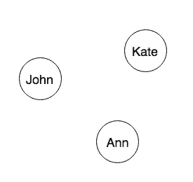
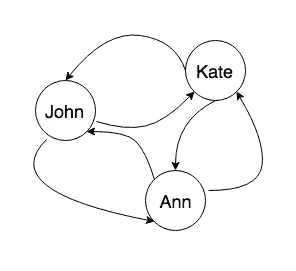
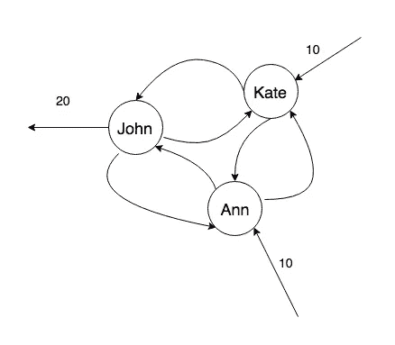
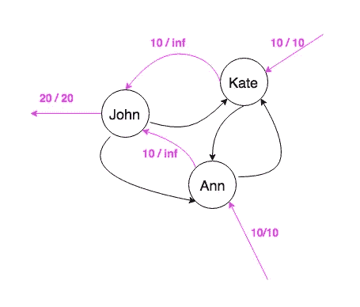

# 现实生活中的最大流算法

> 原文：<https://medium.com/hackernoon/max-flow-algorithm-in-real-life-551ebd781b25>

我平时空闲时间不会想到算法。我宁愿锻炼或做任何让我暂时忘记软件工程的事情——他们说保持你的生产力很重要。但时不时地，我会在手机上下载一个新的应用程序，我有兴趣知道这个应用程序是如何工作的，以及它背后的算法是什么(对任何软件工程师来说都是一个很好的练习)。

我最近搬到旧金山工作。我和两个室友合住一套公寓，我们用一个应用程序(我不会说出它的名字，因为他们没有付钱让我为他们的产品做广告)来帮助我们平均分摊房屋费用。正如你可能猜到的，我试图确定它是如何实现的。

## 最大流量定理

对于那些不熟悉这个[算法](https://hackernoon.com/tagged/algorithm)的人，我建议你快速浏览一下它的维基百科页面。如果你是计算机科学或任何相关专业的学生，你可能已经在你的一门算法设计课上，用这个定理解决了任何类型的问题。你甚至可能会问自己“我真的会在现实生活中使用它吗？”。

事不宜迟，这里有一个很酷的方法，我认为有人可以实现一个费用分摊应用程序。

## **大卡哈纳**

假设我们有三个室友:约翰、凯特和安。

John 总共支付了 40 美元的费用，而 Kate 和 Ann 各支付了 10 美元(这个简单的示例演示了 Max Flow 在此场景中的用途)。你如何平均分配这笔钱？

我们需要按照以下步骤构建一个最大流图:

1-计算支付的总金额。

**金额= 40+10+10 = 60 美元**

2-计算每个人应该支付多少钱:

**due perperson = Amount/# people = 60/3 = 20 美元**

3-计算每个人支付的金额与**支付人**支付的金额之间的差额

**diff(John)= 40–20 = 20**

**diff(Kate)= 10–20 =-10**

**diff(Ann)= 10–20 =-10**

4-在图表中为每个人创建一个节点

创建一条容量等于∞的边，连接图中的每个人和其他人

each edge has capacity ∞ in this graph

6-现在，对于之前计算的每个**差异**，如果值为负，则意味着该人仍然需要偿还某人:我们向用户添加一个向内的边缘，其容量等于| **差异**|(**差异**的绝对值)。这代表了资金流入网络。否则，我们创建一个容量等于 **diff** 的向外边缘。正如你所猜测的，这将代表从图中流出的钱。这样，我们就能确保每个人支付正确的金额，每个人都能得到他们应得的报酬。

20, 10, 10 represent the capacities of the 3 edges

应用最大流算法将产生多个路径，这些路径表示从一个用户到另一个用户的资金流动，这相当于在用户之间平均分配费用。

10 / inf means there is a flow of 10 on the edge of capacity equal to infinity

酷吧。

下次你学习一个算法的时候，不要问自己“我真的会在现实生活中用到这个吗？”。答案是肯定的。

日安。

> [黑客中午](http://bit.ly/Hackernoon)是黑客如何开始他们的下午。我们是 [@AMI](http://bit.ly/atAMIatAMI) 家庭的一员。我们现在[接受投稿](http://bit.ly/hackernoonsubmission)并乐意[讨论广告&赞助](mailto:partners@amipublications.com)机会。
> 
> 如果你喜欢这个故事，我们推荐你阅读我们的[最新科技故事](http://bit.ly/hackernoonlatestt)和[趋势科技故事](https://hackernoon.com/trending)。直到下一次，不要把世界的现实想当然！

