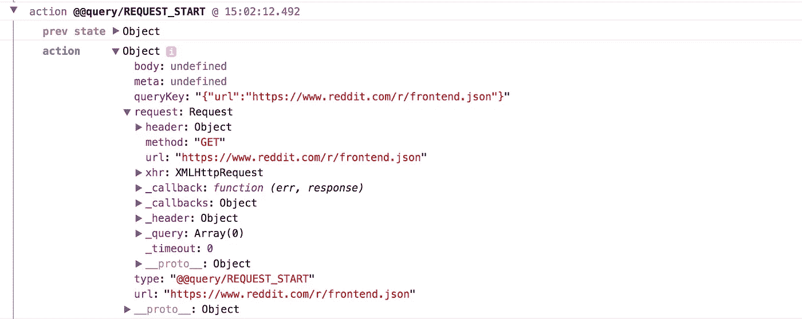
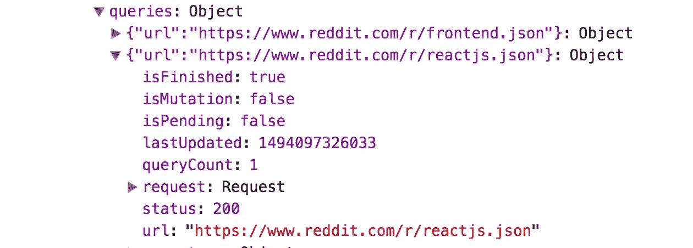
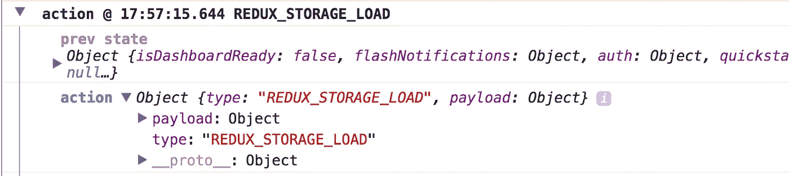
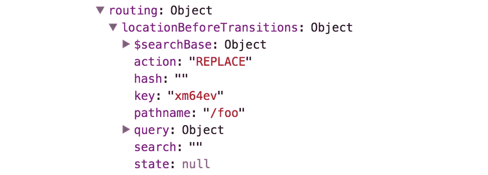

# 使用 Redux 最大化可调试性

> 原文：<https://medium.com/hackernoon/maximizing-debuggability-with-redux-2f0bb43054d8>


在我的上一篇博客文章 [Redux 登录生产](https://blog.logrocket.com/redux-logging-in-production-3b2a4816b713)中，我讨论了使用 Redux 最重要的好处之一——可调试性。通过使用像 LogRocket 这样的前端日志工具，开发人员可以通过检查导致 bug 的`actions`和`state`变更，轻松理解并修复产品中棘手的 bug。

虽然这些信息在任何 Redux 应用程序中都非常有用，但是通过设计一个考虑到日志的应用程序，我们还可以实现更多。在这篇文章中，我将介绍一些库和抽象，它们通过将尽可能多的应用程序数据放入 Redux，使得 Redux 日志*更加有用。*

# 数据提取

通过网络获取/发送数据是任何应用程序中最容易出错的部分之一。连接、意外数据或不正确的逻辑都可能导致问题。轮询、重试逻辑、乐观突变等使事情变得更加复杂。

像 GraphQL 的 **apollo-client** 和 REST 的 **redux-query** 这样的库都有助于通过 redux 从网络获取数据。它们使用 Redux 作为持久层，这意味着在调试问题时，您可以检查您的 Redux 日志，以查看这些客户端获取了哪些数据以及正在进行的请求的状态。

让我们看看 redux-query 生成的 Redux 日志:



这里我们看到了`REQUEST_START`动作，它对应于一个被初始化的查询。查看 action 有效负载，我们可以看到请求中的所有信息，这使得调试变得很容易。一旦收到响应，`redux-query`就会发出一个`REQUEST_SUCCESS`动作，其中包含关于响应的所有信息。

记录请求和响应只是`redux-query`魔力的一部分。深入到`store`我们看到一个键`queries`，在那里`redux-query`保持其内部状态。



上面，我们看到了应用程序执行的每个查询的对象(一个到`reddit.com/r/frontend.json`，一个到`reddit.com/r/reactjs.json`)。在调试问题时，我们可以深入这个状态对象，查看正在进行的请求、`queryCount`(如果我们在查询上轮询)和计时的信息。

在 Redux 中存储这些信息非常重要，因为它将所有网络活动的完整上下文放在 Redux 日志中。

## 滚动您自己的数据获取“框架”

如果您喜欢更简单的方法，您可以通过在查询和从网络接收数据时简单地分派显式操作来构建自己的数据获取“框架”。

例如，假设我们正在构建一个博客应用程序。在查询帖子时，我们会调度`POSTS_QUERY_INIT`。然后，缩减器可以适当地更新状态，以表明 posts 查询正在进行中。

```
postsQuery: {
  url: 'api.blog.com/posts',
  isPending: true,
  ...
}
```

在`thunk`或`saga`中，我们会调用`fetch`，当承诺完成时，我们会发出类似于`POSTS_QUERY_SUCCESS`或`POSTS_QUERY_FAILURE`的动作。这将相应地将状态更新为:

```
postsQuery: {
  url: 'api.blog.com/posts',
  isPending: true,
  data: [...],
}
```

这个例子并不全面，但是它的思想是，通过为请求生命周期的每个部分显式地使用 Redux 操作，可以很容易地调试任何潜在的竞争条件或网络错误。

# 处理非确定性的其他来源

除了网络抓取之外，还有许多其他的不确定性来源会导致 bug。幸运的是，我们也可以使用 Redux 来在出现 bug 时留下完整的日志。

## websockets

当在 websocket 上侦听时，我们可以在接收到数据时调度一个动作，并适当地将数据减少到存储中。例如:

```
myWebSocket.onmessage = function (event) {
  store.dispatch({ 
    type: 'BLOG_POST_UPDATE_RECEIVED',
    payload: event,
  } 
}
```

这样，当查看 redux 日志中的错误或用户报告的问题时，我们可以看到通过 websocket 接收到的所有数据，更重要的是，可以及时将其与其他 Redux 操作和网络请求关联起来。

## 局部存储器

通常，一个应用程序需要在第一次启动时从本地存储器中读取数据。为此，您可以使用`redux-storage`,这是一个方便的库，便于将状态转储到本地存储，并读取/合并回状态。



每当`redux-storage`从 redux 加载或保存状态时，它都会发出一个动作，显示将要减少到存储中的有效负载。

## 其他一切…

为不确定性的源分派 Redux 动作的模式适用于大多数 API，如 IndexedDB，甚至是 Date()和 Math.random()之类的函数——考虑将 Redux 动作与结果一起分派，以便将来可以轻松地调试它们。

# 反应路由器

使用`react-router-redux`可以将 react-router 状态同步到 Redux 中。添加集成很简单，不需要对如何使用`react-router`做任何改变。一旦您设置好库，您将在 Redux 存储中看到一个名为`routing`的新密钥，其中包含当前路由器状态的信息。



此外，`react-router-redux`在其状态改变时会调度类似于`@@router/LOCATION_CHANGE`的动作。

还要注意的是，使用`react-router-redux`可以让你在`redux-devtools`中进行时间旅行时倒回路由器状态，因为它的状态是从 Redux 中的状态派生出来的。

# 关于局部 vs 冗余状态的一个注记

我不想在这里讨论本地和 Redux 状态，但是在某些情况下，production Redux 日志记录确实改变了这个决策的计算。当决定一个给定的状态是否应该在 Redux 中时，问问自己看到那个状态(以及影响它的动作)是否有助于调试问题。如果答案是肯定的，考虑将该状态放在 Redux 中，这样它将与崩溃报告和用户问题一起被记录。

# 生产冗余记录

在生产中记录 Redux 数据有助于修复 bug 和用户报告的问题。查看我之前的博文，了解更多信息:

[](https://blog.logrocket.com/redux-logging-in-production-3b2a4816b713) [## 生产中的冗余日志记录

### Redux 的最大优势之一是可调试性——通过记录应用执行期间的动作和状态…

blog.logrocket.com](https://blog.logrocket.com/redux-logging-in-production-3b2a4816b713) 

# TL；速度三角形定位法(dead reckoning)

使用通过 Redux 处理数据的库和模式，通过留下丰富的审计线索，有助于构建更多可调试的应用程序。

当设计一个新特性时，问问自己它是否容易出错，以及能够在 Redux 日志中查看它的状态是否有助于解决未来的 bug。

*很难保持前端开发的最新状态。加入我们的每周邮件列表，了解有助于您构建更好应用的新工具、库和最佳实践:*

[*LogRocket*](https://logrocket.com/?utm_source=medium&utm_medium=footer) *是帮助你更快修复 bug 的 JavaScript 日志记录和回放工具。通过捕获应用程序的每个日志、网络请求和用户会话，您可以解决问题，而无需来回切换。*

[](http://bit.ly/HackernoonFB)[](https://goo.gl/k7XYbx)[](https://goo.gl/4ofytp)

> [黑客中午](http://bit.ly/Hackernoon)是黑客如何开始他们的下午。我们是阿妹家庭的一员。我们现在[接受投稿](http://bit.ly/hackernoonsubmission)并乐意[讨论广告&赞助](mailto:partners@amipublications.com)机会。
> 
> 如果你喜欢这个故事，我们推荐你阅读我们的[最新科技故事](http://bit.ly/hackernoonlatestt)和[趋势科技故事](https://hackernoon.com/trending)。直到下一次，不要把世界的现实想当然！

