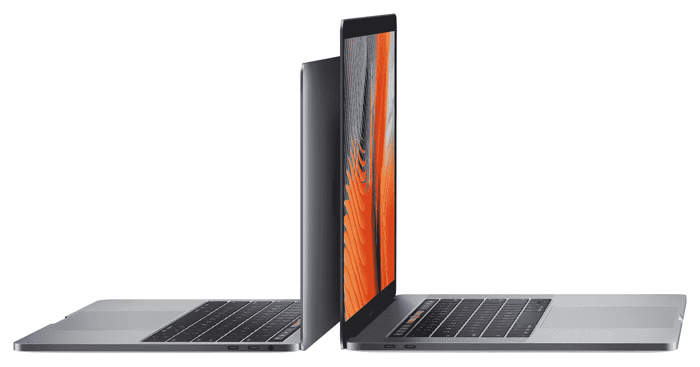
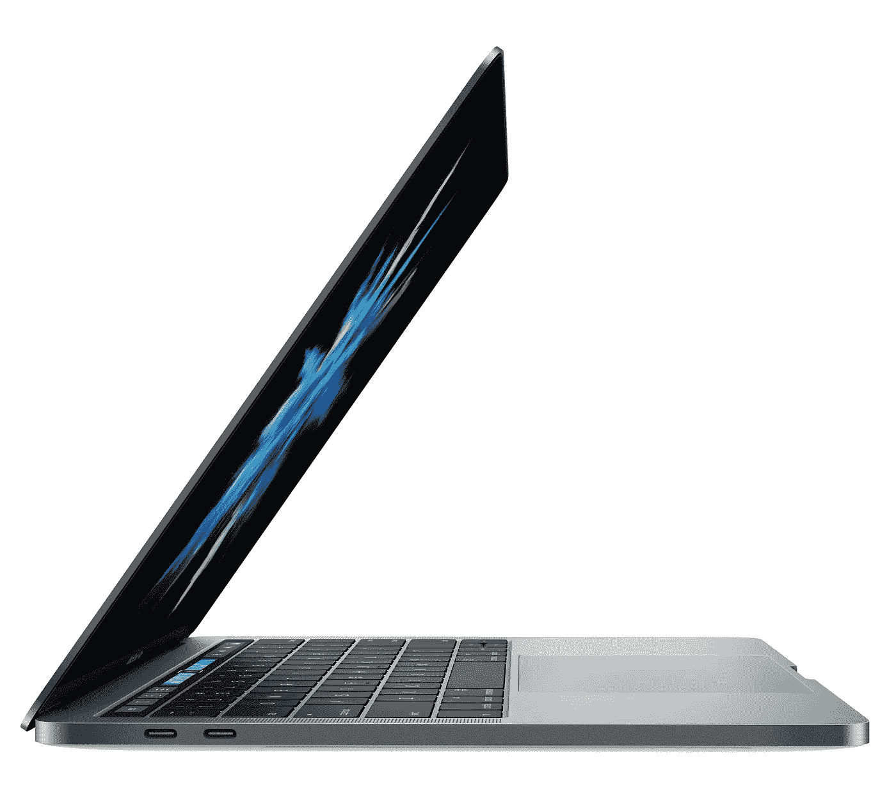
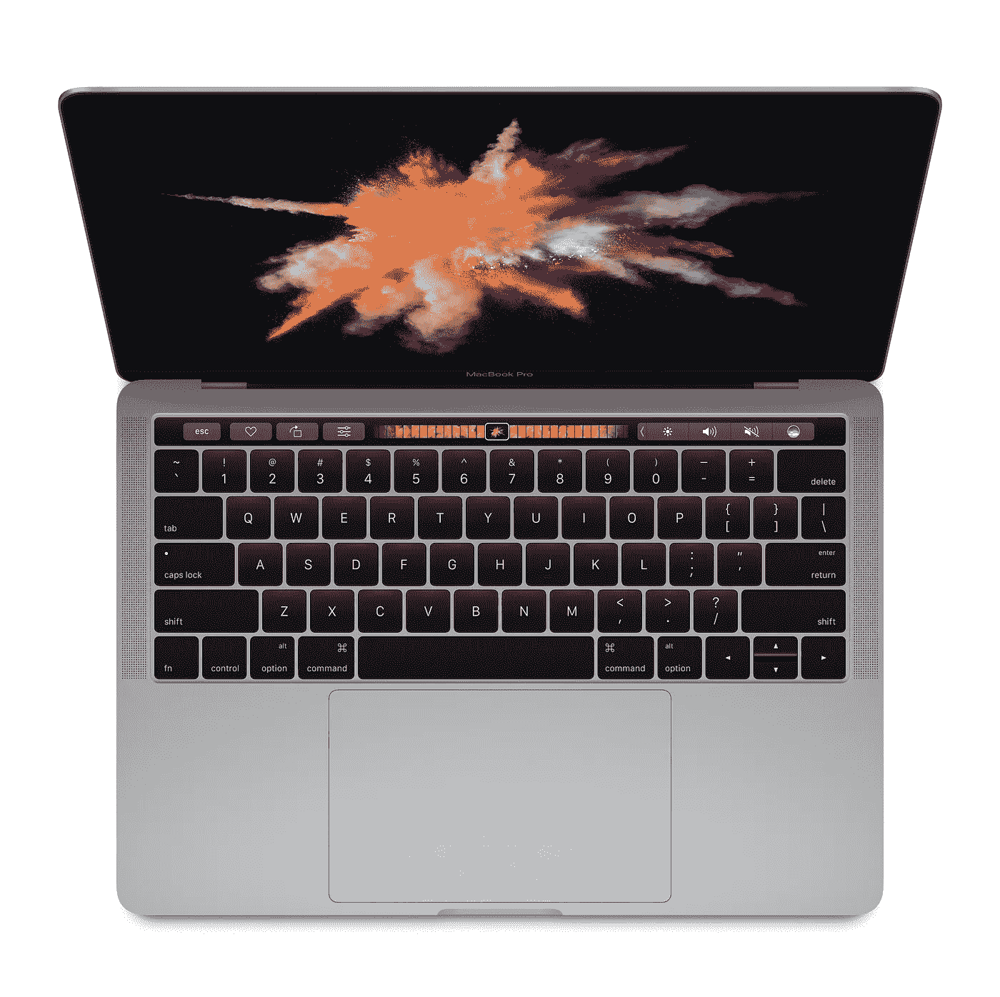
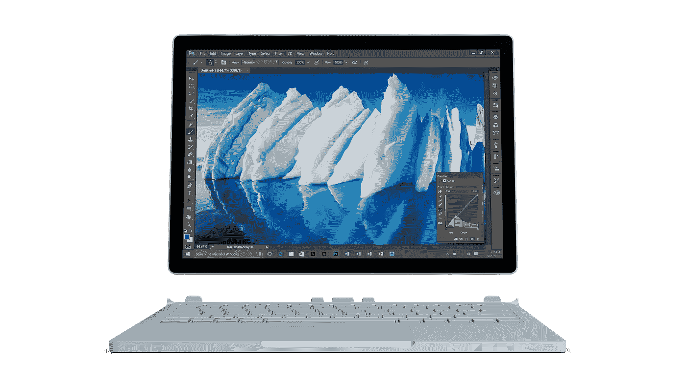

# 也许这一次，将是 Mac 被“调换”

> 原文：<https://medium.com/hackernoon/maybe-this-time-it-will-be-mac-to-be-switched-25500ef4df21>

The new MacBook Pro is moving away from its core customers.

我从椅子上站起来，这是图书馆讨论室里的一张新的木制办公椅，散发着年轻的瑞士松木的气味，我走向墙上的白板，主持我们营销项目的会议。在小会议室里，我在队友的椅子后面走着，当我走在埃迪(Eddie)后面时，我绊倒了他白色 MacBook 的充电器电缆，埃迪是一个说话非常快的聪明人。接下来将要发生的事情在我脑海中一闪而过，他的笔记本电脑摔了个粉碎。我非常确定这一点，因为一周前我刚刚绊倒了我自己的东芝 Portégé的电缆。但神奇的是，什么都没发生。他拿起他的电缆，嘲笑我“别担心，大卫，它是有磁性的！”。那是我第一次知道 MacBook，我告诉自己将来一定会买一台。

不幸的是，得到一台新笔记本电脑的时间并没有太长。一年后，我的东芝 Portégé一直向我显示蓝屏，我知道是时候说再见了。我的第一台一体式铝制 13 英寸 MacBook 是在 2008 年上市时购买的，在我去年获得当前的 15 英寸 retina MacBook Pro 之前，它一直陪伴着我将近 8 年。一般来说，在过去的 10 年里，MacBook Pro 比其他使用 Windows 操作系统的笔记本电脑更强大、更稳定，尤其是在处理设计和 T2 编程等工作时。在我的第一台 MacBook 之前，我从来没有一台基于 Windows 的笔记本电脑能够保持 1.5 年以上的速度和性能，所以我对我的 13 英寸 MacBook 的表现感到非常惊讶。因此，我每年都会额外关注 MacBook 的更新，然而，距离上次 MacBook 的大更新已经有一段时间了。

2016 年 10 月 27 日，苹果用了 4 年 4 个月零 16 天的时间推出了新款 MacBook Pro。老实说，新的 MacBook Pro 是失望的产物，根本不是苹果营销主管菲尔·席勒声称的“里程碑”或“向前迈出的一大步”。虽然我没有像其他等待革命性 MacBook Pro 多年的人一样感到任何强制情绪，但作为一个小工具爱好者和早期采用者，由于我对新 MacBook Pro 没有像以前那样的惊喜时刻，我可以有把握地说，你可能应该跳过新 MacBook Pro 2016，也许再等一年。

**USB-C**

去掉旧 MacBook Pro 中包括 USB-A 和 HDMI 在内的端口，改用 USB-C 只需要勇气(不是 iPhone 7 [耳机插孔和 EarPods](http://www.theverge.com/2016/9/7/12838024/apple-iphone-7-plus-headphone-jack-removal-courage) 的那个)，虽然很多人不同意此举，但我认为这是前进的必要痛苦。

USB-C 比笨重的 USB-A 更小更薄，可以在一根电缆上处理电源、数据和视频。入门级的 MacBook Pro 有两个 USB-C 端口，高端的有四个端口。在新的 MacBook Pro 上，USB-C 端口将成为连接充电器、存储卡读卡器、外部输出等几乎所有设备的唯一方式。即使你有一个更薄的新 MacBook Pro，你也不会发现你的生活更容易每天随身携带它，因为你需要每天在包里带很多软件狗，这增加了你的包的重量和大小。如果苹果真的关心他们的客户，并做得正确，这种不便可以得到缓解，然而，他们没有。如果你是一个忠实的 iPhone 用户，并且刚买了你的 iPhone 7，对不起，你需要购买另一个适配器，以便将你的 iPhone 与新的 MacBook Pro 连接。此外，新款 MacBook Pro 没有像旧款 MacBook Pro 那样的电源延长线，你需要[以 19 美元的价格](http://www.apple.com/shop/product/MK122LL/A/power-adapter-extension-cable)购买。

Adopting USB-C is a necessary pain.

虽然 USB-C 是一个开放的标准，你可以在网上找到价格低于苹果的其他适配器和加密狗，但作为新 MacBook Pro 的早期采用者，一开始就没有办法摆脱加密狗地狱。从长远来看，苹果向 USB-C 的转移是必要的，并有助于设定行业标准。总得有人去做。

**设计**

毫无疑问，新款 MacBook Pro 仍然是世界上最漂亮的笔记本电脑。它纤薄、光滑、漂亮，甚至每次触摸都感觉很棒。但是说实话，当然有点不公平，我们已经习惯了。我们已经习惯了苹果近年来提供的东西，新 MacBook 的设计只是另一个“苹果产品”，而不是改变世界的东西。

The new MacBook is still the most beautiful laptop.

这种设计就像 iPhone 6 和 7 一样，与竞争对手的产品一模一样，时尚且更有品位。换句话说，新款 MacBook Pro 的设计并没有像 iPhone 4 & 5 在上市时那样设定行业标准。虽然我认为乔纳森·伊夫的团队在设计新款 MacBook Pro 方面做得很好，比之前的型号更好看，但它不是革命性的，甚至 Surface Book 也在许多方面超越了它，尽管是以一种丑陋的方式。

**性能**

新款 MacBook Pro 的芯片采用了 Skylake 架构，而不是少数机器采用的 Kaby Lake 架构。按时发布新款 MacBook Pro 是一个安全的选择，这与菲尔·席勒在[采访 CNET](https://www.cnet.com/special-reports/does-the-mac-still-matter/) 时的声明中的“日历不是决定一切的因素”是一记耳光。

好吧，芯片不给力，RAM 怎么样？嗯，新的 MacBook Pro 最大内存为 16g，与之前的 MacBook Pro 相同。

但这些还不是最糟糕的。新款 MacBook Pro 成为第一款没有获得《消费者报告》推荐评级的 MacBook。测试发现，新 MacBook Pro 的电池寿命“从一次试用到另一次试用变化很大”。在《消费者报告》之前，网上有很多关于新款 MacBook Pro 电池续航能力差的抱怨。一些客户声称他们的新 MacBook Pro 只能使用 3 到 4 个小时，而不是苹果广告中的 10 个小时。对我来说，这是压垮骆驼的最后一根稻草，因为电池寿命对笔记本电脑至关重要，以前的 MacBook 在这方面做得很好。

**触摸条**

所以，Touch Bar 来了，它在新 MacBook Pro 发布会上引发了很多讨论。很多人对此非常兴奋，但是，我并不认为它对当前的产品有用。就目前而言，Touch bar 对我来说更像是一个噱头，我认为它背后的兴奋只是源于笔记本电脑业务长期以来缺乏改善。这就像一滴水落入干燥的沙漠——饱和但会迅速蒸发。Touch Bar 在第一次吸引人的时候确实很吸引人，因为它取代的那些按键是过时的东西。然后苹果展示了表情符号的使用案例。哇！这真是一个令人印象深刻的营销。

Use case of Touch Bar for native apps does not make much sense.

然而，当我接触到它时，我发现它对简化工作流程没有什么帮助。比如我打开 Notes app 开始打字的时候，Touch Bar 会给你单词的建议。比如，我输入“我”，它会显示“将”、“上午”等建议供我按下。老实说，当我可以在键盘上打字快 10 倍的时候，这是相当愚蠢的。

另外，当我打开 Safari 时，Touch Bar 可以让你快速选择不同的浏览器标签。在这种情况下，我更喜欢使用我常用的键盘快捷键“cmd+number”或“cmd+option+left 或 right key”从一个标签跳到另一个标签，这也比在 Touch Bar 上按更快。

与苹果在过去 10 年中取得的成就相比，其他案例，如带有照片应用程序的 Touch Bar 和 Final Cut Pro，都是相当糟糕的 UX。苹果是用户体验的先行者，但有了 Touch Bar，证明它的脚步慢了下来。

到目前为止，这是 UX 在 Touch Bar 上的情况，然而，未来仍然没有定义。我期待着更多的应用程序与 Touch Bar 集成，以提供比苹果公司的原生应用程序更好的体验。关键是，如果你想让用户从键盘上抬起手，移动到 Touch Bar 上的任何一个特定按钮，你需要给他们一个更强的激励。现在，激励是微弱的。如果 Touch Bar 只能为用户提供他们可以在键盘上简单完成的任务，它仍然没有用，因为它取代了过时的按键。

Will developers and designers switch to Surface?

在过去，苹果成功地推出了[【Switch】](https://www.youtube.com/watch?v=VHid1bcf1sM)和[【Get a Mac】](http://www.adweek.com/adfreak/apples-get-mac-complete-campaign-130552)广告活动，以吸引沮丧的 Windows 用户尝试 Mac。正是一系列成功的营销让苹果的 MacBook 系列成为设计师、摄影师和开发人员等专业客户的首选之一。但是现在，由于令人失望的新款 MacBook Pro 发布会，轮到 T4 微软公司要求消费者“转而购买”Surface Book。有微软在后面潜伏，苹果真的需要三思谁是他们的客户，并为他们设计产品。新款 MacBook Pro 背叛了其核心和最忠诚的客户、设计师和开发者，尽管他们中的大多数人都是这一领域的早期采用者，但他们可以很容易地跳到其他有趣的产品，如 Surface。也许这一次，会是 Mac 被**切换**。

> [黑客中午](http://bit.ly/Hackernoon)是黑客如何开始他们的下午。我们是阿妹家庭的一员。我们现在[接受投稿](http://bit.ly/hackernoonsubmission)并乐意[讨论广告&赞助](mailto:partners@amipublications.com)机会。
> 
> 如果你喜欢这个故事，我们推荐你阅读我们的[最新科技故事](http://bit.ly/hackernoonlatestt)和[趋势科技故事](https://hackernoon.com/trending)。直到下一次，不要把世界的现实想当然！

