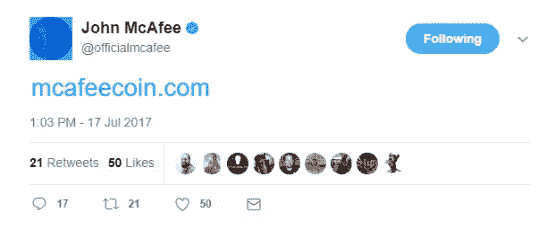
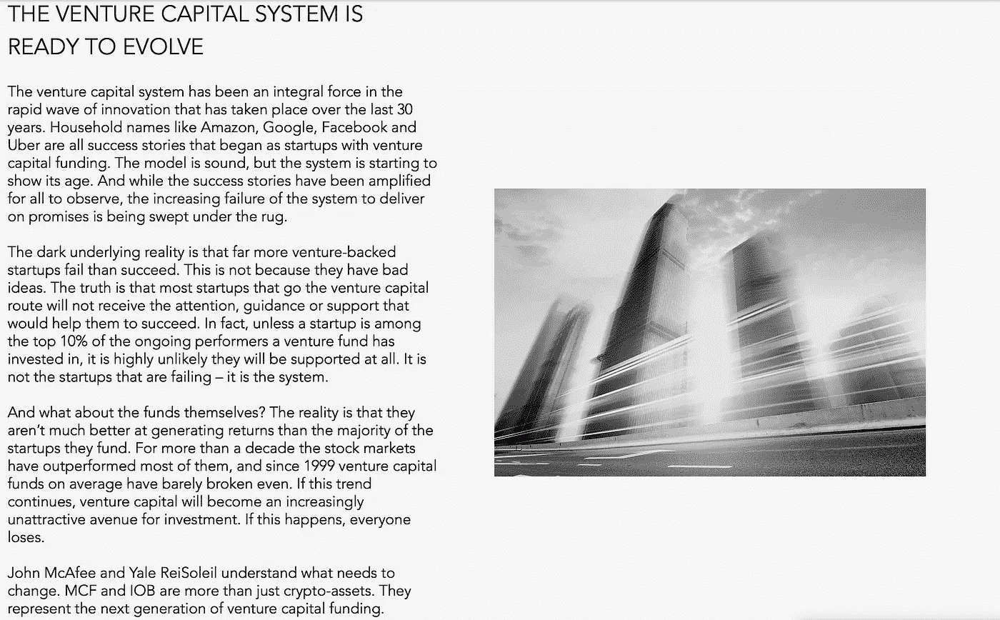
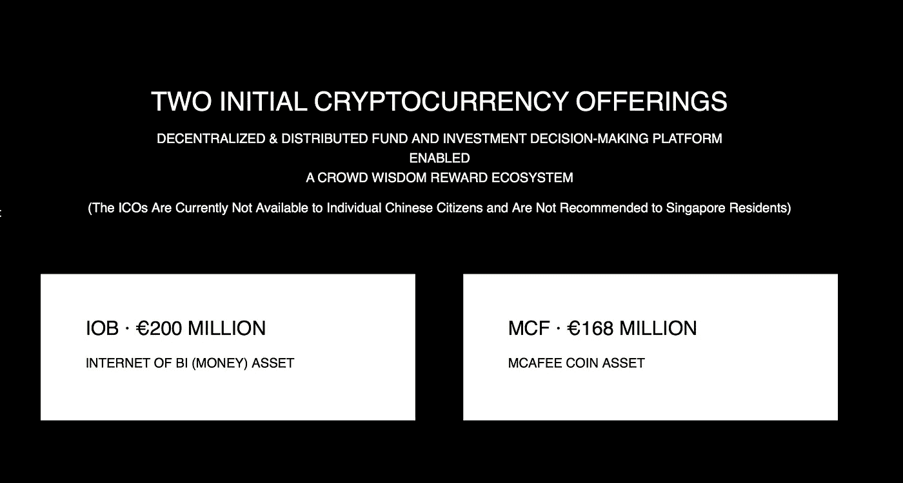

# McAfee Coin、IOB 和 CWB:风险投资的光明未来

> 原文：<https://medium.com/hackernoon/mcafee-coin-iob-and-cwb-a-bright-future-for-venture-capital-6a49263156f2>

John McAfee

2017 年 7 月，网络安全先驱约翰·迈克菲在推特上发布了一个链接，链接到[McAfeeCoin.com](https://www.mcafeecoin.com)。今天，成千上万的人正在为国际奥林匹克运动会做准备。

尽管如此，尽管围绕 ICO 的炒作已经相当高，但许多人仍然缺乏对项目本身真正目的的理解；约翰·迈克菲之所以求助于区块链来革新传统企业实践中的某种过时模式。

在本文中，我们将对 McAfee coin 项目进行深入分析；回顾它的一些关键方面、整体特征以及它通过使用自己的加密货币想要实现的目标。

让我们开始吧。

## 什么是迈克菲币？

如前所述，McAfee coin 是由防病毒和计算机技术先驱 John McAfee 最近宣布的项目。迈克菲在 7 月份发布了关于这个项目的信息，当时他在推特上发布了 McAfeeCoin.com[的链接。](https://www.mcafeecoin.com)

John McAfee’s Announcement Tweet

从那时起，该网站已经更新了关于 McAfee 硬币的一般用途的新信息，以及关于该项目将如何工作的许多技术细节，以及如何开发。和它背后社区将实现他们雄心勃勃的愿景。

该网站是 McAfee Crowdchain Accelerator，Inc .的官方在线主页，也称为 McAfeeXL:一个创业加速器，其生态系统围绕着 McAfee Coins 或 MCF。

实质上，McAfee coin 将作为投资公司的数字令牌，允许他们在投资决策时收集群体智慧。到目前为止，这家公司由约翰·迈克菲(John McAfee)、一位名叫耶鲁·雷索里尔(Yale ReiSoleil)的风投基金经理和一位名叫约翰·朱(John Zhu)的金融科技专家领导。

正如博德利在 McAfee coin 网站首页所说，“风险投资体系已经做好了进化的准备。”这就是项目背后的社区看到了利用区块链技术的革命性力量的机会。

## 迈克菲币旨在解决什么问题？

McAfee coin 项目背后的开发者坚信，现代风险资本世界存在严重缺陷。

几十年来，风险投资一直是企业界不可或缺的力量；然而，随着区块链技术逐渐成为主流，McAfee 团队现在有了一个使这个过时行业完全现代化的愿景。

以下是 McAfeeXL 背后的团队发现并试图解决的一些问题:

*   整个系统越来越无法兑现承诺，而这些失败正在被掩盖。
*   风险投资支持的创业公司失败的比成功的多；这些创业公司中有很多都有好想法和好计划，但他们没有从风投公司那里得到他们需要的关注、指导或支持。
*   除非一家初创公司是风险基金投资的业绩最好的 10%的公司之一，否则它们根本不可能得到支持。
*   从投资者的角度来看，风险投资基金并不擅长提供回报；McAfee Coin 网站声称，“十多年来，股票市场的表现超过了大多数股票市场，自 1999 年以来，风险投资基金平均只能勉强达到收支平衡。”

McAfeeCoin.com

## McAfee Coin 是如何工作的？

作为该项目的领导者，John McAfee 和 Yale ReiSoleil 相信他们可以成功地解决上述问题，并在这样做的过程中，彻底改变风险资本的世界。他们平台背后的关键技术是 MCF (McAfee coin)和 IOB (Internet of Bi)，它们被描述为“不仅仅是加密资产”这两个数字代币，或称“加密资本”，将“……代表下一代风险投资基金。”

拥有这些代币的目的是什么？

作为一名 MCF (McAfee coin)持有者，你在投资公司基于大众的投资决策中扮演着相应的角色。另一方面，IOB 代表该公司加密货币投资基金的股份——类似于你投资任何普通投资工具的方式。

迈克菲硬币项目的另一个关键方面是 CWB，即“群体智慧机器人”通过利用他们专有的人工智能和区块链技术，该公司打算利用 CWB 的技术来提高整个基金的盈利能力。

此外，CWB 将允许创建一个区块链支持的，基于加密货币奖励的社交网络。在这个生态系统中，当你开始获得声誉时，参与——分享你与投资相关的想法和想法——在 MCF 会得到回报，这是由你的内容的价值通过向上投票、分享和浏览量等参数决定的。

McAfeeCoin.com

这些技术(MCF、IOB 和 CWB)是该项目的三个主要的、不可或缺的方面，旨在改善加密资本基金并将其纳入主流。通过利用 CWB，McAfee coin 将确保初创公司在其成长的每个阶段都获得适量的资金，这将使他们在整个发展和扩展阶段更有效地利用资金。

这是我们目前在 ICO 内部看到的一个主要问题。由于主流投资者对区块链理工大学的大肆宣传。，这些初创企业在短短几个小时内就筹集了数千万美元；他们中的一些人甚至没有发行一期就突破了他们雄心勃勃的筹款上限。这使得这些通常由软件程序员和工程师组成的公司拥有超过他们知道如何处理的资金，导致在其发展过程中出现财务问题的可能性增加。

McAfeeCoin.com

## 目标和功能

虽然 McAfee coin 本质上旨在实现一个中心目标，但它计划通过使用不同的机制和功能来实现这一目标。以下是其中的一些:

1.  **人工智能系统**

通过开发者社区和 MCF 持有者的贡献，McAfeeXL 专注于构建先进的、基于区块链的人工智能技术。这样做是为了确保投资决策有很高的获利机会。

2.**基于回报的社会投资**

通过利用 CWB，McAfee 团队计划创建一个基于加密货币的社交网络，参与者因其投资相关的想法而获得 MCF 代币奖励。

这会引起各地投资者和市场投机者的极大关注；目前还没有为参与者的贡献提供货币价值的社会交易生态系统。

3. **IOB 基金**

McAfeeXL 的一个核心特点是其 IOB(Bi 互联网)加密资本基金，该基金被称为“RMZ 的加密资本(CC)分支，这是一只总部位于瑞士的 CC 基金，是第一只通过 ICO 筹集的专注于中国的基金。”

4. **ICO**

McAfeeXL 将利用 ICO(首次发行硬币)方法来分发代币。然而，与其他区块链初创公司不同，McAfeeXL 将做两个 ICO，一个为 MCF，另一个为 IOB。

*   MCF 代币:McAfee Coins，代表基于群体决策的投资平台的股份。
*   IOB 代币:Bi 加密资本基金互联网代币，代表公司数字资产投资基金的股份。

5.**实践指导**

除了其雄心勃勃的将风险资本重新商业化的愿景，McAfeeXL 还旨在创建一个致力于帮助企业家和初创企业成功的全球网络。

## 结论

迈克菲硬币项目的确是一个雄心勃勃的项目。

然而，它背后的团队似乎正朝着正确的方向前进。通过利用几种潜在的机制、功能和技术，以及详细的整合和采用策略，McAfeeXL 旨在揭示现代风险投资的许多缺陷，彻底改革过时的行业。

**注意:**记住，MCF 和 IOB 这两个令牌将分别服务于不同的目的。因此，您对 McAfeeXL ICO 的参与可能取决于您希望持有的令牌。当然，如果你是整个项目的长期信徒，你可能想两者兼得。但是，仍然建议您对资产进行深入研究，以便更准确地了解每项资产的用途和价值。

McAfeeCoin.com

感谢你花时间阅读这篇文章，我希望你真的喜欢它。如果您发现这很有价值，请不要忘记点击👏按钮！也可以随时分享我的内容！

在所有社交媒体平台上关注@ TheCoinEconomy，了解加密货币市场和区块链科技发展的最新动态。( [TradingView](https://www.tradingview.com/u/thecoineconomy/) ， [Twitter](https://twitter.com/thecoineconomy) ， [Instagram](https://www.instagram.com/thecoineconomy/) ，[脸书](https://www.facebook.com/Thecoineconomy-353316841786257/)，[stock wit](https://stocktwits.com/TheCoinEconomy)s)